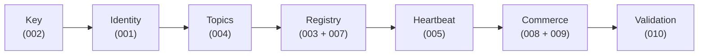

# Neuron SDK Spec

[](https://deepwiki.com/NeuronInnovations/neuron-specs)

Neuron gives any device a **verifiable identity**, **signed communication**, and **provable liveness** on a public ledger. The specifications in this repository are language-neutral — use them to generate an SDK in Go, TypeScript, C++, Rust, or any language.

## Read this first — what this is, and where it's going

**This is a spec-first reimagining of the Neuron SDK, published as a first public draft. It already runs end-to-end, it's actively maturing, and we're sharing it early because we'd genuinely love your help shaping where it goes next.**

Neuron is the protocol layer that gives any device a verifiable identity, signed communication, provable liveness, and a way to buy and sell data peer-to-peer on a public ledger. This repository is our attempt to write that protocol *down* — completely, in language-neutral specifications — so that anyone, and any coding agent, can implement it, extend it, or build on top of it without reverse-engineering a codebase.

### Why we're rebuilding spec-first

The original Neuron SDK served us extraordinarily well — it has kept nodes online and talking to each other for many, many months in production. But it had grown hard to move:

- **Hard to use, hard to onboard to.** The only real "spec" was the running code plus the existing Neuron and 4dsky docs. A new contributor had no clear statement of *what the SDK is supposed to do* — only what it happened to do.
- **Slow to evolve.** Peer-to-peer systems are genuinely difficult, and that complexity made every change expensive. Trying a different transport or communication style meant fighting the p2p plumbing instead of expressing an idea.
- **No obvious place to help.** Requirements lived in people's heads, so contributors couldn't tell where to push.

So we flipped it. Instead of code that *implies* a protocol, we now write the **protocol as the source of truth** and let implementations follow from it. A specification can be read, argued with, versioned — and, crucially, handed to an AI coding agent that turns requirements into a working implementation in the language and transport *you* care about. This is new and genuinely exciting territory, and we think it's the right bet: the protocol can move at speed, every implementation stays honest to one shared contract, and contributors finally get a clear surface to build on.

### What works today

We have a working end-to-end demo running at **two field test sites**. At each site a **Remote ID sensor** (drones) and an **ADS-B sensor** (aircraft) independently publish their detections into Neuron, and a single buyer feeds **both streams into the same UI** — drones and aircraft on one map, each with verifiable provenance. The whole path runs on the specs in this repo: identity, registration, payment, encrypted P2P delivery, SAPIENT messaging, and display. Over time, this spec-first stack is intended to **replace the current Neuron SDK**.

### What's still in progress

A few areas are deliberately ahead of their specs, and we're being upfront about them:

- **Fan-out semantics** (one sensor → many consumers) — working in practice, but not yet fully specified; it will likely get its own spec.
- **Validator deployments** — the validation framework (010) is specified, but rolling out real validators is still in progress.
- **BEAST transport** — the raw Mode-S path the original SDK relied on isn't carried here yet.

If something looks underspecified, ambiguous, or simply missing — that's expected, and telling us is one of the most useful things you can do.

### How to actually use this repo

**This is not a copy-paste SDK.** It does ship reference code — a Go implementation, a TypeScript SDK, Solidity contracts — but that code exists to *prove the specs work*, not to be your product. There are two ways to get value from it, and both lean on AI:

**1. Build with it.** Point an agentic coding tool at the specs and have it build *your* application on top of Neuron's semantics, in the language and transport you care about. We use **[GitHub Spec Kit](https://github.com/github/spec-kit)** for this — see its docs for the workflow that turns a spec into a plan, tasks, and working code.

**2. Understand it.** The specs are deliberately precise rather than pretty — honestly, some are as hard to read as code, and they aren't meant to be read cover-to-cover. So don't just read them: **load the repo into an AI assistant and ask it questions.** *"How does payment settlement work?" "What does a seller publish at registration?" "Walk me through what happens when a buyer connects."* Let the model do the dense reading and explain it back in plain language.

One catch: general-purpose models already "know" a little about Neuron, Hedera, and similar projects from their training data — and that folklore is often out of date or simply wrong for *this* protocol. So tell the model to ignore it and stick to the files in front of it. A prompt like this works well:

```text
You are helping me understand the Neuron protocol. Use ONLY the files in
this repository as your source of truth. Ignore anything you think you
already know about "Neuron", "Hedera", or similar projects from your
training data — if it isn't in these specs, it doesn't count here.

For every claim you make:
- cite the spec and requirement ID (e.g. "005 FR-H03") or the file path
  you took it from;
- if the specs are silent, ambiguous, or seem to contradict each other,
  say so plainly ("the specs don't define this" / "these two look
  inconsistent") instead of guessing or filling the gap from memory.

My question: <ask away>
```

**Found something off?** If a spec is wrong, missing, or just reads inconsistently, that's some of the most valuable feedback we can get. Bring it to **our Discord** and let's flesh it out together. **You do not need to be a coder.** If you can tell us *"this requirement doesn't make sense"* or *"these two specs seem to disagree,"* you're helping exactly the way we hoped — that conversation is the whole point.

### How the repo is laid out

- **Specs 001–013 — the base Neuron layer.** Identity, keys, registry, topics, health/liveness, determinism, on-chain contracts, payment, P2P delivery, validation, relay, and connectivity. This is the protocol every node speaks.
- **Specs 015–018 — the DApp layer.** Applications built on the base layer over the open **SAPIENT (BSI Flex 335)** standard: an ADS-B sensor seller, a Remote ID sensor seller, a buyer, and a display consumer. We intend to **split the DApps into their own repositories** eventually; for now they live here so this first release is something whole you can actually run.

### A note to the community

We're putting this out early, on purpose, warts and all — protocols get better faster in the open. It is a **first draft from a small team**: there will be rough edges, missing pieces, and things we'd write differently tomorrow. If you came to build, to challenge a requirement, to open an issue, to send a PR, or just to think out loud with us on **Discord** — you are exactly who this is for, and we're grateful you're here. All we ask is a little patience and good faith while we get it to a ready state; in return we'll move fast, listen hard, and credit the people who help. **Let's build it together.**

## What this repository contains

- **`specs/`** — the language-neutral specification corpus: Core SDK specs 001–013 (identity, keys, registry, topics, health, determinism, on-chain contracts, payment, P2P delivery, validation, relay, browser profile, connectivity profiles), the shared SAPIENT application profile (015), and the sensor/consumer DApp specs (016–018).
- **`impl/golang/`** — the Go reference implementation: every Core SDK package plus the SAPIENT DApp layer and runnable demo CLIs.
- **`impl/typescript/`** — the TypeScript SDK (specs 001–005 + wire format), derived purely from the specs, never from the Go code.
- **`contracts/`** — Solidity sources (Foundry) for the EIP-8004 Identity, Reputation, and Validation registries and the escrow contract.
- **`docs/`** — public companion docs: the beginner hub (`docs/getting-started/`), wire-format contract docs, and the architecture/identity-model references.
- **`.specify/`** — the Spec Kit toolchain: the project constitution and the templates that generate plans and task lists from specs.

## Start here

```bash
cd impl/golang && go run ./cmd/buyer-seller-demo --mode=mock
```

You'll see the full Neuron commerce loop — negotiation, payment, ECIES-encrypted JPEG delivery, and a validator verdict — run end-to-end in under one second, with zero infrastructure. No Hedera account, no funded HBAR, no env vars, no second terminal.

Then open **[docs/getting-started/](docs/getting-started/)** — the beginner hub with the learning path, one walkthrough per demo, the architecture summary, and integrator guides for the Go and TypeScript SDKs. For the minimal identity-to-liveness path, see **[Zero to Heartbeat](docs/zero-to-heartbeat.md)**.

## Architecture

Everything in Neuron follows five steps:

**Step 1: Get a key (Spec 002)** — Generate a single secp256k1 private key. From that key, you derive an EVM address (on-chain identity), a PeerID (peer-to-peer networking), and a DID:key (decentralized identifier). Pure offline operation — no network, no account, no gas.

**Step 2: Create an identity (Spec 001)** — Build a Parent account (the controller) and a Child account (the agent). The Parent holds the root DID and receives revenue. The Child does the work — it registers, communicates, and heartbeats. Also offline.

**Step 3: Open channels (Spec 004)** — Create three append-only message topics (Hedera Consensus Service is the first-class backend): stdIn (inbound), stdOut (outbound), and stdErr (diagnostics). Every message is a signed envelope with sender address, signature, timestamp, sequence number, and payload.

**Step 4: Register on-chain (Specs 003 + 007)** — Mint an EIP-8004 NFT in an Identity Registry. The NFT stores an `agentURI` JSON document listing your topic endpoints and P2P exchange details. Other agents look you up by your EVM address.

**Step 5: Start heartbeating (Spec 005)** — Publish signed "I'm alive" heartbeats to your stdOut topic. Each heartbeat is a self-declared deadline promise: "I'll check in again within X seconds." Observers subscribe, validate signatures, track deadlines, and independently evaluate your liveness as ALIVE, SUSPECT, DEAD, or OFFLINE.



On top of the Core SDK, the **application layer** (specs 015–018) standardizes sensor data exchange using **SAPIENT (BSI Flex 335 v2.0)**, an open UK-DSTL / NATO sensor-interop standard:

- **Sensor bridges (016, 017)** — Neuron-blind *modality → SAPIENT* translators. A bridge decodes one sensor modality (016: JetVision ADS-B aircraft surveillance; 017: DroneScout Remote ID drone telemetry) and emits standard SAPIENT messages over a plain TCP edge. A bridge holds no key, no wallet, and no Neuron logic.
- **SAPIENT Seller Proxy (015)** — the generic, vendor-blind sensor-side proxy. It owns the EIP-8004 identity, signs and publishes the agent card, routes each SAPIENT message onto the right Neuron lane by message *type* (`DetectionReport` → the 009 P2P data plane; `Registration` / `StatusReport` / `Task` / `TaskAck` → the 004 auditable topic lane), and enforces admission.
- **SAPIENT Buyer Proxy + consumers (015, 018)** — the consumer-side mirror. The generic Buyer Proxy owns the buyer identity and 008 agreements, verifies the seller's agent card, and presents a conformant SAPIENT TCP edge to a Neuron-blind consumer. Spec 018 defines the lightweight display consumer: *SAPIENT → Cursor on Target (CoT)* for TAK displays, aggregating N seller sessions **without** associating tracks.
- **Multi-source buyer** — one buyer process holds N independent seller sessions (e.g. one drone sensor + one aircraft sensor), each with its own agreement, identity verification, and source-scoped payload identity.
- **FID consumer / display** — the demo display chain (`cmd/sapient-fid-consumer`, `cmd/sapient-fid-display`, `cmd/sapient-explorer`) projects received SAPIENT into a Leaflet map UI and an agent-card explorer.

**Boundary rule (Constitution Principle XII):** the Core SDK defines primitives — envelopes, signing, transport, registry, escrow, the `AdmissionPolicy` interface. DApp specs define topology, admission policy implementations, sensor semantics, and frame formats. The bridge does not own heartbeat, registry, or agent-card publication; the proxy does.

## Spec index

| Spec | Title | What it covers |
| ---- | ----- | -------------- |
| 002 | [Key Library](specs/002-key-library/spec.md) | secp256k1 keys; EVM address, PeerID, DID:key derivation; RFC 6979 signing |
| 001 | [NeuronAccount](specs/001-neuron-account-module/spec.md) | Parent/Child/Shared identity model, DIDs, ledger attachment |
| 004 | [Topic System](specs/004-topic-system/spec.md) | Signed TopicMessage envelopes; stdIn/stdOut/stdErr; HCS/Kafka/memory adapters |
| 003 | [Peer Registry](specs/003-peer-registry/spec.md) | EIP-8004 registration, agentURI schema, proof-of-control, lookup |
| 005 | [Health](specs/005-health/spec.md) | Self-declared deadline heartbeats; per-observer liveness state machine |
| 006 | [Protocol Determinism](specs/006-protocol-determinism/spec.md) | Wire format, canonical JSON, byte-level algorithms, golden test vectors |
| 007 | [Identity Contract](specs/007-identity-contract/spec.md) | On-chain EVM registries: identity, reputation, validation; admission policy hook |
| 008 | [Payment](specs/008-payment/spec.md) | Nine-message commerce protocol, escrow adapter, service lifecycle, degraded mode |
| 009 | [P2P Data Delivery](specs/009-p2p-data-delivery/spec.md) | libp2p streams, ECIES multiaddr encryption, stream-direction split, pubsub primitives |
| 010 | [Validation Framework](specs/010-validation-framework/spec.md) | Evidence envelopes, validator agents, three-outcome verdicts |
| 011 | [Relay](specs/011-relay/spec.md) | Circuit Relay v2; reference runtime in `cmd/relay-node` |
| 012 | [Browser Client Profile](specs/012-browser-client-profile/spec.md) | Buyer-only browser target (WSS + WebTransport, ephemeral identity) |
| 013 | [Connectivity Profiles](specs/013-connectivity-profiles/spec.md) | Transport-agnostic capability vectors; profiles A/C/D/E/F |
| 015 | [SAPIENT Sensor Interop Profile](specs/015-sapient-sensor-layer/spec.md) | SAPIENT envelope over Core lanes; transparent Seller/Buyer Proxy; ASM/HLDMM roles; tasking; fan-out |
| 016 | [JetVision ADS-B ASM](specs/016-adsb-dapp/spec.md) | Vendor sensor DApp: `aircraftlist.json` → SAPIENT DetectionReports; `neuron.adsb/1` extension |
| 017 | [DroneScout Remote-ID ASM](specs/017-remote-id-dapp/spec.md) | Vendor sensor DApp: Open Drone ID → SAPIENT DetectionReports; `neuron.rid/1` extension (`rid.*` keys) |
| 018 | [CoT Display Consumer](specs/018-cot-dapp/spec.md) | Consumer DApp: SAPIENT → CoT/TAK; static affiliation policy; aggregation without association |

There is no spec 014; the slot was retired when fan-out moved to the DApp layer. The `TaggedFrame` display chain (`cmd/multistream-buyer`, `cmd/fid-display`) is documented in [`docs/fid-display-contract.md`](docs/fid-display-contract.md), with its sink vocabulary normative in 013 Profile F — see [docs/spec-code-map.md](docs/spec-code-map.md) for the component-by-component map.

## Zero to Heartbeat

The minimal path from clean checkout to a verifiable liveness proof — full walkthrough in **[docs/zero-to-heartbeat.md](docs/zero-to-heartbeat.md)**:

```bash
# 1. Everything offline + in-memory: identities, channels, commerce, validation
cd impl/golang && go run ./cmd/buyer-seller-demo --mode=mock

# 2. Real on-chain heartbeat (requires a funded Hedera testnet account)
export HEDERA_OPERATOR_ID="<your testnet account, e.g. 0.0.XXXXXXX>"
export HEDERA_OPERATOR_KEY="<your ECDSA private key hex>"
cd impl/golang && go run ./cmd/hcs-heartbeat-test/
```

The testnet run creates real HCS topics, publishes a signed heartbeat, and verifies it through the public mirror node — the output prints the topic ID and a HashScan explorer link you can open in a browser.

## SAPIENT data flow

```
sensor hardware ──> bridge (modality→SAPIENT, Neuron-blind, plain TCP)
                        │
                        ▼
                Seller Proxy (015) ── owns identity, agent card, lanes, admission
                        │
        ┌───────────────┴─────────────────┐
        ▼                                 ▼
  /sapient/detection/2.0.0          auditable topic lane (004/HCS)
  (DetectionReports, libp2p)        (Registration, StatusReport, Task, TaskAck)
        │                                 │
        ▼                                 ▼
                Buyer Proxy (015) ── verifies card, holds 008 agreement per seller
                        │
                        ▼
        consumer (018: SAPIENT→CoT; or the FID display chain)
```

- The **bridge emits SAPIENT**; it never sees a key or a lane.
- The **seller publishes identity and capabilities**: EIP-8004 registration, agent card with content hash, spec-005 heartbeats with capability advertisement (including `commerceMode` and `feedSource` disclosure).
- The **buyer receives source-scoped payloads**: each seller session keeps its own `node_id` → PeerID binding, so a drone detection and an aircraft detection are never conflated even on one buyer process.
- The **display / API consumes projected state**: the map UI renders tracks; the read-only received-API exposes the raw decoded SAPIENT for partner verification.

Run the whole chain locally with `make demo-sapient` — walkthrough in [docs/getting-started/demos/8-sapient-chain.md](docs/getting-started/demos/8-sapient-chain.md).

## Build

```bash
# Go SDK + demos (Go >= 1.25)
cd impl/golang
go build ./...
go test ./...
go vet ./...

# Race detection across protocol/runtime/cmd surfaces (run after concurrency changes)
scripts/validation/race-check.sh

# TypeScript SDK (Node.js >= 18)
cd impl/typescript
npm install && npm run build && npm test && npm run lint

# Solidity contracts (requires Foundry; first checkout: cd contracts && forge install OpenZeppelin/openzeppelin-contracts --no-git)
make forge-build && make forge-test

# Demos
make demo           # canonical mock buyer-seller loop, <1s, no infra
make demo-help      # list all demo targets
make demo-sapient   # local SAPIENT Remote ID chain: simulator -> seller -> buyer -> map
```

## Configuration

All credentials come from environment variables. **No real account IDs, keys, or hosts ship in this repository** — placeholders only:

```bash
# Hedera testnet (topics, heartbeats) — create an account at portal.hedera.com
export HEDERA_OPERATOR_ID="0.0.XXXXXXX"
export HEDERA_OPERATOR_KEY="<ECDSA secp256k1 private key hex>"

# EVM contract deployment (make deploy-all) — any funded testnet EVM key
export PRIVATE_KEY="<deployer private key hex>"

# Hedera EVM JSON-RPC (default already set in the Makefile)
export HEDERA_EVM_RPC="https://testnet.hashio.io/api"
```

Public endpoints used by the testnet paths (no credentials embedded):

- JSON-RPC: `https://testnet.hashio.io/api`
- Mirror node: `https://testnet.mirrornode.hedera.com`
- Explorer: `https://hashscan.io/testnet`

## Public API model

The SAPIENT consumer exposes two distinct read-only surfaces; they are deliberately not the same thing:

- **Partner received-API** (`/sapient/received/{latest,stream,schema,health}`, mounted by `cmd/sapient-fid-consumer --sapient-received-http`) — a lossy JSON projection of the SAPIENT messages as decoded at the consumer's receive boundary, before any display projection. It exists so an external partner can verify their sensor's payload arrives and decodes correctly. The surface is **session-scoped**: it carries exactly what the consumer's buyer sessions deliver. In the partner-facing deployment the session carries only the drone (`rid`) service, so the partner received-API is **drone-only**; the code itself applies no modality filter.
- **Internal display state** (`/state.json`, `/events` on the display processes) — the multi-source map projection. It can carry aircraft and drone tracks simultaneously.

Modality rules:

- **ADS-B aircraft are not drones.** JetVision/ADS-B tracks and DroneScout/Remote-ID tracks are separate modalities with separate sellers, sessions, and extension namespaces (`neuron.adsb/1` vs `rid.*`). An aircraft's identity field is its **callsign** (and ICAO 24-bit address), never a Remote ID.
- **Source status is runtime-verified.** Whether a seller is "live" is determined from its sessions and heartbeats (the buyer's `/sessions` endpoint; spec-005 liveness states; the `feedSource` advertisement distinguishing `live` / `replay` / `synthetic` / `placeholder`) — never asserted statically.
- **Global vs filtered views**: `latest` projections are per-object; a `?limit=` query bounds list responses. The received-API never exposes secrets, environment values, keys, or host paths.

## SDK generation guide

1. Read `specs/NNN/spec.md` + `specs/NNN/contracts/*.md` for behavior, inputs, outputs, and error conditions.
2. Read `specs/NNN/data-model.md` for entity definitions.
3. Read `specs/006-protocol-determinism/contracts/` for wire-format rules and byte-level algorithms.
4. Validate against the golden test vectors — output must match exactly.
5. Build order is strictly sequential: `002 → 001 → 004 → 003 → 005 → 006 → 007 → 008 → 009 → 010` (the registry's agentURI embeds topic-service schemas, hence 004 before 003). Do not begin spec N+1 until spec N passes all tests.

For AI-driven SDK generation, see [`ai-spec-to-sdk-pipeline.md`](ai-spec-to-sdk-pipeline.md) — a 7-stage pipeline with checkpoints and cross-language conformance gates.

| Language   | Transport    | Status                                          |
| ---------- | ------------ | ----------------------------------------------- |
| Go         | Hedera (HCS) | Reference implementation (`impl/golang/`)       |
| TypeScript | —            | Specs 001–005 + wire format (`impl/typescript/`) |

## Constitution (v1.7.0)

All implementation complies with 12 ratified principles — full text in [`.specify/memory/constitution.md`](.specify/memory/constitution.md):

| #    | Principle                 | Key Rule                                                              |
| ---- | ------------------------- | --------------------------------------------------------------------- |
| I    | Specification-First       | Spec exists before any code                                           |
| II   | Testable Stories          | Given/When/Then acceptance criteria                                   |
| III  | Clarification Before Plan | No unresolved ambiguities                                             |
| IV   | Semantic Types            | Domain types, not primitives                                          |
| V    | Traceability              | Every task traces to FR-\* or SC-\*                                   |
| VI   | Language-Neutral Protocol | Specs + Spec 006 vectors normative; Go is the reference path          |
| VII  | Strict Spec Compliance    | No silent divergence from MUST/SHOULD                                 |
| VIII | Hedera Transport Binding  | HCS is first-class adapter                                            |
| IX   | Test-First Development    | TDD: Red → Green → Refactor                                           |
| X    | Deterministic Signing     | RFC 6979 + Keccak256 + R\|\|S\|\|V                                    |
| XI   | Verifiable Execution      | Evidence-based validation; three-outcome verdicts                     |
| XII  | Layered Architecture      | Core SDK defines primitives; DApp specs define topology, admission, frame formats |
