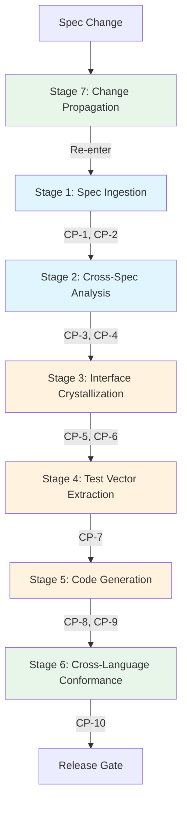
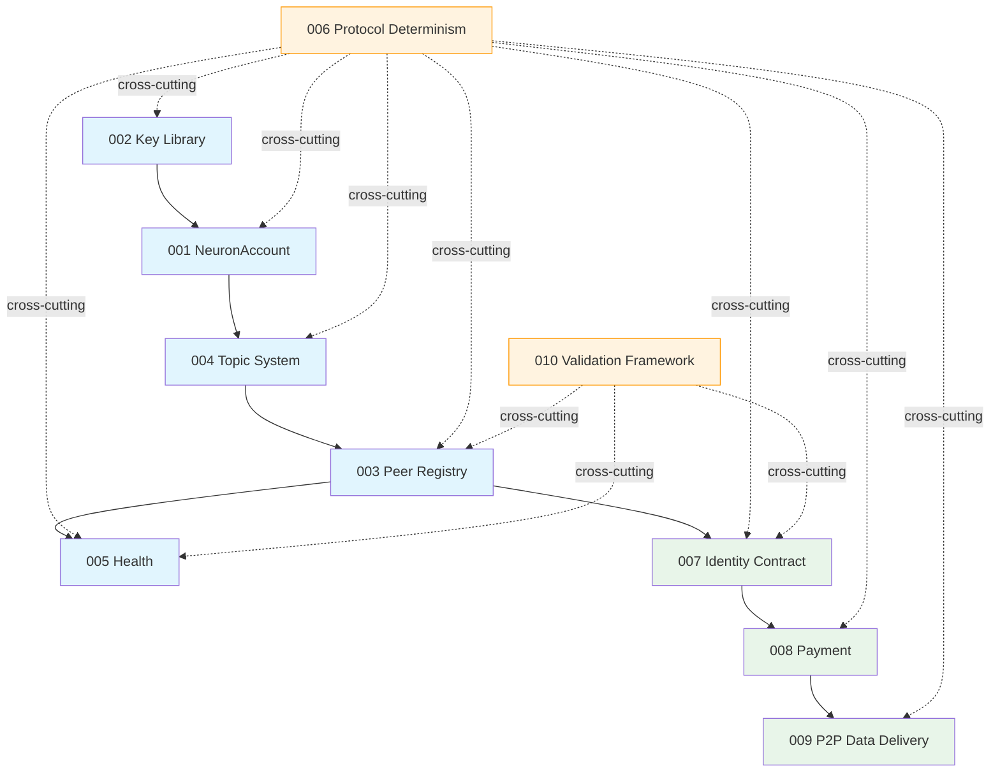

# Neuron Spec-to-SDK AI Pipeline

**Date**: 2026-04-01 | **Status**: v1.1.0 | **Scope**: Canonical reference for deriving language implementations from Neuron protocol specifications (specs 001–010)

---

## Executive Summary

The Neuron SDK uses a 7-stage pipeline organized into 3 tiers to derive language implementations from its 10-spec protocol corpus (001-010). The pipeline ensures that specs remain the single source of truth, implementations do not invent new behavior, and multiple language SDKs produce byte-identical outputs for the same inputs. Spec 006 (Protocol Determinism) serves as the universal oracle for cross-language consistency, providing 16 byte-level algorithm specifications (FR-A01–A16), 10 normative wire format rules (FR-W01–W10) plus the nanosecond timestamp mandate (FR-W02a), 4 golden test vector chains, and a unified error taxonomy across 9 domains. Spec 010 (Validation Framework) extends the protocol with an evidence-based validation layer — validators are agents, verdicts are three-outcome (compliant / non-compliant / inconclusive), and evidence envelopes flow through the same TopicMessage substrate.

---

## Pipeline Overview

### Three Tiers

| Tier              | Stages | Purpose                                                    |
| ----------------- | ------ | ---------------------------------------------------------- |
| **Comprehension** | 1–2    | Read and cross-validate specs before any interpretation    |
| **Derivation**    | 3–5    | Map specs to interfaces, tests, and language-specific code |
| **Generation**    | 6–7    | Verify conformance across languages and propagate changes  |

### Seven Stages

| Stage | Name                           | Input                                               | Output                                     | Checkpoint(s) | Spec Kit Command                       |
| ----- | ------------------------------ | --------------------------------------------------- | ------------------------------------------ | ------------- | -------------------------------------- |
| 1     | Spec Ingestion                 | spec.md, data-model.md, contracts/, plan.md         | Requirement inventory                      | CP-1, CP-2    | `/speckit.specify`, `/speckit.clarify` |
| 2     | Cross-Spec Dependency Analysis | Stage 1 output + upstream contracts/                | Compatibility report                       | CP-3, CP-4    | `/speckit.analyze`                     |
| 3     | Interface Crystallization      | Stage 2 output + 006 type mappings                  | Type/interface/error definitions (no impl) | CP-5, CP-6    | `/speckit.plan`, `/speckit.tasks`      |
| 4     | Test Vector Extraction         | Stage 3 interfaces + 006 test-vectors.md            | Failing test suite (Red phase)             | CP-7          | `/speckit.implement` (Red)             |
| 5     | Code Generation                | Stage 3 interfaces + Stage 4 tests + 006 algorithms | Compiled, tested implementation            | CP-8, CP-9    | `/speckit.implement` (Green)           |
| 6     | Cross-Language Conformance     | Stage 5 output for 2+ languages                     | Conformance report                         | CP-10         | `/speckit.conform`                     |
| 7     | Change Propagation             | Spec diff + dependency graph                        | Impact report                              | —             | `/speckit.propagate`                   |

### Stage Flow



---

## Stage 1: Spec Ingestion

**Purpose**: Build a verified, complete understanding of a single spec's requirements before any interpretation begins.

**Process**:

1. Load constitution (`.specify/memory/constitution.md`) first
2. Load target spec's `spec.md`, `data-model.md`, `contracts/*.md`, `plan.md`
3. Load only `contracts/` and `doc.go` of upstream dependencies — NOT full spec.md (per CLAUDE.md AI Context Loading Strategy)
4. Extract requirement inventory: all FR-\*, SC-\*, SEC-\*, VR-\*, OBS-\* markers with RFC 2119 level and testability flag
5. Extract entity inventory from data-model.md: every entity, field, method, invariant, validation rule
6. Extract contract inventory from contracts/\*.md: every function signature, precondition, algorithm step
7. Cross-reference completeness: every FR maps to an entity or contract function; every SC has a testable scenario
8. Extract Evidence & Validation inventory (Constitution XI, v1.5.0): verification tier (`on-chain-only` / `topic-observable` / `proof-required`), observable signals, evidence rules (VR-\*), non-observable areas, and suggested evidence recipes. If the spec has a `neuron-validator` service type reference, trace the validator agent model from Spec 010.

**Gates**: CP-1 (Constitution Check 11/11), CP-2 (zero `[NEEDS CLARIFICATION]` markers)

---

## Stage 2: Cross-Spec Dependency Analysis

**Purpose**: Verify that imported types, interfaces, and invariants from upstream specs are stable and non-contradictory.

**Process**:

1. Trace imported types — verify each exists in upstream data-model.md with correct methods/fields
2. Trace wire format compliance — verify serialization follows 006 `wire-format.md` (canonical field order, type encoding)
3. Trace algorithm compliance — verify every crypto/encoding operation matches 006 `algorithm-reference.md`
4. Detect contradictions — flag any requirement that conflicts with upstream specs

**Gates**: CP-3 (FR traceability — every FR traces to downstream artifacts), CP-4 (zero cross-spec contradictions)

**Key dependency chain**:

```
002 Key Library → 001 NeuronAccount → 004 Topic System → 003 Peer Registry → 005 Health
                                                                                    ↓
006 Protocol Determinism (cross-cutting, specs 001–010)      007 Identity Contract
                                                                    ↓
                                                             008 Payment → 009 P2P Data Delivery

010 Validation Framework (cross-cutting, depends on 001–007)
```

---

## Stage 3: Interface Crystallization

**Purpose**: Derive the target language's type, interface, and error definitions from spec contracts — **before writing any implementation code**. This is the critical anti-vibe-coding guardrail.

**Process**:

1. Map protocol types to language types using 006's Primitive Type Encoding Table
2. Generate type definitions: struct/class per entity, private fields, factory constructors (`New*()`, `*From*()`), accessor methods (getters only)
3. Generate interface definitions: function signatures from contracts with typed parameters, precondition docs, error types — **no implementation bodies**
4. Generate error type hierarchy from 006 `error-taxonomy.md` using language-idiomatic patterns

**Protocol type mappings**:

| Protocol Type   | Go                | Rust          | TypeScript       | Python        |
| --------------- | ----------------- | ------------- | ---------------- | ------------- |
| `UnsignedInt64` | `uint64`          | `u64`         | `bigint`         | `int`         |
| `ByteArray`     | `[]byte`          | `Vec<u8>`     | `Uint8Array`     | `bytes`       |
| `Optional<T>`   | `*T` / omitempty  | `Option<T>`   | `T \| undefined` | `Optional[T]` |
| `Error`         | `error` interface | `Result::Err` | `Error` class    | `Exception`   |

**Rule**: The AI MUST NOT write any implementation logic during this stage. Only types, signatures, errors, and doc comments.

**Gates**: CP-5 (upstream tests pass), CP-6 (every MUST-level FR has a corresponding type or function)

---

## Stage 4: Test Vector Extraction & Test Scaffolding

**Purpose**: Produce executable tests from spec scenarios and 006 golden test vectors before implementation exists (TDD Red phase — Constitution IX).

**Process**:

1. **Golden test vector tests** — for each of the 4 chains in `test-vectors.md`:
   - Chain 1: Key Derivation (private key → public key → EVM address → PeerID → DID:key)
   - Chain 2: TopicMessage Signing (preimage → Keccak256 → RFC 6979 → canonical JSON)
   - Chain 3: HeartbeatPayload Signing (JSON → TopicMessage envelope → sign)
   - Chain 4: Key Encryption Round-Trip (Argon2id → AES-256-GCM → decrypt → verify)
   - Assert every intermediate hex value, not just final outputs
   - **These tests are identical across all languages**
2. **Acceptance scenario tests** — map Given/When/Then from spec.md to test setup/action/assertion
3. **Determinism tests** — sign same message twice, assert byte-identical signatures (Constitution X)
4. **Negative tests** — for every error code in 006 `error-taxonomy.md`, provide invalid input and assert correct error code
5. **Cross-spec integration tests** — verify type flow across package boundaries

**Gate**: CP-7 (all tests fail — Red phase)

---

## Stage 5: Code Generation

**Purpose**: Implement the minimum code to make all tests pass (TDD Green phase), following spec contracts exactly (Constitution VII).

**Process**:

1. Implement in strict dependency order: 002 → 001 → 004 → 003 → 005 → 006 → 007 → 008 → 009 → 010. Each module's tests must pass before starting the next. Specs 006 and 010 are cross-cutting frameworks — they produce utility types and test infrastructure, not standalone modules.
2. Follow `algorithm-reference.md` literally: exact byte-level operations (Keccak256, RFC 6979, big-endian encoding, low-S normalization, ECIES for 009, delivery framing for 009)
3. **Timestamp semantics**: All protocol timestamps MUST be Unix epoch nanoseconds as uint64 (FR-W02a). Protocol constants (e.g., MIN_DEADLINE_DELTA = 10 seconds) are in seconds; multiply by 10^9 when comparing against nanosecond timestamps.
4. Follow language-specific patterns (for Go: `internal/` packages, structured errors, immutable types, defensive copying, constant-time comparisons, named constants, injectable interfaces, FR/SC tracing in doc comments)

**Gates**: CP-8 (all tests pass — Green phase), CP-9 (static analysis clean — e.g., `go vet` for Go, `clippy` for Rust, `eslint` for TypeScript)

---

## Stage 6: Cross-Language Conformance

**Purpose**: Verify that multiple language SDKs produce byte-identical outputs for the same inputs.

**Process**:

1. Run all 4 golden test vector chains in every language — compare every intermediate value
2. Serialize the same logical object in every language — compare raw UTF-8 bytes
3. Provide same invalid inputs in every language — verify same error codes

**Language-specific concerns**:

- **UTF-16 languages (JS, Java, C#)**: Must explicitly encode to UTF-8 before hashing
- **Languages without ordered maps (Python < 3.7)**: Must use ordered collections for canonical JSON
- **Languages with arbitrary-precision integers (Python, JS BigInt)**: Simpler UnsignedInt64 handling

**Gate**: CP-10 (100% byte-identical outputs across languages for all test vector chains)

**Tool**: `/speckit.conform`

---

## Stage 7: Change Propagation

**Purpose**: When a spec is amended, trace the change through the dependency graph and identify all affected artifacts and implementations.

**Process**:

1. Classify: MUST (breaking) / SHOULD (significant) / additive / clarification
2. Trace downstream impact using the dependency graph
3. Identify affected spec artifacts and implementation files
4. Produce impact report with specific file paths and change descriptions
5. Offer to regenerate affected tasks.md files

**Tool**: `/speckit.propagate`

---

## Checkpoint Reference

| CP    | Stage | Name                   | Automated?    | Validation Method                                                                          |
| ----- | ----- | ---------------------- | ------------- | ------------------------------------------------------------------------------------------ |
| CP-1  | 1     | Constitution Check     | Yes           | Parse `plan.md` Constitution Check table for 11 PASS/N/A rows                              |
| CP-2  | 1     | Zero Ambiguity         | Yes           | Grep spec artifacts for `[NEEDS CLARIFICATION` — count must be 0                           |
| CP-3  | 2     | FR Traceability        | Yes           | Every FR-\* and VR-\* in `spec.md` appears in `data-model.md`, `contracts/`, or `tasks.md` |
| CP-4  | 2     | Cross-Spec Consistency | Best-effort   | Imported types exist in upstream `data-model.md`                                           |
| CP-5  | 3     | Upstream Tests         | Yes           | Run tests on all upstream dependency packages (e.g., `go test`, `npm test`)                |
| CP-6  | 3     | Interface Coverage     | Best-effort   | MUST-level FRs have corresponding types/functions in the target language                   |
| CP-7  | 4     | Red Phase              | Manual        | All generated tests fail before implementation code exists                                 |
| CP-8  | 5     | Green Phase            | Yes           | Run tests on target package (e.g., `go test`, `npm test`)                                  |
| CP-9  | 5     | Static Analysis        | Yes           | Static analysis clean — zero warnings (e.g., `go vet`, `clippy`, `eslint`)                 |
| CP-10 | 6     | Cross-Language         | Manual→Script | Run `/speckit.conform` for byte-identical output verification                              |

**Automated validation**: `.specify/scripts/bash/validate-pipeline.sh`

```bash
# Check all gates for a spec (skip go test/vet)
.specify/scripts/bash/validate-pipeline.sh --spec 005-health --skip-tests

# Check only Stage 1 gates
.specify/scripts/bash/validate-pipeline.sh --spec 005-health --stage 1

# Full check with tests (requires Go toolchain)
.specify/scripts/bash/validate-pipeline.sh --spec 005-health

# JSON output for CI integration
.specify/scripts/bash/validate-pipeline.sh --spec 005-health --json
```

---

## Rules for AI Generation

### Hard Rules (violation = pipeline halt)

| Rule                               | Description                                                                                                                                                            | Rationale                     |
| ---------------------------------- | ---------------------------------------------------------------------------------------------------------------------------------------------------------------------- | ----------------------------- |
| **R1: No Invention**               | AI MUST NOT add behavior not specified in FRs. Every function/type/error traces to FR/SC/SEC/VR. Ambiguity → halt and clarify, not guess.                              | Anti-hallucination            |
| **R2: Algorithm Fidelity**         | Every crypto/encoding operation follows 006 `algorithm-reference.md` exactly. No substitutions (SHA-3 ≠ Keccak256, random nonce ≠ RFC 6979).                           | Determinism (Constitution X)  |
| **R3: Wire Format Compliance**     | Every JSON serialization follows 006 `wire-format.md`: compact, canonical order, UnsignedInt64 as strings, base64 padded, optional omitted not null, EIP-55 addresses. | Cross-language consistency    |
| **R4: Error Taxonomy Compliance**  | Every error uses exact code from 006 `error-taxonomy.md`. No custom codes. No missing MUST-level error conditions.                                                     | Uniform diagnostics           |
| **R5: Traceability Comments**      | Every type/function/test includes FR/SC/SEC/VR ref in doc comments. Pattern: `// FR-001: ...`, `// VR-H-01: ...`                                                       | Traceability (Constitution V) |
| **R6: Test-Before-Implementation** | Within each task phase, all tests must be written and verified to fail before any implementation code is written.                                                      | TDD (Constitution IX)         |

### Soft Rules (violation = warning, documented)

| Rule                            | Description                                                                                                                                 | Rationale                   |
| ------------------------------- | ------------------------------------------------------------------------------------------------------------------------------------------- | --------------------------- |
| **R7: Language Idioms**         | Use the target language's patterns (Go: error returns; Rust: Result; Python: exceptions)                                                    | Developer experience        |
| **R8: Defensive Coding**        | Defensive copies for byte slices, constant-time comparisons for security, named constants for magic values, validation at construction time | Security (SEC-003, SEC-005) |
| **R9: Dependency Minimization** | Use only dependencies listed in plan.md. Document rationale for any additions.                                                              | Supply chain safety         |

---

## Anti-Hallucination Safeguards

1. **Requirement anchoring**: Post-generation grep for functions without FR/SC/VR comments → flag as potential invention.

2. **Test vector anchoring**: Every crypto test assertion compares against hex values from 006 `test-vectors.md`. AI-invented "expected" values are forbidden — all golden values come from the spec.

3. **Interface-implementation mismatch**: Diff the exported API surface against the Stage 3 interface specification. Extra exports (functions the spec did not call for) are violations of R1.

4. **Wire format compliance testing**: A dedicated test serializes every JSON-serializable type and verifies compact format, correct field order, correct type encoding. This test is mechanically derived from `wire-format.md` and is identical across languages.

5. **Error message sanitization**: A test searches all error messages for patterns that might contain key material (hex strings >64 chars, base64 strings >44 chars). This enforces SEC-003 and SEC-005 automatically.

---

## Cross-Language Consistency Strategy

### 006 as Universal Oracle

Cross-language consistency is achieved by comparing every implementation to the same set of normative documents — not by comparing implementations to each other:

| 006 Artifact             | What It Provides                                                           | How It Ensures Consistency                                     |
| ------------------------ | -------------------------------------------------------------------------- | -------------------------------------------------------------- |
| `algorithm-reference.md` | 16 byte-level algorithm specs (FR-A01–A16)                                 | Any language following the same steps produces identical bytes |
| `wire-format.md`         | 10 JSON encoding rules (FR-W01–W10) + FR-W02a nanosecond timestamp mandate | Identical serialization regardless of language JSON library    |
| `test-vectors.md`        | 4 golden chains with every intermediate hex value                          | Byte-exact verification — no room for interpretation           |
| `error-taxonomy.md`      | Unified NEURON-{DOMAIN}-{NNN} error codes across 9 domains                 | Same diagnostics across all SDKs                               |
| `data-model.md`          | Primitive Type Encoding Table                                              | Maps protocol types to language-native types                   |

### First Language (Go) vs. Subsequent Languages

**Go (reference implementation)**:

- Full pipeline Stages 1–5
- Produces reference outputs cross-verified against 006 documented values
- Refines ambiguities in 006 → fed back as spec amendments

**Subsequent languages (Rust, TypeScript, Python)**:

- Stages 1–2: Same comprehension and dependency analysis
- Stage 3: Same interfaces mapped to language-native types via 006 type mapping
- Stage 4: Import the exact same test vectors — shared JSON data, language-specific test harness
- Stage 5: Same algorithms, language-specific libraries
- Stage 6: Cross-language conformance against Go reference values

---

## Spec Kit Command Mapping

| Pipeline Stage | Command                  | Purpose                                              |
| -------------- | ------------------------ | ---------------------------------------------------- |
| 1              | `/speckit.specify`       | Create/update feature specification                  |
| 1              | `/speckit.clarify`       | Resolve ambiguities in specification                 |
| 2              | `/speckit.analyze`       | Cross-artifact consistency analysis                  |
| 3              | `/speckit.plan`          | Generate implementation plan with Constitution Check |
| 3–4            | `/speckit.tasks`         | Generate dependency-ordered task list                |
| 4–5            | `/speckit.implement`     | Execute TDD implementation (Red → Green → Refactor)  |
| 6              | `/speckit.conform`       | Cross-language conformance verification              |
| 7              | `/speckit.propagate`     | Change impact analysis and propagation               |
| \*             | `/speckit.checklist`     | Custom quality checklists                            |
| \*             | `/speckit.constitution`  | Constitution management                              |
| \*             | `/speckit.taskstoissues` | Convert tasks to GitHub Issues                       |

---

## Dependency Graph



---

## Appendix: Validation Tooling

### Pipeline Checkpoint Script

Location: `.specify/scripts/bash/validate-pipeline.sh`

```bash
# Usage
./validate-pipeline.sh --spec <spec-name> [--stage N] [--skip-tests] [--json]

# Examples
./validate-pipeline.sh --spec 005-health --skip-tests        # Spec-only checks
./validate-pipeline.sh --spec 002-key-library                 # Full check with tests
./validate-pipeline.sh --spec 007-identity-contract --json    # CI-friendly output
./validate-pipeline.sh --spec 005-health --stage 1            # Stage 1 gates only
```

### Conformance Command

```
/speckit.conform
```

Verifies test vector chains, wire format, and error taxonomy for all detected language implementations. See `.claude/commands/speckit.conform.md`.

### Propagation Command

```
/speckit.propagate "002: renamed EVMAddress to EthereumAddress"
```

Traces downstream impact through the dependency graph. See `.claude/commands/speckit.propagate.md`.
