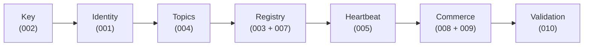

# Architecture in 2 Minutes

← Back to [Getting Started](README.md)

Every Neuron interaction has the same seven moving parts. Read this once and the demos make sense in order.

## The seven pieces

**Buyer / Seller.** Any process holding a secp256k1 private key. From that one key it derives an EVM address (on-chain identity), a libp2p PeerID (peer-to-peer networking), and a DID:key (W3C decentralized identifier). The same person, the same code, the same key — three identities. Specs [002](../../specs/002-key-library/spec.md), [001](../../specs/001-neuron-account-module/spec.md).

**SDK.** The bindings that turn protocol semantics into function calls. Reference implementations live in [`impl/golang/internal/`](../../impl/golang/internal/) and [`impl/typescript/src/`](../../impl/typescript/src/). The Go SDK is the most complete; the TypeScript SDK covers the buyer side and is browser-ready.

**Profile descriptor.** A JSON document at `/.well-known/neuron-profile.json` declaring which connectivity profiles and transport bindings the agent supports — for example WSS for browsers, QUIC for native, Circuit Relay v2 for NATed peers, WebTransport for HTTP/3 clients. The buyer reads this descriptor and picks the binding that fits its runtime. This is the seam that lets a browser and a NATed IoT device talk to the same seller without either side knowing the other's transport. Spec [013](../../specs/013-connectivity-profiles/spec.md).

**Transport — control plane.** Signed, append-only message channels (`stdIn`, `stdOut`, `stdErr`) carry every protocol envelope: registration, heartbeats, negotiation, invoices, validator verdicts. The default backend is Hedera Consensus Service. The same `TopicAdapter` interface accepts ERC-20-style logs, Kafka, or in-memory mocks — so the same code that runs against real HCS in production runs against an in-memory bus in unit tests. Spec [004](../../specs/004-topic-system/spec.md).

**Transport — data plane.** Once buyer and seller agree on terms over the control plane, they open a libp2p stream for the actual data. Streams run over QUIC, secure WebSockets, or WebTransport — chosen at runtime based on the profile descriptor and what each peer supports. Optional Circuit Relay v2 handles NAT traversal. Specs [009](../../specs/009-p2p-data-delivery/spec.md), [011](../../specs/011-relay/spec.md).

**Payment / escrow.** Buyers and sellers negotiate price and terms over the control plane, then deposit funds into an `EscrowAdapter`. In demos this is an in-memory mock; in production it is a Solidity contract on an EVM chain. The adapter abstraction means the same negotiation state machine works against either backend. Spec [008](../../specs/008-payment/spec.md).

**Delivery.** Once escrow is funded, the seller publishes a `connectionSetup` envelope containing its multiaddr **encrypted to the buyer's public key** (secp256k1 ECDH + HKDF-SHA256 + AES-256-GCM). The buyer decrypts, dials the seller, and receives data through a small frame protocol with a SHA-256 integrity check. Then the buyer signs an invoice acknowledgement and the seller releases the escrow.

**Validation.** Independent validator agents observe the control plane, verify every signature, and publish `EvidenceEnvelope` records carrying a three-outcome verdict (`COMPLIANT` / `NON_COMPLIANT` / `INCONCLUSIVE`). Verdicts can anchor on-chain via the Validation Registry, which means a third party can confirm — by reading a public ledger — that a given exchange actually happened the way the parties claim. Spec [010](../../specs/010-validation-framework/spec.md).

## Underneath all of this: liveness

Every agent publishes signed heartbeats on its `stdOut` topic with a self-declared deadline promise: "I'll check in again within X seconds." Observers track those deadlines and classify peers as `ALIVE`, `SUSPECT`, `DEAD`, or `OFFLINE`. There is no central liveness oracle — every observer makes its own call from the public record. Spec [005](../../specs/005-health/spec.md).

## The SAPIENT application layer (specs 015–018)

On top of the seven Core pieces, the application layer standardizes **sensor data exchange** using SAPIENT (BSI Flex 335 v2.0), an open UK-DSTL / NATO sensor-interop standard. The division of labor is strict:

- **Sensor bridge (016 JetVision ADS-B, 017 DroneScout Remote ID)** — a Neuron-blind *modality → SAPIENT* translator. It decodes one sensor modality and emits standard SAPIENT messages over a plain TCP edge. It holds **no key, no wallet, no AgentCard, no heartbeat, no lane logic**.
- **Seller Proxy (015)** — the generic, vendor-blind sensor-side proxy. It owns the EIP-8004 identity, AgentCard publication, capability advertisement, heartbeats, admission, and the buyer dial. It routes each SAPIENT message onto a Neuron lane by message *type*: `DetectionReport` → the 009 P2P data plane; `Registration` / `StatusReport` / `Task` / `TaskAck` → the 004 auditable topic lane.
- **Buyer Proxy + consumer (015, 018)** — the consumer-side mirror. The Buyer Proxy owns the buyer identity and per-seller 008 agreements, verifies the seller's AgentCard, and presents a plain SAPIENT TCP edge to a Neuron-blind consumer. The buyer is **multi-source and modality-blind**: it holds N independent seller sessions and never interprets payloads.
- **Display / API (consumer side)** — modality interpretation happens only here. Tracks are keyed `nodeId|uid` (never by SAPIENT `object_id` alone, which can collide across sensors); aircraft surface with `kind:"adsb"` + `callsign`, drones with `rid.*` fields — an aircraft never renders as a drone. Source liveness is **runtime-verified** from sessions, heartbeats, and the `feedSource` advertisement, never asserted statically.

Spec [015](../../specs/015-sapient-sensor-layer/spec.md) defines the proxies and lanes once; [016](../../specs/016-adsb-dapp/spec.md) and [017](../../specs/017-remote-id-dapp/spec.md) define only the vendor translators (`neuron.adsb/1`, `neuron.rid/1` extensions); [018](../../specs/018-cot-dapp/spec.md) defines the lightweight SAPIENT→CoT display consumer.

## How the demos map to this

| Demo                                                     | Pieces exercised                                |
| -------------------------------------------------------- | ----------------------------------------------- |
| [Mock buyer-seller](demos/1-buyer-seller-mock.md)        | All seven, in-process, mock substrate           |
| [P2P delivery](demos/2-delivery.md)                      | Data plane in isolation — across processes      |
| [Relayed delivery](demos/3-relay.md)                     | Data plane + Circuit Relay v2                   |
| [Browser demo (WSS)](demos/4-browser-wss.md)             | Buyer-side SDK + WSS data plane in a browser    |
| [Browser WebTransport](demos/5-browser-webtransport.md)  | Buyer-side SDK + HTTP/3 data plane in a browser |
| [Hedera heartbeat](demos/6-hedera-heartbeat.md)          | Control plane on real HCS + heartbeat           |
| [Full testnet commerce](demos/7-hedera-full-commerce.md) | All seven, real HCS + real escrow adapter       |
| [SAPIENT sensor chain](demos/8-sapient-chain.md)         | The 015 proxy pair + sensor translator + map UI |

## Where to read more

- The [learning path](learning-path.md) walks through each piece with the demos that prove it.
- The [Constitution](../../.specify/memory/constitution.md) defines the twelve ratified principles every spec must satisfy.
- Each component has its own spec at [`../../specs/`](../../specs/) — read them when you want the formal contract, not the high-level intuition.
