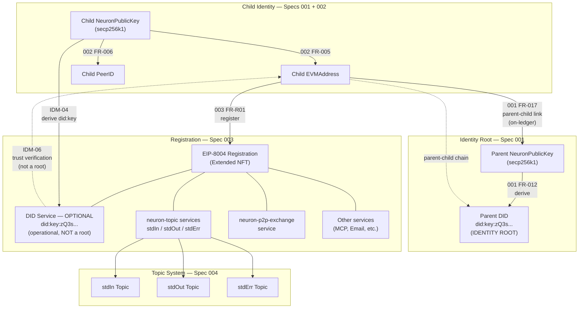

# Neuron Identity Model and DID Service Specification

**Status**: Proposal
**Date**: 2026-02-13
**Scope**: Cross-cutting — applies to Spec 001 (NeuronAccount), Spec 002 (Key Library), Spec 003 (Peer Registry), and Spec 004 (Topic System)
**Purpose**: Eliminate ambiguity in DID ownership between the Account layer and the Registration layer; establish a single-root hierarchical identity model for the Neuron protocol

---

## 1. Background

The Neuron protocol defines agent identity across multiple specification documents. Two of these documents independently reference Decentralized Identifiers (DIDs) without defining the relationship between them:

- **Spec 001 (NeuronAccount Module)** defines a DID as a mandatory attribute of the Parent Account. The Parent's DID is in `did:key` format, derived from the Parent's NeuronPublicKey (secp256k1). Child Accounts are explicitly excluded from holding a DID; identity resolution for a Child proceeds through the parent-child relationship to the Parent's DID (001 FR-002, FR-007, FR-012).

- **Spec 003 (Peer Registry)** states that the Child's registration — an extended NFT (EIP-721) in an EIP-8004 registry — "carries or references: identity (DID, MCP, Email, Trust Registry)" (003, Key Entities: Extended NFT). The spec does not define whose DID this is, how it is derived, whether it is mandatory, or how it relates to the Parent's DID from Spec 001.

- **Spec 004 (Topic System)** includes a complete agentURI example in which a DID service appears in the EIP-8004 services array with an Ed25519-encoded `did:key` value (`z6Mk...` prefix). This encoding is inconsistent with the Key Library's secp256k1-only constraint (002 FR-003).

The result is an underspecified identity architecture in which the Parent holds one DID (001) and the Child's registration references an undefined DID (003), with no rule governing whether these are the same identifier, related identifiers, or independent identity roots.

---

## 2. Problem Statement

### 2.1 Ambiguity

No specification document defines the relationship between the Parent's DID (001) and the DID referenced on the Child's registration (003). The following questions are unanswered:

1. Is the DID on the registration the Parent's DID, forwarded for discoverability?
2. Is it a new DID for the Child, derived from the Child's own key?
3. Is it an independent, externally-sourced DID unrelated to either key?
4. Is it mandatory or optional for registration completeness?

### 2.2 Risk: Dual Identity Roots

Without a governing rule, implementers may treat the registration's DID as an independent identity root alongside the Parent's DID. This produces:

- **Two unlinked identity anchors** for the same Parent-Child hierarchy, with no defined precedence.
- **Ambiguous trust resolution**: a verifier encountering the registration's DID has no way to determine whether it is authoritative, derived, or advisory.
- **Circular or broken trust graphs** if the registration DID and the Parent DID reference different subjects without a defined resolution path.

### 2.3 Objective

Define a canonical identity model that:

- Establishes exactly one identity root per Parent-Child hierarchy.
- Specifies the derivation, purpose, and trust status of any DID that appears on a registration.
- Prevents dual-root or circular-trust configurations.
- Is consistent with the cryptographic model in Spec 002 (secp256k1 only) and the service schema in Spec 004.

---

## 3. Identity Model

### 3.1 Single-Root Hierarchical Identity

The Neuron protocol uses a **single-root hierarchical identity model**. Each Parent-Child hierarchy has exactly one identity root: the Parent Account's DID.

### 3.2 Identity Root: Parent Account

The Parent Account (001) holds the sole identity root for its hierarchy.

| Property | Value |
|----------|-------|
| **DID format** | `did:key` (W3C DID specification, did:key method) |
| **Key type** | secp256k1 (NeuronPublicKey, per 002 FR-003) |
| **Multicodec** | `0xe7` (secp256k1-pub) |
| **Multibase encoding** | base58btc (`z` prefix) |
| **Resulting prefix** | `did:key:zQ3s...` |
| **Authority** | The Parent's DID is the authoritative identity anchor. All subordinate identities in the hierarchy derive trust from it. |
| **Spec reference** | 001 FR-012: "System MUST generate DID:key format identifiers for Parent accounts" |

### 3.3 Child Account Identity

The Child Account does NOT possess an authoritative DID at the Account level.

The Child's identity consists of:

| Component | Derivation | Spec reference |
|-----------|-----------|----------------|
| **EVMAddress** | Derived from the Child's NeuronPublicKey (secp256k1) | 002 FR-005 |
| **PeerID** | Derived from the Child's NeuronPublicKey (secp256k1) | 002 FR-006 |
| **Parent reference** | The Parent's NeuronPublicKey, stored on the Child Account | 001 FR-002 |
| **Parent-child link** | Traceable on ledger (first funder or explicit creator) | 001 FR-017 |

Identity resolution for a Child follows the chain: Child EVMAddress -> parent-child relationship (on-ledger) -> Parent's DID (identity root).

### 3.4 Shared Account Identity

The Shared Account does NOT possess a DID at the Account level or on any registration. Shared Accounts use MultisigKey (002 FR-023) and are identified by their multisig key configuration and ledger attachment.

### 3.5 Registration: Capability Declaration, Not Identity Establishment

The Registration (003) declares the Child's **reachability and services** within an EIP-8004 registry. It is a capability and discoverability layer. It does NOT establish a new identity.

The registration's extended NFT (EIP-721) and associated EIP-8004 services describe what the agent can do and how to reach it. They do not define who the agent is at the identity-root level.

---

## 4. DID Service on Registration

### 4.1 Definition

The EIP-8004 services array on a registration MAY include a DID service. When present, this service has the following form:

```json
{
  "name": "DID",
  "endpoint": "did:key:zQ3s<base58btc-encoded-secp256k1-public-key>",
  "version": "v1"
}
```

### 4.2 Derivation Rule

The DID value in the registration's DID service MUST be a `did:key` identifier deterministically derived from the **registered Child's NeuronPublicKey** (secp256k1).

Rationale:

1. The registration subject is the Child (EIP-8004 registers agents; the agent is the Child).
2. `did:key` from a NeuronPublicKey is a deterministic encoding of the same key that produces the Child's EVMAddress and PeerID. It does not introduce a new cryptographic root.
3. The Parent's DID belongs to the Parent entity, not to the Child's agent registration.
4. Consumers resolving the agentURI require a resolvable identifier for the agent itself.

### 4.3 Trust Status

The DID service on the registration is an **operational identifier** for DID-based discovery and interoperability. It is NOT an identity root.

Trust verification follows a single, acyclic path:

```
Registration DID:key
    |
    | (derived from)
    v
Child NeuronPublicKey
    |
    | (derives)
    v
Child EVMAddress
    |
    | (parent-child link, on-ledger — 001 FR-017)
    v
Parent NeuronPublicKey
    |
    | (derives)
    v
Parent DID:key  (IDENTITY ROOT)
```

A verifier who encounters the registration's DID:key can confirm its legitimacy by:

1. Extracting the secp256k1 public key from the `did:key` value.
2. Deriving the EVMAddress from that public key.
3. Verifying that the EVMAddress matches the registered Child's address.
4. Verifying the parent-child relationship (001 FR-017) to reach the Parent's DID.

### 4.4 Mandatory vs Optional

The DID service on the registration is **OPTIONAL**. A registration is complete without it (per 003 FR-R08, which requires only the three standard `neuron-topic` services for completeness). When present, it MUST comply with the rules in this document.

### 4.5 Encoding Constraint

The `did:key` identifier on the registration MUST use the secp256k1 multicodec encoding:

| Parameter | Value |
|-----------|-------|
| Multicodec code | `0xe7` (secp256k1-pub) |
| Multibase prefix | `z` (base58btc) |
| Resulting DID prefix | `did:key:zQ3s...` |

The Ed25519 multicodec (`0xed`, prefix `z6Mk...`) MUST NOT be used for Neuron DIDs. This constraint follows from the Key Library's secp256k1-only design (002 FR-003, FR-004).

---

## 5. Normative Rules

The following rules are normative. They use RFC 2119 language (MUST, MUST NOT, SHOULD, MAY).

### 5.1 Identity Root

**IDM-01**: The Parent Account's DID (`did:key` format, derived from the Parent's NeuronPublicKey per 001 FR-012) MUST be the sole identity root for its Parent-Child hierarchy. No other entity in the hierarchy MAY claim an independent identity root.

**IDM-02**: The Child Account MUST NOT possess an authoritative DID attribute on the Account entity (001). The Child's identity MUST resolve via its EVMAddress and parent-child relationship to the Parent's DID.

**IDM-03**: The Shared Account MUST NOT possess a DID attribute on the Account entity or on any registration.

### 5.2 Registration DID Service

**IDM-04**: When a Registration (003) includes a DID service (service name `"DID"`) in the EIP-8004 services array, the DID value MUST be a `did:key` identifier deterministically derived from the registered Child's NeuronPublicKey (secp256k1, per 002).

**IDM-05**: The Registration MUST NOT include a DID service whose value is not derivable from the registered Child's NeuronPublicKey. Externally-sourced, manually-assigned, or arbitrary DIDs MUST NOT appear in the DID service.

**IDM-06**: The DID service on the Registration MUST NOT be interpreted or used as an identity root. It is an operational identifier for DID-based discovery. Identity root resolution MUST follow: Registration DID:key -> Child NeuronPublicKey -> Child EVMAddress -> parent-child relationship -> Parent DID.

**IDM-07**: The DID service on the Registration is OPTIONAL. A registration is valid and complete without it (per 003 FR-R08). When present, it MUST comply with IDM-04 through IDM-06.

**IDM-08**: The `did:key` identifier on the Registration MUST use the secp256k1 multicodec encoding (`0xe7` prefix, base58btc `zQ3s...`), consistent with the Key Library's secp256k1-only constraint (002 FR-003).

### 5.3 Cross-Spec Consistency

**IDM-09**: The Account module (001) defines the DID entity (NeuronDID) for Parent accounts only. The Registration (003) MAY expose a DID:key service for the Child. These are not conflicting: the Account-level DID and the Registration-level DID service serve different purposes (identity root vs. operational discoverability) and refer to different subjects (Parent vs. Child).

**IDM-10**: Any DID:key on a Registration (derived from the Child's NeuronPublicKey) MUST be verifiable against the identity root (Parent DID) through the parent-child relationship defined in 001 FR-017. If the parent-child link cannot be verified, the derived DID MUST be treated as unverified — not as a standalone root.

### 5.4 Prohibited Patterns

**IDM-11**: A Registration MUST NOT contain a DID service whose value matches the Parent's DID. The Parent's DID is the Parent's identity; the registration is for the Child. Using the Parent's DID on the Child's registration conflates the two entities and violates the hierarchical model.

**IDM-12**: A Registration MUST NOT contain multiple DID services. At most one DID service (service name `"DID"`) is permitted per registration.

**IDM-13**: A system MUST NOT treat a Registration DID as valid for operations that require the identity root (e.g., signing authority over the Parent's treasury, parent-level governance). The Registration DID identifies the Child agent for discovery; it does not confer Parent-level authority.

---

## 6. Required Spec Amendments

The following amendments bring Specs 001, 003, and 004 into alignment with this identity model.

### 6.1 Spec 001 — NeuronAccount Module

**Amendment 001-A**: NeuronDID entity description.

Current (line 260):
> **NeuronDID**: Represents a decentralized identifier document for Parent accounts, providing a standard identity format. Key attributes: DID string, DID document structure. Relationships: required for Parent accounts, optional (nil) for Child accounts.

Replace with:
> **NeuronDID**: Represents a decentralized identifier document for Parent accounts, providing the identity root for the Parent-Child hierarchy. Key attributes: DID string (`did:key` format, secp256k1 multicodec `0xe7`), DID document structure. Relationships: required for Parent accounts; absent for Child and Shared accounts. The Parent's DID is the sole identity root. When a Child's registration (003) exposes a DID service, that DID is derived from the Child's NeuronPublicKey and is subordinate to the Parent's DID via the parent-child relationship (FR-017). See this document.

**Amendment 001-B**: New clarification entry.

Add to the Clarifications section:
> - Q: Is the Parent's DID the only identity root, or can a Registration introduce a separate identity root? -> A: The Parent's DID (`did:key` from the Parent's NeuronPublicKey) is the **sole identity root** for the hierarchy. The Registration (003) MAY include a DID service (`did:key` from the Child's NeuronPublicKey) as an operational identifier for interoperability, but it is NOT an identity root. Trust verification follows the parent-child chain to the Parent's DID. See this document.

### 6.2 Spec 003 — Peer Registry

**Amendment 003-A**: Purpose section, paragraph on NFT and services (line 23).

Current:
> ...the NFT and EIP-8004 **services** carry identity elements (DID, MCP, Email, Trust Registry), **public communication** (unified topic system: stdIn, stdOut, stdErr), and **private communication** (multiaddress — direct registration or indirect via topics).

Replace with:
> ...the NFT and EIP-8004 **services** carry identity elements (MCP, Email, Trust Registry), an optional **DID service** (`did:key` derived from the Child's NeuronPublicKey; see this document), **public communication** (unified topic system: stdIn, stdOut, stdErr), and **private communication** (multiaddress — direct registration or indirect via topics).

**Amendment 003-B**: Key Entities, Extended NFT (line 112).

Current:
> Carries or references: identity (DID, MCP, Email, Trust Registry), and **EIP-8004 services** for topics (public comms) and p2pconns (multiaddress) as defined in their respective specs.

Replace with:
> Carries or references: identity elements (MCP, Email, Trust Registry), an optional DID service (`did:key` derived from the Child's NeuronPublicKey per IDM-04 in this document), and **EIP-8004 services** for topics (public comms) and p2pconns (multiaddress) as defined in their respective specs.

**Amendment 003-C**: Appendix, line 132.

Current:
> NFT links to identity (DID, MCP, Email, Trust Registry)

Replace with:
> NFT links to identity elements (optional DID:key derived from Child's NeuronPublicKey, MCP, Email, Trust Registry)

**Amendment 003-D**: New section — "Identity Model" (after Out of Scope, before User Scenarios).

> ### Identity Model
>
> The registration follows the **single-root hierarchical identity model** defined in this document:
>
> 1. **Identity root**: The Parent Account's DID (`did:key`, derived from the Parent's NeuronPublicKey per 001 FR-012) is the sole identity root for the Parent-Child hierarchy.
>
> 2. **Child identity**: The Child's identity is its EVMAddress (derived from its own NeuronPublicKey per 002). The Child does NOT have an authoritative DID on the Account entity. Identity resolution proceeds via the parent-child relationship (001 FR-017) to the Parent's DID.
>
> 3. **DID service on registration**: The registration MAY include a DID service (`name: "DID"`) in the EIP-8004 services array. When present:
>    - The DID value MUST be a `did:key` derived from the registered Child's NeuronPublicKey (secp256k1).
>    - The `did:key` MUST use the secp256k1 multicodec encoding (`0xe7`, base58btc prefix `zQ3s`), consistent with 002.
>    - This DID is an **operational identifier** for DID-based discovery. It is NOT an identity root.
>    - Trust verification follows: Child DID:key -> Child NeuronPublicKey -> Child EVMAddress -> parent-child link (001 FR-017) -> Parent DID (identity root).
>
> 4. **Prohibited patterns**: The registration MUST NOT include a DID that is unrelated to the Child's NeuronPublicKey. The registration MUST NOT use the Parent's DID as its DID service value. At most one DID service is permitted per registration.

**Amendment 003-E**: New functional requirement.

> - **FR-R14**: When a registration includes a DID service (service name `"DID"`) in the EIP-8004 services array, the DID value MUST be a `did:key` identifier deterministically derived from the registered Child's NeuronPublicKey (secp256k1, per 002). The `did:key` MUST use multicodec `0xe7` (secp256k1-pub, base58btc prefix `zQ3s`). The DID service is an operational identifier for DID-based discovery and MUST NOT introduce an identity root independent of the Parent-Child hierarchy defined in 001. The DID service is OPTIONAL; a registration is complete without it (per FR-R08). See this document.
>
> *Note: This was originally proposed as FR-R09 but was renumbered to FR-R14 during integration to avoid a collision with the Access Control Model's FR-R09 (admission policy). The admission-policy FR numbering is preserved.*

### 6.3 Spec 004 — Topic System

**Amendment 004-A**: Complete agentURI example, DID service (lines 356-360).

Current:
```json
{
  "name": "DID",
  "endpoint": "did:key:z6MkhaXgBZDvotDkL5257faiztiGiC2QtKLGpbnnEGta2doK",
  "version": "v1"
}
```

Replace with:
```json
{
  "name": "DID",
  "endpoint": "did:key:zQ3shP2mWsZYWgpKDXRRx8rBe6UaDQY4mJgZrm5KywKgjqiU9",
  "version": "v1"
}
```

The `zQ3s` prefix is the base58btc + secp256k1 multicodec encoding (`0xe7`), consistent with the Key Library's secp256k1-only constraint (002 FR-003). The previous `z6Mk` prefix encoded Ed25519 (`0xed`), which is not a supported key type in the Neuron protocol.

---

## 7. Trust Graph



Solid arrows represent derivation or registration relationships. Dashed arrows represent the trust verification path. The Parent DID is the sole terminal node in the trust chain.

---

## 8. Summary of Changes

| Spec | Amendment ID | Change |
|------|-------------|--------|
| 001 | 001-A | Clarify NeuronDID entity as sole identity root; note subordination of registration DID |
| 001 | 001-B | Add clarification Q&A on identity root exclusivity |
| 003 | 003-A | Revise Purpose paragraph: DID is optional, derived from Child key |
| 003 | 003-B | Revise Extended NFT entity: DID is optional, derived, governed by IDM-04 |
| 003 | 003-C | Revise Appendix summary: DID is optional and derived |
| 003 | 003-D | Add Identity Model section with single-root rules and prohibited patterns |
| 003 | 003-E | Add FR-R14 (renumbered from FR-R09): DID service derivation, encoding, trust status, and optionality |
| 004 | 004-A | Correct agentURI example DID:key from Ed25519 (`z6Mk`) to secp256k1 (`zQ3s`) |

---

## 9. Conformance

A system conforms to this identity model if and only if:

1. Every Parent Account has a DID (`did:key`, secp256k1) that serves as the identity root for its hierarchy.
2. No Child Account or Shared Account possesses a DID at the Account level.
3. Every DID service on a Registration is derived from the registered Child's NeuronPublicKey and uses secp256k1 multicodec encoding.
4. No Registration DID is treated as an identity root for trust decisions.
5. Every Registration DID is verifiable through the parent-child chain to the Parent's DID.
6. No Registration contains the Parent's DID as its DID service value.
7. No Registration contains more than one DID service.

---

**Document version**: 1.0.0
**Author**: Protocol Architecture
**Governing specs**: 001 (NeuronAccount), 002 (Key Library), 003 (Peer Registry), 004 (Topic System)
