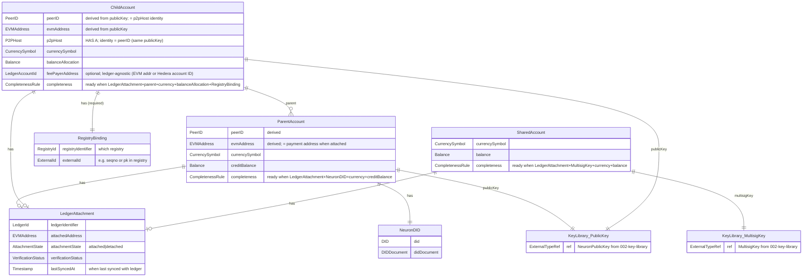

# Feature Specification: NeuronAccount Module

**Feature Branch**: `001-neuron-account-module`  
**Created**: 2026-01-23  
**Status**: Draft  

## Related specs

- **Specs in this repo**:
  - [002 Key Library](../002-key-library/spec.md) — neuron public key, MultisigKey; identity derivation and key semantics.
  - [003 Peer Registry (EIP-8004)](../003-peer-registry/spec.md) — registration and reachability; this account module is upstream and provides identity and payment address.
- **External standards**:
  - [EIP-8004](https://eips.ethereum.org/EIPS/eip-8004) (ERC-8004) — identity registry; payment address and registry binding alignment.
  - [EIP-4337](https://eips.ethereum.org/EIPS/eip-4337) (ERC-4337) — Account Abstraction; paymaster for Child fee payer on Ethereum.
  - [EIP-634](https://eips.ethereum.org/EIPS/eip-634) (ENS text records) — DID attachment for Parent via ENS (alternative to stagnant [EIP-1056](https://eips.ethereum.org/EIPS/eip-1056)).
  - [EIP-7702](https://eips.ethereum.org/EIPS/eip-7702) — Set code for EOAs; EOA can delegate to contract (batching, sponsorship). Does not provide true M-of-N multisig; for Shared use a multisig contract.

## Purpose

The NeuronAccount module implements a hierarchical account system for agent identity and ledger management in distributed systems. The module provides three account types:

**Parent Accounts** serve as the root identity and primary financial account in the system. Each Parent account is:
- Identified by a [neuron public key](../002-key-library/spec.md) (secp256k1)
- Associated with a Decentralized Identifier (DID) document
- Capable of creating and managing Child accounts
- The primary recipient of revenue from data transactions performed by Child accounts
- The main account holder for financial assets (credit balance)

**Child Accounts** represent agent identities, devices, or service endpoints that operate under a Parent account. Each Child account:
- References its Parent account's [neuron public key](../002-key-library/spec.md) for hierarchical identification
- Does not require its own DID document (parent relationship provides identity resolution)
- **HAS A** **p2pHost** (libp2p-style): the Child is associated with a p2p host (e.g. a libp2p Host) for peer-to-peer connectivity. The **p2pHost identity is the PeerID**, derived from the **same [neuron public key](../002-key-library/spec.md)** that derives the Child's EVM address and PeerID — there is no separate host identity; one key derives both ledger identity (evmAddress) and p2p identity (PeerID). How others discover and reach the host (multiaddress discovery) is defined in the [Peer Registry (EIP-8004) specification](../003-peer-registry/spec.md).
- Maintains a separate balance allocation for operational expenses such as transaction signing fees
- Does **not** store reachability or communication data on the account; those are defined and resolved in the [Peer Registry (EIP-8004) specification](../003-peer-registry/spec.md)
- MAY designate a **fee payer** (paymaster): the account holder signs transactions and another party pays transaction fees; see [Blockchain and ledger compatibility](#blockchain-and-ledger-compatibility) for how this is implemented on Ethereum ([ERC-4337](https://eips.ethereum.org/EIPS/eip-4337)) and Hedera (native payer)

**Ledger Attachment**: Accounts must be attached to a settlement infrastructure (e.g., a public DLT like Ethereum, Base, Hedera, a private ledger or just a centralised system, or any ledger system that works with the cryptographic key standards used by Neuron). The account object in this module represents an account that may or may not be attached to a ledger. When attached, the account links to a ledger account using the derived address (e.g., Ethereum address) as the account identifier. Note that some ledgers do not identify accounts by public key directly - multiple accounts can share the same public key, and the discriminator is the Ethereum address (or equivalent derived address). Therefore, the Ethereum address (or ledger-specific derived address) is adopted as the account identity for ledger attachment, not the public key itself. The attachment relationship must be provable - the module must provide methods to verify that the account exists on the specified ledger and that the Neuron private key corresponds to the ledger account (by proving ownership of the Ethereum address or derived address). Account creation on the ledger itself is deferred (out of scope); this module manages the object-level representation and attachment verification.

**Shared Accounts** represent multisig accounts that require threshold signatures (e.g., 2-of-3 multisig) for operations. Each Shared account:
- Uses [MultisigKey](../002-key-library/spec.md) with threshold configuration (e.g., 2-of-3)
- Requires multiple [neuron public keys](../002-key-library/spec.md) for threshold signing
- Can be attached to settlement infrastructure (ledgers) like Parent and Child accounts
- Maintains currency symbol and balance information linked to the attached ledger account
- Does NOT have reachability/comms (like Parent accounts)
- Does NOT have a DID document (like Child accounts)

**Rationale for account types**

- **Parent**: The Parent is the **primary treasury**—the main holder of financial assets and the recipient of revenue. It is kept **separate from Child** so that high value is not exposed in risky environments. Children can operate in relatively unsafe contexts (e.g. IoT devices without a secure crypto module) where only small amounts of value are needed or desirable. A Child can sign transactions with **zero balance** when a **fee payer** (paymaster or native payer) covers fees, or hold a **limited operational allocation** for day-to-day expenses. Limiting funds at the Child limits loss if the Child is compromised.

- **Child**: The Child exists to represent agents, devices, or endpoints that act under a Parent. Each Child **HAS A** p2pHost (libp2p-style); the p2pHost **identity is the PeerID** from the same neuron public key that derives the evmAddress (one key, no separate host identity). Reachability is in the Peer Registry. Because they may live in unsafe or constrained environments, they are designed to need minimal funds (fee payer or a limited operational allocation) and to never hold the Parent's primary treasury. Identity is derived from the Parent so the Child does not require its own DID.

- **Shared**: The Shared account is used when there is a **relationship between two Children and an external arbiter**—a third Neuron account. The Shared account is the multisig (e.g. 2-of-3) that embodies this relationship: the two Children plus the arbiter as signers, with a threshold so that no single party can act alone.

**Currency and Balance**: Each account maintains a currency symbol identifier and balance information. **Balance is only set by syncing with the ledger** (or an explicit refresh); there is no initial balance at construction. When attached to a ledger, **the ledger is the source of truth for balance**: the module reads balance from the ledger (e.g. via RPC) and may cache it for performance but does not define a separate authoritative balance. When **detached**, balance is the **last-known cached value** (if any), otherwise undefined; the cache is explicitly stale when detached. The account object (or its ledger/balance-related part) MUST track **when it was last synced** (e.g. last-synced timestamp) so callers can interpret cached balance and attachment state. Parent accounts serve as the primary financial account holder; Child accounts maintain separate balance allocations for operational expenses. Shared accounts maintain their own balance for multisig-controlled operations.

**Ledger Attachment Semantics Verification**: When an account is attached to a ledger, the system MUST verify that the public key semantics match between Neuron and the ledger. Specifically, the [neuron public key](../002-key-library/spec.md) that derives the Ethereum address in Neuron MUST have matching semantics with the ledger account. If the ledger account has a public key and a different Ethereum address (or derived address), they do NOT match and attachment verification MUST fail. Parent and Child accounts MUST have matching semantics - the public key → Ethereum address derivation must be consistent between the Neuron account object and the ledger account. For Shared accounts, the multisig threshold key configuration must match the ledger's multisig account structure.

This hierarchical model enables organizations to manage multiple agents or devices under a single Parent account while maintaining financial control and identity relationships. The Parent account receives revenue from data transactions, while Child accounts operate with allocated funds for their operational needs. Shared accounts provide additional security through threshold multisig requirements.

**Peer registry compatibility**: This account object maintains compatibility with peer registries (including those conforming to [ERC-8004](https://eips.ethereum.org/EIPS/eip-8004#identity-registry)) that are defined elsewhere. The module provides minimal, registry-agnostic hooks—**registry binding** (required for Child accounts) and payment address resolution—so that a separate registration specification or registry client can publish or sync peer identity to such registries without encoding registry-specific formats in the account.

**Relationship to registration specification**: Registration and reachability are defined in the [Peer Registry (EIP-8004) specification](../003-peer-registry/spec.md). This (account) module is the **upstream** dependency: it provides **identity** (Child EVM address, parent reference, payment address = Parent's evmAddress), **proof of control** of the ledger address, and **registry binding** (registry identifier + external id; required for Child). Reachability and communication details are **not** in this spec; see Peer Registry.

**Account completeness (ready on construction)**: Developers MAY require that an account be **complete** (ready on construction) when building it. A complete account has all required attachments present so that it is usable for account-level operations (identity, ledger, balance capability). For **Parent**: ledger attachment, DID, currency symbol, and credit balance **capability** (balance value may be undefined until first sync). For **Child**: ledger attachment, parent reference, currency symbol, balance allocation capability, and **registry binding**. For **Shared**: ledger attachment, multisig key, currency symbol, and balance capability. Reachability is **not** part of account completeness; see [Peer Registry](../003-peer-registry/spec.md). The system MUST support a completeness check (or builder option) so that construction can require the account to be complete and fail or defer until all of these are present.

## Clarifications

### Session 2026-01-23

- Q: How should keys be referenced in this specification? → A: Use "neuron public key" terminology and link to the [Key Library specification](../002-key-library/spec.md) when discussing keys. This ensures consistency and provides developers with the authoritative source for key-related details.
- Q: Do Parent accounts have communication channels? → A: No. Parent accounts do NOT have reachability/comms. They have credit balance and can receive money. Sending money and transaction signing are out of scope. Reachability/comms are defined in the Peer Registry spec, not here.
- Q: How are parent-child account associations handled? → A: Parent-child associations are maintained at the object level (in-memory representation) in this module. The relationship MUST be traceable on the ledger: parent is the first funder of the child (e.g. first transfer to child address — implicit account creation on Ethereum or Hedera) or the child explicitly lists the parent as creator (e.g. Hedera). The module MUST provide a verification function that verifies this against on-ledger data or account registry systems; when ledger/registry is unavailable, it returns a distinct unverified result.
- Q: How are accounts linked to ledgers? → A: Accounts must be attached to settlement infrastructure (public DLTs, private ledgers, or any ledger system compatible with Neuron's cryptographic key standards). The account object in this module may be attached or detached from a ledger. When attached, the account links to a ledger account using the derived address (e.g., Ethereum address) as the account identifier. Note that some ledgers do not identify accounts by public key directly - multiple accounts can share the same public key, and the discriminator is the Ethereum address. Therefore, the Ethereum address (or ledger-specific derived address) is adopted as the account identity for ledger attachment, not the public key itself. The module MUST provide methods to prove attachment by verifying: (1) the account exists on the specified ledger, (2) the Neuron private key corresponds to the ledger account by proving ownership of the Ethereum address or derived address, (3) the public key semantics match - the public key that derives the Ethereum address in Neuron must have matching semantics with the ledger account (if the ledger has a public key and a different Ethereum address, they do not match). Parent and Child accounts MUST have matching semantics. Account creation on the ledger is out of scope; this module manages object-level representation and attachment verification. Each account must have a currency symbol associated with the ledger and balance.
- Q: What are Shared accounts? → A: Shared accounts are multisig accounts that require threshold signatures (e.g., 2-of-3 multisig) for operations. They use [MultisigKey](../002-key-library/spec.md) with threshold configuration. Shared accounts can be attached to settlement infrastructure like Parent and Child accounts, maintain currency symbol and balance, but do NOT have reachability/comms (like Parent) or DID documents (like Child). For Shared accounts attached to ledgers, the multisig threshold key configuration must match the ledger's multisig account structure.
- Q: Does the account module call the registry contract (RPC, transactions)? → A: No. The module provides data and proofs (e.g. owner and payment address, proof of control of the ledger address). A separate registry client or registration specification performs on-chain or remote calls. The account module only exposes what that client needs so that peers can be registered or updated in registries defined elsewhere.

### Session 2026-02-05

- Q: What are the canonical names for communication address entities? → A: Defined in the [Peer Registry specification](../003-peer-registry/spec.md); this spec does not define comms entities.
- Q: What types should the ER diagram use for entity attributes? → A: High-level semantic types (e.g. AccountType, PeerID, EVMAddress, LedgerId, Balance, DID) must be used for all attributes. Low-level ground types (e.g. string, decimal, object) are used only where no richer type applies. Comms-related types are defined in the Peer Registry spec.
- Q: Should the ER diagram model Parent and Child as one entity or separate entities? → A: Parent, Child, and Shared are shown as **separate entities** (ParentAccount, ChildAccount, SharedAccount) in the ER diagram to reflect their distinct attribute sets and relationships. The runtime type discriminator (accountType) and the single NeuronAccount key entity in the spec remain; the diagram is a high-level view of the three account kinds.
- Q: What is the Parent's payment address and where does it come from? → A: The Parent's **payment address** is the Parent's **evmAddress** (i.e. the attached address when attached to a ledger). There is **no separate** payment address field. This satisfies EIP/ERC-8004 requirements that an agent report a payment address: the peer (Child) reports the Parent's evmAddress so revenue is paid into the Parent account. The Child keeps a limited operational allocation in its own balance; the payment address for registry use is the Parent's evmAddress.
- Q: What is the overarching name for the pluggable component that provides topic-based public comms? → A: Specified in the [Peer Registry](../003-peer-registry/spec.md); not in this spec.
- Q: How does this spec relate to the registry/registration specification? → A: This (account) spec is the **upstream** dependency: it defines the account model, registry binding, and payment address resolution. The **registration specification** (separate) defines how a peer is registered or updated in a registry and consumes the account's binding, payment address, and proof of control.
- Q: What does "account completeness" or "ready on construction" mean? → A: **Complete** means all required attachments for that account type are present (ledger, parent ref, currency, balance capability, registry binding for Child; etc.). Reachability/comms are not part of completeness; see Peer Registry. The builder can require completeness so the account is ready on construction.
- Q: How should the Appendix document blockchain and ledger compatibility (Ethereum, Hedera)? → A: Add one short subsection with **Ethereum/EVM** as the primary target and **Hedera** as a worked example (ledger identifiers, registration model). Comms/topics are in the Peer Registry spec.
- Q: What serialization format(s) must the module support for account data structures? → A: **JSON** is the required/canonical serialization format. Other formats (e.g. CBOR) may be supported by implementations but are not required by this spec.
- Q: What happens when a developer creates an account with a communication address using an unregistered transport kind? → A: Out of scope for this spec; validation of comms/transports is defined in the Peer Registry spec.
- Q: Is the module's balance a local source of truth or a reflection of ledger state? → A: **Ledger is source of truth** — When attached, balance is read from the ledger (e.g. via RPC); the module may cache it for performance but does not define a separate authoritative balance.
- Q: How must parent-child verification work and what when ledger/registry is unavailable? → A: The **parent-child relationship MUST be traceable on the ledger**. Verification checks that the parent is the **first funder** of the child (e.g. first transfer to the child address — implicit account creation on Ethereum or Hedera) or that the child **explicitly lists the parent as creator** (e.g. Hedera). When ledger or registry cannot be used, the verification function returns a distinct **unverified** (or equivalent) result so callers can distinguish verified, unverified, and failed.
- Q: Where do communication/reachability entities live? → A: In the [Peer Registry (EIP-8004) specification](../003-peer-registry/spec.md). The account module does **not** store them; the Child is identified by EVM address and registry binding (required for Child).
- Q: When an account is detached from a ledger, what does balance represent? Should the object track sync time? → A: **Last-known cache** when detached: the last cached value (if any) is still readable; otherwise balance is undefined. The cache is explicitly **stale** when detached. The **whole account object** (or the ledger/balance-related part of it) MUST know **when it was last synced** (e.g. a last-synced timestamp or equivalent) so callers can interpret cached balance and attachment state.
- Q: Can the builder set an initial balance at construction? → A: **No**. Balance is only set by syncing with the ledger (or an explicit refresh). Before first sync, balance is undefined (or last-known cache if reusing a previously synced object). There is no initial-balance parameter at construction.
- Q: For Parent completeness, does "credit balance" require balance to be defined (synced) or only the capability? → A: **Capability only**. "Credit balance" in completeness means the account has the credit balance capability (and currency); the balance value may be undefined until first sync. A Parent can be complete with ledger attachment, DID, and currency without requiring a successful balance read.
- Q: Should the ER diagram type for Child's fee payer be EVMAddress or ledger-agnostic? → A: **Ledger-agnostic**. Use a generic type (e.g. LedgerAccountId or FeePayerId) so the same attribute can hold an EVM address (Ethereum paymaster) or a Hedera account ID. Implementations map the stored value to the appropriate format per ledger. A note in the blockchain compatibility section records this.
- Q: Should Ethereum and Hedera use the same concept for registration? → A: **Yes**. Both use **EIP-8004** for registration (identity registry, extended NFT, services). Hedera has native smart contract capability, so the same model applies on both; details (including any topic/comms mapping) are in the Peer Registry spec.
- Q: Is the p2pHost identity a new key or the same as the account identity? → A: The **p2pHost identity is the PeerID**. It comes from the **same [neuron public key](../002-key-library/spec.md)** that derives both the Child's EVM address and the PeerID. You do **not** create a new host identity; you use the one public key that derives both ledger identity (evmAddress) and p2p identity (PeerID).

### Session 2026-02-11

- Q: Is the Parent's DID the only identity root, or can a Registration introduce a separate identity root? → A: The Parent's DID (`did:key` from the Parent's NeuronPublicKey) is the **sole identity root** for the hierarchy. The Registration (003) MAY include a DID service (`did:key` from the Child's NeuronPublicKey) as an operational identifier for interoperability, but it is NOT an identity root. Trust verification follows the parent-child chain to the Parent's DID. See [Neuron Identity Model](../../docs/neuron-identity-model.md).
- Q: Does the Parent sign transactions on behalf of the Child? → A: **No.** The Parent creates the Child and provides the identity root (Parent DID). The Child acts operationally using its own NeuronPrivateKey — including registration in peer registries (003). The Parent's authority is structural (account hierarchy), not transactional.

## Out of Scope

The following are explicitly out of scope for the NeuronAccount Module:

- **Sending Money (Transfer Execution)**: While Parent accounts have credit balance and can receive money (balance increases), sending money (actual transfer execution) is NOT part of this specification. The module describes account identity and balance tracking, not transaction execution.

- **Transaction Signing**: Signing transactions (including money transactions) is a capability but is out of scope for this specification. Transaction signing functionality would be provided by other modules (e.g., the Key Library for cryptographic signing operations).

- **Account Creation on Ledger**: While DLTs may create accounts through sending money to non-existent accounts or explicit account creation primitives, actual account creation on the ledger is out of scope. This module works with account representations at the object level and manages attachment to existing ledger accounts. The module provides attachment verification but does not create accounts on the ledger.

- **Account Management Operations**: Account lifecycle operations beyond creation, validation, and relationship verification (e.g., updates, deletion) are not specified in this document.

- **Message Transport or Routing**: Out of scope; see Peer Registry spec.

- **Key Generation or Storage**: Key management is handled by the [Key Library](../002-key-library/spec.md). This module uses keys but does not generate or store them.

- **Network Connectivity / Reachability**: Out of scope; see Peer Registry spec.

- **Registry contract interface and chain interaction**: Registry contract ABI, RPC, and sending transactions to a peer registry are out of scope. Registration file format, registry client behaviour, and on-chain registry operations (e.g. setAgentURI, setAgentWallet) are defined in the [Peer Registry specification](../003-peer-registry/spec.md) (when available). This module provides account data and proofs only.

## User Scenarios & Testing *(mandatory)*

### User Story 1 - Create Parent Account with Identity and Financial Management (Priority: P1)

A developer needs to create a root identity (Parent account) that serves as the primary account holder and can create and manage Child accounts. The Parent account includes cryptographic identity ([neuron public key](../002-key-library/spec.md)), DID document, and credit balance management. Parent accounts receive revenue from data transactions performed by their Child accounts. Parent accounts can receive money (balance increases), but sending money (actual transfer execution) is NOT part of this spec. Parent accounts do NOT have reachability/comms (see Peer Registry). Signing transactions (including money transactions) is a capability but is out of scope for this specification.

**Why this priority**: This is the foundational capability - without the ability to create parent accounts, no agent identities can exist. Parent accounts serve as the root of the hierarchical identity system and the primary financial account holder, receiving revenue from Child account operations.

**Independent Test**: Can be fully tested by creating a parent account with a [neuron public key](../002-key-library/spec.md), generating its DID, and verifying it has a credit balance. The test validates that the account structure is correct, the DID is properly formatted, and the account has credit balance tracking capabilities.

**Acceptance Scenarios**:

1. **Given** a developer has a [neuron public key](../002-key-library/spec.md) (secp256k1), **When** they create a Parent account, **Then** the account has a valid DID document and credit balance support (balance is set by syncing with the ledger, not at construction; before first sync, balance is undefined)
2. **Given** a developer creates a Parent account, **When** they query the account, **Then** the account has no reachability/comms data stored (see Peer Registry)
3. **Given** a developer creates a Parent account without a DID, **When** they attempt to validate the account, **Then** validation fails with clear error messages indicating that Parent accounts require a DID

---

### User Story 2 - Create Child Account for Agents and Devices with Relationship Verification (Priority: P2)

A developer needs to create a Child account that represents an agent, device, or service endpoint operating under a Parent account. Child accounts reference their Parent account's [neuron public key](../002-key-library/spec.md) for hierarchical identification, enabling identity resolution without requiring a full DID document. Child accounts maintain their own balance allocation for operational expenses (e.g., transaction signing fees) while the Parent account serves as the primary financial account holder. The parent-child association is maintained at the object level, and the system must provide verification capabilities to verify the relationship against on-ledger data or account registry systems.

**Why this priority**: Enables the hierarchical account model where agents, devices, and service endpoints operate under a Parent account. This structure supports organizational management, delegated operations, and financial control while allowing Child accounts to operate independently with allocated funds. Relationship verification ensures the object-level association can be validated against authoritative sources (ledgers or account registries).

**Independent Test**: Can be fully tested by creating a child account with a parent's [neuron public key](../002-key-library/spec.md) reference, then verifying the relationship. The test validates that the child account correctly references the parent at object level, does not require a DID, passes validation rules, and can verify the relationship against on-ledger or account registry data.

**Acceptance Scenarios**:

1. **Given** a developer has a Parent account's [neuron public key](../002-key-library/spec.md), **When** they create a Child account referencing that parent, **Then** the child account is created without a DID, correctly references the parent [neuron public key](../002-key-library/spec.md) at object level, and passes validation
2. **Given** a developer attempts to create a Child account, **When** they do not provide a parent [neuron public key](../002-key-library/spec.md), **Then** validation fails with an error indicating that child accounts require a parent reference
3. **Given** a developer creates both Parent and Child accounts, **When** they query the relationship, **Then** the system can identify that the child belongs to the specified parent at object level
4. **Given** a developer has Parent and Child accounts with an object-level association, **When** they verify the parent-child relationship, **Then** the system can verify the link against on-ledger data or account registry systems (if the underlying technology is not exactly a ledger)

---

> _Note: US3 was removed during clarification. Numbering preserved for task traceability._

### User Story 4 - Validate Account Structure and Relationships (Priority: P2)

A developer needs to ensure that account structures are valid according to business rules (e.g., Parent accounts must have DIDs and credit balance capabilities, Child accounts must have parent references and registry binding, Shared accounts must have multisig threshold keys, public key semantics must match for ledger attachments). Reachability/comms are not validated here; see [Peer Registry](../003-peer-registry/spec.md).

**Why this priority**: Validation ensures data integrity and prevents invalid account states, but is secondary to account creation capabilities. Public key semantics verification ensures consistency between Neuron accounts and ledger accounts.

**Independent Test**: Can be fully tested by creating various invalid account configurations and verifying that validation catches all rule violations with appropriate error messages, including public key semantics mismatches.

**Acceptance Scenarios**:

1. **Given** a developer creates a Parent account without a DID, **When** they attempt to validate the account, **Then** validation fails with an error indicating that Parent accounts require a DID
2. **Given** a developer creates a Child account without a parent [neuron public key](../002-key-library/spec.md), **When** they attempt to validate the account, **Then** validation fails with an error indicating that Child accounts require a parent reference
3. **Given** a developer creates a Child account without a registry binding, **When** they attempt to validate the account (or require completeness), **Then** validation fails or the account is not complete, with an error indicating that Child accounts require a registry binding
4. **Given** a developer creates a Shared account without a [MultisigKey](../002-key-library/spec.md), **When** they attempt to validate the account, **Then** validation fails with an error indicating that Shared accounts require a multisig threshold key
5. **Given** a developer creates a Parent or Child account attached to a ledger where the public key semantics do not match (e.g., the public key that derives the Ethereum address in Neuron differs from the ledger account's public key semantics), **When** they attempt to verify attachment, **Then** verification fails with a clear error indicating public key semantics mismatch
6. **Given** a developer creates a valid Parent account, **When** they validate it, **Then** validation passes and the account is marked as valid

---

### User Story 5 - Create Shared Account with Multisig Threshold Keys (Priority: P3)

A developer needs to create a Shared account (multisig threshold account) that requires threshold signatures (e.g., 2-of-3) for operations. Shared accounts use [MultisigKey](../002-key-library/spec.md) with threshold configuration and can be attached to settlement infrastructure like Parent and Child accounts.

**Why this priority**: Shared accounts provide additional security through threshold multisig requirements, enabling collaborative control over accounts. This is an advanced feature that supports multisig use cases.

**Independent Test**: Can be fully tested by creating a Shared account with a [MultisigKey](../002-key-library/spec.md) (e.g., 2-of-3 threshold), attaching it to a ledger, and verifying that the multisig threshold key configuration matches the ledger's multisig account structure.

**Acceptance Scenarios**:

1. **Given** a developer has multiple [neuron public keys](../002-key-library/spec.md) and wants to create a 2-of-3 multisig account, **When** they create a Shared account with a [MultisigKey](../002-key-library/spec.md) configured for 2-of-3 threshold, **Then** the Shared account is created with the multisig threshold key, has no DID document, has no reachability/comms (see Peer Registry), and passes validation
2. **Given** a developer creates a Shared account, **When** they attach it to a ledger, **Then** the system verifies that the multisig threshold key configuration matches the ledger's multisig account structure, and attachment succeeds if the configuration matches
3. **Given** a developer creates a Shared account with a multisig configuration that does not match the ledger's multisig account structure, **When** they attempt to verify attachment, **Then** verification fails with a clear error indicating the multisig configuration mismatch
4. **Given** a developer creates a Shared account without a [MultisigKey](../002-key-library/spec.md), **When** they attempt to validate the account, **Then** validation fails with an error indicating that Shared accounts require a multisig threshold key

---

### User Story 6 - Registry binding and payment address for peer registries (Priority: P3)

A developer needs to link a Child account to an external peer registry and to resolve the payment address (Parent's address) so that a separate registration specification or registry client can register or update the peer (e.g. on an ERC-8004-compatible registry) without storing registry-specific data on the account beyond the minimal binding.

**Why this priority**: Enables use of the account with peer registries defined elsewhere while keeping the account object minimal and registry-agnostic. Registration format and registry interaction are specified separately.

**Independent Test**: Can be tested by adding a registry binding (registry identifier + external id) to a Child account and resolving the Child's payment address to the Parent's payment address; a registry client can then use these for registration or update.

**Acceptance Scenarios**:

1. **Given** a Child account with a Parent (payment address = Parent's evmAddress when attached), **When** the developer resolves the Child's payment address, **Then** the Parent's evmAddress (payment address) is returned
2. **Given** a Child account, **When** the developer sets the registry binding with a registry identifier and external id, **Then** the account stores the binding and the binding can be used by a registry client; a Child is not complete without it
3. **Given** a Child account with a registry binding, **When** the developer queries the account, **Then** the registry identifier and external id are available for use by a registration spec or registry client

---

### Edge Cases

- What happens when a Child account references a parent [neuron public key](../002-key-library/spec.md) that doesn't correspond to any known Parent account at object level?
- What happens when verifying a parent-child relationship and the verification fails against on-ledger data or account registry? (Return verification failure with clear error indicating the relationship cannot be verified)
- How does the system handle parent-child relationship verification when the underlying technology is not a ledger? (Use account registry systems when available; otherwise return a distinct unverified result so callers can distinguish verified vs unverified vs failed)
- What happens when attempting to verify ledger attachment for an account that is not attached? (Return clear error indicating the account is in detached state)
- What happens when ledger attachment verification fails (e.g., account does not exist on ledger, private key does not match)? (Return verification failure with specific error indicating the reason: account not found, key mismatch, ledger connection failure, etc.)
- What happens when public key semantics do not match between Neuron and the ledger (e.g., ledger has a public key that derives a different Ethereum address)? (Return verification failure with clear error indicating public key semantics mismatch - the public key that derives the Ethereum address in Neuron must match the ledger account's public key semantics)
- How does the system handle Parent and Child accounts where the public key → Ethereum address derivation is inconsistent between Neuron and the ledger? (Verification MUST fail - Parent and Child accounts MUST have matching semantics)
- How does the system handle Shared accounts where the multisig threshold key configuration does not match the ledger's multisig account structure? (Verification MUST fail - Shared account multisig configuration must match the ledger)
- How does the system handle accounts with different currency symbols? (Currency symbol is associated with the ledger and balance; different ledgers may use different currency symbols)
- What happens when an account is attached to a ledger but the balance query fails? (Return error indicating balance query failure, but attachment state remains valid)
- What does balance represent when an account is detached? (Last-known cached value if any, otherwise undefined; cache is stale when detached; account exposes last-synced time so callers can interpret)
- How does the system handle invalid cryptographic key formats or sizes? (Keys must conform to the [Key Library specification](../002-key-library/spec.md))
- What happens when a developer attempts to create an account with an AccountType of Unspecified (0)? (Reject as invalid)
- What happens when a Shared account is created without a [MultisigKey](../002-key-library/spec.md)? (Validation fails with error indicating Shared accounts require multisig threshold keys)
- What happens when a Parent or Child account is created with a [MultisigKey](../002-key-library/spec.md) instead of a single [neuron public key](../002-key-library/spec.md)? (Validation fails - Parent and Child accounts use single keys, not multisig)
- What happens when a Shared account is created with a DID document? (Validation fails - Shared accounts do not have DIDs)
- What happens when resolving a Child's payment address and the Parent has no attached address (e.g. not attached to a ledger)? (Return clear error indicating payment address cannot be resolved—payment address is Parent's evmAddress/attached address)
- What happens when resolving a Child's payment address and the Parent is not available at object level? (Return clear error indicating parent reference cannot be resolved)
- What happens when construction requires completeness but ledger attachment (or for Child, parent reference, currency, balance, or registry binding) is missing? (Construction fails or account is not marked ready; clear report of what is missing)

## Requirements *(mandatory)*

### Functional Requirements

- **FR-001**: System MUST allow developers to create Parent accounts with cryptographic identity ([neuron public key](../002-key-library/spec.md) - secp256k1), DID document, currency symbol, and credit balance management. Parent accounts serve as the primary financial account holder, receiving revenue from data transactions performed by Child accounts. Parent accounts can receive money (balance increases), but sending money (actual transfer execution) is NOT part of this spec. Parent accounts MUST be capable of creating and managing Child accounts. Parent accounts MUST NOT have reachability/comms (see Peer Registry). Parent accounts MUST support attachment to settlement infrastructure (ledgers) where the balance is linked. Signing transactions (including money transactions) is a capability but is out of scope for this specification
- **FR-002**: System MUST allow developers to create Child accounts that represent agents, devices, or service endpoints. Each Child **HAS A** **p2pHost** (libp2p-style): the Child is associated with a p2p host for peer-to-peer connectivity. The **p2pHost identity is the PeerID**, derived from the **same [neuron public key](../002-key-library/spec.md)** that derives the Child's EVM address and PeerID; the module MUST NOT require or imply a separate host identity — one key derives both. The module MUST support this association (e.g. expose or reference the p2pHost using the derived PeerID). Child accounts MUST reference their Parent account's [neuron public key](../002-key-library/spec.md) for hierarchical identification without requiring a DID document. Child accounts MUST maintain their own balance allocation with currency symbol for operational expenses (e.g., transaction signing fees). Child accounts MUST support attachment to settlement infrastructure (ledgers) where the balance is linked. Child accounts MAY designate an optional **fee payer** (address or ledger-specific identifier) so that the account holder signs and another party pays transaction fees; see [Blockchain and ledger compatibility](#blockchain-and-ledger-compatibility). Child accounts MUST have a **registry binding** (registry identifier + external id); a Child without one is not complete (see FR-022). Child accounts do **not** store reachability/comms; see [Peer Registry](../003-peer-registry/spec.md). Parent-child associations are maintained at the object level (in-memory representation)
- **FR-006**: System MUST validate that Parent accounts have a DID document, have a credit balance, have a single [neuron public key](../002-key-library/spec.md), and do NOT have parent reference or multisig keys. Sending money (actual transfer execution) is NOT part of this spec
- **FR-007**: System MUST validate that Child accounts have a parent [neuron public key](../002-key-library/spec.md) reference, have a single [neuron public key](../002-key-library/spec.md), have a **registry binding** (registry identifier + external id), and do not require a DID document or multisig keys
- **FR-007a**: System MUST validate that Shared accounts have a [MultisigKey](../002-key-library/spec.md) with threshold configuration, do NOT have a DID document, do NOT have a parent reference, and do NOT have a single [neuron public key](../002-key-library/spec.md) (they use MultisigKey instead)
- **FR-008**: System MUST derive identity components (PeerID, EVMAddress) from the [neuron public key](../002-key-library/spec.md) (secp256k1) consistently
- **FR-011**: System MUST provide a fluent builder API for constructing accounts with validation
- **FR-011a**: System MUST support **account completeness** (ready on construction): when requested, construction or validation MUST require that the account has all required attachments for its type (ledger attachment; for Child: parent reference, currency, balance allocation capability, **registry binding**; for Parent: ledger attachment, DID, currency, credit balance **capability**—balance value may be undefined until first sync; for Shared: ledger attachment, multisig key, currency, balance capability). Reachability is **not** part of account completeness; see [Peer Registry](../003-peer-registry/spec.md). The system MUST allow the developer to require completeness and MUST fail or clearly report incompleteness until all are present
- **FR-012**: System MUST generate DID:key format identifiers for Parent accounts
- **FR-013**: System MUST support three valid account types: Parent (1), Child (2), and Shared (3). Any other account type value (e.g. Unspecified or unknown) MUST be rejected as invalid. Each account type has distinct characteristics: Parent accounts have DIDs, single [neuron public key](../002-key-library/spec.md), and can create Child accounts; Child accounts have parent references, **registry binding** (required), and single [neuron public key](../002-key-library/spec.md) (reachability in Peer Registry); Shared accounts use [MultisigKey](../002-key-library/spec.md) with threshold configuration and have neither DIDs nor reachability/comms on the account
- **FR-014**: System MUST provide clear, actionable error messages when validation fails
- **FR-015**: System MUST support serialization and deserialization of account data structures. The canonical format is **JSON**; implementations MAY support additional formats (e.g. CBOR) but are not required to
- **FR-016**: System MUST support credit balance management for Parent accounts and balance allocation management for Child accounts (operational expenses). Balance is **only set by syncing with the ledger** (or explicit refresh); there is no initial balance parameter at construction. When attached, balance is read from the ledger (source of truth); the module may cache balance for performance. When detached, balance is the last-known cached value (if any), otherwise undefined; the cache is stale when detached. The account object (or ledger/balance-related part) MUST expose **when it was last synced** (e.g. last-synced timestamp) so callers can interpret cached balance. Balance queries return the ledger-derived or cached value (with staleness implied when detached). Sending money (actual transfer execution) is NOT part of this spec. Signing transactions (including money transactions) is a capability but is out of scope for this specification
- **FR-017**: System MUST provide a verification function to verify parent-child account relationships. The relationship MUST be **traceable on the ledger**: verification checks that the parent is the **first funder** of the child (e.g. first transfer to the child address — implicit account creation on Ethereum or Hedera) or that the child **explicitly lists the parent as creator** (e.g. Hedera). Verification uses on-ledger data or account registry systems when available. When ledger or registry cannot be used, the function MUST return a distinct result (e.g. **unverified**) so callers can distinguish verified, unverified, and failed. The module maintains the association at object level and provides these verification semantics
- **FR-018**: System MUST support ledger attachment for accounts. Accounts MUST be linkable to accounts on settlement infrastructure (public DLTs, private ledgers, or any ledger system compatible with Neuron's cryptographic key standards). The link MUST use the derived address (e.g., Ethereum address) as the account identifier, not the public key directly. Note that some ledgers do not identify accounts by public key - multiple accounts can share the same public key, and the discriminator is the Ethereum address. Therefore, the Ethereum address (or ledger-specific derived address) is adopted as the account identity for ledger attachment. Accounts may be in an attached state (linked to a ledger account) or detached state (not linked). Account creation on the ledger is out of scope; this module manages object-level representation and attachment verification
- **FR-019**: System MUST provide methods to prove ledger attachment. The system MUST be able to verify that: (1) the account exists on the specified ledger (e.g., Ethereum mainnet, testnet, private ledger) using the Ethereum address or derived address as the identifier, (2) the Neuron private key corresponds to the ledger account by proving ownership of the Ethereum address or derived address, (3) the public key semantics match - the [neuron public key](../002-key-library/spec.md) that derives the Ethereum address in Neuron MUST have matching semantics with the ledger account (if the ledger account has a public key and a different Ethereum address, they do NOT match and verification MUST fail), and (4) the attachment link is valid. Verification MUST use the Ethereum address (or ledger-specific derived address) as the linking identifier, not the public key directly. Parent and Child accounts MUST have matching semantics between Neuron and the ledger. For Shared accounts, the multisig threshold key configuration MUST match the ledger's multisig account structure
- **FR-020**: System MUST support currency symbol identification for accounts. Each account MUST have a currency symbol that identifies the currency/asset type for balance tracking. The currency symbol is associated with the attached ledger and balance information
- **FR-021**: System MUST support Shared accounts (multisig threshold accounts). Shared accounts MUST use [MultisigKey](../002-key-library/spec.md) with threshold configuration (e.g., 2-of-3). Shared accounts MUST support attachment to settlement infrastructure (ledgers) where the balance is linked. Shared accounts MUST maintain currency symbol and balance information. Shared accounts MUST NOT have reachability/comms (like Parent accounts) and MUST NOT have DID documents (like Child accounts). When Shared accounts are attached to ledgers, the multisig threshold key configuration MUST match the ledger's multisig account structure
- **FR-022**: System MUST require a Child account to store a single **registry binding** consisting of a registry identifier (string or URI) and an external id (opaque string or id). The account is linked to a peer identity on that registry via this binding. Registries (including ERC-8004-compatible ones) are defined elsewhere; this module does not interpret registry semantics. A Child without a registry binding is not complete (see FR-011a)
- **FR-023**: System MUST define the **payment address** for Parent accounts as the Parent's **evmAddress** (i.e. the attached address when attached to a ledger). There is no separate payment address field. System MUST allow resolution of the Parent's payment address for use by peer registries (e.g. ERC-8004)
- **FR-024**: System MUST define the **payment address** for a Child account for external use (e.g. by peer registries) as the Parent's payment address, resolved from the Child's parent reference. System MUST allow resolution of the Child's payment address
- **FR-025**: The account object MUST maintain compatibility for use with peer registries (including those conforming to ERC-8004) as defined in separate specifications. The module provides registry binding and payment address resolution only; it does not implement or call registry contracts
- **FR-026**: System MUST allow a Child account to optionally store a **fee payer** (address or ledger-specific identifier of the account that pays transaction fees when the Child is the signer). When present, implementations use it according to ledger semantics (e.g. [ERC-4337](https://eips.ethereum.org/EIPS/eip-4337) paymaster on Ethereum, native transaction payer on Hedera). Transaction submission and paymaster/payer logic are out of scope; this module only stores and exposes the fee payer designation

### Key Entities *(include if feature involves data)*

- **NeuronAccount**: Represents an agent identity including cryptographic identity, account type (Parent/Child/Shared), DID document (for Parents only), parent reference (for Children only), multisig threshold key (for Shared accounts), ledger attachment information, currency symbol, and account-specific attributes. For Parent accounts: credit balance (primary financial account holder, receives revenue from Child account data transactions; can receive money, but sending money is NOT part of this spec; transaction signing is out of scope), capability to create and manage Child accounts, ledger attachment, single [neuron public key](../002-key-library/spec.md), payment address for registry use = Parent's evmAddress (attached address when attached); no separate field. For Child accounts: **p2pHost** (libp2p-style; the Child HAS A p2p host; the p2pHost identity **is** the PeerID, derived from the same neuron public key that derives evmAddress and peerID — no separate host identity), balance allocation (operational expenses such as transaction signing fees), ledger attachment, single [neuron public key](../002-key-library/spec.md), parent reference, **registry binding** (required), optional **feePayer** (address or ledger-specific identifier of the account that pays transaction fees when the Child signs—e.g. paymaster on Ethereum, payer account on Hedera); payment address for external use (e.g. peer registries) is the Parent's payment address (resolved). **Reachability/comms are not stored on the account**; see [Peer Registry](../003-peer-registry/spec.md). For Shared accounts: balance (for multisig-controlled operations), ledger attachment, [MultisigKey](../002-key-library/spec.md) with threshold configuration (e.g., 2-of-3), no DID document. Parent-child associations are maintained at the object level (in-memory representation) and can be verified against on-ledger data or account registry systems. Accounts may be attached to settlement infrastructure (ledgers) or detached. When attached, the public key semantics MUST match between Neuron and the ledger. The account object maintains compatibility with peer registries (e.g. ERC-8004-compatible) defined elsewhere via optional registry binding and payment address resolution. Key attributes: publicKey ([neuron public key](../002-key-library/spec.md) for Parent/Child), multisigKey ([MultisigKey](../002-key-library/spec.md) for Shared), peerID, evmAddress, accountType (Parent=1, Child=2, Shared=3), did (for Parents only), parentPubKey ([neuron public key](../002-key-library/spec.md) for Children only), **p2pHost** (for Children; libp2p-style—the Child HAS A p2p host; p2pHost identity = PeerID, derived from the same neuron public key as evmAddress/peerID — one key, no separate host identity), currencySymbol, creditBalance (for Parents), balanceAllocation (for Children), balance (for Shared), ledgerAttachment (ledger identifier, attached/detached state, linked address), registryBinding (for Children; required; see RegistryBinding), optional **feePayer** (for Children; LedgerAccountId—ledger-agnostic, e.g. EVM address or Hedera account ID). An account is **complete** (ready on construction) when all required attachments for its type are present (ledger, parent ref for Child, DID/currency/balance for Parent, multisig/currency/balance for Shared); see Purpose: Account completeness.

- **NeuronDID**: Represents a decentralized identifier document for Parent accounts, providing the identity root for the Parent-Child hierarchy. Key attributes: DID string (`did:key` format, secp256k1 multicodec `0xe7`), DID document structure. Relationships: required for Parent accounts; absent for Child and Shared accounts. The Parent's DID is the sole identity root. When a Child's registration (003) exposes a DID service, that DID is derived from the Child's NeuronPublicKey and is subordinate to the Parent's DID via the parent-child relationship (FR-017). See [Neuron Identity Model](../../docs/neuron-identity-model.md).

- **LedgerAttachment**: Represents the attachment relationship between a NeuronAccount and a settlement infrastructure (ledger). Key attributes: ledgerIdentifier (e.g., "ethereum-mainnet", "ethereum-testnet", "hedera-mainnet", custom ledger identifier), attachedAddress (the Ethereum address or ledger-specific derived address used to link to the ledger account - this is the account identifier, not the public key), attachmentState (attached/detached), verificationStatus, **lastSyncedAt** (timestamp or equivalent indicating when the account was last synced with the ledger, e.g. when balance was last read). The account object (or LedgerAttachment) MUST track when it was last synced so callers can interpret cached balance and attachment state. Relationships: each NeuronAccount has zero or one LedgerAttachment. The attachment links the account object to a ledger account using the Ethereum address (or ledger-specific derived address) as the account identifier. Note that some ledgers do not identify accounts by public key directly - multiple accounts can share the same public key, and the discriminator is the Ethereum address. The Neuron private key serves as proof of ownership of the Ethereum address and linkage between the NeuronAccount object and the ledger account. For Parent accounts, the payment address is the Parent's evmAddress (the attached address when attached); there is no separate payment address field.

- **RegistryBinding**: Binding of a Child account to an external peer registry. Key attributes: registryIdentifier (string or URI identifying the registry), externalId (opaque string or id assigned by the registry — for EIP-8004 registries per [Spec 007](../007-identity-contract/spec.md), this corresponds to the `tokenId`/`agentId` assigned by the Identity Registry on `register()`). Relationships: a Child account MUST have exactly one RegistryBinding (required for completeness). Used by a separate registration specification or registry client to sync or update peer identity (e.g. to ERC-8004-compatible registries per Spec 007). The account is treated as a peer in registry contexts; registries may use other terms and are defined elsewhere.

## Success Criteria *(mandatory)*

### Measurable Outcomes

- **SC-001**: Developers can create a valid Parent account with all required components (identity, DID, currency symbol, credit balance management, Child account creation capability, ledger attachment support) in a single operation without encountering validation errors. Parent accounts do NOT have reachability/comms
- **SC-002**: Developers can create a valid Child account (representing an agent, device, or service endpoint) referencing a parent and with a registry binding in a single operation without encountering validation errors. Child accounts have currency symbol, balance allocation for operational expenses, ledger attachment support, and **registry binding** (required). Reachability is in the [Peer Registry](../003-peer-registry/spec.md). Parent-child associations are maintained at object level and can be verified against on-ledger or account registry data
- **SC-009**: System can verify ledger attachment for accounts, proving that: (1) the account exists on the specified ledger using the Ethereum address (or derived address) as the identifier, (2) the Neuron private key corresponds to the ledger account by proving ownership of the Ethereum address or derived address, and (3) the attachment link is valid. Verification succeeds for attached accounts and fails with clear errors for detached accounts or invalid attachments. Note that verification uses the Ethereum address (or ledger-specific derived address) as the account identifier, not the public key directly, since some ledgers allow multiple accounts to share the same public key
- **SC-005**: Account validation identifies all rule violations (missing DID for Parents, missing credit balance for Parents, missing parent reference or registry binding for Children, missing multisig key for Shared accounts, incompleteness when completeness required) with specific, actionable error messages
- **SC-010**: System verifies public key semantics match between Neuron accounts and ledger accounts. For Parent and Child accounts, the public key that derives the Ethereum address in Neuron MUST match the ledger account's public key semantics. For Shared accounts, the multisig threshold key configuration MUST match the ledger's multisig account structure. Verification fails with clear errors when semantics do not match
- **SC-007**: Developers can successfully serialize and deserialize account structures (canonical format JSON) without data loss or corruption
- **SC-008**: Account creation and validation operations complete in under 100 milliseconds for typical account configurations (excluding network I/O)
- **SC-011**: Developers can resolve the payment address for a Parent (Parent's evmAddress, i.e. attached address when attached) and for a Child (as the Parent's evmAddress) for use by a peer registry or registration client
- **SC-012**: Developers must set the registry binding (registry identifier + external id) on a Child account; a Child is not complete without it. The binding enables use with peer registries defined elsewhere (including ERC-8004-compatible registries)

---

## Appendix: High-level view

### Entity-relationship diagram

Key entities and their relationships in the NeuronAccount module. Parent, Child, and Shared are shown as **separate entities** to reflect their distinct attribute sets and relationships; the spec’s Key Entities still use NeuronAccount as the single type with an account-type discriminator. Identity and multisig key types come from the [Key Library](../002-key-library/spec.md) (external). Attribute types are high-level semantic types. **ChildAccount**: evmAddress, peerID, and p2pHost identity are all **derived from the same publicKey**; the p2pHost identity is the PeerID (one key, no separate host identity).

**Account completeness (ready on construction)**: An account is **complete** when all required attachments for its type are present (ledger, parent ref and **registry binding** for Child, DID/currency/credit balance capability for Parent, multisig/currency/balance capability for Shared). Balance **value** may be undefined until first sync; completeness refers to capability/structure. Reachability is in the [Peer Registry](../003-peer-registry/spec.md), not the account.

### Blockchain and ledger compatibility

This spec is **blockchain-agnostic**: ledger attachment uses a generic derived address (e.g. Ethereum address) and `ledgerIdentifier` (e.g. `ethereum-mainnet`, `hedera-mainnet`). Requirements are phrased so any ledger compatible with Neuron’s cryptographic key standards can be used.

**Unified EIP-8004 model for registration**  
Both **Ethereum** and **Hedera** implementations use the **same conceptual model** for peer registration: [EIP-8004](https://eips.ethereum.org/EIPS/eip-8004) (identity registry, extended NFT, services) as defined in the [Peer Registry](../003-peer-registry/spec.md). Hedera has **native smart contract** capability, so the same model applies on both chains. Comms/topics are specified in the Peer Registry, not here.

- **Ethereum / EVM**: The natural fit. Use `ledgerIdentifier` values such as `ethereum-mainnet`, `ethereum-sepolia`, or other EVM chain identifiers. The attached address is the EOA or contract address; ownership and semantics verification follow standard Ethereum semantics. **Parent-child traceability**: the parent is the address that sent the first transfer to the child address (implicit account creation). Registration: [EIP-8004](https://eips.ethereum.org/EIPS/eip-8004) (Peer Registry); payment address resolution aligns with EVM addresses.

- **Hedera (worked example)**: Hedera implementations can adhere by (1) using `ledgerIdentifier` values such as `hedera-mainnet` or `hedera-testnet` for ledger attachment, with the account’s Hedera account ID or EVM-equivalent address as the attached address where applicable; (2) **parent-child traceability**: parent is the first funder of the child (first transfer to child account — implicit creation) or the child account explicitly lists the parent as creator (Hedera creator/alias semantics). **Registration**: same EIP-8004 model as Ethereum; implemented via **native smart contracts** on Hedera. See [Peer Registry](../003-peer-registry/spec.md). HTS or other Hedera services can be referenced in separate specs or implementation guidance as needed.

**DID attachment (Parent)**  
The spec requires Parent accounts to have a DID (DID:key format, derived from the neuron public key). “Attaching” the DID to a ledger means making it discoverable or verifiable on-chain:

- **Ethereum**: [ERC-1056](https://eips.ethereum.org/EIPS/eip-1056) (Ethereum DID Registry, `did:ethr`) is **stagnant**; implementations that need on-chain DID discoverability MAY use one of the following instead. **(1) DID:key only**: No on-chain DID registry. The Parent’s DID is DID:key (derived from the neuron public key); “attachment” is that the same key controls the EVM address. Resolvers resolve DID:key off-chain; no chain lookup for the DID document. **(2) ENS**: The Parent (or an address they control) owns an [ENS](https://ens.domains) name; set a **text record** (e.g. via [ENSIP-5](https://docs.ens.domains/ensip/5) / [ERC-634](https://eips.ethereum.org/EIPS/eip-634)) with a key such as `did` or `org.w3.did` whose value is the DID document URL or inline document. Resolve the ENS name to obtain the DID document. **(3) Minimal registry**: Use a custom or third-party key-value contract (address → DID document URI or hash) without relying on ERC-1056. **(4) ERC-1056 where still supported**: In environments where did:ethr and the ERC-1056 registry are deployed and maintained, `did:ethr:<chainId>:<address>` remains an option; link DID:key via registry attributes if desired.

- **Hedera**: A common pattern is to **publish the Parent's DID (or DID document) to an HCS topic** (used here as a DID publication/resolution mechanism — distinct from HCS topics used as communication channels in the [Topic System spec](../004-topic-system/spec.md)): the document (or a reference) is submitted as a message to a topic, and resolvers read from the topic to resolve the DID. So DID attachment on Hedera is "DID in HCS topic" rather than a registry contract.

**Fee payer (sponsored transactions)**  
Child accounts MAY designate a **fee payer** so that the account holder signs and another party pays transaction fees. The fee payer is stored in **ledger-agnostic form** (e.g. type LedgerAccountId in the data model): implementations map it to the appropriate format per ledger (EVM address on Ethereum, Hedera account ID on Hedera). Ledgers implement sponsored transactions differently:

- **Ethereum**: Use **Account Abstraction** via [ERC-4337 (EIP-4337)](https://eips.ethereum.org/EIPS/eip-4337) (Account Abstraction using alt mempool). The Child's optional fee payer is the **paymaster** address: the account holder signs a UserOperation, and the paymaster contract pays gas (and may apply policies). The Child's `feePayer` stores the paymaster contract address (or equivalent) for use when submitting UserOperations.

- **Hedera**: Hedera supports a **native transaction payer**: every transaction has a payer account ID that pays the transaction fees. The signer (e.g. Child's account) and the payer can be different. The Child's optional `feePayer` stores the Hedera account ID (or EVM-equivalent address where applicable) to use as the transaction payer when the Child is the signer. No separate paymaster contract is required.

**Account object representation per chain**  
The following suggests how each Neuron account type (Parent, Child, Shared) can be represented on-chain. Implementations MAY follow these patterns; the spec remains blockchain-agnostic.

| Account type | Ethereum / EVM | Hedera |
|--------------|----------------|--------|
| **Parent** | **EOA** at address derived from the neuron public key (secp256k1). Single owner; balance and ownership follow standard Ethereum semantics. DID: use **DID:key only** (no registry), or **ENS text record** (ERC-634) pointing to DID document, or a **minimal registry** (address → DID doc URI), or ERC-1056 where still deployed (note: [ERC-1056](https://eips.ethereum.org/EIPS/eip-1056) is stagnant). | **Hedera account** (native account ID, e.g. 0.0.123) with the neuron public key as the account key; or **EVM alias account** (EVM address derived from same key). DID: publish DID document (or reference) to an **HCS topic** for resolution. |
| **Child** | **EOA** at address derived from the Child’s neuron public key. Parent-child link: **first funder** of this address is the Parent (implicit creation). Optional **ERC-4337** smart account at same logical identity with a **paymaster** for fee payer. Registration: [EIP-8004](https://eips.ethereum.org/EIPS/eip-8004) (Peer Registry). | **Hedera account** (account ID or EVM-equivalent) with the Child’s key. Parent-child link: **first funder** or **creator** (Hedera creator/alias semantics). Use **transaction payer** field for fee payer (no paymaster contract). Registration: **same EIP-8004 model** as Ethereum (Peer Registry). |
| **Shared** | **Multisig contract** (e.g. [Gnosis Safe](https://safe.global), Safe{Wallet}): the **attached address** is the contract address. Threshold and signer set must match the spec’s MultisigKey. Ethereum has no native M-of-N EOA; [EIP-7702](https://eips.ethereum.org/EIPS/eip-7702) lets an EOA delegate to contract code (batching, sponsorship) but the EOA key retains full control—for true threshold multisig, use a contract. | **Hedera account** with **threshold key** (M-of-N keys); account ID is the attached identifier. Or **contract-based multisig** on Hedera EVM with threshold matching the spec’s MultisigKey. |

