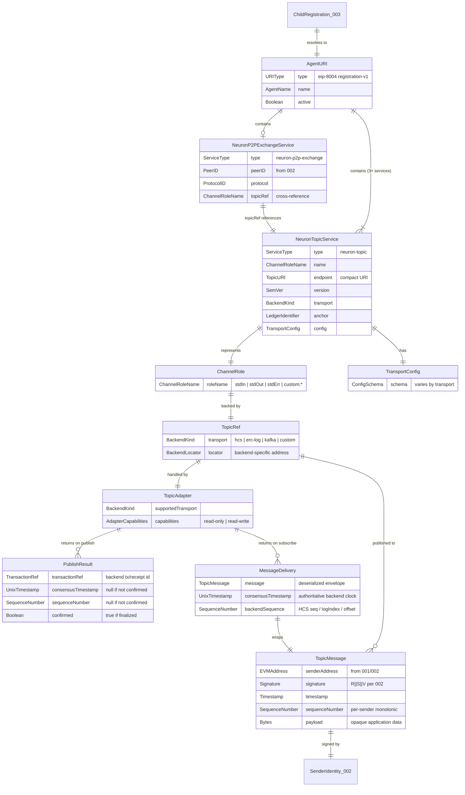
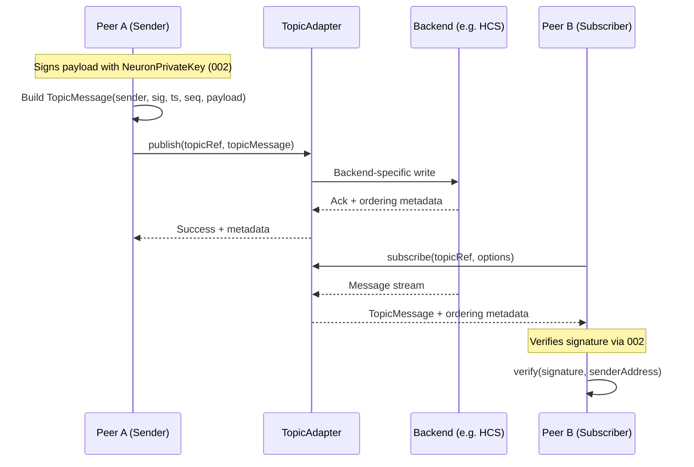
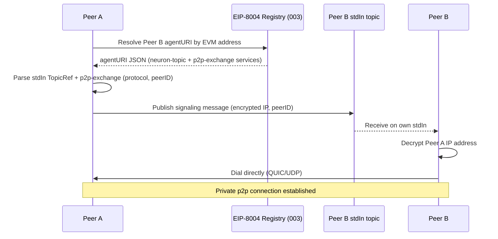

# Feature Specification: Topic System (Unified Topics)

**Feature Branch**: `004-topic-system`
**Created**: 2026-02-10
**Status**: Draft

## Related specs

- **Specs in this repo**:
  - [001 NeuronAccount Module](../001-neuron-account-module/spec.md) — provides Child identity (EVM address), Parent payment address. Account does NOT store topic endpoints or communication addresses. The peer's own runtime network address (p2pHost) is application-managed runtime-local state, not part of the account entity. Account has a Registration; Registration has Topics.
  - [002 Key Library](../002-key-library/spec.md) — NeuronPrivateKey / NeuronPublicKey; signing and verification of topic messages (Keccak256 + ECDSA R||S||V).
  - [003 Peer Registry (EIP-8004)](../003-peer-registry/spec.md) — topics are surfaced as EIP-8004 services in the Child's agentURI (extended NFT). Registration defines topics AND the method to discover multiaddress. This spec is the "separate spec" that 003 FR-R02 mandates.
- **External standards**:
  - [EIP-8004](https://eips.ethereum.org/EIPS/eip-8004) — Trustless Agents / Identity Registry; agentURI resolves to JSON registration file with a `services` array. Topics are represented as services in that array.
  - [HCS (Hedera Consensus Service)](https://docs.hedera.com/hedera/sdks-and-apis/sdks/consensus-service) — one of the supported topic backends.

## Purpose

The Topic System defines a **technology-agnostic abstraction** for **public, ordered, append-only, transactional message channels** (topics) used by Neuron peers for public communication. Topics are the mechanism through which peers publish and consume signed, sequenced messages on distributed ledgers or ledger-anchored messaging systems.

A **topic** is a transactional, sequenced, append-only message channel. **Transactional** means: each message has a sequence number, is immutable once published, and is verifiable against an anchoring ledger. Topics can be implemented with:
- **Smart contracts and events** (ERC event logs on Ethereum or EVM chains)
- **Hedera Consensus Service** (HCS)
- **Kafka anchored to a ledger** (e.g. periodic Merkle-root anchoring to HCS or Ethereum)
- **Any future append-only system** that satisfies the transactional invariants defined in this spec

**Standard channel roles**: Every registered peer (Child account from 001, registered in 003) exposes three mandatory topic channels as EIP-8004 services in the agentURI:
- **stdIn** — the peer's inbound public channel; other peers publish messages **to** this peer here (signaling, requests, commands).
- **stdOut** — the peer's outbound public channel; this peer publishes its own output messages here.
- **stdErr** — the peer's error/diagnostic public channel; this peer publishes error or status messages here (SLA compliance proofs, fault reports).

These three channels are mandatory for a complete peer registration (see 003). Peers MAY define additional custom-named channels beyond the standard three using the `custom:<name>` namespace.

**agentURI integration (EIP-8004)**: Topics are represented as EIP-8004 services in the agentURI JSON using a structured, self-describing schema with `type: "neuron-topic"`. Each service object carries the channel role, transport backend, anchoring ledger, and backend-specific configuration. See [agentURI Topic Schema](#agenturi-topic-schema-eip-8004-integration) for the full schema.

**Multiaddress discovery**: The agentURI also carries a `neuron-p2p-exchange` service that defines HOW to discover the peer's multiaddress (via the referenced topic using a specified protocol). The peer's own IP/multiaddress (p2pHost) is **runtime-local application state** — it is stored neither on the account entity (001) nor in the registry (003). Discovery of the actual multiaddress happens via the `neuron-p2p-exchange` protocol over topics.

**Adapter pattern**: The topic system uses a **TopicAdapter** interface to abstract over backend-specific implementations. Each supported backend provides an adapter that implements the common publish/subscribe/read interface. Adding a new adapter MUST NOT require changes to the core topic API.

**Relationship to Peer Registry (003)**: This spec defines the topic abstractions; the Peer Registry exposes them. When a Child registers in an EIP-8004 registry, its stdIn/stdOut/stdErr topics are published as EIP-8004 services (service type `neuron-topic` + structured config). The registry does not interpret topic contents — it stores the service descriptors so other peers can discover and connect.

**Relationship to Account (001)**: The account module provides the Child's identity (EVM address) and Parent's payment address. Topics are NOT stored on the account. The Child's controller (key that controls the Child per 001) is the authorized creator/manager of the Child's topics.

**Why this spec**: Spec 003 (Peer Registry) mandates that "topics (public DLT-traceable comms) are defined in a separate spec" (FR-R02). This is that spec.

## Clarifications

### Session 2026-02-10

- Q: What message envelope/format do topics use? → A: Topics use a standard **TopicMessage** envelope: sender EVM address, signature (NeuronPrivateKey signing, Keccak256 hash, R||S||V format per Key Library 002), timestamp, sequenceNumber (monotonically increasing per sender per topic), and opaque payload (bytes). The envelope is mandatory; the payload format is application-defined. Implementations MUST support JSON serialization of the envelope; other formats (e.g. Protobuf, CBOR) are optional.
- Q: Are stdIn/stdOut/stdErr the only standard channel roles, or can peers define custom channels? → A: stdIn, stdOut, and stdErr are the three **mandatory** channel roles for a complete peer registration. Peers MAY define additional custom-named channels. Custom channel names MUST use a namespace prefix (`custom:<name>`) to avoid collision with future standard roles. Standard role names (`stdIn`, `stdOut`, `stdErr`) are reserved.
- Q: Who owns a topic? → A: Topic **ownership** is tied to the entity that created it on the backend. For a Child's standard channels, the Child's controller (per 001) is the logical owner. Topics MAY be shared (multiple peers can publish to the same topic if the backend allows it), but ownership and access control semantics are backend-specific. This spec defines the **logical ownership** model (creator = owner); backend-specific access control is adapter-defined.
- Q: Must messages be signed? → A: **Yes, messages MUST be signed** by the sender's NeuronPrivateKey (002). Consumers SHOULD verify signatures before processing. Unsigned messages MUST be rejected by conforming implementations.
- Q: How do adapters handle different ordering guarantees? → A: The topic abstraction guarantees **per-sender ordering** (messages from the same sender on the same topic are ordered by sequence number). **Global ordering** across senders is backend-dependent. The adapter MUST expose the backend's native ordering metadata so consumers can use it. The spec does not mandate a single global ordering across senders.
- Q: Can an adapter be read-only? → A: **Yes.** An adapter MUST implement at minimum the **subscribe/read** interface. The **publish** interface is REQUIRED for writable backends. For read-only backends (e.g. Ethereum event logs), the publish interface MUST return a clear error.
- Q: What Mermaid diagram type is most appropriate? → A: Use an **erDiagram** for the entity model and a **sequenceDiagram** for the publish/subscribe and signaling flows. Both in the Appendix.
- Q: How are topics represented in the EIP-8004 agentURI? → A: Topics use a structured, self-describing service schema with `type: "neuron-topic"` in the EIP-8004 services array. Each service carries: `type`, `name`, `endpoint`, `version`, `channel`, `transport`, `anchor`, and `config`. The structured fields are authoritative; the `endpoint` is a compact URI for backward-compatible EIP-8004 consumers.
- Q: Where does the peer's own multiaddress/IP live? → A: The peer's own IP/multiaddress (p2pHost) is **runtime-local application state** — it is NOT stored on the account entity (001) or in the registry (003). The account provides identity; the registration defines the **method** for discovering the multiaddress via a `neuron-p2p-exchange` service. The actual multiaddress is exchanged at runtime through the referenced topic.
- Q: Are topics transactional? → A: **Yes.** All topics MUST satisfy: (1) Sequenced — monotonically increasing sequence numbers, (2) Immutable — append-only, (3) Verifiable — provable against the anchoring ledger, (4) Signed — every message signed by sender's NeuronPrivateKey. For non-ledger backends like Kafka, "anchored to a ledger" means periodic submission of integrity proofs (e.g. Merkle root) to a ledger.

## Out of Scope

- **Private comms (multiaddress / p2p connection establishment)**: Defined in a separate spec; this spec covers only public topic-based communication. The `neuron-p2p-exchange` service defines the discovery method; the p2p protocol itself is out of scope.
- **Message transport routing**: How bytes are physically routed between nodes is not defined here; topics are logical channels.
- **EIP-8004 contract ABI**: The registry contract interface is in 003 or separate implementation docs.
- **Topic access control lists (ACLs)**: Backend-specific ACLs are adapter concerns.
- **Payload schema or protocol**: The payload within a TopicMessage is opaque bytes; application-level protocols are not defined here.
- **Topic deletion/garbage collection**: Backend-specific lifecycle operations beyond create/publish/subscribe are adapter concerns.
- **Billing or metering**: Costs associated with topic operations are not specified.
- **Key generation or storage**: Handled by [Key Library (002)](../002-key-library/spec.md).
- **Account management**: Handled by [NeuronAccount (001)](../001-neuron-account-module/spec.md).
- **agentURI hosting/storage**: Whether the agentURI JSON is hosted on IPFS, HTTPS, or stored as a data URI is a deployment concern.

## User Scenarios & Testing *(mandatory)*

### User Story 1 - Create and publish signed messages to a topic (Priority: P1)

A developer needs to create a topic on a supported backend (e.g. HCS, Kafka) and publish signed, sequenced messages to it. The developer uses the unified topic API through an adapter, without needing to know backend-specific details beyond selecting the transport.

**Why this priority**: This is the foundational capability — without creating topics and publishing signed messages, no public communication exists. All other stories depend on topics existing and being writable.

**Independent Test**: Can be fully tested by creating a topic via an adapter (e.g. HCS adapter), publishing a signed TopicMessage, and verifying the message is persisted on the backend with correct envelope fields.

**Acceptance Scenarios**:

1. **Given** a developer has a NeuronPrivateKey (from 002) and an HCS topic adapter, **When** they create a new topic, **Then** a TopicRef is returned with transport = `hcs` and a valid locator (HCS topic ID)
2. **Given** a topic exists, **When** the developer publishes a TopicMessage with sender EVM address, signed payload, timestamp, and sequence number, **Then** the message is persisted on the backend and retrievable with all envelope fields intact
3. **Given** a developer attempts to publish to a read-only adapter (e.g. ERC event logs), **When** they call publish, **Then** the system returns a clear error indicating the backend does not support direct publishing
4. **Given** a developer attempts to publish an unsigned message, **When** they call publish, **Then** the system rejects the message with a clear error indicating signature is required

---

### User Story 2 - Subscribe to a topic and consume verified messages (Priority: P1)

A developer needs to subscribe to an existing topic and receive messages in order. The subscription works through the unified adapter interface regardless of backend. Each received message can be verified: the consumer checks the signature against the sender's EVM address to ensure authenticity.

**Why this priority**: Consuming and verifying messages is equally foundational to publishing — peers must be able to read each other's public channels.

**Independent Test**: Can be fully tested by subscribing to a topic with known messages, consuming them, and verifying per-sender ordering, envelope integrity, and signature validity.

**Acceptance Scenarios**:

1. **Given** a topic with published messages, **When** a developer subscribes via the adapter, **Then** messages are received with per-sender ordering preserved and all envelope fields intact
2. **Given** a topic, **When** a developer verifies the signature on a received TopicMessage using the sender's NeuronPublicKey (from 002), **Then** verification succeeds for valid messages and fails for tampered messages
3. **Given** different backends (HCS, Kafka), **When** a developer uses the same subscribe API, **Then** the adapter returns messages with backend-specific ordering metadata exposed alongside the TopicMessage

---

### User Story 3 - Represent topics as EIP-8004 services in agentURI (Priority: P2)

A developer has a registered Child (from 003) and needs to create three standard topic channels (stdIn, stdOut, stdErr), then represent them as EIP-8004 `neuron-topic` services in the Child's agentURI JSON document. The structured service schema includes transport, anchor, and backend-specific config so that any consumer can discover and connect to the topics.

**Why this priority**: Depends on topic creation (P1) being established. This story integrates topics with the EIP-8004 agentURI, making them discoverable via the Peer Registry.

**Independent Test**: Can be fully tested by creating three topics, forming the `neuron-topic` service objects, assembling an agentURI JSON document, and verifying that parsing the document yields valid TopicRefs that can be used to subscribe.

**Acceptance Scenarios**:

1. **Given** a Child with three created topics (e.g. stdIn on HCS, stdOut on Kafka, stdErr on HCS), **When** the developer serializes them as `neuron-topic` services in an agentURI JSON, **Then** each service has `type`, `name`, `endpoint`, `version`, `channel`, `transport`, `anchor`, and `config` fields correctly populated
2. **Given** an agentURI JSON with `neuron-topic` services, **When** a consumer parses the services array, **Then** they can extract TopicRefs for each standard channel and use them to subscribe
3. **Given** a developer attempts to register a standard channel with missing or invalid config fields, **When** they validate the service object, **Then** validation fails with a clear error identifying the missing or invalid field

---

### User Story 4 - Discover and connect to a peer's public channels (Priority: P2)

A developer knows a peer's EVM address and registry, and wants to discover their public topic channels (stdIn, stdOut, stdErr) and begin communicating. They resolve the peer's registration (via 003), parse the agentURI, extract TopicRefs, and subscribe.

**Why this priority**: This is the end-to-end discovery flow combining 003 (registry lookup) with 004 (topic subscription). Depends on stories 1-3.

**Independent Test**: Can be fully tested by resolving a peer's agentURI, parsing `neuron-topic` services, subscribing to stdOut, and publishing a message to stdIn.

**Acceptance Scenarios**:

1. **Given** a peer's EVM address and a registry instance, **When** the developer resolves the peer's agentURI (via 003), **Then** the `neuron-topic` services for stdIn, stdOut, and stdErr are present and parseable
2. **Given** a parsed stdOut TopicRef for a peer, **When** the developer subscribes via the appropriate adapter, **Then** they receive the peer's published messages with verified signatures
3. **Given** a parsed stdIn TopicRef for a peer, **When** the developer publishes a signed message to it, **Then** the target peer receives it on their stdIn channel

---

### User Story 5 - Represent multiaddress discovery method in agentURI (Priority: P2)

A developer needs to publish the peer's multiaddress discovery method as a `neuron-p2p-exchange` service in the agentURI. This service cross-references the stdIn topic and specifies the protocol for exchanging encrypted multiaddresses via topic signaling.

**Why this priority**: Depends on topics (P1) and agentURI integration (US3). Enables peers to establish private connections after discovering each other's public channels.

**Independent Test**: Can be fully tested by constructing a `neuron-p2p-exchange` service object with valid peerID, protocol, and topicRef, serializing it in the agentURI, and verifying the cross-reference resolves to a valid `neuron-topic` service.

**Acceptance Scenarios**:

1. **Given** a peer with a registered stdIn topic and a known PeerID (from 002), **When** the developer creates a `neuron-p2p-exchange` service with `topicRef: "stdIn"`, **Then** the service is valid and the topicRef resolves to the stdIn `neuron-topic` service in the same document
2. **Given** a `neuron-p2p-exchange` service with an invalid `topicRef`, **When** validation runs, **Then** it fails with a clear error indicating the cross-reference is broken
3. **Given** a resolved `neuron-p2p-exchange` service from a peer's agentURI, **When** the developer reads it, **Then** they know the PeerID, the exchange protocol, and which topic to use for the multiaddress exchange

---

### User Story 6 - Use a custom backend via adapter (Priority: P3)

A developer has a custom or emerging backend and needs to integrate it with the topic system by implementing a TopicAdapter and registering it at runtime.

**Why this priority**: Extension story — the core system works with built-in adapters; custom adapters enable ecosystem growth without changing the core API.

**Independent Test**: Can be tested by implementing a minimal TopicAdapter for an in-memory backend, creating a topic, publishing and subscribing, and verifying the unified API works identically to built-in adapters.

**Acceptance Scenarios**:

1. **Given** a developer implements a TopicAdapter for a custom backend, **When** they register the adapter with the topic system, **Then** topics can be created with the custom transport kind and the unified API works
2. **Given** a custom adapter that is read-only, **When** a developer attempts to publish, **Then** the adapter returns a clear error indicating read-only mode
3. **Given** a custom adapter, **When** the developer creates a topic and subscribes, **Then** messages conform to the TopicMessage envelope and per-sender ordering contract

---

### User Story 7 - Define and register custom named channels (Priority: P3)

A developer needs to expose additional topic channels beyond stdIn/stdOut/stdErr (e.g. `custom:metrics`, `custom:heartbeat`) and represent them as additional `neuron-topic` services in the agentURI.

**Why this priority**: Extension story — standard channels cover most use cases; custom channels enable advanced patterns.

**Independent Test**: Can be tested by creating a custom-named topic, representing it as a `neuron-topic` service, and verifying it parses alongside standard channels.

**Acceptance Scenarios**:

1. **Given** a registered Child, **When** the developer creates a topic with channel name `custom:metrics`, **Then** the `neuron-topic` service is valid and can be included in the agentURI alongside standard channels
2. **Given** a developer attempts to create a custom channel with a reserved name (e.g. `stdIn`), **When** they validate, **Then** the system rejects it with an error indicating the name is reserved
3. **Given** a peer with custom channels in their agentURI, **When** another peer parses the agentURI, **Then** both standard and custom `neuron-topic` services are returned

---

### Edge Cases

- What happens when a developer creates a topic on a backend that is unavailable (e.g. HCS node down)? (Return clear error indicating backend unavailability; no partial topic is created)
- What happens when a published message exceeds the backend's size limit (e.g. HCS max message size)? (Return clear error; the adapter MUST reject rather than silently truncate)
- What happens when subscribing to a topic that does not exist on the backend? (Return clear error indicating topic not found)
- What happens when signature verification fails on a received message? (Conforming implementations MUST reject it)
- What happens when the sender's EVM address in the envelope does not match the recovered signer from the signature? (Message MUST be rejected — sender mismatch)
- What happens when a developer uses a transport kind for which no adapter is registered? (Return clear error indicating unsupported transport kind)
- What happens when two senders publish to the same topic simultaneously? (Per-sender ordering is preserved; cross-sender ordering is backend-dependent)
- What happens when stdIn/stdOut/stdErr use different backends (e.g. stdIn on HCS, stdOut on Kafka)? (Allowed — each channel is independently backed)
- What happens when a custom channel name does not use the required `custom:` prefix? (Validation fails with error)
- What happens when reading from a topic with no messages? (Return empty result set; no error)
- What happens when the `topicRef` in a `neuron-p2p-exchange` service references a name that does not exist in the same agentURI? (Validation fails with `BrokenTopicRef` error)
- What happens when a Kafka topic's anchoring configuration is missing or invalid? (Validation fails — non-ledger-native transports MUST have valid anchoring config)
- What happens when the `endpoint` URI is inconsistent with the structured `config` fields? (Structured fields are authoritative; `endpoint` is a convenience. Validators SHOULD warn but MUST use structured fields as the source of truth)

## agentURI Topic Schema (EIP-8004 Integration)

Topics are represented as EIP-8004 services in the agentURI JSON using structured, self-describing service objects. The EIP-8004 `services` array is fully extensible (custom fields are permitted), so the Neuron `type` field and structured config are valid extensions.

### Service Type: `neuron-topic`

```json
{
  "type": "neuron-topic",
  "name": "<channelRole>",
  "endpoint": "<topicURI>",
  "version": "<semver>",
  "channel": "<channelRole>",
  "transport": "<backendKind>",
  "anchor": "<anchorLedger>",
  "config": { "<transport-specific>" }
}
```

| Field       | Type   | Required | Description |
| ----------- | ------ | -------- | ----------- |
| `type`      | string | MUST     | Always `"neuron-topic"`. Discriminates from other EIP-8004 services. |
| `name`      | string | MUST     | Channel role: `stdIn`, `stdOut`, `stdErr`, or `custom:<name>`. |
| `endpoint`  | string | SHOULD   | Compact Topic URI for backward-compatible EIP-8004 consumers. |
| `version`   | string | MUST     | Topic protocol version (semver). |
| `channel`   | string | MUST     | Neuron channel role (same value as `name` for standard channels). |
| `transport`  | string | MUST     | Backend kind: `hcs`, `erc-log`, `kafka`, or `custom:<type>`. |
| `anchor`    | string | MUST     | Ledger that anchors the topic. For ledger-native transports, anchor = the transport's own ledger. |
| `config`    | object | MUST     | Transport-specific configuration (schemas below). |

#### Config: HCS (`transport: "hcs"`)

```json
{
  "network": "hedera-mainnet",
  "topicId": "0.0.4515382"
}
```

#### Config: ERC Event Logs (`transport: "erc-log"`)

```json
{
  "chainId": 1,
  "contractAddress": "0xAbCdEf1234567890AbCdEf1234567890AbCdEf12",
  "eventSignature": "TopicMessage(address,uint256,bytes)"
}
```

#### Config: Kafka (`transport: "kafka"`)

```json
{
  "bootstrapServers": ["kafka1.neuron.network:9092"],
  "topicName": "neuron.agent.alice.stdin",
  "saslMechanism": "SCRAM-SHA-512",
  "anchoring": {
    "method": "hcs-hash-chain",
    "anchorTopicId": "0.0.9999999",
    "anchorNetwork": "hedera-mainnet",
    "interval": "every-batch"
  }
}
```

### Service Type: `neuron-p2p-exchange`

```json
{
  "type": "neuron-p2p-exchange",
  "name": "p2p",
  "version": "1.0.0",
  "peerID": "12D3KooWA1b2c3D4e5F6g7H8i9J0kLmNoPqRsTuVwXyZ",
  "protocol": "/neuron/multiaddr-exchange/1.0.0",
  "topicRef": "stdIn"
}
```

| Field      | Type   | Required | Description |
| ---------- | ------ | -------- | ----------- |
| `type`     | string | MUST     | Always `"neuron-p2p-exchange"`. |
| `name`     | string | MUST     | Service name (e.g. `"p2p"`). |
| `version`  | string | MUST     | Exchange protocol version (semver). |
| `peerID`   | string | MUST     | Libp2p PeerID (from Key Library 002). |
| `protocol` | string | MUST     | Protocol ID for multiaddress exchange. |
| `topicRef` | string | MUST     | Cross-reference to a `neuron-topic` service `name` in this agentURI. |

### Complete agentURI example

```json
{
  "type": "https://eips.ethereum.org/EIPS/eip-8004#registration-v1",
  "name": "agent-alice-sensor-01",
  "description": "Neuron IoT data agent for Alice's sensor fleet",
  "image": "https://assets.neuron.world/agents/alice-01.png",
  "services": [
    {
      "type": "neuron-topic",
      "name": "stdIn",
      "endpoint": "hcs://0.0.4515382",
      "version": "1.0.0",
      "channel": "stdIn",
      "transport": "hcs",
      "anchor": "hedera-mainnet",
      "config": {
        "network": "hedera-mainnet",
        "topicId": "0.0.4515382"
      }
    },
    {
      "type": "neuron-topic",
      "name": "stdOut",
      "endpoint": "kafka+ledger://kafka1.neuron.network:9092/neuron.agent.alice.stdout",
      "version": "1.0.0",
      "channel": "stdOut",
      "transport": "kafka",
      "anchor": "hedera-mainnet",
      "config": {
        "bootstrapServers": ["kafka1.neuron.network:9092"],
        "topicName": "neuron.agent.alice.stdout",
        "saslMechanism": "SCRAM-SHA-512",
        "anchoring": {
          "method": "hcs-hash-chain",
          "anchorTopicId": "0.0.9999999",
          "anchorNetwork": "hedera-mainnet",
          "interval": "every-batch"
        }
      }
    },
    {
      "type": "neuron-topic",
      "name": "stdErr",
      "endpoint": "hcs://0.0.4515383",
      "version": "1.0.0",
      "channel": "stdErr",
      "transport": "hcs",
      "anchor": "hedera-mainnet",
      "config": {
        "network": "hedera-mainnet",
        "topicId": "0.0.4515383"
      }
    },
    {
      "type": "neuron-p2p-exchange",
      "name": "p2p",
      "version": "1.0.0",
      "peerID": "12D3KooWA1b2c3D4e5F6g7H8i9J0kLmNoPqRsTuVwXyZ",
      "protocol": "/neuron/multiaddr-exchange/1.0.0",
      "topicRef": "stdIn"
    },
    {
      "name": "DID",
      "endpoint": "did:key:zQ3shP2mWsZYWgpKDXRRx8rBe6UaDQY4mJgZrm5KywKgjqiU9",
      "version": "v1"
    },
    {
      "name": "MCP",
      "endpoint": "https://agent-alice.neuron.world/.well-known/mcp",
      "version": "2025-06-18"
    }
  ],
  "x402Support": false,
  "active": true,
  "registrations": [
    {
      "agentId": 42,
      "agentRegistry": "eip155:295:0xNeuronRegistryContract"
    }
  ],
  "supportedTrust": [
    "crypto-economic"
  ]
}
```

## Topic URI Scheme

The `endpoint` field contains a compact **Topic URI** for backward compatibility with generic EIP-8004 consumers.

| Transport    | URI Scheme       | Locator Format                       | Example                                                       |
| ------------ | ---------------- | ------------------------------------ | ------------------------------------------------------------- |
| `hcs`        | `hcs`            | `<topicId>`                          | `hcs://0.0.4515382`                                           |
| `erc-log`    | `erc-log`        | `<chainId>:<contractAddress>`        | `erc-log://1:0xAbCdEf1234567890AbCdEf1234567890AbCdEf12`      |
| `kafka`      | `kafka+ledger`   | `<broker>/<topicName>`               | `kafka+ledger://kafka1.neuron.network:9092/neuron.agent.stdin` |

The structured fields (`transport`, `config`) are **authoritative**. The `endpoint` URI is a convenience. When both are present, structured fields take precedence.

## Requirements *(mandatory)*

### Functional Requirements

- **FR-T01**: The system MUST define a **TopicRef** as the composite reference to a topic, consisting of a **transport kind** (BackendKind) and a **topic locator** (BackendLocator). The pair (transport kind, topic locator) MUST be globally unique within the system
- **FR-T02**: The system MUST define a **TopicMessage** envelope with mandatory fields: senderAddress (EVMAddress), signature (Signature — R||S||V per Key Library 002), timestamp (Timestamp), sequenceNumber (SequenceNumber — monotonically increasing per sender per topic), and payload (Bytes — opaque). The canonical serialization MUST be JSON; implementations MAY support additional formats
- **FR-T03**: All messages published to a topic MUST be **signed** by the sender's NeuronPrivateKey (from 002). The signature MUST cover the Keccak256 hash of (timestamp + sequenceNumber + payload). Unsigned messages MUST be rejected
- **FR-T04**: The system MUST provide a **TopicAdapter** interface: `createTopic()` → TopicRef, `publish(topicRef, message)` → result, `subscribe(topicRef, options)` → message stream, `resolve(topicRef)` → topic metadata. `subscribe` and `resolve` are REQUIRED for all adapters; `createTopic` and `publish` MUST return `UnsupportedOperation` on read-only backends
- **FR-T05**: The system MUST support at minimum two built-in adapters: one for **Hedera HCS** (`hcs`) and one additional backend (e.g. `kafka` or `erc-log`). Additional adapters MUST be registerable at runtime without changes to the core API
- **FR-T06**: The system MUST guarantee **per-sender message ordering**: messages from the same sender on the same topic MUST be consumable in sequence-number order. Cross-sender ordering is backend-dependent. Adapters MUST expose backend-native ordering metadata
- **FR-T07**: The system MUST define three **standard channel roles**: `stdIn` (inbound), `stdOut` (outbound), `stdErr` (diagnostic). These are REQUIRED for a complete peer registration. Role names are **reserved**
- **FR-T08**: The system MUST allow **custom named channels** with the `custom:<name>` namespace prefix. Custom channels are represented as additional `neuron-topic` services in the agentURI
- **FR-T09**: The system MUST support **topic discovery** via the Peer Registry (003): resolve a peer's agentURI, parse `neuron-topic` services, extract TopicRefs for standard and custom channels
- **FR-T10**: The system MUST validate **TopicMessage integrity** on receipt: (1) verify signature against recovered public key, (2) verify recovered senderAddress matches envelope, (3) reject failures with clear errors
- **FR-T11**: The system MUST provide structured error types with kinds: `BackendUnavailable`, `TopicNotFound`, `MessageTooLarge`, `UnsupportedOperation`, `InvalidSignature`, `SenderMismatch`, `UnsupportedTransport`, `InvalidTopicRef`, `ReservedChannelName`, `InvalidConfig`, `BrokenTopicRef`
- **FR-T12**: TopicRef validation: transport kind MUST match a registered adapter; locator MUST be non-empty and well-formed. Invalid TopicRefs MUST be rejected before backend operations
- **FR-T13**: Each channel MUST be **independently backed** — different channels for the same peer MAY use different backends
- **FR-T14**: Topic channels MUST be representable as **EIP-8004 services** with `type: "neuron-topic"`. Each service MUST include: `type`, `name`, `version`, `channel`, `transport`, `anchor`, `config`. The service SHOULD include `endpoint` for backward compatibility
- **FR-T15**: The system MUST define **transport config schemas** for: `hcs` (`network` + `topicId`), `erc-log` (`chainId` + `contractAddress` + `eventSignature`), `kafka` (`bootstrapServers` + `topicName` + `anchoring`). Custom transports MUST provide a config schema
- **FR-T16**: For **non-ledger-native transports** (e.g. `kafka`), `config` MUST include an `anchoring` object: `method`, `anchorTopicId`, `anchorNetwork`, `interval`. This ensures verifiability against a ledger
- **FR-T17**: The system MUST support a **`neuron-p2p-exchange`** service type with: `peerID` (PeerID from 002), `protocol` (exchange protocol ID), `topicRef` (cross-reference to a `neuron-topic` service name). This defines the METHOD for multiaddress discovery; the actual multiaddress is NOT in the registry
- **FR-T18**: The `topicRef` in `neuron-p2p-exchange` MUST be validated as a **cross-reference** to an existing `neuron-topic` service in the same agentURI. Invalid references produce `BrokenTopicRef` error
- **FR-T19**: All topics MUST satisfy four **transactional invariants**: (1) Sequenced, (2) Immutable (append-only), (3) Verifiable against anchoring ledger, (4) Signed. For ledger-native backends these are inherent; for non-ledger backends the adapter MUST implement verifiability via anchoring (FR-T16)
- **FR-T20**: The **stdIn** channel MUST support receiving structured signaling messages including encrypted payloads. The topic system MUST NOT restrict payload content
- **FR-T21**: TopicMessage envelope JSON serialization MUST be **deterministic** for signature purposes. Implementations MUST define canonical field ordering

#### Publish/Subscribe Execution Binding

- **FR-T22**: `publish()` MUST return a **PublishResult** type with fields: `transactionRef` (TransactionRef — string), `consensusTimestamp` (UnixTimestamp — UnsignedInt64 | null), `sequenceNumber` (SequenceNumber — UnsignedInt64 | null), `confirmed` (Boolean). If `confirmed` is `false`, `consensusTimestamp` and `sequenceNumber` MAY be null
- **FR-T23**: `publish()` MUST support two **confirmation modes**: `FIRE_AND_FORGET` (return after network acknowledgment, `confirmed = false`) and `WAIT_FOR_CONSENSUS` (return after backend finalization with consensus timestamp, `confirmed = true`). The mode MUST be selectable per-call via an options parameter
- **FR-T24**: `subscribe()` MUST return a **MessageDelivery** type with fields: `message` (TopicMessage), `consensusTimestamp` (UnixTimestamp — UnsignedInt64), `backendSequence` (SequenceNumber — UnsignedInt64). The `consensusTimestamp` MUST be the authoritative timestamp from the backend's consensus mechanism
- **FR-T25**: `subscribe()` MUST support **resumption** from a given sequence number via a `fromSequence` option. On reconnection, the adapter MUST backfill any messages between the last delivered sequence and the current stream position. Message delivery MUST be at-least-once with sequence-based deduplication by the consumer. When deduplication is enabled, the tracker SHOULD use `SHA-256(TopicMessage.signature)` as the dedup key. Since RFC 6979 produces deterministic signatures (006 FR-A07), identical `(key, message)` pairs produce identical signatures, making the signature hash a reliable and compact dedup identifier across SDK implementations
- **FR-T26**: Adapters MUST **retry transient failures** with exponential backoff: `baseDelay × 2^attempt` where `baseDelay` is 1 second and `maxRetries` is 5. Permanent failures (invalid topic, insufficient funds, message too large) MUST NOT be retried
- **FR-T27**: Adapters MUST expose `maxMessageSize()` → UnsignedInt64, returning the **maximum payload size** in bytes for the backend. `publish()` MUST check message size against this limit and return `MessageTooLarge` error (FR-T11) BEFORE submitting to the backend
- **FR-T28**: Adapters SHOULD expose `estimatePublishCost(messageSize)` → `{ amount: UnsignedInt64, unit: string }` for backends with per-message fees. This enables callers to make cost-informed decisions about publication cadence
- **FR-T29**: The `consensusTimestamp` in `MessageDelivery` (FR-T24) MUST map to the **backend's authoritative clock**: HCS consensus timestamp, EVM `block.timestamp`, or anchor timestamp for non-ledger backends. The adapter MUST NOT use the sender's self-reported timestamp as `consensusTimestamp`

### Key Entities *(include if feature involves data)*

- **TopicRef**: The globally unique reference to a topic. Composed of **transport** (BackendKind — e.g. `hcs`, `erc-log`, `kafka`) and **locator** (BackendLocator — backend-specific string). Serializable to a compact Topic URI or a structured `neuron-topic` service. Relationships: each channel maps to one TopicRef; stored as EIP-8004 services in the Peer Registry (003).

- **TopicMessage**: A signed, sequenced message published to a topic. Attributes: senderAddress (EVMAddress), signature (Signature — R||S||V per 002), timestamp (Timestamp), sequenceNumber (SequenceNumber — per-sender monotonic), payload (Bytes — opaque). Published to a topic identified by TopicRef.

- **TopicAdapter**: Interface abstracting backend-specific operations. Attributes: supportedTransport (BackendKind), capabilities (AdapterCapabilities — read-only or read-write). One adapter per BackendKind.

- **ChannelRole**: Named role of a topic channel. Attributes: roleName (ChannelRoleName — `stdIn`, `stdOut`, `stdErr`, or `custom:<name>`), topicRef (TopicRef). A registered Child has three mandatory ChannelRoles plus zero or more custom ones.

- **NeuronTopicService**: EIP-8004 service object with `type: "neuron-topic"`. Attributes: type (ServiceType), name (ChannelRoleName), endpoint (TopicURI), version (SemVer), channel (ChannelRoleName), transport (BackendKind), anchor (LedgerIdentifier), config (TransportConfig). One per ChannelRole in the agentURI.

- **NeuronP2PExchangeService**: EIP-8004 service object with `type: "neuron-p2p-exchange"`. Attributes: type (ServiceType), name (ServiceName), version (SemVer), peerID (PeerID from 002), protocol (ProtocolID), topicRef (ChannelRoleName — cross-reference). One per peer in the agentURI.

- **TopicError**: Structured error type. Attributes: errorKind (TopicErrorKind — one of FR-T11 kinds), message (ErrorMessage), backendError (optional BackendError — wrapped backend error).

- **PublishResult**: Result returned by `publish()`. Attributes: transactionRef (TransactionRef — backend-specific transaction/receipt identifier), consensusTimestamp (UnixTimestamp — UnsignedInt64 | null, authoritative backend clock at finalization), sequenceNumber (SequenceNumber — UnsignedInt64 | null, backend-assigned sequence), confirmed (Boolean — true if backend finalized, false if fire-and-forget). Used by callers to schedule follow-up actions based on publication timing.

- **MessageDelivery**: Wrapper returned by `subscribe()` for each received message. Attributes: message (TopicMessage — the deserialized envelope), consensusTimestamp (UnixTimestamp — UnsignedInt64, the authoritative backend clock when the message was finalized), backendSequence (SequenceNumber — UnsignedInt64, backend-native ordering number: HCS sequence, EVM logIndex, Kafka offset). The `consensusTimestamp` is the canonical clock for downstream deadline arithmetic.

- **ConfirmationMode**: Enumeration controlling `publish()` behavior. Values: `FIRE_AND_FORGET` (return after network ack, `confirmed = false`), `WAIT_FOR_CONSENSUS` (return after finalization, `confirmed = true` with timestamps). Selectable per-call.

## Success Criteria *(mandatory)*

### Measurable Outcomes

- **SC-T01**: Developers can create a topic on at least two different backends using the same unified API, receiving a valid TopicRef in both cases
- **SC-T02**: Developers can publish a signed TopicMessage and subscribe to receive it on the same topic, with signature verification succeeding, using any supported adapter
- **SC-T03**: Per-sender message ordering is preserved: messages from the same sender are consumed in sequence-number order on 100% of supported backends
- **SC-T04**: A registered Child's stdIn, stdOut, and stdErr are representable as `neuron-topic` services in an agentURI, and a consumer can parse them, extract TopicRefs, and subscribe — verified end-to-end
- **SC-T05**: Adding a new backend adapter does not require changes to the core topic API or existing adapters — verified by implementing a test adapter
- **SC-T06**: Invalid messages (unsigned, tampered, sender mismatch) are rejected with specific error kinds in 100% of cases
- **SC-T07**: Topic operations return typed errors for all FR-T11 error kinds with 100% coverage
- **SC-T08**: TopicMessage envelope JSON serialization is deterministic — round-trip tests produce identical bytes
- **SC-T09**: `neuron-topic` services round-trip: serialize to agentURI JSON and parse back to identical TopicRef — verified for all registered transports
- **SC-T10**: `neuron-p2p-exchange` cross-reference validated: valid references succeed; broken references produce `BrokenTopicRef` error
- **SC-T11**: Transactional invariants hold: published messages are sequenced, immutable, verifiable against anchoring ledger, and signed — verified per backend
- **SC-T12**: `publish()` returns a PublishResult with `confirmed = true` and valid `consensusTimestamp` when using `WAIT_FOR_CONSENSUS` mode — verified on all supported backends
- **SC-T13**: `subscribe()` returns MessageDelivery with `consensusTimestamp` matching the backend's authoritative clock (HCS consensus, EVM block.timestamp, Kafka anchor) — verified on all supported backends
- **SC-T14**: `subscribe()` with `fromSequence` resumes delivery from the specified sequence number with no message gaps — verified by disconnect/reconnect test
- **SC-T15**: `maxMessageSize()` returns the backend's payload limit, and `publish()` rejects oversized messages with `MessageTooLarge` before network submission — verified per backend

---

## Appendix: High-level view

### Entity-relationship diagram



### Publish/subscribe sequence



### Peer discovery and signaling flow



### Blockchain and ledger compatibility

This spec is **blockchain-agnostic**: transport kind and config abstract the underlying system.

**Hedera (HCS)**:
- Transport: `hcs`; config: `network` + `topicId`
- Consensus timestamps provide global ordering; native sequence numbers per-topic
- Topic creation via `TopicCreateTransaction`; admin key = Child's neuron key
- Max message size ~1024 bytes per chunk (chunking support); adapter MUST reject oversized messages
- Transactional invariants: inherently satisfied

**Ethereum / EVM**:
- Transport: `erc-log`; config: `chainId` + `contractAddress` + `eventSignature`
- Event logs are **read-only** for external observers; adapter is typically read-only
- Block number + log index provides ordering; finality depends on confirmation depth
- Transactional invariants: inherently satisfied on-chain

**Kafka (ledger-anchored)**:
- Transport: `kafka`; config: `bootstrapServers` + `topicName` + `anchoring`
- Not natively DLT-traceable; `anchoring` config REQUIRED (FR-T16)
- Adapter periodically submits integrity proofs (e.g. Merkle root) to anchor ledger
- Suitable for high-throughput environments; verifiability is periodic (bounded by `interval`)
