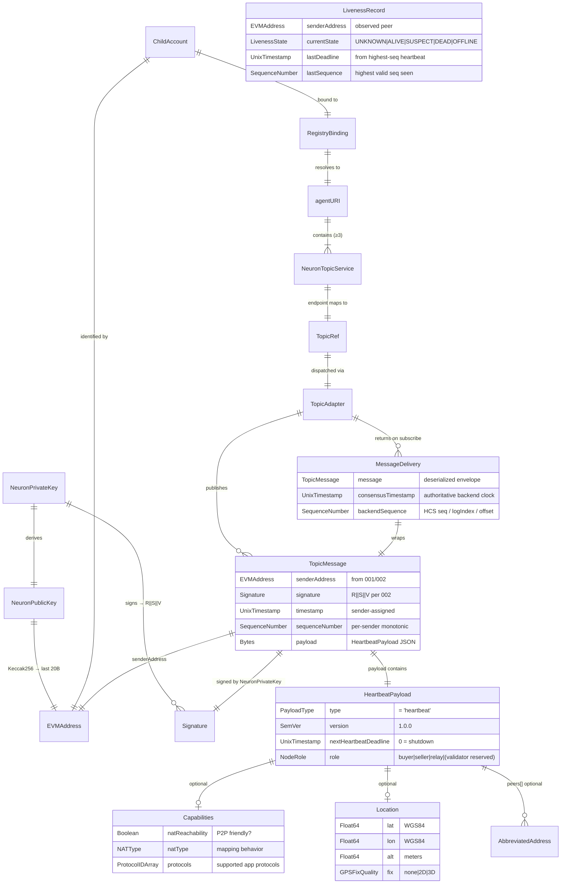
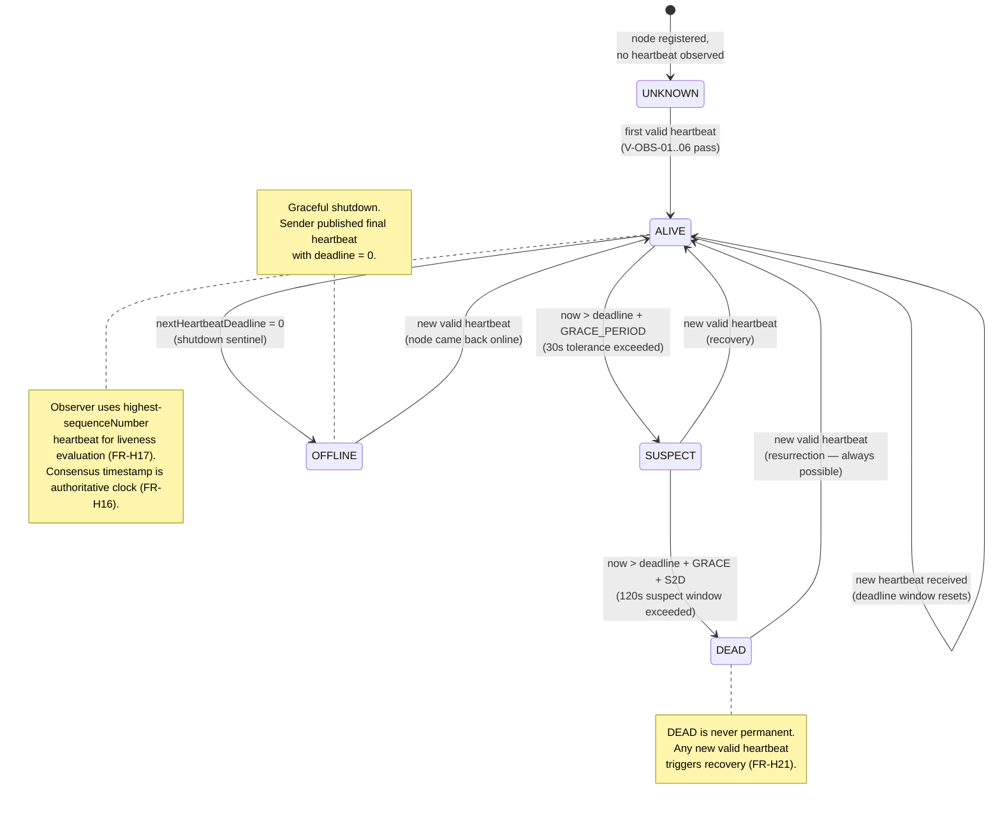
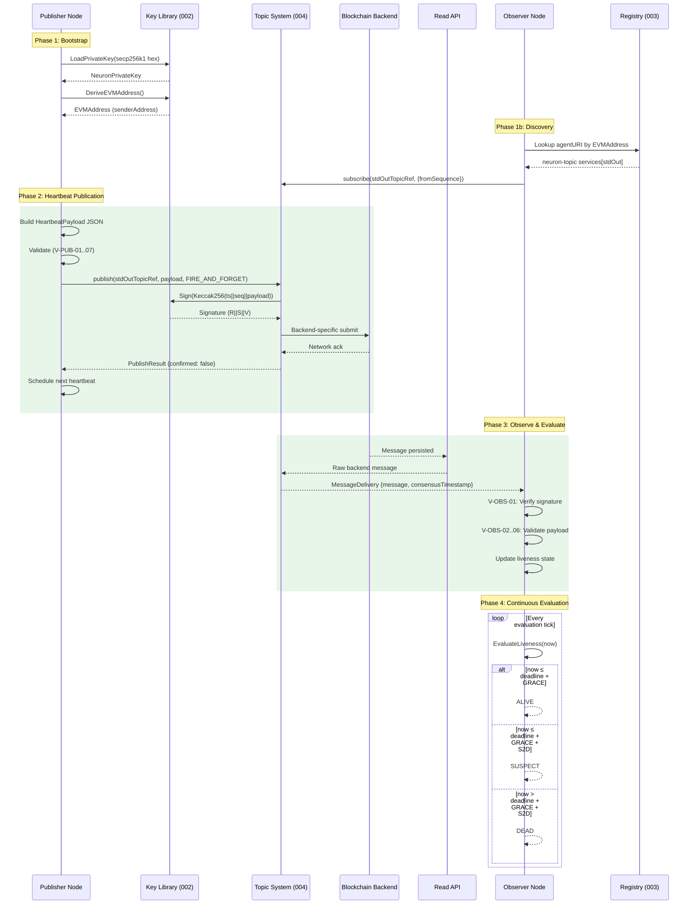
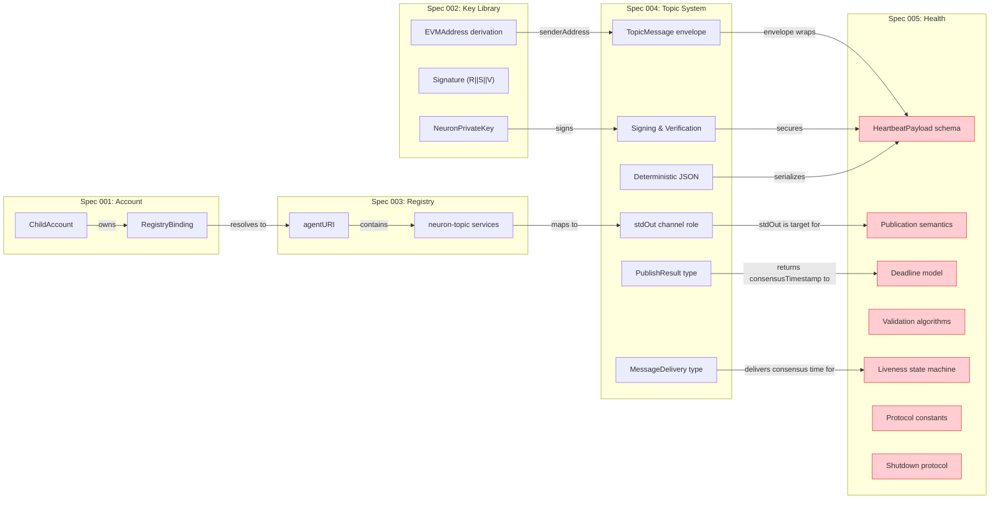

# Feature Specification: Health (Onchain Liveness & Health Status)

**Feature Branch**: `005-health`
**Created**: 2026-02-24
**Status**: Draft

## Related specs

- **Specs in this repo**:
  - [001 NeuronAccount Module](../001-neuron-account-module/spec.md) — provides Child identity (EVMAddress as `senderAddress` in the TopicMessage envelope). The account does NOT store health state; liveness is computed by observers from on-chain heartbeat messages.
  - [002 Key Library](../002-key-library/spec.md) — NeuronPrivateKey / NeuronPublicKey; signing of heartbeat TopicMessages (Keccak256 + ECDSA R||S||V). The heartbeat signature covers `timestamp || sequenceNumber || payload`, making the `nextHeartbeatDeadline` commitment tamper-proof.
  - [003 Peer Registry (EIP-8004)](../003-peer-registry/spec.md) — agentURI with `neuron-topic` services; observers discover a peer's stdOut topic via the registry to subscribe to heartbeats. Registration defines the endpoint; this spec defines what is published to it.
  - [004 Topic System](../004-topic-system/spec.md) — TopicMessage envelope (FR-T02), mandatory signing (FR-T03), stdOut channel role (FR-T07), deterministic JSON serialization (FR-T21), TopicAdapter interface (FR-T04), PublishResult (FR-T22), confirmation modes (FR-T23), MessageDelivery with consensus timestamp (FR-T24), subscribe resumption (FR-T25), retry policy (FR-T26), message size limits (FR-T27), clock normalization (FR-T29). This spec defines the **payload**; Spec 004 handles the **transport**.
  - [007 Identity Registry Smart Contract](../007-identity-contract/spec.md) — on-chain Identity Registry contract. Observers verify heartbeat sender identity by calling `lookup(senderAddress)` and `ownerOf(tokenId)` on the Identity Registry (US6). Spec 007 FR-C-10 defines `lookup()` behavior; standard ERC-721 `ownerOf()` confirms token ownership.
- **Project documentation**:
  - [Neuron Identity Model](../../docs/neuron-identity-model.md) — defines the single-root hierarchical identity model (Parent DID as identity root, Child identity via EVMAddress). Health heartbeats operate at the Child layer; the sender is always a Child identified by EVMAddress, signing with its own NeuronPrivateKey. Parent identity is not involved in the heartbeat protocol.
- **External standards**:
  - [EIP-8004](https://eips.ethereum.org/EIPS/eip-8004) — Trustless Agents / Identity Registry; agentURI resolves to JSON with `services` array containing `neuron-topic` services for stdOut discovery.

## Purpose

The Health spec defines how Neuron agents prove they are alive and broadcast their operational status using **on-chain heartbeat messages**. A heartbeat is a signed TopicMessage published to the sender's stdOut topic whose payload declares (1) the sender's current role, capabilities, and location, and (2) the **latest timestamp by which the sender commits to publishing its next heartbeat**. This self-declared deadline model gives each node control over its own heartbeat cadence — cost-sensitive nodes can heartbeat once per day, while high-visibility sellers can heartbeat every 10 seconds — while providing observers with deterministic, auditable liveness semantics.

The design is chain-agnostic (must work on any blockchain via Spec 004 adapters), cost-sensitive (minimize on-chain payload size and message frequency), and externally verifiable (an observer with only blockchain access can determine whether a node follows the protocol correctly). The validation criterion for the entire spec suite (001–005) is: the specs alone must be sufficient to produce an SDK that publishes a verifiable heartbeat on a non-Hedera blockchain. Health is broader than heartbeat — it combines liveness proof with health status (role, capabilities, location, peer census) in a single compact message.

## Clarifications

### Session 2026-02-24

- Q: Why is the spec called "Health" and not "Heartbeat"? → A: "Health" is broader — it encompasses both the heartbeat (liveness proof) and health status (device self-reported capabilities, location, role). "Heartbeat" is the mechanism; "Health" is the feature.
- Q: Does this spec define transport mechanics (how messages reach the chain)? → A: **No.** This spec defines the **payload** and **publication semantics** (where, when, how often). Transport is delegated entirely to Spec 004: this spec defines the message that goes into the topic system; how the topic system works is defined there. The spec references Spec 004's TopicAdapter, PublishResult, MessageDelivery, and confirmation modes but does not define them.
- Q: What roles are confirmed for the `role` field? → A: `buyer`, `seller`, `relay` are confirmed roles. The value `"validator"` is reserved for future use — implementations MUST accept it as a valid string to maintain forward compatibility, but no on-chain validator role exists in the current architecture. Validation is done by observers, not by a dedicated node type.
- Q: Why self-declared deadlines instead of a fixed heartbeat interval? → A: Cost optimization (AP-2, AP-3). On-chain message fees make fixed short intervals expensive; self-declared deadlines let nodes balance visibility vs. cost. The rollup mental model applies: anchor minimal data to the blockchain.
- Q: Why is consensus timestamp the authoritative clock, not sender timestamp? → A: The sender controls `topicMessage.timestamp` and could set it arbitrarily. The consensus timestamp is assigned by the ledger backend (HCS consensus timestamp, EVM block.timestamp, Kafka anchor timestamp) and is outside sender control. All deadline arithmetic MUST use consensus timestamp to prevent clock manipulation attacks.
- Q: Why four liveness states (ALIVE, SUSPECT, DEAD, OFFLINE) plus UNKNOWN? → A: Binary alive/dead is too brittle — a 1-second delay past deadline would kill a node. SUSPECT absorbs transient failures (network jitter, backend propagation delay). OFFLINE enables graceful shutdown signaling (distinct from crash). UNKNOWN covers the initial state before any heartbeat is observed.
- Q: Is liveness global or per-observer? → A: **Per-observer.** There is no global liveness oracle. Different observers may reach different conclusions based on network partitions and message delivery timing (FR-H20). This is fundamental to the decentralized model.
- Q: Are `capabilities`, `location`, and `peers` fields required? → A: `capabilities` and `location` are SHOULD, not MUST. `peers` is MAY. This minimizes mandatory payload size. Nodes without GPS or in privacy-sensitive contexts can omit optional fields. The mandatory fields (`type`, `version`, `nextHeartbeatDeadline`, `role`) fit in under 80 bytes.
- Q: Should `MIN_DEADLINE_DELTA` vary per role? → A: **Open question.** Sellers may benefit from shorter intervals (higher visibility) while relays may prefer longer intervals (lower cost). Current spec uses a uniform 10s minimum for simplicity. Per-role deltas may be added in a future version.
- Q: Should the protocol mandate a recommended default deadline delta? → A: **Open question.** A recommendation of 60 seconds ("implementations SHOULD use 60 seconds unless application requirements dictate otherwise") would give SDKs a sane default without hardcoding it. Not mandated in this version.

## Out of Scope

- **Service request/response protocol**: Separate interaction model ("message transport, not money"); future spec.
- **Payment protocol (escrow, scheduled transfers)**: Money transport, not message transport; future spec.
- **NAT traversal / hole punching coordination**: P2P concern, not blockchain transport; future spec.
- **P2P data exchange streams**: P2P concern; future spec.
- **Detailed device diagnostics (temperature, signal quality, coverage polygons)**: High-volume, application-specific data better served via P2P or API. On-chain cost prohibitive.
- **Persistence / message archival**: Whether and how heartbeat history is stored is a separate concern.
- **Discovery retrieval tools**: Tools to query the EIP-8004 registry to find peer topics are out of scope for this spec (covered by Spec 003).
- **Points / reputation attribution**: Application layer that consumes health data; not defined here.
- **Topic transport mechanics**: How `publish()` becomes a blockchain transaction, retry policies, fee models — all Spec 004 concerns (AP-1).
- **Hash chaining / message linking**: Considered but not adopted; not included in this version.
- **Seller discovery aggregation**: Application-layer concern that uses liveness state to filter sellers.

## User Scenarios & Testing *(mandatory)*

### User Story 1 - Publish a Signed Heartbeat to stdOut (Priority: P1)

A developer needs to build and publish a valid heartbeat message to their node's stdOut topic. The heartbeat contains a self-declared deadline (when the next heartbeat will arrive), the node's role, and optionally its capabilities and location. The message is signed via Spec 004's TopicMessage envelope and published through the TopicAdapter.

**Why this priority**: This is the foundational capability — without publishing heartbeats, no liveness signal exists. All other stories depend on heartbeat messages being on-chain.

**Independent Test**: Can be fully tested by building a HeartbeatPayload, wrapping it in a TopicMessage, publishing to stdOut via any adapter, and verifying the message is persisted on-chain with correct envelope and payload fields.

**Acceptance Scenarios**:

1. **Given** a node with a NeuronPrivateKey (002) and a registered stdOut topic (003/004), **When** it builds a HeartbeatPayload with `type: "heartbeat"`, `version: "1.0.0"`, `nextHeartbeatDeadline` set 60 seconds in the future, and `role: "seller"`, **Then** publisher validation (V-PUB-01..07) passes and the payload is accepted for signing
2. **Given** a valid HeartbeatPayload, **When** the node publishes it as a TopicMessage to stdOut using `FIRE_AND_FORGET` mode (FR-T23), **Then** a PublishResult (FR-T22) is returned and the message is retrievable from the backend
3. **Given** a node attempts to publish a heartbeat with `nextHeartbeatDeadline` set 5 seconds in the future (below MIN_DEADLINE_DELTA), **When** publisher validation runs, **Then** it rejects with "deadline too soon: minimum delta is MIN_DEADLINE_DELTA seconds"
4. **Given** a node attempts to publish a heartbeat with `nextHeartbeatDeadline` set 48 hours in the future (above MAX_DEADLINE_DELTA), **When** publisher validation runs, **Then** it rejects with "deadline too far: maximum delta is MAX_DEADLINE_DELTA seconds"
5. **Given** a node attempts to publish a heartbeat with an unrecognized `role` value, **When** publisher validation runs, **Then** it rejects with "unrecognized role"

---

### User Story 2 - Observe and Evaluate Peer Liveness (Priority: P1)

An observer node subscribes to a peer's stdOut topic (discovered via Spec 003 agentURI), receives heartbeat messages, validates them, and maintains a liveness state for each observed peer. The observer uses consensus timestamps (not sender timestamps) for all deadline arithmetic.

**Why this priority**: Equally foundational to publishing — without observation and liveness evaluation, heartbeats have no consumer. This story makes the liveness model functional.

**Independent Test**: Can be fully tested by subscribing to a peer's stdOut, receiving heartbeat messages, running observer validation (V-OBS-01..06), and verifying the liveness state machine transitions correctly.

**Acceptance Scenarios**:

1. **Given** an observer subscribed to a peer's stdOut with no prior heartbeats, **When** the observer evaluates liveness, **Then** the peer's state is `UNKNOWN`
2. **Given** an observer receives a valid heartbeat with `nextHeartbeatDeadline = T`, **When** the observer validates it (signature verification, deadline bounds, consensus timestamp check), **Then** validation passes and the peer transitions to `ALIVE`
3. **Given** a peer is `ALIVE` with deadline `T`, **When** `currentTime > T + GRACE_PERIOD (30s)` and no new heartbeat has arrived, **Then** the peer transitions to `SUSPECT`
4. **Given** a peer is `SUSPECT`, **When** `currentTime > T + GRACE_PERIOD + SUSPECT_TO_DEAD (120s)` and no new heartbeat has arrived, **Then** the peer transitions to `DEAD`
5. **Given** a peer is `DEAD`, **When** a new valid heartbeat arrives from that peer, **Then** the peer transitions to `ALIVE` (recovery is always possible)
6. **Given** an observer receives a heartbeat where `nextHeartbeatDeadline ≤ consensusTimestamp`, **When** observer validation runs, **Then** it rejects with "deadline is in the past relative to consensus time"

---

### User Story 3 - Graceful Shutdown Signaling (Priority: P2)

A node going offline intentionally publishes a final heartbeat with `nextHeartbeatDeadline = 0` (SHUTDOWN_SENTINEL) to signal graceful shutdown. Observers immediately transition the node to `OFFLINE` state, distinguishing intentional shutdown from a crash.

**Why this priority**: Depends on US1 (publish) and US2 (observe). Enables clean distinction between crash and intentional offline, preventing unnecessary SUSPECT/DEAD churn.

**Independent Test**: Can be fully tested by publishing a shutdown heartbeat and verifying that observers immediately transition the peer to `OFFLINE`, then publishing a new normal heartbeat and verifying recovery to `ALIVE`.

**Acceptance Scenarios**:

1. **Given** an `ALIVE` node, **When** it publishes a heartbeat with `nextHeartbeatDeadline = 0`, **Then** publisher validation bypasses deadline constraints (V-PUB-03) and the message is published successfully
2. **Given** an observer receives a valid heartbeat with `nextHeartbeatDeadline = 0`, **When** observer validation runs, **Then** validation passes and the peer transitions immediately to `OFFLINE`
3. **Given** an `OFFLINE` peer, **When** a new valid heartbeat with a non-zero deadline arrives, **Then** the peer transitions to `ALIVE` (the node came back online)

---

### User Story 4 - Self-Tuning Heartbeat Cadence (Priority: P2)

A node adjusts its heartbeat frequency based on its operational context. A high-visibility seller heartbeats every 15 seconds; a cost-sensitive relay heartbeats every hour. The self-declared deadline model allows each node to choose its own cadence within protocol bounds (10s to 86400s).

**Why this priority**: Depends on US1. Exercises the cost-optimization design principle (AP-2). Not required for basic liveness but critical for production viability on expensive chains.

**Independent Test**: Can be fully tested by publishing heartbeats with varying deadline deltas across the full range (10s to 86400s) and verifying all are accepted by both publisher and observer validation.

**Acceptance Scenarios**:

1. **Given** a seller node, **When** it publishes heartbeats with `nextHeartbeatDeadline` set 15 seconds ahead, **Then** both publisher and observer validation accept the heartbeat (15s ≥ MIN_DEADLINE_DELTA)
2. **Given** a relay node, **When** it publishes heartbeats with `nextHeartbeatDeadline` set 3600 seconds (1 hour) ahead, **Then** both publisher and observer validation accept the heartbeat (3600s ≤ MAX_DEADLINE_DELTA)
3. **Given** a cost-sensitive node on a 24-hour cadence, **When** it publishes heartbeats with `nextHeartbeatDeadline` set 86400 seconds ahead, **Then** validation accepts the heartbeat (86400s = MAX_DEADLINE_DELTA)
4. **Given** a node, **When** it changes its deadline delta from 60s to 300s between heartbeats, **Then** the new cadence is accepted — nodes MAY change their cadence at any time

---

### User Story 5 - Health Status Broadcast (Priority: P2)

A node publishes its operational status — capabilities (NAT reachability, supported protocols), location (GPS coordinates), and peer census (abbreviated addresses of connected peers) — as part of the heartbeat payload. Observers use this information for peer selection, coverage mapping, and protocol compatibility matching.

**Why this priority**: Depends on US1. "Health" is broader than "heartbeat" — the device reports its operational performance inside the health heartbeat. Not required for basic liveness but provides the status half of the health feature.

**Independent Test**: Can be fully tested by publishing heartbeats with full optional fields and verifying that observers can parse and use capabilities, location, and peers data.

**Acceptance Scenarios**:

1. **Given** a node with GPS and NAT discovery results, **When** it publishes a heartbeat with `capabilities` (natReachability, natType, protocols) and `location` (lat, lon, alt, fix), **Then** the heartbeat is valid and parseable by observers
2. **Given** a node without GPS, **When** it publishes a heartbeat without the `location` object, **Then** the heartbeat is valid (location is MAY)
3. **Given** a node with 5 connected peers, **When** it publishes a heartbeat with `peers: ["ec3a", "940b", "1ba7", "f29c", "3d8e"]`, **Then** the heartbeat is valid and observers can read the abbreviated peer addresses (informational only — not for trust decisions)
4. **Given** an observer, **When** it reads the `peers` field from a heartbeat, **Then** it MUST NOT use it for trust, routing, or identity decisions (FR-H27)

---

### User Story 6 - Cross-Chain Heartbeat Verification (Priority: P3)

An external observer with access to a non-Hedera blockchain (e.g. Base, Arbitrum) can verify that a node is following the health protocol correctly by examining on-chain heartbeat messages. The observer checks: signed by valid NeuronPrivateKey, senderAddress matches registered EVMAddress, published to registered stdOut, HeartbeatPayload schema valid, deadline bounds respected.

**Why this priority**: This is the suite's portability acceptance test — a verifiable heartbeat on a second, non-Hedera blockchain. Depends on all previous stories plus multi-chain adapter support from Spec 004.

**Independent Test**: Can be fully tested by deploying the SDK on a non-Hedera EVM chain, publishing heartbeats, and having an independent observer verify protocol compliance from chain data alone.

**Acceptance Scenarios**:

1. **Given** a node registered on an EVM L2 chain with stdOut as an ERC event log, **When** it publishes heartbeats, **Then** an external observer can read the events and verify the TopicMessage signature
2. **Given** an observer reading heartbeats from an EVM chain, **When** it applies observer validation (V-OBS-01..06) using `block.timestamp` as the consensus timestamp, **Then** the liveness evaluation produces correct state transitions
3. **Given** heartbeats on two different backends (HCS and EVM), **When** the same HeartbeatPayload content is published to both, **Then** both are independently verifiable with identical liveness semantics (chain-agnostic)

---

### Edge Cases

- What happens when a heartbeat's `nextHeartbeatDeadline` is in the past relative to the consensus timestamp? → Rejected by V-OBS-05: "deadline is in the past relative to consensus time." The consensus timestamp is assigned by the ledger, not the sender.
- What happens when a heartbeat has an "immortal" deadline (e.g. 48 hours ahead)? → Rejected by V-OBS-06: "deadline delta exceeds maximum." MAX_DEADLINE_DELTA = 86400s (24 hours). Any deadline more than 24 hours ahead is invalid.
- What happens when the HeartbeatPayload exceeds the backend's maximum message size? → The adapter returns `MessageTooLarge` before submission (FR-T27). Publisher MUST trim optional fields in order: `peers` first, then `capabilities`, then `location`.
- What happens when two heartbeats from the same sender have conflicting sequence numbers? → Observer uses the heartbeat with the **highest valid sequenceNumber** for liveness evaluation (FR-H17). Lower-sequence heartbeats are silently ignored for liveness purposes.
- What happens when `publish()` fails (backend unavailable, insufficient funds)? → Publisher logs the error and skips this heartbeat. Do NOT retry the same heartbeat. The deadline model is self-healing — the next heartbeat extends the liveness window. The observer's GRACE_PERIOD (30s) and SUSPECT window (120s) absorb transient publish failures.
- What happens when an observer's subscription has a gap (missed messages during reconnection)? → The adapter MUST backfill via fromSequence resumption (FR-T25). Observer MUST NOT evaluate liveness based on a stale view. If backfill is unavailable, the observer keeps the last known liveness state.
- What happens when an attacker replays a previously valid heartbeat? → Two layers of defense: (1) Spec 004's sequenceNumber monotonicity — replayed messages have stale sequence numbers and are rejected. (2) If the original deadline has passed, V-OBS-05 rejects it as "deadline in the past."
- What happens when an attacker forges a shutdown heartbeat (`nextHeartbeatDeadline = 0`) for a victim node? → Heartbeats are signed by the sender's NeuronPrivateKey (FR-T03, FR-H13). The attacker cannot forge a valid signature without the private key. This reduces to private key compromise, which is out of scope.
- What happens when a node receives a heartbeat with `version: "2.0.0"`? → Consumers MUST reject major version 2.x.y until explicitly upgraded (FR-H28). Unknown fields in 1.x.y versions MUST be ignored (open-world assumption).

## Requirements *(mandatory)*

### Functional Requirements

#### Payload Schema

- **FR-H01**: The system MUST define a **HeartbeatPayload** as a JSON object carried in the `payload` field of a Spec 004 TopicMessage. The HeartbeatPayload discriminator is `type: "heartbeat"`. The payload is signed as part of the TopicMessage signature (FR-T03), making the deadline commitment tamper-proof.
- **FR-H02**: The HeartbeatPayload MUST include the following mandatory fields:

  | Field | Type | Required | Description |
  |-------|------|----------|-------------|
  | `type` | PayloadType (string) | MUST | Discriminator. MUST be `"heartbeat"`. Enables payload-level message dispatch within the opaque Spec 004 payload |
  | `version` | SemVer (string) | MUST | Semantic version of the heartbeat schema. Initial version: `"1.0.0"` |
  | `nextHeartbeatDeadline` | UnixTimestamp (UnsignedInt64) | MUST | Unix timestamp (nanoseconds, per 006 FR-W02a). The sender commits to publishing the next heartbeat at or before this time. Value `0` = SHUTDOWN_SENTINEL (graceful offline) |
  | `role` | NodeRole (string) | MUST | One of `"buyer"`, `"seller"`, `"relay"`. The value `"validator"` is reserved for future use. Declares the node's current operating mode |

- **FR-H03**: The HeartbeatPayload SHOULD include the following optional fields:

  | Field | Type | Required | Description |
  |-------|------|----------|-------------|
  | `capabilities` | Capabilities (object) | SHOULD | Node capabilities for peer selection decisions |
  | `capabilities.natReachability` | Boolean | SHOULD | Whether the node's NAT allows inbound P2P connections |
  | `capabilities.natType` | NATType (string) | MAY | NAT mapping behavior: `"no-nat"`, `"endpoint-independent"`, `"address-dependent"`, `"address-and-port-dependent"` |
  | `capabilities.protocols` | ProtocolID[] (string[]) | SHOULD | Application-level protocol IDs this node supports (e.g., `"/adsb/v1"`) |
  | `location` | Location (object) | MAY | Geographic location for radius-filtered discovery |
  | `location.lat` | Float64 | Conditional | Latitude (WGS84). MUST be present if `location` is present |
  | `location.lon` | Float64 | Conditional | Longitude (WGS84). MUST be present if `location` is present |
  | `location.alt` | Float64 | MAY | Altitude (meters above WGS84 ellipsoid) |
  | `location.fix` | GPSFixQuality (string) | MAY | GPS fix quality: `"none"`, `"2D"`, `"3D"` |
  | `peers` | AbbreviatedAddress[] (string[]) | MAY | Last 4 hex characters of EVMAddresses of currently connected peers. Informational only — MUST NOT be used for trust decisions |

- **FR-H04**: HeartbeatPayload fields MUST be serialized in the order listed in FR-H02 and FR-H03 (top to bottom) for deterministic serialization, per Spec 004 FR-T21. Nested objects (`capabilities`, `location`) follow their own field order as listed.
- **FR-H05**: The `role` field MUST accept the values `"buyer"`, `"seller"`, and `"relay"`. The value `"validator"` is reserved for future use — implementations MUST accept it as a valid role value but SHOULD NOT assign semantic behavior to it until a future spec defines the validator role. Implementations MUST reject unrecognized role values not in this set. Additional roles MAY be added in future versions via the open-world assumption on minor/patch versions.

#### Protocol Constants

- **FR-H06**: The system MUST define `MIN_DEADLINE_DELTA = 10` seconds. This is the minimum allowed difference between a heartbeat's consensus timestamp and its declared `nextHeartbeatDeadline`. Rationale: prevents topic spam; must exceed maximum backend clock granularity (EVM block timestamps have 2-12s granularity).
- **FR-H07**: The system MUST define `MAX_DEADLINE_DELTA = 86400` seconds (24 hours). This is the maximum allowed difference between a heartbeat's consensus timestamp and its declared `nextHeartbeatDeadline`. Rationale: prevents immortal liveness claims while allowing cost-sensitive nodes to heartbeat as infrequently as once per day.
- **FR-H08**: The system MUST define `GRACE_PERIOD = 30` seconds. This duration is added to the declared deadline before transitioning from `ALIVE` to `SUSPECT`. Rationale: absorbs consensus latency, backend propagation delay, and topic subscription re-establishment lag.
- **FR-H09**: The system MUST define `SUSPECT_TO_DEAD = 120` seconds. After entering `SUSPECT`, a node has this additional window before being declared `DEAD`. Rationale: accounts for transient network partitions and provides recovery time.

#### Deadline Model

- **FR-H10**: A non-zero `nextHeartbeatDeadline` MUST be strictly greater than the message's consensus timestamp. A deadline equal to or less than the consensus timestamp MUST be rejected. The SHUTDOWN_SENTINEL (`0`) is exempt from this constraint.
- **FR-H11**: The deadline delta MUST satisfy: `MIN_DEADLINE_DELTA ≤ delta_seconds ≤ MAX_DEADLINE_DELTA`, where `delta_seconds = (nextHeartbeatDeadline - consensusTimestamp) / 10^9`. Both timestamps are in nanoseconds (per 006 FR-W02a); protocol constants are in seconds. Both the publisher (using local clock as proxy) and observer (using consensus timestamp) MUST enforce these bounds.
- **FR-H12**: The value `0` for `nextHeartbeatDeadline` is the **SHUTDOWN_SENTINEL**. It signals intentional graceful shutdown. A heartbeat with `nextHeartbeatDeadline = 0` MUST bypass all deadline constraints during validation and MUST trigger an immediate `OFFLINE` transition at the observer.

#### Publisher Validation

- **FR-H13**: Before signing and publishing, the publisher MUST validate the outbound heartbeat using the following algorithm:

  ```
  FUNCTION ValidateOutboundHeartbeat(payload, senderClock) → (valid, error)

    // V-PUB-01: Schema check
    IF payload.type ≠ "heartbeat" THEN
      RETURN (false, "invalid payload type")

    // V-PUB-02: Version check
    IF payload.version is not a recognized version THEN
      RETURN (false, "unsupported heartbeat version")

    // V-PUB-03: Shutdown sentinel bypass
    IF payload.nextHeartbeatDeadline = 0 THEN
      RETURN (true, absent)

    // V-PUB-04: Deadline must be in the future relative to sender clock
    IF payload.nextHeartbeatDeadline ≤ senderClock THEN
      RETURN (false, "deadline must be in the future")

    // V-PUB-05: Minimum delta (anti-spam)
    delta := payload.nextHeartbeatDeadline - senderClock
    IF delta < MIN_DEADLINE_DELTA THEN
      RETURN (false, "deadline too soon: minimum delta is MIN_DEADLINE_DELTA seconds")

    // V-PUB-06: Maximum delta (anti-immortality)
    IF delta > MAX_DEADLINE_DELTA THEN
      RETURN (false, "deadline too far: maximum delta is MAX_DEADLINE_DELTA seconds")

    // V-PUB-07: Role must be recognized
    IF payload.role ∉ {"buyer", "seller", "relay", "validator"} THEN  // "validator" reserved
      RETURN (false, "unrecognized role")

    RETURN (true, absent)
  ```

- **FR-H14**: A node MUST NOT publish more than one heartbeat per `MIN_DEADLINE_DELTA` interval to a single stdOut topic. This is enforced implicitly: the deadline must be at least `MIN_DEADLINE_DELTA` ahead, so publishing faster would require violating FR-H11.

#### Observer Validation

- **FR-H15**: On receipt of a heartbeat TopicMessage, the observer MUST validate it using the following algorithm:

  ```
  FUNCTION ValidateInboundHeartbeat(topicMessage, consensusTimestamp) → (valid, error)

    // V-OBS-01: Standard TopicMessage validation (Spec 004 FR-T10)
    IF NOT VerifySignature(topicMessage) THEN
      RETURN (false, "signature verification failed")
    IF NOT VerifySenderAddress(topicMessage) THEN
      RETURN (false, "sender address mismatch")

    // V-OBS-02: Deserialize payload
    payload := JSON.parse(topicMessage.payload)
    IF payload.type ≠ "heartbeat" THEN
      RETURN (false, "not a heartbeat message")

    // V-OBS-03: Version compatibility
    IF payload.version major version ≠ 1 THEN
      RETURN (false, "incompatible heartbeat version")

    // V-OBS-04: Shutdown sentinel — valid but triggers OFFLINE state
    IF payload.nextHeartbeatDeadline = 0 THEN
      RETURN (true, absent)  // Caller MUST transition sender to OFFLINE

    // V-OBS-05: Deadline must be after consensus timestamp
    IF payload.nextHeartbeatDeadline ≤ consensusTimestamp THEN
      RETURN (false, "deadline is in the past relative to consensus time")

    // V-OBS-06: Deadline delta bounds (using consensus timestamp)
    delta := payload.nextHeartbeatDeadline - consensusTimestamp
    IF delta < MIN_DEADLINE_DELTA THEN
      RETURN (false, "deadline delta below minimum")
    IF delta > MAX_DEADLINE_DELTA THEN
      RETURN (false, "deadline delta exceeds maximum")

    RETURN (true, absent)
  ```

- **FR-H16**: All deadline arithmetic at the observer MUST use the **consensus timestamp** from `MessageDelivery.consensusTimestamp` (FR-T24, FR-T29). The observer MUST NOT use the sender's `timestamp` field or its own local wall clock for deadline enforcement.
- **FR-H17**: When multiple heartbeats from the same sender are received, the observer MUST use the one with the **highest valid sequenceNumber** for liveness evaluation. Lower-sequence heartbeats MUST be ignored for liveness purposes. This prevents replay of old heartbeats with shorter deadlines from causing premature DEAD transitions.

#### Liveness State Machine

- **FR-H18**: The system MUST define five **liveness states**: `UNKNOWN`, `ALIVE`, `SUSPECT`, `DEAD`, `OFFLINE`. Each observer maintains a separate liveness state per observed peer.
- **FR-H19**: Liveness state transitions MUST follow these rules:

  | From | To | Trigger |
  |------|----|---------|
  | `UNKNOWN` | `ALIVE` | First valid heartbeat received (V-OBS-01..06 pass) |
  | `ALIVE` | `ALIVE` | New valid heartbeat received (deadline window resets) |
  | `ALIVE` | `SUSPECT` | `currentTime > deadline + GRACE_PERIOD` with no new heartbeat |
  | `ALIVE` | `OFFLINE` | Heartbeat received with `nextHeartbeatDeadline = 0` (SHUTDOWN_SENTINEL) |
  | `SUSPECT` | `ALIVE` | New valid heartbeat received (recovery) |
  | `SUSPECT` | `DEAD` | `currentTime > deadline + GRACE_PERIOD + SUSPECT_TO_DEAD` with no new heartbeat |
  | `DEAD` | `ALIVE` | New valid heartbeat received (resurrection — always possible) |
  | `OFFLINE` | `ALIVE` | New valid heartbeat with non-zero deadline received (node came back online) |

- **FR-H20**: The observer MUST evaluate liveness using the following algorithm:

  ```
  FUNCTION EvaluateLiveness(senderAddress, currentTime) → LivenessState

    lastHB := GetLastValidHeartbeat(senderAddress)

    // No heartbeat ever received
    IF lastHB is absent THEN
      RETURN UNKNOWN

    // Sender declared graceful shutdown
    IF lastHB.payload.nextHeartbeatDeadline = 0 THEN
      RETURN OFFLINE

    deadline := lastHB.payload.nextHeartbeatDeadline

    // Within declared deadline + grace period
    IF currentTime ≤ deadline + GRACE_PERIOD THEN
      RETURN ALIVE

    // Past grace period, within suspect window
    IF currentTime ≤ deadline + GRACE_PERIOD + SUSPECT_TO_DEAD THEN
      RETURN SUSPECT

    // Past all windows
    RETURN DEAD
  ```

- **FR-H21**: Recovery MUST always be possible. A node in any state (`DEAD`, `OFFLINE`, `SUSPECT`, `UNKNOWN`) MUST transition to `ALIVE` upon receipt of a new valid heartbeat with a non-zero deadline. The protocol MUST NOT permanently blacklist crashed nodes.

#### Publication Semantics

- **FR-H22**: Heartbeats MUST be published exclusively to the sender's **stdOut** topic (Spec 004 FR-T07). A heartbeat found on any other topic MUST be rejected by observers. The stdOut topic is discovered via the sender's agentURI in the EIP-8004 registry (Spec 003).
- **FR-H23**: Heartbeats SHOULD use `FIRE_AND_FORGET` confirmation mode (FR-T23). Rationale: heartbeats are periodic and self-healing (the next heartbeat extends the liveness window); waiting for consensus confirmation adds 3-30s latency per heartbeat for no user benefit; GRACE_PERIOD absorbs transient publish delays.
- **FR-H24**: After publishing a heartbeat, the publisher MUST schedule the next heartbeat. If `PublishResult.confirmed` is `true` (FR-T22), the publisher SHOULD use `PublishResult.consensusTimestamp` as the publication reference time. If `confirmed` is `false` (FIRE_AND_FORGET), the publisher SHOULD use the local wall clock at the time of submission as the publication reference time. The GRACE_PERIOD (30s) absorbs estimation error from wall-clock-based scheduling. The next deadline MUST be: `publicationReferenceTime + chosenDelta` where `MIN_DEADLINE_DELTA ≤ chosenDelta ≤ MAX_DEADLINE_DELTA`.
- **FR-H25**: On `publish()` failure (BackendUnavailable, InsufficientFunds, etc.): the publisher MUST log the error and skip this heartbeat. The publisher MUST NOT retry the failed heartbeat. The self-declared deadline model is self-healing — the next scheduled heartbeat creates a new liveness window. The observer's GRACE_PERIOD and SUSPECT_TO_DEAD windows absorb transient publish failures.

#### Security & Integrity

- **FR-H26**: Heartbeat payloads are **not encrypted**. Heartbeats are public announcements published to stdOut, which is a public channel by definition (Spec 004). Location, role, capabilities, and peer information are broadcast in cleartext.
- **FR-H27**: The `peers` field MUST NOT be used for trust, routing, or identity decisions. The peer list is informational and unauthenticated — the connected peers did not sign the heartbeat. Observers receiving the `peers` field MUST treat it as gossip-grade data.
- **FR-H27a**: A heartbeat MUST be signed by the **Child's own NeuronPrivateKey** — the key whose corresponding EVMAddress matches the `senderAddress` in the TopicMessage envelope. Observers MUST reject any heartbeat where the recovered signing key does not correspond to the Child's registered EVMAddress. A Parent's NeuronPrivateKey MUST NOT be used to sign heartbeats on behalf of a Child; such messages fail V-OBS-01 (`VerifySenderAddress`) because the Parent's EVMAddress differs from the Child's `senderAddress`. This is implicit in the cryptographic design but stated explicitly to prevent implementation confusion about delegation.

#### Version Compatibility

- **FR-H28**: The `version` field enables forward compatibility:

  | Version Pattern | Consumer Behavior |
  |-----------------|-------------------|
  | `"1.x.y"` where `x ≥ 0`, `y ≥ 0` | MUST accept. Ignore unknown fields (open-world assumption). No removal of existing fields in minor/patch versions |
  | `"2.x.y"` or higher major version | MUST reject until explicitly upgraded. Major version changes may remove or rename fields |

#### Payload Size Budget

- **FR-H29**: The mandatory HeartbeatPayload fields (`type`, `version`, `nextHeartbeatDeadline`, `role`) MUST fit within **256 bytes** when JSON-serialized. If the full payload (with optional fields) approaches the adapter's `maxMessageSize()` (FR-T27), the publisher MUST trim optional fields in the following priority order: `peers` first, then `capabilities`, then `location`. Mandatory fields MUST NOT be trimmed.

#### Degraded-Mode Liveness *(2026-05-08 amendment)*

- **FR-H30**: An observer MUST distinguish two failure shapes:
  (a) **Control-plane stalled** — the topic backend (HCS or other 004 adapter) is unreachable from the observer, the publisher, or both. The observer is not seeing new heartbeats because messages are not being delivered, not because the publisher is dead.
  (b) **Peer down** — the publisher process or its host is genuinely unavailable.
  The two shapes MUST NOT be conflated. An observer that knows it is itself in a degraded state (its own topic adapter is reporting failures, its mirror node is unreachable, the chain is in an outage) MUST NOT advance peers from `ALIVE` toward `SUSPECT` or `DEAD` solely because no new heartbeat has arrived during that outage. The deadline arithmetic of FR-H08 / FR-H09 still runs, but its conclusions are advisory while the local control plane is unavailable.
- **FR-H31**: When the observer's own topic adapter is healthy but a specific peer's heartbeats have stopped arriving, the observer MAY supplement its liveness verdict with **data-plane reachability evidence** (per Spec 009): an active P2P delivery channel to the peer, with frames flowing or with a recent successful send/receive, is acceptable evidence that the peer is still operational even if the latest heartbeat deadline has lapsed. Observers using this rule MUST keep it advisory: the canonical liveness state machine (FR-H18 / FR-H19) is unchanged; data-plane evidence MAY soften an observer's *application-level* decisions (e.g., "do not page on-call yet — the peer is still streaming"), but it does not retroactively rewrite the recorded `LivenessState`.
- **FR-H32**: Cached last-known-good heartbeat MAY be retained across observer restart and reused as the baseline for deadline arithmetic. When an observer restarts during a control-plane outage, it MAY treat the last-known-good heartbeat (from before the outage) as the current liveness baseline rather than declaring the peer `UNKNOWN`. The cached record MUST include the consensus timestamp from before the outage; using a stale baseline as if it were fresh is a conformance violation.
- **FR-H33**: Publishers MUST NOT use Section H degraded mode as cover for genuinely missed heartbeats. When the publisher's topic adapter recovers, the publisher MUST resume publishing per the existing FR-H22–FR-H25 rules. Skipping a recovered heartbeat under the rationale "control plane was down recently anyway" is a conformance violation. The observer-side relaxation in FR-H30–FR-H32 protects observers; it is not a license for publishers to drift.
- **FR-H34** *(added 2026-05-13 — Stage 3C extension point)*: A heartbeat MAY include `capabilities.operational` — a sub-object carrying DApp-defined operational disclosure fields (e.g., service name, identity bindings, backend selectors, a degraded flag). The schema of `operational` is delegated to the consuming DApp spec; observers that do not recognise a key inside `operational` MUST tolerate it (forward-compat) and MUST NOT reject the heartbeat. Liveness state-machine semantics (FR-H18 ↔ FR-H21, plus the GRACE_PERIOD / SUSPECT_TO_DEAD constants) are UNCHANGED by this extension — `operational` provides observable disclosure only; it does NOT define a new state or alter the time-based machinery. A publisher's `operational.degraded = true` MAY be surfaced by DApp-level liveness consumers as a richer state alongside ALIVE / SUSPECT / DEAD / OFFLINE (e.g., a DApp consumer MAY project `Healthy / Stale / Offline / Degraded`), but the underlying spec-005 record remains unaffected. DApp specs amending `operational` MUST reference this clause. Reference DApp anchor: Spec 017 FR-R21 (Remote ID operational disclosure).

### Key Entities

- **HeartbeatPayload**: A JSON object carried in the TopicMessage payload field. Attributes: type (PayloadType — `"heartbeat"`), version (SemVer — `"1.0.0"`), nextHeartbeatDeadline (UnixTimestamp — UnsignedInt64, `0` = shutdown), role (NodeRole — `"buyer"` | `"seller"` | `"relay"` | `"validator"` reserved). Optional: capabilities (Capabilities), location (Location), peers (AbbreviatedAddress[]). Published to the sender's stdOut topic. Validated by publisher (V-PUB-01..07) before signing and by observer (V-OBS-01..06) on receipt.

- **Capabilities**: An optional object within HeartbeatPayload reporting node capabilities. Attributes: natReachability (Boolean — P2P inbound connectivity), natType (NATType — NAT mapping behavior), protocols (ProtocolID[] — supported application protocols like `"/adsb/v1"`). Used by observers for peer selection and protocol compatibility matching.

- **Location**: An optional object within HeartbeatPayload reporting geographic position. Attributes: lat (Float64 — WGS84 latitude), lon (Float64 — WGS84 longitude), alt (Float64 — meters above WGS84 ellipsoid), fix (GPSFixQuality — `"none"` | `"2D"` | `"3D"`). Conditional: if `location` is present, `lat` and `lon` MUST be present. Used for radius-filtered discovery.

- **Peers (PeerCensus)**: The optional `peers` field within HeartbeatPayload — an array of AbbreviatedAddress strings (last 4 hex characters of EVMAddresses) listing currently connected peers. Informational only — MUST NOT be used for trust decisions (FR-H27). Gossip-grade data.

- **LivenessState**: An enumeration of five states maintained per-observer per-peer: `UNKNOWN` (no heartbeat ever seen), `ALIVE` (within deadline + grace), `SUSPECT` (past grace, within suspect window), `DEAD` (past all windows), `OFFLINE` (graceful shutdown sentinel received). Transitions are deterministic given (consensusTimestamp, nextHeartbeatDeadline, protocol constants).

- **ProtocolConstants**: The four protocol-level constants that govern liveness arithmetic: MIN_DEADLINE_DELTA (10s — anti-spam floor), MAX_DEADLINE_DELTA (86400s — anti-immortality ceiling), GRACE_PERIOD (30s — absorbs infrastructure jitter), SUSPECT_TO_DEAD (120s — absorbs genuine failures). These are fixed in protocol version 1.0.0.

- **LivenessRecord**: The observer's per-peer tracking state. Attributes: senderAddress (EVMAddress), lastValidHeartbeat (HeartbeatPayload + consensus timestamp + sequence number), currentState (LivenessState), lastTransitionTime (UnixTimestamp). One record per observed peer per observer. Not persisted on-chain — observer-local state.

## Success Criteria *(mandatory)*

### Measurable Outcomes

- **SC-H01**: A heartbeat can be published and retrieved end-to-end on at least **two different backends** (e.g. HCS and EVM event logs) using the same HeartbeatPayload schema and TopicAdapter interface — verified by round-trip test
- **SC-H02**: Publisher validation (V-PUB-01..07) rejects **100%** of invalid payloads: wrong type, unsupported version, past deadline, spam delta, immortal delta, unrecognized role — verified by test suite covering all rejection paths
- **SC-H03**: Observer validation (V-OBS-01..06) rejects **100%** of invalid heartbeats: bad signature, sender mismatch, wrong payload type, incompatible version, past deadline, out-of-bounds delta — verified by test suite covering all rejection paths
- **SC-H04**: All liveness state transitions (UNKNOWN→ALIVE, ALIVE→SUSPECT, SUSPECT→DEAD, ALIVE→OFFLINE, DEAD→ALIVE, OFFLINE→ALIVE, SUSPECT→ALIVE) are **deterministic** — given the same (consensusTimestamp, nextHeartbeatDeadline, currentTime, constants), any conforming implementation produces the same state
- **SC-H05**: **Consensus timestamp** is used for ALL deadline arithmetic at the observer. No conforming implementation uses sender timestamp or local wall clock for liveness evaluation — verified by audit of validation and evaluation algorithms
- **SC-H06**: A node can publish a shutdown sentinel (`nextHeartbeatDeadline = 0`), be transitioned to `OFFLINE` by observers, then publish a new normal heartbeat and be transitioned back to `ALIVE` — verified end-to-end
- **SC-H07**: The full cadence range is accepted: heartbeats with delta = 10s (MIN_DEADLINE_DELTA) and delta = 86400s (MAX_DEADLINE_DELTA) both pass validation — verified by boundary tests
- **SC-H08**: A minimum viable heartbeat (mandatory fields only: `type`, `version`, `nextHeartbeatDeadline`, `role`) serializes to **under 256 bytes** — verified by serialization test
- **SC-H09**: Version forward-compatibility: heartbeats with `version: "1.1.0"` or `"1.99.0"` are accepted; heartbeats with `version: "2.0.0"` are rejected — verified by version parsing test
- **SC-H10**: HeartbeatPayload JSON serialization is **deterministic**: serializing the same payload twice produces identical bytes — verified by round-trip test per Spec 004 FR-T21
- **SC-H11**: An **external observer** on a non-Hedera EVM chain can verify protocol compliance (valid signature, registered senderAddress, correct stdOut topic, valid schema, deadline bounds) from chain data alone — the suite's portability acceptance test
- **SC-H12**: When multiple heartbeats from the same sender exist, the observer uses the **highest-sequenceNumber** heartbeat for liveness evaluation — verified by test with out-of-order delivery
- **SC-H13** (2026-05-08 amendment): Degraded-mode observer behavior: with the observer's topic adapter simulated as unreachable for 5 minutes during which a peer's `nextHeartbeatDeadline` lapses, the observer does NOT advance the peer to `DEAD` solely on missed heartbeats. When the topic adapter recovers and a fresh heartbeat is delivered, the observer reconciles to the correct `ALIVE` state. Verifiable by an integration test that toggles the topic adapter into a fault state.
- **SC-H14**: Data-plane evidence as advisory liveness (FR-H31): an observer with both a stalled heartbeat stream and an active P2P delivery channel to the same peer reports application-layer status of the peer as "operational despite missed heartbeat" without overwriting the `LivenessState` machine result. Verifiable by a unit test of the observer's status surface API.

---

## Evidence & Validation *(mandatory)*

### Verification Tier

**`topic-observable`**

A third-party validator can assess health spec compliance by subscribing to an agent's stdOut topic and observing heartbeat messages. No access to agent internals is required. The validator reads publicly available topic messages with consensus timestamps provided by the transport backend (HCS, EVM event logs, or Kafka with anchoring).

### Observable Signals

- **Heartbeat messages on stdOut**: Any observer can subscribe to an agent's stdOut topic (discoverable via Identity Registry `lookup()` → agentURI → `neuron-topic` service with `channel: "stdOut"`) and read HeartbeatPayload messages. Each message is a signed TopicMessage (004) with consensus timestamp.
- **`nextHeartbeatDeadline` field**: Each heartbeat declares when the next heartbeat will arrive (FR-H02). This is a public commitment — the agent promises to publish again before this time.
- **Consensus timestamps**: The transport backend provides authoritative timestamps for each message (FR-H16). These are the clock for deadline evaluation, not sender timestamps or local time.
- **Shutdown sentinel**: A heartbeat with `nextHeartbeatDeadline: 0` signals graceful shutdown (FR-H07). Observable as a standard heartbeat message on stdOut.
- **Agent registration in Identity Registry**: `lookup(agentAddress)` confirms the agent is registered and returns the agentURI with stdOut topic reference (007).
- **Heartbeat payload schema**: The payload structure (type, version, nextHeartbeatDeadline, role, optional fields) is publicly readable in each TopicMessage.

### Evidence Rules

- **VR-H-01**: A heartbeat message appears on the agent's stdOut before the previously declared `nextHeartbeatDeadline` → suggests the agent is meeting its self-declared liveness commitment (compliant with FR-H02). Absence of a heartbeat after the deadline has elapsed → suggests the agent failed its commitment (non-compliant). If the stdOut topic is unreachable → the situation is inconclusive (network issue, not necessarily agent failure).
- **VR-H-02**: HeartbeatPayload contains all MUST fields (`type`, `version`, `nextHeartbeatDeadline`, `role`) in the canonical field order (FR-H02, FR-H04) → suggests payload schema compliance (compliant). Missing MUST fields or non-canonical ordering → suggests schema non-compliance (non-compliant).
- **VR-H-03**: The `nextHeartbeatDeadline` delta (deadline minus consensus timestamp of the current heartbeat) falls within `[MIN_DEADLINE_DELTA, MAX_DEADLINE_DELTA]` (10s–86400s per FR-H06) → suggests deadline bounds compliance (compliant). Delta outside bounds → non-compliant.
- **VR-H-04**: TopicMessage signature verifies against the registered EVMAddress from Identity Registry `lookup()` (004 FR-T03, 002 FR-014) → suggests sender authenticity (compliant). Signature fails `ecrecover` or recovered address does not match registration → non-compliant.
- **VR-H-05**: The `role` field contains a recognized value (`"buyer"`, `"seller"`, `"relay"`, or `"validator"`) per FR-H05 → compliant. Unrecognized value → non-compliant.

### Non-Observable Areas

- **Internal health status**: The `capabilities`, `location`, and `peers` fields are SHOULD/MAY-level (FR-H03). Their absence does not indicate non-compliance — the agent may choose to omit them for privacy, cost, or lack of hardware. A validator cannot determine whether the agent has GPS or NAT detection capability.
- **Actual role performance**: The `role` field declares the agent's operating mode, but a heartbeat does not prove the agent is actually performing that role. An agent declaring `role: "seller"` may not be serving any buyers. Heartbeats prove liveness, not function.
- **Per-observer liveness state**: Liveness is per-observer, not global (Clarifications). Different validators may observe different message delivery timing due to network topology and transport propagation delays. There is no global liveness oracle — two validators may legitimately reach different conclusions about the same agent at the same moment.
- **Off-chain observer state**: The LivenessRecord (UNKNOWN/ALIVE/SUSPECT/DEAD/OFFLINE state machine) is observer-local state, not published on-chain or to any topic. A validator cannot directly observe another observer's liveness evaluation.

**Behavioral Inference Recipes**:

- If an agent's stdOut topic is reachable AND no heartbeat appears after `nextHeartbeatDeadline + GRACE_PERIOD` (30s), infer the agent has failed its liveness commitment. The GRACE_PERIOD absorbs infrastructure jitter (FR-H09); absence beyond it is a meaningful signal.
- If an agent publishes a shutdown sentinel (`nextHeartbeatDeadline: 0`) and no subsequent heartbeat appears, infer the agent is intentionally offline (OFFLINE state). This is compliant behaviour — the agent properly signaled its shutdown.
- If two consecutive heartbeats from the same agent have inconsistent `role` values (e.g., `"seller"` then `"buyer"`), infer the agent changed its operating mode. This is permitted by the spec (roles are self-declared per heartbeat) but may warrant further investigation depending on context.

### Suggested Evidence Recipes

**Recipe: Health Liveness Validation (Zero-to-Heartbeat — individual spec component)**

This recipe validates a single agent's health liveness compliance. It is a component of the Zero-to-Heartbeat composite scenario defined in Spec 010 (FR-V20).

1. Discover the agent via Identity Registry `lookup(agentAddress)` → confirm registration exists, extract agentURI
2. Parse agentURI's `services[]` → find `neuron-topic` service with `channel: "stdOut"` → extract topic reference
3. Subscribe to the agent's stdOut topic
4. Read the most recent HeartbeatPayload → verify schema (MUST fields present, canonical field order per FR-H04), verify TopicMessage signature against registered EVMAddress
5. Extract `nextHeartbeatDeadline` from the heartbeat
6. Wait until `nextHeartbeatDeadline + GRACE_PERIOD` (30s tolerance per FR-H09)
7. Check for a new heartbeat on stdOut:
   - **If new heartbeat present** → verdict: `"compliant"` — agent met its self-declared liveness commitment
   - **If no new heartbeat AND topic is reachable** → verdict: `"non-compliant"` — agent failed its commitment
   - **If topic is unreachable** → verdict: `"inconclusive"` — cannot determine compliance due to network issue
8. Construct an evidence envelope (Spec 010 FR-V01–V07) with `specRef: "005-health"`, the verdict, `evidenceHash` linking to detailed observation notes, and publish to the validator's own stdOut topic

**Note**: This recipe is informative guidance. A competent validator may use alternative observation methods, different timing tolerances, or additional data sources. What matters is defensible evidence and a clear judgment (Constitution XI: Validator Autonomy).

---

## Appendix: Diagrams

### Entity-Relationship Diagram



### Liveness State Machine



### Publish → Observe Lifecycle



### Spec Boundary Map



### Cost-Aware Design

```mermaid
graph TB
    subgraph ON["ON-CHAIN (costs money per message)"]
        direction TB
        OC1["HeartbeatPayload<br/>(compact JSON, signed)"]
        OC2["nextHeartbeatDeadline<br/>(UnsignedInt64 — 8 bytes)"]
        OC3["role<br/>(short string — ~6 bytes)"]
        OC4["version<br/>(semver — ~5 bytes)"]
        OC5["type discriminator<br/>('heartbeat' — 9 bytes)"]
    end

    subgraph CONDITIONAL["ON-CHAIN (only if changed / needed)"]
        direction TB
        CC1["location<br/>(lat/lon/alt — ~40 bytes)<br/>SHOULD include if available"]
        CC2["capabilities<br/>(~50 bytes)<br/>SHOULD include"]
        CC3["peers<br/>(4 chars × N — variable)<br/>MAY include"]
    end

    subgraph OFF["OFF-CHAIN (free / no cost)"]
        direction TB
        OF1["Detailed diagnostics<br/>(temperature, signal quality,<br/>coverage polygons)"]
        OF2["Historical heartbeat archive<br/>(persistence — separate concern)"]
        OF3["Liveness state computation<br/>(observer-side, no on-chain state)"]
        OF4["Seller discovery aggregation<br/>(application layer)"]
    end

    ON -->|"~30 bytes mandatory"| NOTE1["Minimum viable<br/>heartbeat: ~75 bytes JSON<br/>+ envelope overhead"]
    CONDITIONAL -->|"~90 bytes typical"| NOTE2["Full heartbeat<br/>with location: ~165 bytes<br/>+ envelope overhead"]
    OFF -->|"zero chain cost"| NOTE3["Richer health data<br/>served via P2P or API<br/>(future specs)"]

    style ON fill:#ffcdd2,color:#333,stroke:#c62828
    style CONDITIONAL fill:#fff9c4,color:#333,stroke:#f9a825
    style OFF fill:#c8e6c9,color:#333,stroke:#2e7d32
```



### Blockchain and Ledger Compatibility

This spec is **blockchain-agnostic**: the HeartbeatPayload schema is identical regardless of the underlying chain. Transport differences are abstracted by Spec 004's TopicAdapter.

**Hedera (HCS)**:
- Transport: `hcs`; HeartbeatPayload carried in TopicMessage → `TopicMessageSubmitTransaction`
- Consensus timestamp: HCS-native, sub-second precision, global total order
- Propagation delay: ~3-7s via Mirror Node
- Cost: Fixed per-message fee (~$0.0001 USD, recently increased 8x)
- MIN_DEADLINE_DELTA (10s) exceeds HCS consensus latency (~3-5s)

**Ethereum / EVM (L1 and L2)**:
- Transport: `erc-log`; HeartbeatPayload carried in event data via `emitMessage(bytes)`
- Consensus timestamp: `block.timestamp` (12s granularity on L1, ~2s on L2s)
- Propagation delay: ~block time (2-12s L1, 2-4s L2)
- Cost: Gas-based, variable. L2s (Base, Optimism, Arbitrum) are 10-100x cheaper than L1
- MIN_DEADLINE_DELTA (10s) exceeds maximum block granularity on all supported chains

**Kafka (ledger-anchored)**:
- Transport: `kafka`; HeartbeatPayload carried in Kafka message, anchored via periodic Merkle root
- Consensus timestamp: Application-assigned, verified against anchor timestamp
- Propagation delay: Near-real-time (<1s), but anchor verification is periodic
- Cost: No per-message chain cost; periodic anchoring cost amortized
- Verifiability bounded by anchoring interval (FR-T16)

**Minimum viable heartbeat** (mandatory fields only):

```json
{
  "type": "heartbeat",
  "version": "1.0.0",
  "nextHeartbeatDeadline": 1708123496,
  "role": "seller"
}
```

~75 bytes as JSON. Compact enough for even expensive chains.
