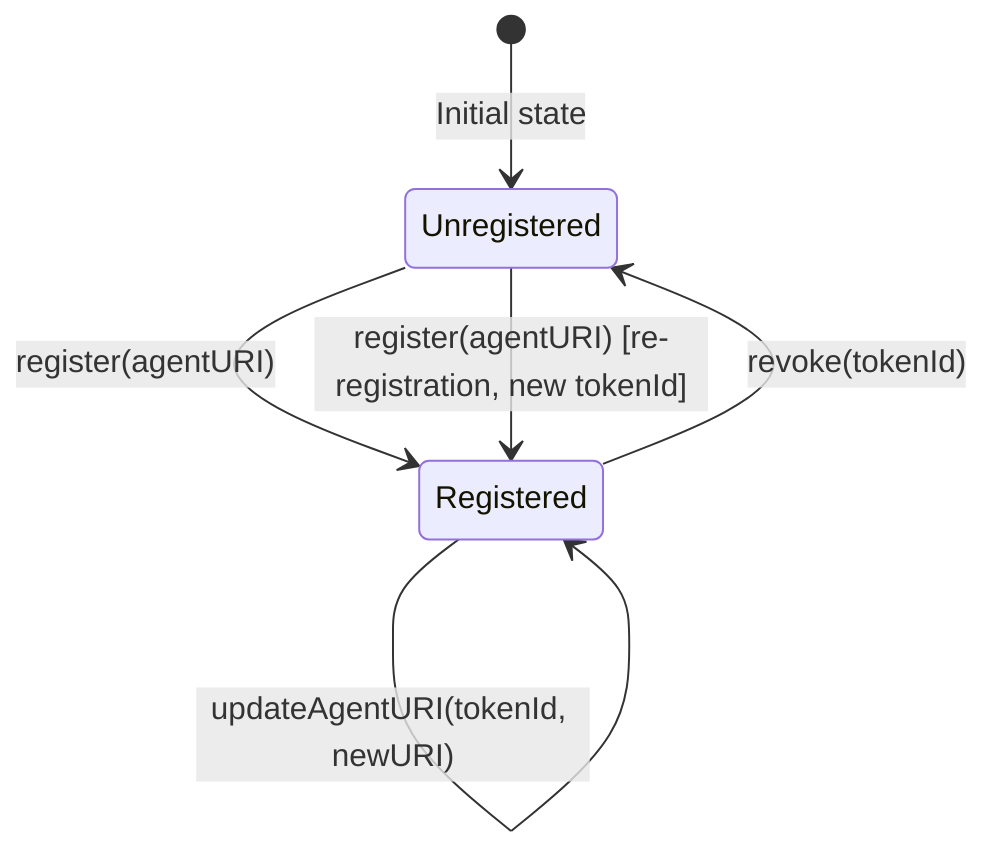
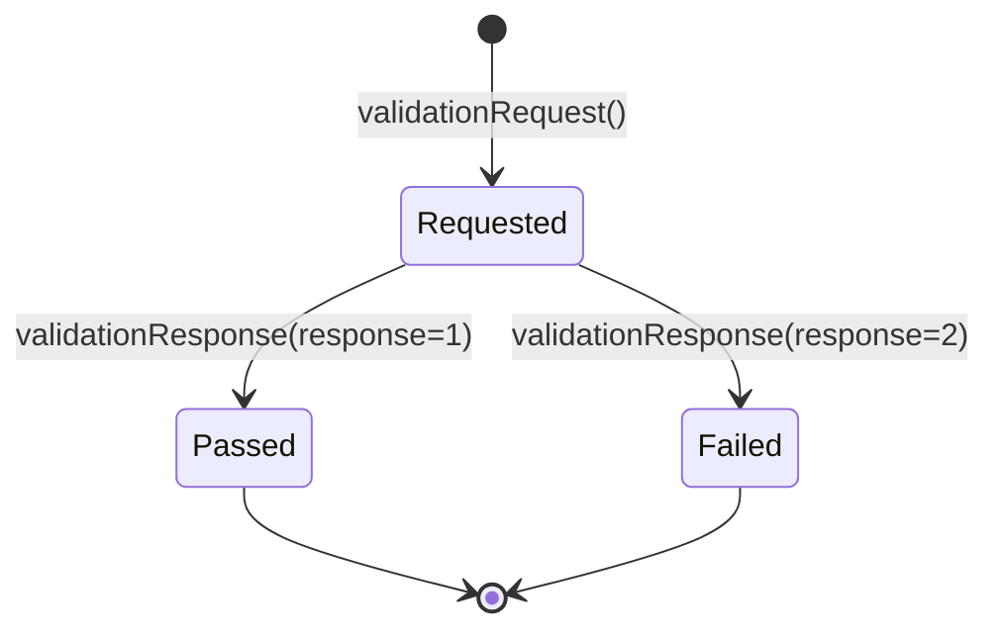
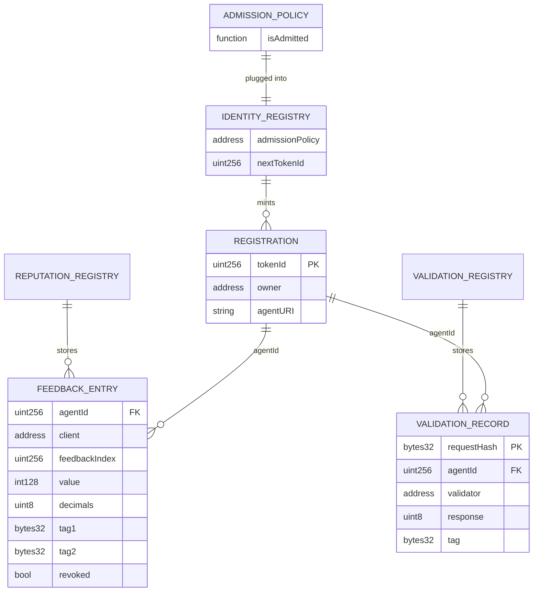

# Data Model: Identity Registry Smart Contract (EIP-8004)

**Feature**: 007-identity-contract
**Date**: 2026-03-04
**Spec**: [spec.md](spec.md)

---

## On-Chain Entities

### Identity Registry

The primary contract. ERC-721 with ERC721Enumerable.

#### State Variables

| Name | Type | Description | FR |
|------|------|-------------|-----|
| `_nextTokenId` | `uint256` | Auto-incrementing counter (starts at 1) | FR-C-02 |
| `_agentURIs` | `mapping(uint256 => string)` | tokenId → agentURI string | FR-C-03 |
| `_addressToTokenId` | `mapping(address => uint256)` | Reverse mapping for `lookup()`. 0 = unregistered | FR-C-10 |
| `_admissionPolicy` | `IAdmissionPolicy` | Pluggable admission policy. `address(0)` = permissionless | FR-C-12 |

#### Functions

| Function | Mutability | Access | Emits | FR |
|----------|-----------|--------|-------|-----|
| `register(string agentURI) → uint256` | State-changing | Anyone (subject to admission) | `IdentityRegistered` | FR-C-02, FR-C-04 |
| `register(string agentURI, bytes parentDIDProof) → uint256` | State-changing | Anyone (subject to admission) | `IdentityRegistered` | FR-C-02, FR-C-04 |
| `updateAgentURI(uint256 tokenId, string newAgentURI)` | State-changing | Owner or approved operator | `IdentityUpdated` | FR-C-05, FR-C-07 |
| `revoke(uint256 tokenId)` | State-changing | Owner only | `IdentityRevoked` | FR-C-05, FR-C-08 |
| `agentURI(uint256 tokenId) → string` | View | Anyone | — | FR-C-03 |
| `lookup(address account) → (uint256, string)` | View | Anyone | — | FR-C-10 |
| `setAdmissionPolicy(address newPolicy)` | State-changing | Contract owner only | `AdmissionPolicyUpdated` | FR-C-13 |
| `admissionPolicy() → address` | View | Anyone | — | FR-C-12 |

#### Events

| Event | Indexed Fields | Non-indexed Fields | FR |
|-------|---------------|-------------------|-----|
| `IdentityRegistered` | `tokenId`, `owner` | `agentURI` | FR-C-04 |
| `IdentityUpdated` | `tokenId` | `newAgentURI` | FR-C-05 |
| `IdentityRevoked` | `tokenId`, `owner` | — | FR-C-05 |
| `AdmissionPolicyUpdated` | `oldPolicy`, `newPolicy` | — | FR-C-13 |

#### Revert Reasons

| Error | Parameters | Trigger | FR |
|-------|-----------|---------|-----|
| `AlreadyRegistered` | `address account` | Duplicate registration | FR-C-06 |
| `NotOwnerOrApproved` | `uint256 tokenId, address caller` | Unauthorized updateAgentURI | FR-C-07 |
| `NotTokenOwner` | `uint256 tokenId, address caller` | Unauthorized revoke | FR-C-08 |
| `EmptyAgentURI` | — | Empty agentURI string | FR-C-19 |
| `AdmissionDenied` | `address account` | Policy rejected caller | FR-C-12 |

#### State Transitions



---

### IAdmissionPolicy (Interface)

| Function | Mutability | Parameters | Returns | FR |
|----------|-----------|-----------|---------|-----|
| `isAdmitted` | View | `address childAddress, bytes parentDIDProof` | `bool` | FR-C-14 |

#### Informative Implementations

- **PermissionlessPolicy**: Always returns `true`. Equivalent to `address(0)` but as a deployed contract.
- **AllowlistPolicy**: Maintains `mapping(bytes32 => bool)` of allowed Parent DID hashes. `isAdmitted` returns `true` if `keccak256(parentDIDProof)` is in the allowlist.

---

### Reputation Registry

Standalone contract linked to Identity Registry via constructor parameter.

#### Data Structures

**FeedbackEntry**:

| Field | Type | Description | FR |
|-------|------|-------------|-----|
| `client` | `address` | Feedback giver's address | FR-C-20 |
| `value` | `int128` | Rating value (fixed-point numerator) | FR-C-21 |
| `decimals` | `uint8` | Decimal places (0–18) | FR-C-21 |
| `tag1` | `bytes32` | Primary category tag | FR-C-20 |
| `tag2` | `bytes32` | Secondary category tag | FR-C-20 |
| `feedbackURI` | `string` | Off-chain detail URI | FR-C-20 |
| `feedbackHash` | `bytes32` | Keccak256 of off-chain content | FR-C-20 |
| `revoked` | `bool` | Whether feedback has been revoked | FR-C-22 |
| `responseURI` | `string` | Agent's response URI (empty if no response) | FR-C-23 |
| `responseHash` | `bytes32` | Keccak256 of response content | FR-C-23 |

#### State Variables

| Name | Type | Description | FR |
|------|------|-------------|-----|
| `_identityRegistry` | `IIdentityRegistry` | Linked Identity Registry (set in constructor) | FR-C-26 |
| `_feedbacks` | `mapping(uint256 => mapping(address => FeedbackEntry[]))` | agentId → client → feedback entries | FR-C-20 |

#### Functions

| Function | Mutability | Access | Emits | FR |
|----------|-----------|--------|-------|-----|
| `giveFeedback(...)` | State-changing | Anyone | `FeedbackGiven` | FR-C-20, FR-C-25 |
| `revokeFeedback(uint256 agentId, uint256 feedbackIndex)` | State-changing | Original giver only | `FeedbackRevoked` | FR-C-22, FR-C-25 |
| `appendResponse(...)` | State-changing | Agent owner only | `ResponseAppended` | FR-C-23, FR-C-25 |
| `getSummary(...)` | View | Anyone | — | FR-C-24 |

#### Events

| Event | Indexed Fields | Non-indexed Fields | FR |
|-------|---------------|-------------------|-----|
| `FeedbackGiven` | `agentId`, `client` | `feedbackIndex`, `value`, `decimals`, `tag1`, `tag2` | FR-C-25 |
| `FeedbackRevoked` | `agentId`, `client` | `feedbackIndex` | FR-C-25 |
| `ResponseAppended` | `agentId`, `clientAddress` | `feedbackIndex` | FR-C-25 |

#### Revert Reasons

| Error | Parameters | Trigger | FR |
|-------|-----------|---------|-----|
| `AgentNotRegistered` | `uint256 agentId` | agentId not in Identity Registry | FR-C-26 |
| `NotFeedbackGiver` | `uint256 agentId, uint256 feedbackIndex, address caller` | Unauthorized revoke | FR-C-22 |
| `NotAgentOwner` | `uint256 agentId, address caller` | Unauthorized response | FR-C-23 |

---

### Validation Registry

Standalone contract linked to Identity Registry via constructor parameter.

#### Data Structures

**ValidationRecord**:

| Field | Type | Description | FR |
|-------|------|-------------|-----|
| `validator` | `address` | Addressed validator | FR-C-27 |
| `agentId` | `uint256` | Agent's tokenId from Identity Registry | FR-C-27 |
| `requestURI` | `string` | Off-chain request details URI | FR-C-27 |
| `response` | `uint8` | 0=pending, 1=pass, 2=fail | FR-C-29 |
| `responseURI` | `string` | Validator's response details URI | FR-C-28 |
| `responseHash` | `bytes32` | Keccak256 of response content | FR-C-28 |
| `tag` | `bytes32` | Validation category tag | FR-C-28 |
| `lastUpdate` | `uint256` | Block timestamp of last update | FR-C-30 |

#### State Variables

| Name | Type | Description | FR |
|------|------|-------------|-----|
| `_identityRegistry` | `IIdentityRegistry` | Linked Identity Registry (set in constructor) | FR-C-33 |
| `_validations` | `mapping(bytes32 => ValidationRecord)` | requestHash → validation record | FR-C-27 |

#### Functions

| Function | Mutability | Access | Emits | FR |
|----------|-----------|--------|-------|-----|
| `validationRequest(...)` | State-changing | Agent owner only | `ValidationRequested` | FR-C-27, FR-C-32 |
| `validationResponse(...)` | State-changing | Addressed validator only | `ValidationResponded` | FR-C-28, FR-C-32 |
| `getValidationStatus(bytes32 requestHash)` | View | Anyone | — | FR-C-30 |
| `getSummary(...)` | View | Anyone | — | FR-C-31 |

#### Events

| Event | Indexed Fields | Non-indexed Fields | FR |
|-------|---------------|-------------------|-----|
| `ValidationRequested` | `requestHash`, `agentId`, `validatorAddress` | — | FR-C-32 |
| `ValidationResponded` | `requestHash` | `response`, `tag` | FR-C-32 |

#### Revert Reasons

| Error | Parameters | Trigger | FR |
|-------|-----------|---------|-----|
| `AgentNotRegistered` | `uint256 agentId` | agentId not in Identity Registry | FR-C-33 |
| `NotAgentOwner` | `uint256 agentId, address caller` | Unauthorized request | FR-C-27 |
| `NotAddressedValidator` | `bytes32 requestHash, address caller` | Unauthorized response | FR-C-28 |
| `RequestAlreadyExists` | `bytes32 requestHash` | Duplicate request hash | FR-C-27 |

#### State Transitions



---

## Cross-Registry Entity Relationships



---

## Deployment Model

### Direct Deployment (Immutable)

```
IdentityRegistry (deployed) ← Reputation/Validation reference via constructor
```

### Proxy Deployment (Recommended)

```
ProxyAdmin (owner: deployer)
├── TransparentProxy → IdentityRegistryV1 (implementation)
├── TransparentProxy → ReputationRegistryV1 (implementation)
└── TransparentProxy → ValidationRegistryV1 (implementation)
```

- ProxyAdmin address ≠ RegistryAdmin address (FR-C-35)
- Upgrade: ProxyAdmin calls `upgrade(proxy, newImpl)` — preserves storage
