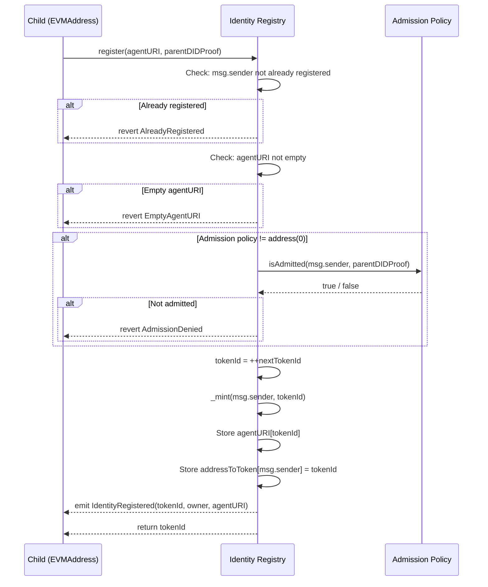
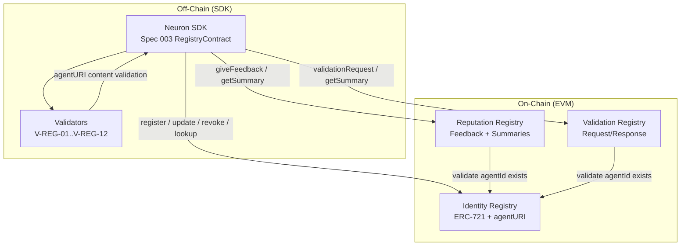
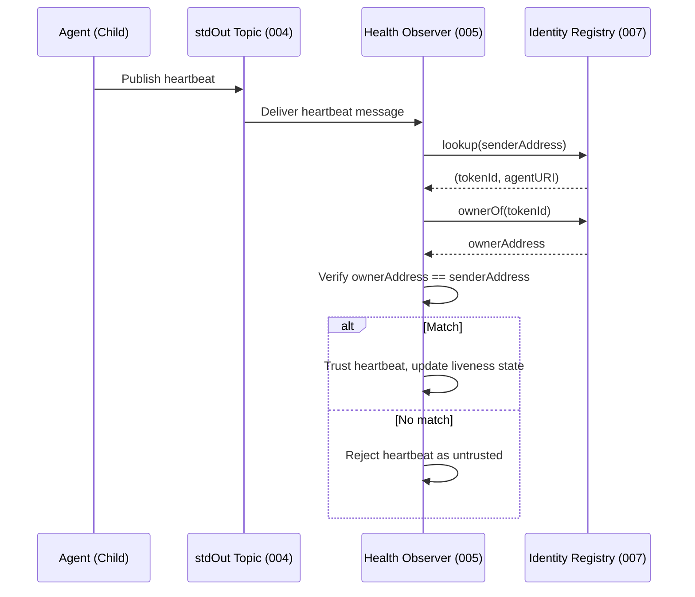

# Feature Specification: Identity Registry Smart Contract (EIP-8004 On-Chain Registries)

**Feature Branch**: `007-identity-contract`
**Created**: 2026-03-04
**Status**: Draft

## Related Specs

- **Specs in this repo**:
  - [001 NeuronAccount Module](../001-neuron-account-module/spec.md) — DID ownership (Parent DID as identity root), RegistryBinding, LedgerAttachment. The Parent's DID serves as the trust anchor for admission policies (FR-C-14).
  - [002 Key Library](../002-key-library/spec.md) — EVMAddress derivation from NeuronPublicKey, secp256k1 ECDSA signatures, ecrecover, DID:key encoding. Proof-of-control in `register()` relies on the EVM transaction model: `msg.sender` is the address derived from the signing key (002 FR-K02).
  - [003 Peer Registry](../003-peer-registry/spec.md) — SDK-level registration protocol. V-REG-01 through V-REG-12 validations remain off-chain in the SDK. Role boundaries (FR-R11a–d), allowlist semantics (FR-R12a–e), and proof-of-control (FR-R06) are the authoritative source for the on-chain invariants codified here. This spec (007) defines the **contract** that 003's `RegistryContract` interface calls.
  - [004 Topic System](../004-topic-system/spec.md) — `neuron-topic` and `neuron-p2p-exchange` service schemas encoded in the agentURI. The contract stores agentURI as an opaque string; 004 defines the JSON structure within.
  - [005 Health](../005-health/spec.md) — stdOut heartbeat publication. Observers verify the heartbeat sender's identity by calling `ownerOf(tokenId)` on the Identity Registry to confirm the sender controls the registration NFT.
  - [006 Protocol Determinism](../006-protocol-determinism/spec.md) — Wire format and signing algorithm specifications. agentURI content serialization follows 006's canonical JSON rules when content-addressability is desired.

- **External standards**:
  - [EIP-8004](https://eips.ethereum.org/EIPS/eip-8004) — Trustless Agents; defines the three-registry model (Identity, Reputation, Validation) that this spec implements.
  - [ERC-721](https://eips.ethereum.org/EIPS/eip-721) — Non-Fungible Token Standard; the Identity Registry is an ERC-721 contract.
  - [EIP-1967](https://eips.ethereum.org/EIPS/eip-1967) — Proxy Storage Slots; recommended upgrade pattern for all three registries.
  - [EIP-712](https://eips.ethereum.org/EIPS/eip-712) — Typed Structured Data Signing; used for `agentWallet` metadata changes.
  - [ERC-165](https://eips.ethereum.org/EIPS/eip-165) — Standard Interface Detection; all contracts MUST implement `supportsInterface`.

## Purpose

This specification defines the **on-chain smart contract layer** for the Neuron protocol. It covers three registries specified by EIP-8004:

1. **Identity Registry** (primary): An ERC-721 contract that maps a Child's EVMAddress to a registration NFT containing an `agentURI` — a URI pointing to or embedding the JSON services document. The contract enforces proof-of-control (`msg.sender == Child`), uniqueness (one registration per address per registry), pluggable admission policy, and role boundaries (admin cannot mint, modify, or revoke on behalf of agents).

2. **Reputation Registry**: Records feedback from clients about registered agents. Supports fixed-point value ratings with categorical tags, off-chain detail URIs with Keccak256 integrity hashes, agent responses to feedback, and tag-filtered summary queries.

3. **Validation Registry**: Enables third-party validators to verify agent capabilities. Supports validation requests (agent to validator), validation responses (validator to agent with pass/fail/pending status), and tag-filtered summary queries.

All three registries share: EVM-compatible deployment (Ethereum, Base, Hedera EVM), EIP-1967 proxy upgrade pattern (recommended), reentrancy protection, and the same `agentId` (tokenId from Identity Registry) as the cross-registry identifier.

**Verifier-centric design**: Every requirement in this spec describes observable on-chain behavior. A verifier with only blockchain access (no SDK internals) can determine whether a deployment conforms to this specification by observing contract state, emitted events, and revert reasons.

**On-chain vs. off-chain validation split**: The contract stores `agentURI` as an opaque string — no JSON parsing on-chain (FR-C-11). SDK-level validations (V-REG-01 through V-REG-12 from Spec 003) remain off-chain. The contract enforces only security-critical invariants: uniqueness, ownership, admission, and role boundaries.

**Relationship to Spec 003 (Peer Registry)**: Spec 003 defines the SDK-level registration workflow — how the SDK constructs an agentURI, validates it, and submits it. This spec (007) defines the on-chain contract that 003's `RegistryContract` interface calls. The SDK interface mapping is:

| SDK Method (003 RegistryContract) | Contract Function (007) | Notes |
|-----------------------------------|------------------------|-------|
| Register(opts, agentURI) | register(string agentURI) | Returns tokenId; overload with parentDIDProof for permissioned |
| UpdateAgentURI(opts, tokenId, agentURI) | updateAgentURI(uint256 tokenId, string newAgentURI) | Owner or approved operator |
| Revoke(opts, tokenId) | revoke(uint256 tokenId) | Owner only; burns token |
| Lookup(opts, address) | lookup(address account) | Returns (tokenId, agentURI) or (0, "") |
| OwnerOf(opts, tokenId) | ownerOf(uint256 tokenId) | Standard ERC-721; confirms token ownership |
| AgentURI(opts, tokenId) | agentURI(uint256 tokenId) | Direct token-level query |

## Out of Scope

- **SDK-level validation logic**: V-REG-01 through V-REG-12 (agentURI JSON schema validation, service completeness checks, topicRef resolution) remain in Spec 003. The contract does not parse agentURI content.
- **agentURI JSON schema**: The internal structure of the agentURI document (services array, neuron-topic schema, neuron-p2p-exchange schema) is defined in Specs 003 and 004. This spec treats agentURI as an opaque string.
- **Solidity implementation code**: Solidity interface definitions in the appendix are **informative, not normative** (FR-C-37). Implementations MAY use any language targeting the EVM (Solidity, Vyper, Huff, etc.).
- **Gas optimization**: Specific gas optimization techniques are implementation concerns. The spec defines functional behavior, not gas budgets.
- **Governance and DAO**: How registry administrators are appointed, replaced, or governed is a platform concern outside this spec.
- **Cross-chain bridging**: How registrations are bridged between different EVM chains is not defined here.
- **Off-chain indexing**: How indexers, subgraphs, or mirror nodes consume events is not defined here. Events are specified for on-chain verifiability; off-chain consumers may use them freely.
- **Dispute resolution**: How conflicts between feedback givers and agents are resolved off-chain is not defined here.
- **SDK orchestration for Reputation and Validation**: Spec 003 provides SDK-level orchestration for the Identity Registry (agentURI validation, registration workflow). Equivalent SDK orchestration for the Reputation Registry (FR-C-20–C-26) and Validation Registry (FR-C-27–C-33) is deferred to a future spec. This spec defines only the on-chain contract behavior for all three registries.
- **agentWallet metadata**: EIP-8004 defines `agentWallet` as a reserved metadata key for payment addresses (requires EIP-712 signature to change). Spec 001 defines payment address resolution (FR-023/024). Writing `agentWallet` to the on-chain contract is deferred to a future spec iteration. The EIP-712 reference in Related Specs is included for forward compatibility.

## Clarifications

### Session 2026-03-04

- Q: How should the `register()` function accept `parentDIDProof` for admission policy checks? → A: Two overloads: `register(agentURI)` for permissionless registries (no admission check or policy is `address(0)`), and `register(agentURI, parentDIDProof)` for permissioned registries where the admission policy requires proof of Parent DID lineage.
- Q: Who can call `validationRequest()` for a given `agentId`? → A: Only the owner of the `agentId` NFT in the Identity Registry. This prevents spam validation requests and ensures the agent consents to being validated.

## Design Decisions

### DD-01: Opaque agentURI storage
The contract stores `agentURI` as a `string` without any on-chain parsing or schema validation. This keeps gas costs low, avoids Solidity's string manipulation limitations, and maintains a clean separation between the on-chain identity layer (this spec) and the off-chain service description layer (Specs 003, 004). The SDK is responsible for constructing valid agentURIs before calling `register()`.

### DD-02: Pluggable admission policy
Admission is delegated to an external `IAdmissionPolicy` contract via a strategy pattern. Setting the policy address to `address(0)` means permissionless registration (any address satisfying proof-of-control may register). This allows platform operators to start permissionless and later add restrictions without redeploying the registry. Two informative policy examples are provided in the appendix: `PermissionlessPolicy` (always admits) and `AllowlistPolicy` (Parent DID allowlist).

### DD-03: ERC-721 transfers unrestricted
Registration NFTs follow standard ERC-721 transfer semantics. They are NOT soulbound. Per 003 FR-R11d, post-mint transfer is governed by standard ERC-721 semantics and platform governance, not by the protocol spec. Platforms MAY implement transfer restrictions via custom ERC-721 hooks if needed.

### DD-04: Cross-registry identity via agentId
Reputation and Validation registries reference the Identity Registry's `agentId` (tokenId) as their cross-registry key. Both registries accept the Identity Registry contract address as a constructor parameter and validate that the referenced `agentId` exists in that registry.

### DD-05: EIP-1967 proxy upgrade pattern
All three registries SHOULD be deployed behind EIP-1967 transparent proxies. The proxy admin MUST be a separate address from the registry admin to prevent privilege escalation. Immutable deployment and registry-versioning (deploy new contract, migrate) are documented as alternatives with tradeoffs.

---

## User Scenarios & Testing *(mandatory)*

### User Story 1 — Register and Manage a Child Identity On-Chain (Priority: P1)

A Child agent (identified by EVMAddress from 001/002) registers itself in the Identity Registry. The Child calls `register(agentURI)` with a valid agentURI string. The contract mints an ERC-721 token to the Child's address, stores the agentURI, and emits an `IdentityRegistered` event. The Child can later update its agentURI, look up its registration, and revoke (burn) its token. After revocation, the Child may re-register with a new tokenId.

**Why this priority**: Identity registration is the foundation — all Reputation and Validation operations require a valid agentId from the Identity Registry. Without US1, no other registry is usable.

**Independent Test**: Deploy an Identity Registry on a local EVM testnet. A Child address calls `register()`, `updateAgentURI()`, `lookup()`, and `revoke()`. Verify token ownership, agentURI retrieval, event emissions, and re-registration after revocation.

**Acceptance Scenarios**:

1. **Given** a Child with a valid EVMAddress and no existing registration, **When** the Child calls `register("https://example.com/agent.json")`, **Then** a new token is minted to `msg.sender` with an auto-incrementing tokenId, the agentURI is stored, and `IdentityRegistered(tokenId, owner, agentURI)` is emitted.
2. **Given** a registered Child, **When** the Child calls `updateAgentURI(tokenId, "https://example.com/agent-v2.json")`, **Then** the stored agentURI is updated and `IdentityUpdated(tokenId, newAgentURI)` is emitted.
3. **Given** a registered Child, **When** the Child calls `revoke(tokenId)`, **Then** the token is burned, the address-to-token mapping is cleared, and `IdentityRevoked(tokenId, owner)` is emitted.
4. **Given** a Child that previously revoked its registration, **When** the Child calls `register()` again, **Then** a new token is minted with a new (higher) tokenId.
5. **Given** a Child that is already registered, **When** the Child calls `register()` again, **Then** the transaction reverts with `AlreadyRegistered`.
6. **Given** any address, **When** `lookup(address)` is called for an unregistered address, **Then** the result is `(0, "")`.
7. **Given** a Child calling `register("")`, **When** the agentURI is an empty string, **Then** the transaction reverts with `EmptyAgentURI`.

---

### User Story 2 — Enforce Admission Policy for Permissioned Registries (Priority: P2)

A platform operator deploys an Identity Registry with a pluggable admission policy. By default, the registry is permissionless (policy address = `address(0)`). The operator can later set an `AllowlistPolicy` that restricts registration to Children whose Parent DID is on the allowlist. The operator manages the allowlist by adding/removing Parent DIDs. Removing a Parent DID does NOT auto-revoke existing registrations.

**Why this priority**: Permissioned registries are essential for enterprise and regulated environments. However, the permissionless case (US1) must work first.

**Independent Test**: Deploy an Identity Registry with an AllowlistPolicy. Add a Parent DID to the allowlist. Have a Child of that Parent register (should succeed). Have a Child of an unlisted Parent attempt to register (should revert). Remove the first Parent DID and verify existing registrations persist.

**Acceptance Scenarios**:

1. **Given** a registry with `admissionPolicy` set to `address(0)`, **When** any address calls `register()`, **Then** admission is not checked and registration proceeds (permissionless).
2. **Given** a registry with a custom `IAdmissionPolicy` set, **When** a Child calls `register()` with `parentDIDProof` bytes, **Then** the contract calls `admissionPolicy.isAdmitted(childAddress, parentDIDProof)` and reverts if the result is `false`.
3. **Given** a registry with an allowlist policy, **When** the registry owner calls `setAdmissionPolicy(newPolicyAddress)`, **Then** the policy is updated and `AdmissionPolicyUpdated(oldPolicy, newPolicy)` is emitted.
4. **Given** a Parent DID on the allowlist with registered Children, **When** the Parent DID is removed from the allowlist, **Then** existing registrations by that Parent's Children are NOT automatically revoked. Only new registration attempts are rejected.
5. **Given** any non-owner address, **When** it calls `setAdmissionPolicy()`, **Then** the transaction reverts.

---

### User Story 3 — Give and Query Reputation Feedback for an Agent (Priority: P2)

A client interacts with a registered agent and wants to leave feedback. The client calls `giveFeedback()` on the Reputation Registry with a rating value, categorical tags, and an optional off-chain detail URI with a Keccak256 integrity hash. The agent owner can respond to feedback. Feedback can be revoked by the original giver. Summary queries return aggregated counts and values filtered by tags.

**Why this priority**: Reputation is a core EIP-8004 registry. It depends on Identity Registry (US1) for agentId validation but can be developed in parallel.

**Independent Test**: Deploy Identity and Reputation registries. Register an agent. Give feedback, revoke feedback, append a response, and query summaries. Verify events and aggregation.

**Acceptance Scenarios**:

1. **Given** a registered agent with `agentId`, **When** a client calls `giveFeedback(agentId, 450, 2, "quality", "speed", feedbackURI, feedbackHash)`, **Then** feedback is recorded with value 4.50 (450 / 10^2) and `FeedbackGiven(agentId, client, feedbackIndex, value, decimals, tag1, tag2)` is emitted.
2. **Given** existing feedback, **When** the original feedback giver calls `revokeFeedback(agentId, feedbackIndex)`, **Then** the feedback is marked revoked and `FeedbackRevoked(agentId, client, feedbackIndex)` is emitted.
3. **Given** existing feedback, **When** the agent owner calls `appendResponse(agentId, clientAddress, feedbackIndex, responseURI, responseHash)`, **Then** the response is recorded and `ResponseAppended(agentId, clientAddress, feedbackIndex)` is emitted.
4. **Given** multiple feedback entries with different tags, **When** `getSummary(agentId, [], "quality", "")` is called, **Then** only feedback matching `tag1 = "quality"` is included in the count and aggregated value.
5. **Given** an `agentId` that does not exist in the Identity Registry, **When** `giveFeedback()` is called with that `agentId`, **Then** the transaction reverts.

---

### User Story 4 — Request and Provide Third-Party Validation (Priority: P2)

An agent wants its capabilities validated by a third-party validator. The agent owner calls `validationRequest()` to create a request addressed to a specific validator. The validator reviews the request off-chain and calls `validationResponse()` with a pass/fail/pending response code. Summary queries return aggregated validation results filtered by tags.

**Why this priority**: Validation is a core EIP-8004 registry. It depends on Identity Registry (US1) for agentId validation but can be developed in parallel with US3.

**Independent Test**: Deploy Identity and Validation registries. Register an agent. Create a validation request, submit a response, and query summaries. Verify events and status queries.

**Acceptance Scenarios**:

1. **Given** a registered agent with `agentId`, **When** the agent owner calls `validationRequest(validatorAddress, agentId, requestURI, requestHash)`, **Then** a validation request is created and `ValidationRequested(requestHash, agentId, validatorAddress)` is emitted.
2. **Given** a pending validation request, **When** the addressed validator calls `validationResponse(requestHash, 1, responseURI, responseHash, "security")`, **Then** the response is recorded with `response = 1` (pass) and `ValidationResponded(requestHash, response, tag)` is emitted.
3. **Given** a pending validation request, **When** an address other than the addressed validator calls `validationResponse()`, **Then** the transaction reverts.
4. **Given** multiple validation responses with different tags, **When** `getSummary(agentId, [], "security")` is called, **Then** only validations matching `tag = "security"` are included in the returned count, passCount, and failCount.
5. **Given** an `agentId` that does not exist in the Identity Registry, **When** `validationRequest()` is called, **Then** the transaction reverts.

---

### User Story 5 — Deploy Registries with Proxy Upgradeability (Priority: P2)

A platform operator deploys all three registries (Identity, Reputation, Validation) behind EIP-1967 transparent proxies. The proxy admin is a separate address from the registry admin. The operator can upgrade the implementation contract while preserving all state (registrations, feedback, validations). Deployment works identically on Ethereum, Base, and Hedera EVM.

**Why this priority**: Upgradeability is essential for production deployments but is not required for initial development and testing.

**Independent Test**: Deploy a proxied Identity Registry. Register agents. Upgrade the implementation. Verify all registrations and agentURIs are preserved. Repeat on Hedera EVM testnet.

**Acceptance Scenarios**:

1. **Given** a deployed proxy + implementation pair, **When** agents register through the proxy, **Then** all state is stored in the proxy's storage and behaves identically to a non-proxied deployment.
2. **Given** a proxied registry with existing registrations, **When** the proxy admin upgrades the implementation to a new version, **Then** all existing registrations, agentURIs, and token ownership are preserved.
3. **Given** a proxy admin address and a registry admin address, **When** the proxy admin calls upgrade functions, **Then** it succeeds. When the registry admin calls upgrade functions, it reverts (and vice versa for registry operations).
4. **Given** the same deployment scripts, **When** deploying to Hedera EVM testnet, **Then** all contract functionality works identically, accounting for Hedera-specific differences (gas model, account model, finality).

---

### User Story 6 — Observe Agent Trust Root from Registry (Priority: P3)

A health observer (from Spec 005) receives a heartbeat message on an agent's stdOut topic. The observer looks up the sender's registration in the Identity Registry using `lookup(senderAddress)` to verify that the sender controls a valid registration NFT. This establishes the trust root: the heartbeat sender is a registered agent with a verifiable on-chain identity.

**Why this priority**: Cross-spec integration that enhances the health system but is not required for the registries to function independently.

**Independent Test**: Deploy an Identity Registry and register an agent. Simulate a health observer calling `lookup(agentAddress)` and verifying `ownerOf(tokenId) == agentAddress`. Confirm that unregistered senders return `(0, "")`.

**Acceptance Scenarios**:

1. **Given** a registered agent publishing heartbeats on stdOut, **When** an observer calls `lookup(senderAddress)` on the Identity Registry, **Then** the observer receives `(tokenId, agentURI)` confirming the sender is registered.
2. **Given** the returned `tokenId`, **When** the observer calls `ownerOf(tokenId)`, **Then** the result equals the heartbeat sender's address, confirming proof-of-control.
3. **Given** an unregistered sender publishing heartbeats, **When** the observer calls `lookup(senderAddress)`, **Then** the result is `(0, "")` and the observer MAY treat the sender as untrusted.

---

### Edge Cases

- What happens when a registered address receives an NFT via ERC-721 `transferFrom()` from another registered address? The registry's address-to-token mapping tracks the minting address. Transfer semantics follow standard ERC-721 — the new owner can call `updateAgentURI()` and `revoke()` on the received token, but the original address-to-token mapping is cleared only on `revoke()` by the original owner, not on transfer.
- What happens when the admission policy contract is self-destructed or becomes non-functional? Registration calls will revert with an out-of-gas or low-level revert. The registry owner can reset the admission policy to `address(0)` (permissionless) or deploy a new policy contract.
- What happens when `giveFeedback()` is called with `decimals > 18`? The contract SHOULD reject values where `decimals > 18` to prevent overflow in fixed-point arithmetic.
- What happens when the Identity Registry's token is burned but the Reputation/Validation registries still reference that `agentId`? Existing feedback and validation records persist as historical data. New feedback/validation operations on the burned `agentId` revert because the `agentId` no longer exists in the Identity Registry.

---

## Requirements *(mandatory)*

### Functional Requirements

#### Identity Registry

- **FR-C-01**: The Identity Registry MUST be an ERC-721 contract with ERC721Enumerable support, enabling on-chain enumeration of all registered agents.
- **FR-C-02**: The contract MUST provide two `register` overloads: (a) `register(string agentURI)` for permissionless registries or when no admission proof is needed, and (b) `register(string agentURI, bytes parentDIDProof)` for permissioned registries where the admission policy requires proof of Parent DID lineage. Both overloads MUST mint a new ERC-721 token to `msg.sender` with an auto-incrementing `tokenId` (starting from 1) and store the `agentURI` associated with the minted token. When the admission policy is `address(0)`, overload (a) proceeds without an admission check; overload (b) ignores `parentDIDProof`. When the admission policy is non-zero, overload (a) calls `isAdmitted(msg.sender, "")` (empty proof); overload (b) calls `isAdmitted(msg.sender, parentDIDProof)`.
- **FR-C-03**: The contract MUST store the `agentURI` as a `string`, retrievable via `agentURI(uint256 tokenId) → string`. This function MUST return the stored string for valid tokens and revert for non-existent tokens.
- **FR-C-04**: `register()` MUST emit `IdentityRegistered(uint256 indexed tokenId, address indexed owner, string agentURI)` upon successful registration.
- **FR-C-05**: `updateAgentURI(uint256 tokenId, string newAgentURI)` MUST emit `IdentityUpdated(uint256 indexed tokenId, string newAgentURI)`. `revoke(uint256 tokenId)` MUST emit `IdentityRevoked(uint256 indexed tokenId, address indexed owner)`.
- **FR-C-06**: One registration per address per registry instance. If `msg.sender` already holds a registration token in this contract, `register()` MUST revert with `AlreadyRegistered(address account)`.
- **FR-C-07**: `updateAgentURI()` MUST be callable only by the token owner or an approved operator (per ERC-721 `approve()` or `setApprovalForAll()`). If the caller is neither, the transaction MUST revert with `NotOwnerOrApproved(uint256 tokenId, address caller)`.
- **FR-C-08**: `revoke()` MUST burn the token and clear the address-to-token mapping. `revoke()` MUST be callable only by the token owner — not by approved operators and not by the contract admin. If the caller is not the owner, the transaction MUST revert with `NotTokenOwner(uint256 tokenId, address caller)`.
- **FR-C-09**: The contract admin (owner) MUST NOT be able to mint tokens, modify any agent's `agentURI`, or revoke any agent's registration. Admin functions are limited to admission policy management (FR-C-13). This enforces the role boundary defined in 003 FR-R11a.
- **FR-C-10**: `lookup(address account) → (uint256 tokenId, string agentURI)` MUST return the registration data for the given address. If the address is not registered, it MUST return `(0, "")`.
- **FR-C-11**: The contract MUST NOT parse, validate, or interpret the `agentURI` string content. The `agentURI` is an opaque string on-chain. All content validation (JSON schema, service completeness, field values) is the responsibility of the SDK layer (Spec 003).
- **FR-C-12**: The contract MUST support a pluggable admission policy via an `IAdmissionPolicy` interface. When the admission policy address is `address(0)`, the registry operates in permissionless mode (no admission check). When set to a non-zero address, the contract MUST call `IAdmissionPolicy.isAdmitted()` during `register()`.
- **FR-C-13**: Only the contract owner MAY update the admission policy via `setAdmissionPolicy(address newPolicy)`. This function MUST emit `AdmissionPolicyUpdated(address indexed oldPolicy, address indexed newPolicy)`.
- **FR-C-14**: The `IAdmissionPolicy` interface MUST define: `isAdmitted(address childAddress, bytes calldata parentDIDProof) → bool`. The `parentDIDProof` is opaque bytes — the admission policy implementation defines the proof format. This spec does not prescribe it.
- **FR-C-15**: Removing a Parent DID from an allowlist-based admission policy MUST NOT auto-revoke existing registrations by Children of that Parent. Only new registration attempts by Children of the removed Parent MUST be rejected. This enforces 003 FR-R12d.
- **FR-C-16**: After `revoke()`, the same address MAY call `register()` again to create a new registration with a new (higher) `tokenId`.
- **FR-C-17**: The contract MUST be deployable on any EVM-compatible chain, including Ethereum mainnet, Base, and Hedera EVM. No chain-specific opcodes or precompiles are permitted in the core contract logic.
- **FR-C-18**: All state-modifying functions (`register`, `updateAgentURI`, `revoke`, `setAdmissionPolicy`) MUST use reentrancy protection (e.g., OpenZeppelin ReentrancyGuard or equivalent checks-effects-interactions pattern).
- **FR-C-19**: `register()` and `updateAgentURI()` MUST reject empty `agentURI` strings (`bytes(agentURI).length == 0`) with a `EmptyAgentURI()` revert.

#### Reputation Registry

- **FR-C-20**: `giveFeedback(uint256 agentId, int128 value, uint8 decimals, bytes32 tag1, bytes32 tag2, string feedbackURI, bytes32 feedbackHash)` MUST record feedback from `msg.sender` about the agent identified by `agentId`. Each feedback entry is assigned a sequential `feedbackIndex` per (agentId, client) pair.
- **FR-C-21**: Feedback value MUST use fixed-point arithmetic: `int128 value` with `uint8 decimals` (0–18). The actual rating is `value / 10^decimals`. Implementations MUST reject `decimals > 18` to prevent overflow.
- **FR-C-22**: `revokeFeedback(uint256 agentId, uint256 feedbackIndex)` MUST allow only the original feedback giver (`msg.sender` matches the recorded client address) to revoke their feedback. Revoked feedback MUST be excluded from summary calculations.
- **FR-C-23**: `appendResponse(uint256 agentId, address clientAddress, uint256 feedbackIndex, string responseURI, bytes32 responseHash)` MUST allow only the agent owner (the address that owns `agentId` in the Identity Registry) to append a response to existing feedback.
- **FR-C-24**: `getSummary(uint256 agentId, address[] calldata clientAddresses, bytes32 tag1, bytes32 tag2) → (uint256 count, int256 totalValue, uint8 decimals)` MUST return aggregated feedback count and total value, filtered by the provided tags and client addresses. Empty tag values (`bytes32(0)`) MUST be treated as wildcards (no filter on that tag dimension). Empty `clientAddresses` array MUST include all clients.
- **FR-C-25**: Feedback operations MUST emit the following events: `FeedbackGiven(uint256 indexed agentId, address indexed client, uint256 feedbackIndex, int128 value, uint8 decimals, bytes32 tag1, bytes32 tag2)`, `FeedbackRevoked(uint256 indexed agentId, address indexed client, uint256 feedbackIndex)`, `ResponseAppended(uint256 indexed agentId, address indexed clientAddress, uint256 feedbackIndex)`.
- **FR-C-26**: The `agentId` used in all Reputation Registry functions MUST correspond to a valid `tokenId` in the linked Identity Registry. Operations on non-existent `agentId` values MUST revert with `AgentNotRegistered(uint256 agentId)`.

#### Validation Registry

- **FR-C-27**: `validationRequest(address validatorAddress, uint256 agentId, string requestURI, bytes32 requestHash)` MUST create a validation request addressed to `validatorAddress`. Only the owner of the `agentId` NFT in the Identity Registry MAY call this function. If `msg.sender` is not the owner of `agentId`, the transaction MUST revert with `NotAgentOwner(uint256 agentId, address caller)`. The `validatorAddress` MUST have an active registration in the linked Identity Registry; if `lookup(validatorAddress)` returns no valid tokenId, the transaction MUST revert with `ValidatorNotRegistered(address validatorAddress)` (per [Spec 010 FR-V14](../010-validation-framework/spec.md)). The `requestHash` serves as the unique identifier for the request.
- **FR-C-28**: `validationResponse(bytes32 requestHash, uint8 response, string responseURI, bytes32 responseHash, bytes32 tag)` MUST be callable only by the validator address specified in the original request. If `msg.sender` does not match the request's `validatorAddress`, the transaction MUST revert with `NotAddressedValidator(bytes32 requestHash, address caller)`. Additionally, the caller (`msg.sender`) MUST have an active registration in the linked Identity Registry; if `lookup(msg.sender)` returns no valid tokenId, the transaction MUST revert with `ValidatorNotRegistered(address caller)` (per [Spec 010 FR-V13](../010-validation-framework/spec.md)).
- **FR-C-29**: Response codes MUST follow: `0 = pending` (initial state), `1 = pass`, `2 = fail`, `3 = inconclusive` (insufficient evidence to determine compliance, per [Spec 010 FR-V08](../010-validation-framework/spec.md)). Implementations MAY define additional codes above 3 for extended status in future versions.
- **FR-C-30**: `getValidationStatus(bytes32 requestHash) → (address validator, uint256 agentId, uint8 response, bytes32 responseHash, bytes32 tag, uint256 lastUpdate)` MUST return the complete validation record for a given request hash.
- **FR-C-31**: `getSummary(uint256 agentId, address[] calldata validatorAddresses, bytes32 tag) → (uint256 count, uint256 passCount, uint256 failCount, uint256 inconclusiveCount)` MUST return aggregated validation counts including all three outcome types, filtered by validator addresses and tag. Empty `validatorAddresses` array MUST include all validators. Empty tag (`bytes32(0)`) MUST be treated as a wildcard. The `inconclusiveCount` reflects validations with response code `3` (per [Spec 010 FR-V10](../010-validation-framework/spec.md)).
- **FR-C-32**: Validation operations MUST emit: `ValidationRequested(bytes32 indexed requestHash, uint256 indexed agentId, address indexed validatorAddress)` and `ValidationResponded(bytes32 indexed requestHash, uint8 response, bytes32 tag)`.
- **FR-C-33**: The `agentId` used in all Validation Registry functions MUST correspond to a valid `tokenId` in the linked Identity Registry. Operations on non-existent `agentId` values MUST revert with `AgentNotRegistered(uint256 agentId)`.

#### Cross-Cutting

- **FR-C-34**: All three registries SHOULD be deployed behind EIP-1967 transparent proxies for upgradeability. This is a SHOULD (not MUST) to allow immutable deployments as a valid alternative.
- **FR-C-35**: When using a proxy deployment, the proxy admin MUST be a separate address from the registry admin (contract owner). This prevents a single key compromise from granting both upgrade and administrative access.
- **FR-C-36**: All contracts MUST implement ERC-165 `supportsInterface(bytes4 interfaceId) → bool` to enable runtime interface detection by callers.
- **FR-C-37**: Solidity interface definitions in the spec appendix are **informative, not normative**. Implementations MAY use any EVM-targeting language and are not required to follow the exact Solidity syntax. The normative specification is the set of function signatures, events, revert reasons, and behavioral requirements defined in this section.
- **FR-C-38**: The spec MUST document deployment differences for Hedera EVM, including: (a) gas model differences (Hedera uses a gas-to-hbar conversion that may affect deployment costs), (b) account model differences (Hedera accounts require explicit creation and may need an initial HBAR balance), (c) finality differences (Hedera provides immediate finality vs. probabilistic finality on Ethereum).

### Key Entities

- **Identity Registry**: An ERC-721 contract. Each token (registration) maps an `address` (the Child's EVMAddress) to a `tokenId` and an `agentURI` string. Maintains an `address → tokenId` reverse mapping for `lookup()`. Supports pluggable `IAdmissionPolicy`. Emits `IdentityRegistered`, `IdentityUpdated`, `IdentityRevoked`, `AdmissionPolicyUpdated` events.
- **Reputation Registry**: A standalone contract linked to an Identity Registry. Stores `FeedbackEntry` records keyed by `(agentId, clientAddress, feedbackIndex)`. Each entry contains `value`, `decimals`, `tag1`, `tag2`, `feedbackURI`, `feedbackHash`, `revoked` flag, and optional `responseURI`/`responseHash`. Emits `FeedbackGiven`, `FeedbackRevoked`, `ResponseAppended` events.
- **Validation Registry**: A standalone contract linked to an Identity Registry. Stores `ValidationRecord` entries keyed by `requestHash`. Each record contains `validatorAddress`, `agentId`, `requestURI`, `requestHash`, `response` (uint8), `responseURI`, `responseHash`, `tag`, and `lastUpdate` timestamp. Emits `ValidationRequested`, `ValidationResponded` events.
- **IAdmissionPolicy**: An interface contract implementing `isAdmitted(address childAddress, bytes calldata parentDIDProof) → bool`. Plugged into the Identity Registry. `address(0)` indicates permissionless mode.
- **agentId**: A `uint256` tokenId from the Identity Registry, used as the cross-registry identifier in Reputation and Validation registries.
- **agentURI**: An opaque `string` stored on-chain. MAY be a data URI (inline JSON), IPFS URI, or HTTPS URL. Content structure is defined by Specs 003 and 004.

### Revert Reasons

| Revert                                     | Contract             | Trigger                                              |
|--------------------------------------------|----------------------|------------------------------------------------------|
| `AlreadyRegistered(address)`               | Identity             | `msg.sender` already has a registration              |
| `NotOwnerOrApproved(uint256, address)`     | Identity             | Caller is not token owner or approved operator       |
| `NotTokenOwner(uint256, address)`          | Identity             | Caller is not the token owner (for revoke)           |
| `EmptyAgentURI()`                          | Identity             | agentURI string is empty                             |
| `AdmissionDenied(address)`                 | Identity             | Admission policy rejected the caller                 |
| `AgentNotRegistered(uint256)`              | Reputation, Validation | agentId does not exist in Identity Registry        |
| `NotFeedbackGiver(uint256, uint256, address)` | Reputation        | Caller did not give the referenced feedback          |
| `NotAgentOwner(uint256, address)`          | Reputation, Validation | Caller does not own the agent's token              |
| `NotAddressedValidator(bytes32, address)`  | Validation           | Caller is not the addressed validator                |
| `RequestAlreadyExists(bytes32)`            | Validation           | A request with this hash already exists              |
| `ValidatorNotRegistered(address)`          | Validation           | Validator address has no active Identity Registry registration (Spec 010 FR-V13/V14) |

---

## Success Criteria *(mandatory)*

### Measurable Outcomes

- **SC-C-01**: A Child calling `register(agentURI)` results in a token owned by `msg.sender` with the agentURI queryable via `agentURI(tokenId)` and `lookup(address)`.
- **SC-C-02**: A second `register()` call from an already-registered address reverts with `AlreadyRegistered`.
- **SC-C-03**: `updateAgentURI()` succeeds for the token owner and approved operators; reverts with `NotOwnerOrApproved` for all other callers.
- **SC-C-04**: `revoke()` burns the token and clears the address mapping. The same address can re-register and receives a new, higher tokenId.
- **SC-C-05**: The contract admin (owner) cannot call `register()`, `updateAgentURI()`, or `revoke()` on behalf of any Child — these calls revert unless the admin is acting on their own registration.
- **SC-C-06**: When an admission policy is set, `register()` reverts with `AdmissionDenied` for addresses not admitted by the policy.
- **SC-C-07**: All events (`IdentityRegistered`, `IdentityUpdated`, `IdentityRevoked`, `AdmissionPolicyUpdated`, `FeedbackGiven`, `FeedbackRevoked`, `ResponseAppended`, `ValidationRequested`, `ValidationResponded`) are emitted with correct indexed fields and values.
- **SC-C-08**: `lookup(address)` returns `(tokenId, agentURI)` for registered addresses and `(0, "")` for unregistered addresses.
- **SC-C-09**: Feedback can be given, revoked, responded to, and summarized with tag-based filtering. Revoked feedback is excluded from summaries.
- **SC-C-10**: Validation request/response lifecycle works end-to-end: request creation, validator response, status query, and summary query.
- **SC-C-11**: All three contracts deploy and function identically on Ethereum testnets and Hedera EVM testnet, with documented differences in gas costs and account setup.
- **SC-C-12**: An EIP-1967 proxy upgrade preserves all existing registrations, feedback entries, and validation records. No data loss after upgrade.
- **SC-C-13**: The Go SDK's `RegistryContract` interface (from Spec 003) maps cleanly to the deployed contract's ABI — each SDK method corresponds to a contract function with compatible parameters and return types.
- **SC-C-14**: `register("")` and `updateAgentURI(tokenId, "")` revert with `EmptyAgentURI`.
- **SC-C-15**: `validationResponse()` with response code `3` (INCONCLUSIVE) is accepted and `getSummary()` returns accurate `inconclusiveCount` — verified by end-to-end lifecycle test with all three verdict outcomes.
- **SC-C-16**: `validationResponse()` reverts with `ValidatorNotRegistered` when the caller has no active Identity Registry registration — verified by negative test with an unregistered address.
- **SC-C-17**: `validationRequest()` reverts with `ValidatorNotRegistered` when `validatorAddress` has no active Identity Registry registration — verified by negative test with an unregistered validator address.

---

## Evidence & Validation *(mandatory)*

### Verification Tier

**`on-chain-only`**

A third-party observer can assess identity contract compliance entirely from on-chain state: contract storage (`ownerOf()`, `lookup()`, `agentURI()`, `getValidationStatus()`, `getSummary()`), emitted events (`IdentityRegistered`, `ValidationRequested`, `ValidationResponded`), and transaction receipts (reverts). No topic subscription is required.

### Observable Signals

- **Identity Registry state**: `lookup(address)` returns `(tokenId, agentURI)` for registered agents; `ownerOf(tokenId)` confirms token ownership (FR-C-10, FR-C-11)
- **Validation Registry records**: `getValidationStatus(requestHash)` returns the complete validation record including response code, responseHash, and tag (FR-C-30)
- **Validation summaries**: `getSummary(agentId, validators, tag)` returns aggregated pass/fail/inconclusive counts (FR-C-31)
- **Emitted events**: `ValidationRequested` and `ValidationResponded` events are indexed and filterable by requestHash, agentId, and validatorAddress (FR-C-32)
- **Transaction reverts**: Failed `validationResponse()` calls produce `ValidatorNotRegistered` or `NotAddressedValidator` revert reasons observable in transaction receipts
- **Cross-registry linkage**: Validation Registry references Identity Registry's `agentId` as the cross-registry key; `agentId` existence is verified on every operation (FR-C-33)

### Evidence Rules

- **VR-IC-01**: `lookup(agentAddress)` returns a valid `(tokenId, agentURI)` with `ownerOf(tokenId) == agentAddress` → suggests the agent has a valid, self-owned registration (compliant with FR-C-06/FR-C-10). If `ownerOf(tokenId)` differs from the original registrant → the NFT has been transferred (permitted by ERC-721 but notable for trust assessment).
- **VR-IC-02**: `getValidationStatus(requestHash)` returns response code `1`, `2`, or `3` with a non-zero `responseHash` → suggests the validation lifecycle completed (compliant with FR-C-28/FR-C-29). Response code `0` → validation is still pending.
- **VR-IC-03**: `getSummary(agentId, [], bytes32(0))` returns counts where `passCount + failCount + inconclusiveCount <= count` → suggests the summary is consistent (compliant with FR-C-31). Inconsistent counts → non-compliant.
- **VR-IC-04**: A `ValidationResponded` event where the `response` value is not in `{1, 2, 3}` → suggests a non-conforming implementation (non-compliant with FR-C-29).

### Non-Observable Areas

- **agentURI content validity**: The Identity Registry stores `agentURI` as an opaque string. Whether the JSON content is well-formed, contains valid services, or matches the agent's actual capabilities cannot be verified from on-chain state alone. Content validation requires off-chain parsing (see Spec 003 VR-REG-01–04).
- **Validator qualification**: The cross-registry check (FR-C-28 amendment) verifies the validator has an Identity Registry registration, but does NOT verify the presence of a `neuron-validator` service type in their agentURI. Service type validation is an off-chain, SDK-level concern — the contract cannot parse opaque agentURI JSON.
- **Evidence document content**: The `responseHash` and `responseURI` in a validation record are opaque bytes32/string values. Whether they actually link to a valid evidence envelope on the validator's stdOut (per Spec 010 FR-V09) cannot be verified from on-chain state alone.

**Behavioral Inference Recipes**:

- If a `validationResponse()` transaction reverts with `ValidatorNotRegistered`, infer the addressed validator has not registered in the Identity Registry. This may indicate the validator was never registered, or their registration was revoked between request creation and response submission.
- If `getSummary()` for an agent returns zero counts across all outcome types, infer no validation has been completed for this agent. This is not non-compliant — it means no validator has been engaged (or no engaged validator has responded).

### Suggested Evidence Recipes

**Recipe: Verify validation lifecycle integrity**

1. Query `getValidationStatus(requestHash)` → extract `validator`, `agentId`, `response`, `responseHash`, `tag`
2. Verify `response` is one of `{1, 2, 3}` (valid verdict codes per FR-C-29)
3. Verify `agentId` exists in Identity Registry via `lookup()` by iterating known addresses or filtering `IdentityRegistered` events
4. Verify `validator` address has an active Identity Registry registration via `lookup(validator)`
5. If `responseHash` is non-zero → optionally verify it matches a `validationEvidence` envelope on the validator's stdOut topic (cross-layer check, requires topic subscription per Spec 010 FR-V09)
6. Query `getSummary(agentId, [validator], tag)` → confirm counts are consistent with individual validation records
7. Construct evidence envelope (Spec 010 FR-V01–V07) with `specRef: "007-identity-contract"` and publish verdict

---

## Appendix A: Informative Solidity Interfaces

> **Note**: These interfaces are informative, not normative (FR-C-37). They illustrate the expected function signatures and events. Implementations MAY use any EVM-targeting language.

### Identity Registry Interface

```solidity
// SPDX-License-Identifier: MIT
// INFORMATIVE — NOT NORMATIVE

interface IIdentityRegistry {
    // Events
    event IdentityRegistered(uint256 indexed tokenId, address indexed owner, string agentURI);
    event IdentityUpdated(uint256 indexed tokenId, string newAgentURI);
    event IdentityRevoked(uint256 indexed tokenId, address indexed owner);
    event AdmissionPolicyUpdated(address indexed oldPolicy, address indexed newPolicy);

    // Registration
    function register(string calldata agentURI) external returns (uint256 tokenId);
    function register(string calldata agentURI, bytes calldata parentDIDProof) external returns (uint256 tokenId);
    function updateAgentURI(uint256 tokenId, string calldata newAgentURI) external;
    function revoke(uint256 tokenId) external;

    // Queries
    function agentURI(uint256 tokenId) external view returns (string memory);
    function lookup(address account) external view returns (uint256 tokenId, string memory uri);

    // Admin
    function setAdmissionPolicy(address newPolicy) external;
    function admissionPolicy() external view returns (address);
}

interface IAdmissionPolicy {
    function isAdmitted(address childAddress, bytes calldata parentDIDProof) external view returns (bool);
}
```

### Reputation Registry Interface

```solidity
// SPDX-License-Identifier: MIT
// INFORMATIVE — NOT NORMATIVE

interface IReputationRegistry {
    // Events
    event FeedbackGiven(
        uint256 indexed agentId,
        address indexed client,
        uint256 feedbackIndex,
        int128 value,
        uint8 decimals,
        bytes32 tag1,
        bytes32 tag2
    );
    event FeedbackRevoked(uint256 indexed agentId, address indexed client, uint256 feedbackIndex);
    event ResponseAppended(uint256 indexed agentId, address indexed clientAddress, uint256 feedbackIndex);

    // Feedback
    function giveFeedback(
        uint256 agentId,
        int128 value,
        uint8 decimals,
        bytes32 tag1,
        bytes32 tag2,
        string calldata feedbackURI,
        bytes32 feedbackHash
    ) external returns (uint256 feedbackIndex);

    function revokeFeedback(uint256 agentId, uint256 feedbackIndex) external;

    function appendResponse(
        uint256 agentId,
        address clientAddress,
        uint256 feedbackIndex,
        string calldata responseURI,
        bytes32 responseHash
    ) external;

    // Queries
    function getSummary(
        uint256 agentId,
        address[] calldata clientAddresses,
        bytes32 tag1,
        bytes32 tag2
    ) external view returns (uint256 count, int256 totalValue, uint8 decimals);
}
```

### Validation Registry Interface

```solidity
// SPDX-License-Identifier: MIT
// INFORMATIVE — NOT NORMATIVE

interface IValidationRegistry {
    // Events
    event ValidationRequested(bytes32 indexed requestHash, uint256 indexed agentId, address indexed validatorAddress);
    event ValidationResponded(bytes32 indexed requestHash, uint8 response, bytes32 tag);

    // Validation
    function validationRequest(
        address validatorAddress,
        uint256 agentId,
        string calldata requestURI,
        bytes32 requestHash
    ) external;

    function validationResponse(
        bytes32 requestHash,
        uint8 response,
        string calldata responseURI,
        bytes32 responseHash,
        bytes32 tag
    ) external;

    // Queries
    function getValidationStatus(bytes32 requestHash)
        external view returns (
            address validator,
            uint256 agentId,
            uint8 response,
            bytes32 responseHash,
            bytes32 tag,
            uint256 lastUpdate
        );

    function getSummary(
        uint256 agentId,
        address[] calldata validatorAddresses,
        bytes32 tag
    ) external view returns (uint256 count, uint256 passCount, uint256 failCount);
}
```

---

## Appendix B: Informative Admission Policy Examples

### PermissionlessPolicy

```solidity
// INFORMATIVE — always admits any address
contract PermissionlessPolicy is IAdmissionPolicy {
    function isAdmitted(address, bytes calldata) external pure returns (bool) {
        return true;
    }
}
```

### AllowlistPolicy

```solidity
// INFORMATIVE — admits Children whose Parent DID is on the allowlist
contract AllowlistPolicy is IAdmissionPolicy {
    address public owner;
    mapping(bytes32 => bool) public allowedParentDIDs;

    function addParentDID(bytes32 parentDIDHash) external {
        require(msg.sender == owner);
        allowedParentDIDs[parentDIDHash] = true;
    }

    function removeParentDID(bytes32 parentDIDHash) external {
        require(msg.sender == owner);
        allowedParentDIDs[parentDIDHash] = false;
    }

    function isAdmitted(address, bytes calldata parentDIDProof) external view returns (bool) {
        bytes32 parentDIDHash = keccak256(parentDIDProof);
        return allowedParentDIDs[parentDIDHash];
    }
}
```

---

## Appendix C: Hedera EVM Deployment Notes

Per FR-C-38, the following differences apply when deploying to Hedera EVM:

1. **Gas model**: Hedera converts gas units to HBAR via a dynamic exchange rate. Deployment and execution gas costs may differ from Ethereum. Use Hedera's gas estimator tools for accurate cost projections.

2. **Account model**: Hedera EVM addresses require explicit account creation (via `CryptoCreate` or `EthereumTransaction`). The deploying address must have an existing Hedera account with sufficient HBAR balance. Auto-account creation from ECDSA public keys is supported.

3. **Finality**: Hedera provides immediate finality (no reorgs, no probabilistic confirmation). Transactions confirmed in a Hedera consensus round are final. This means confirmation modes from Spec 004 (e.g., "wait for N confirmations") can be simplified to "wait for inclusion" on Hedera.

4. **Contract size**: Hedera supports the same 24KB contract size limit as Ethereum. Large contracts may need to use the diamond pattern or library delegation.

5. **Precompiles**: Hedera provides additional precompiles (e.g., HTS system contract at `0x167`). The registries MUST NOT depend on Hedera-specific precompiles to maintain cross-chain compatibility (FR-C-17).

---

## Appendix D: ERC-721 Transfer Behavior

The Identity Registry uses standard ERC-721 transfer semantics (DD-03). Key implications:

- **`transferFrom()`**: The token owner or approved operator can transfer a registration NFT to another address. After transfer, the new owner can call `updateAgentURI()` and `revoke()` on the transferred token.
- **Address-to-token mapping**: The `lookup(address)` function uses a reverse mapping from address to tokenId. This mapping is set during `register()` and cleared during `revoke()`. Standard ERC-721 `transferFrom()` does NOT update the reverse mapping — it only updates ERC-721 ownership. This means `lookup(originalOwner)` may return a tokenId no longer owned by that address after a transfer. Callers SHOULD verify `ownerOf(tokenId)` matches the expected address.
- **Re-registration after transfer**: If address A registers, then transfers the token to address B, address A is still marked as "registered" in the reverse mapping. Address A cannot call `register()` again until the reverse mapping is cleared (via `revoke()` by the current owner or a separate administrative function). This is a known limitation of the simple reverse mapping design.

---

## Appendix E: Mermaid Diagrams

### Identity Registry — Registration Flow



### Three-Registry Architecture



### Observer Trust Root (Cross-Spec 005 → 007)


