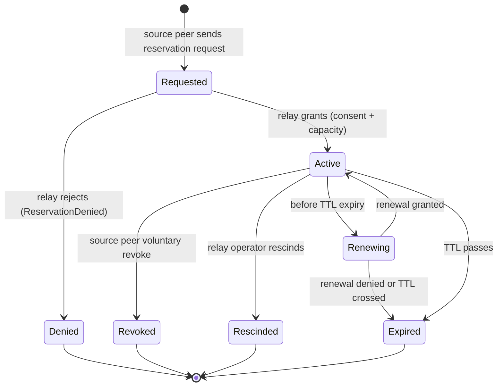
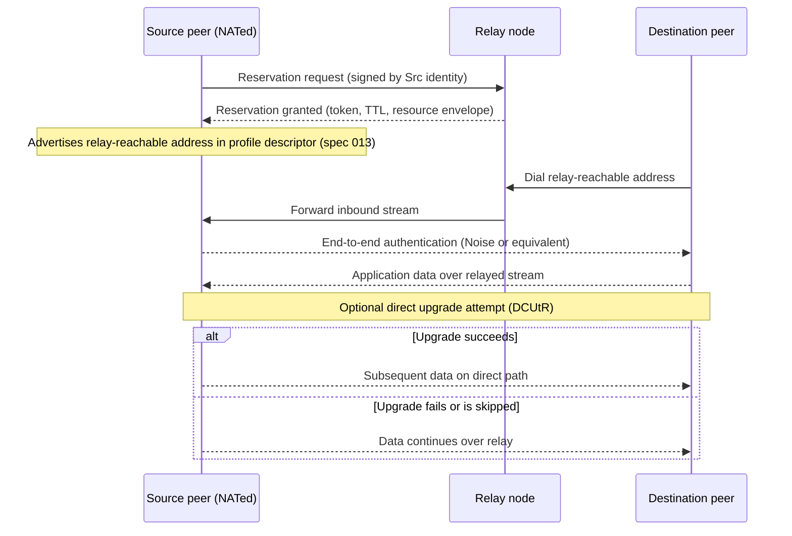
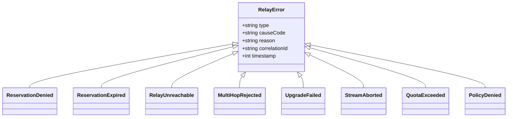

# Feature Specification: Relay and NAT Traversal

**Feature Branch**: `011-relay`
**Created**: 2026-04-24
**Status**: Draft

## Purpose and Scope

### Why this spec exists

Neuron agents are expected to communicate across hostile network topologies. Many agents run behind NAT, firewalls, or other middleboxes that block inbound connections. Without relay-assisted connectivity, two agents that both need to be reachable as responders cannot exchange service data even when both sides have valid identities and agreed-upon commerce terms.

The current corpus pins relay behavior inside spec 009 ("P2P Data Delivery / libp2p binding"): FR-D18 (NAT traversal stack), FR-D20 (Circuit Relay v2 fallback), FR-D21 (DCUtR upgrade), and relay-error references in FR-D29. That framing makes three problems visible:

1. Relay becomes a libp2p-only feature in normative text, which contradicts the transport-agnostic architecture direction set by spec 013 (connectivity profiles).
2. Profile C in 013 ("Any → NATed Peer via Relay") has no standalone spec to reference; its conformance rules end up copy-pasted from 009.
3. Relay-specific concerns — consent, resource accounting, reservation lifecycle, evidence, discovery — are scattered or missing entirely in 009.

This spec introduces a standalone normative definition of relay and NAT traversal as a first-class, transport-profile-aware component. It separates three concerns cleanly: relay semantics (what relay-assisted communication means), relay binding (how a concrete stack such as libp2p Circuit Relay v2 realizes those semantics), and profile relationship (how Profile C consumes relay capabilities). It does this without editing spec 009 and without modifying spec 013 in this run.

Although the spec title names NAT traversal, the normative core defines **relay-assisted** NAT traversal specifically. Hole-punching, STUN, and unilateral DCUtR-style mechanisms are scoped through binding appendices per FR-R-014 and FR-R-022; they are not general obligations of this spec's normative core.

### What this spec governs

- The normative semantics of relay-assisted connectivity: reservation lifecycle, consent, discovery, address advertisement, session establishment.
- The single-hop relay constraint for v1.
- The optional direct-upgrade mechanism (DCUtR-style path promotion).
- Security and abuse controls: consent model, resource accounting, rate limiting, DoS considerations, privacy boundaries, trust model.
- The relay error taxonomy surfaced to initiators and validators.
- The evidence model: what observable signals validators can use to confirm relay use and evaluate upgrade behavior.
- Conformance rules for agents claiming relay support and for relay operators claiming to run a compliant relay node.
- Cross-spec integration points: how Profile C in spec 013 consumes this spec; how spec 009's libp2p binding is recast as one reference binding.

### What this spec does not govern

- The libp2p Circuit Relay v2 protocol itself (an external standard; referenced as a reference binding only).
- The full P2P Data Delivery model (governed by spec 009).
- Profile definitions, profile descriptor schema, or profile-based binding selection (governed by spec 013).
- Wire format, canonical JSON, signing primitives (governed by spec 006).
- Commerce state machine, negotiation sequence, settlement (governed by spec 008).
- On-chain identity registry, agentURI service schema beyond a service-type suggestion (governed by spec 003 and spec 007).
- Browser-to-browser communication (a future connectivity profile; out of scope here).

## Definitions

- **Relay.** A middlebox service that forwards bytes between two peers that could not otherwise connect directly due to network topology constraints. "Relay" is a role, not a specific protocol.
- **Relay node.** A specific deployed instance of a relay. A relay node has an identity (EVMAddress and, in libp2p bindings, PeerID), operator-declared resource limits, and a set of endpoint addresses at which it accepts reservations and stream requests.
- **Source peer.** The peer that needs to be reached through a relay. The source peer is typically NATed or otherwise lacks inbound reachability. The source peer holds a reservation on at least one relay node so the node will accept inbound dials on the source's behalf.
- **Destination peer.** The peer initiating an outbound connection toward the source peer via a relay. The destination peer dials the relay node and asks to be forwarded to the source peer. In this spec, "destination" names the dialing direction at the relay layer; commerce-layer terms (buyer, seller, initiator, responder) are independent.
- **Relayed connection.** A bidirectional stream between source and destination peers whose bytes traverse a relay node. The two end peers authenticate each other after the relay has forwarded the initial handshake; the relay never becomes a trusted party in the end-to-end authentication.
- **Relay reservation.** A time-bounded, cryptographically-authorized slot that the relay node holds for a specific source peer. During the reservation's lifetime, the relay accepts inbound dials from destination peers and forwards them to the source peer. Reservations have a TTL, a resource envelope (bandwidth and stream-count limits), and a termination semantic (expire, revoke, or rescind).
- **Relay discovery.** The mechanism by which a source peer selects one or more candidate relay nodes to hold its reservation. Discovery mechanisms include static configuration, profile descriptor advertisement (spec 013), `agentURI.services[]` publication (spec 003), and binding-specific dynamic discovery such as DHT lookups.
- **Direct upgrade / DCUtR.** After a relayed connection is established, parties may attempt to upgrade to a direct path using coordinated hole-punching or analogous techniques (Direct Connection Upgrade through Relay, or equivalent). Upgrade is optional and best-effort; the original relay path serves until the upgrade succeeds.
- **Single-hop relay.** A relay topology in which exactly one relay node sits between source and destination. This spec v1 mandates single-hop; multi-hop topologies (chained relays) are out of scope.
- **Relay evidence.** Observable signals (reservation-acquired, reservation-expired, stream-opened, upgrade-attempted, error codes) that validators use to confirm relay-assisted communication occurred and assess conformance.
- **Relay binding.** A concrete realization of relay semantics by a specific transport stack (for example, libp2p Circuit Relay v2). Bindings are identified by stable tokens (e.g., `T-Relay` in spec 013's binding registry).

## Clarifications

- Relay binding identifier reused from spec 013's registry: `T-Relay` (Circuit Relay v2 over libp2p is the v1 reference binding). Additional relay bindings land as binding appendices.
- Reservation TTL floor: this spec defines a minimum reservation TTL of 10 minutes (normative floor). Bindings may offer longer TTLs. Rationale: matches the current relay-node deployment profile and leaves room for binding-level tuning.
- Verification tier selection: `topic-observable`. Relay-related observable signals include reservation events (potentially published to HCS for audit), observable network-layer handshakes, and error codes in in-band frames.

### Session 2026-04-24

- Q: Reservation TTL upper bound — should spec 011 impose a maximum TTL (e.g., 1 hour) or leave it binding-specific? → A: The 10-minute minimum in FR-R-003 remains normative. Maximum TTL is binding-specific, but each relay binding descriptor and each operator policy MUST declare its maximum TTL explicitly. Expired reservations MUST remain observable to the source peer regardless of the TTL value chosen.
- Q: Direct-upgrade strength — should the normative core keep MAY while bindings may strengthen to SHOULD, and how should intentional skips be surfaced? → A: The core semantics keep direct upgrade as `MAY` (FR-R-009). Binding appendices MAY strengthen the requirement to `SHOULD` where the underlying stack supports upgrade. When a binding supports upgrade but intentionally skips it for a specific session or deployment, the binding MUST emit an observable reason — either a documented skip-reason in the binding appendix that applies categorically, or a per-session evidence field surfaced on the relayed connection.
- Q: Relay metadata retention ceiling — should 011 mandate a global retention window (e.g., 30 days), or leave retention to operator policy? → A: The core spec does not mandate one global retention ceiling. Relay operators MUST declare their retention policy — maximum retention duration, the fields covered, and whether published to a public audit surface — in a machine-readable form accessible to validators. Implementations MUST distinguish payload content from relay metadata; payload content MUST NOT be logged by compliant relays (FR-R-017). Metadata retention beyond the declared policy is `non-compliant`.

## User Scenarios & Testing *(mandatory)*

### User Story 1 — A NATed peer accepts inbound communication through a relay (Priority: P1)

A peer running behind NAT — a consumer device, an enterprise-networked machine, or a mobile runtime — needs to accept inbound service requests but cannot expose an inbound port. The peer registers a reservation with one or more relay nodes, advertises its relay-reachable address in its profile descriptor (spec 013) or `agentURI.services[]` (spec 003), and waits. A destination peer dials the advertised relay address; the relay node forwards the connection; the two peers complete end-to-end authentication and carry on the commerce flow defined in spec 008.

**Why this priority**: Without this scenario, Profile C in spec 013 has no valid implementation path and any deployment where the responder is NATed — a large fraction of real-world agents — fails. This is the core reason the relay spec exists.

**Independent Test**: Stand up a relay node and a NATed source peer. Have the source peer acquire a reservation, advertise the relay-reachable address, and accept one inbound dial from a destination peer. Success is a bidirectional, authenticated byte stream over the relayed path.

**Acceptance Scenarios**:

1. **Given** a relay node with available capacity and a NATed source peer with a valid identity, **When** the source peer requests a reservation, **Then** the relay node grants a reservation with a declared TTL, a resource envelope, and a reservation token observable by the source peer.
2. **Given** a source peer holding an active reservation and an advertised relay-reachable address, **When** a destination peer dials that address, **Then** the relay forwards the initial handshake bytes, the two peers complete end-to-end authentication, and a bidirectional stream is available for the commerce flow.
3. **Given** a source peer without a valid identity or without capacity at the relay, **When** the reservation request is made, **Then** the relay rejects the request with a typed error (`ReservationDenied`) and the source peer attempts another relay or fails cleanly per its operator policy.

---

### User Story 2 — A destination peer (server or public listener) reaches a NATed peer through a relay (Priority: P2)

A server process or publicly-reachable listener acts as the initiator in a Profile C topology (spec 013). The server loads the source peer's descriptor, observes that the source peer's `nat-traversal = relay-assisted` capability is declared, and finds a `T-Relay` binding in the descriptor's `transports[]`. The server dials the relay node using the binding's address form, gets forwarded to the source peer, completes authentication, and proceeds to the commerce flow.

**Why this priority**: Demonstrates that 011 defines the semantics Profile C consumes without forcing Profile C to re-derive relay behavior. This scenario is the bridge between 013 (profile selection) and 011 (relay semantics).

**Independent Test**: Use the Profile C conformance fixture produced under spec 013 `/speckit.plan`. Load the descriptor from a test harness, dial the declared relay-assisted binding, and observe end-to-end connectivity. Success is a relayed session reachable without any out-of-band hints about the relay node's address.

**Acceptance Scenarios**:

1. **Given** a Profile C descriptor that lists one `T-Relay` binding with a valid relay-reachable multiaddr, **When** a server-runtime buyer loads the descriptor and runs 013's binding-selection rule, **Then** selection matches the `T-Relay` binding and the buyer dials the declared address.
2. **Given** a destination peer that cannot reach the relay node (e.g., network partition), **When** the dial is attempted, **Then** a `RelayUnreachable` error surfaces within the dial-timeout window declared by the relay binding.

---

### User Story 3 — Relay-assisted connection upgrades to a direct path when possible (Priority: P3)

Once a relayed connection is established, the parties attempt a direct upgrade. Each party observes the other's network-layer information visible through the relayed handshake and attempts coordinated hole-punching. If upgrade succeeds, subsequent data flow leaves the relay path. If upgrade fails, the parties continue over the relay; upgrade failure is not a session-terminating event.

**Why this priority**: Direct upgrade is a latency and cost optimization, not a correctness requirement. It matters for production performance but not for baseline connectivity. Implementations may skip upgrade entirely and remain conformant.

**Independent Test**: Run a relayed session in a test environment where hole-punching succeeds (both sides behind cone NAT with visible external ports). Observe that after the direct upgrade event, subsequent bytes flow over the direct path rather than the relay, and that the relay's byte-counter for this session stops increasing.

**Acceptance Scenarios**:

1. **Given** a relayed session between two cone-NATed peers, **When** both peers attempt coordinated hole-punching, **Then** if the direct path establishes, the parties switch data flow to the direct path and the relay session enters a teardown state.
2. **Given** a relayed session where upgrade is attempted and fails (e.g., symmetric NAT), **When** the failure is detected, **Then** the original relay path remains live and an `UpgradeFailed` signal is surfaced as informational (not a fatal error).
3. **Given** a binding or deployment that intentionally skips upgrade, **When** the session runs, **Then** direct-upgrade signals MUST NOT appear; validators observing the session infer that upgrade was intentionally skipped rather than failed.

---

### User Story 4 — Relay failure surfaces deterministically in the error taxonomy (Priority: P2)

When any relay-related failure occurs — reservation denial, reservation expiry, relay unreachability, multi-hop rejection, upgrade failure, stream abort — the initiator and source peer receive a typed error from the defined relay error taxonomy. Errors are deterministic: the same failure condition produces the same error type across runs and bindings.

**Why this priority**: Without deterministic error surfacing, validators cannot distinguish between a misconfigured agent and an external network event. This determinism is a prerequisite for the evidence model.

**Independent Test**: For each error type in the taxonomy, construct a scenario that deterministically triggers it and observe the reported error type. Success is a 1:1 match between triggered condition and reported error type across multiple bindings.

**Acceptance Scenarios**:

1. **Given** a source peer that has exhausted the relay's per-source-peer reservation quota, **When** the source peer requests a reservation, **Then** the relay returns `ReservationDenied` with an observable cause code (e.g., `quota-exceeded`).
2. **Given** a reservation whose TTL has passed, **When** a destination peer attempts to dial the expired relay-reachable address, **Then** the relay returns `ReservationExpired` and the destination peer does not silently fall back.
3. **Given** a destination peer that attempts to dial a chained relay path (two hops), **When** the dial is processed, **Then** the relay returns `MultiHopRejected` (or equivalent single-hop enforcement error) and no circuit is established.

---

### Edge Cases

- Source peer holds reservations at multiple relay nodes simultaneously: accepted; destination peer chooses which advertised relay to dial. Selection strategy is out of scope.
- Reservation renewal fails while a stream is open: the open stream MUST continue serving until explicit close; new inbound dials are rejected after TTL expiry.
- Relay node crashes mid-session: both peers observe a `StreamAborted` error; attempting to rebind through the same dead relay address fails with `RelayUnreachable`.
- Direct upgrade succeeds on one party's view but not the other (split-brain): both parties MUST treat the session as unchanged until bidirectional confirmation; a timed-out asymmetric upgrade reverts to the relay path and surfaces `UpgradeFailed`.
- Source peer is blocked at the relay's admission policy (for example, IP-block or identity-deny): the reservation request returns `ReservationDenied` with cause `policy-denied`; the source peer MUST NOT retry indefinitely without operator-configured backoff.
- Relay receives a multi-hop request (destination already reached via another relay): rejected with `MultiHopRejected`.
- Source peer's identity (EVMAddress and, where applicable, PeerID) is not cryptographically bound to the reservation request: the relay MUST reject the request because reservations are identity-bound.
- A destination peer opens a stream but sends no bytes: the relay MAY apply an idle-timeout; the idle-timeout value is binding-specific.
- A relay session carries payloads larger than the relay's per-reservation data cap: the relay MUST enforce the cap and surface `QuotaExceeded` when the cap is hit; in-flight bytes MAY continue to completion of the current frame.

## Requirements *(mandatory)*

### Functional Requirements

All Functional Requirement identifiers use the `FR-R-*` prefix (R = Relay) to scope per-spec per Constitution "Evidence & Validation" section.

- **FR-R-001** (Relay reservation existence): A source peer that expects inbound relay-assisted communication MUST hold at least one active reservation at a chosen relay node before its relay-reachable address is advertised to any discovery surface.
- **FR-R-002** (Reservation authorization): Reservation requests MUST be authenticated by the source peer's Neuron identity (EVMAddress, and PeerID for libp2p bindings). Relay nodes MUST reject unsigned or impersonated reservation requests with `ReservationDenied`.
- **FR-R-003** (Reservation lifecycle): Reservations MUST have a declared TTL not less than 10 minutes. The maximum TTL is not normatively fixed by this spec; each relay binding appendix AND each relay operator policy MUST declare the maximum TTL the binding or operator will grant. The declared maximum TTL MUST be discoverable alongside the admission policy (FR-R-004) through the mechanism the binding defines for operator policy publication. Source peers MUST renew reservations before TTL expiry if they intend to remain reachable. Relay nodes MUST expire reservations at TTL; expiry MUST be observable by the source peer regardless of the chosen TTL value.
- **FR-R-004** (Relay consent): A relay operator MUST declare an admission policy — unconditional, allowlist-based, quota-based, or policy-based. Relay consent is expressed through this policy at reservation time, not per-connection at dial time. Policy denial MUST surface as `ReservationDenied` with an observable cause code.
- **FR-R-005** (Relay discovery — profile-descriptor mechanism): Relay addresses that a source peer accepts inbound dials at MUST be discoverable through the source peer's profile descriptor (spec 013) via at least one of (a) a `T-Relay` entry in `transports[]`, (b) a `relayNodes[]` field if present, or (c) an equivalent mechanism declared in the relay binding appendix. Additional discovery mechanisms (DHT, registry lookup) are permitted but not required.
- **FR-R-006** (Address advertisement): A source peer's relay-reachable address MUST encode both the relay node's network address and the source peer's identity such that a destination peer can dial without out-of-band coordination. In the libp2p reference binding, this is the standard `/p2p-circuit/` multiaddr form.
- **FR-R-007** (Relayed connection establishment): When a destination peer dials an advertised relay-reachable address, the relay node MUST forward the initial handshake bytes between destination and source. The relay MUST NOT observe, modify, or block payload bytes once the end-to-end authentication is complete. End-to-end authentication between source and destination MUST proceed without trusting the relay.
- **FR-R-008** (Single-hop constraint): A relay node MUST reject dial requests that would create a multi-hop relay path (for example, a dial that itself arrives via another relay). The rejection error is `MultiHopRejected`. This constraint holds for v1 regardless of binding.
- **FR-R-009** (Direct upgrade is optional in the core): In the normative core of this spec, after a relayed connection is established, parties MAY attempt a direct-upgrade coordination. Upgrade is best-effort; failure MUST NOT terminate the relayed session. A binding appendix MAY strengthen the core `MAY` to `SHOULD` for deployments where its stack supports upgrade (for example, libp2p Circuit Relay v2 with DCUtR available). Every skipped upgrade MUST be accompanied by one of: (a) a categorical skip-reason published in the binding appendix that applies to every session on that binding, or (b) a per-session skip-reason emitted via FR-R-012's evidence surface on the relayed connection. Skips that lack both (a) and (b) are non-compliant under this FR.
- **FR-R-010** (Upgrade non-degradation): While a direct-upgrade attempt is in progress, the relayed session MUST remain active. Traffic MUST NOT migrate to a direct path until bidirectional confirmation of the direct path's readiness. Asymmetric or failed upgrades MUST revert cleanly to relayed flow.
- **FR-R-011** (Relay error taxonomy): Relay-specific errors MUST surface as typed errors from the set: `ReservationDenied`, `ReservationExpired`, `RelayUnreachable`, `MultiHopRejected`, `UpgradeFailed`, `StreamAborted`, `QuotaExceeded`, `PolicyDenied`. Each error MUST carry an observable cause code (machine-readable) and a human-readable reason string. New error types MAY be added by binding appendices but MUST NOT silently absorb the semantics of existing types.
- **FR-R-012** (Relay evidence emission): Source peers SHOULD emit relay-session metadata — reservation acquisition, reservation expiry, stream opened, upgrade attempted, upgrade succeeded or failed, session closed — to an audit surface consumable by validators per spec 010. Emission MAY use HCS (spec 004) when the agent's profile permits client-publish audit trail, or in-band frames when the profile's audit trail is server-proxied.
- **FR-R-013** (Profile descriptor integration): Agents claiming Profile C support under spec 013 MUST include the relay binding (`T-Relay` or equivalent) in the descriptor's `transports[]` and MUST declare `nat-traversal = relay-assisted` in the descriptor's `capabilities`. Agents MUST NOT declare Profile C support without advertising at least one valid relay-reachable address via this spec's discovery mechanisms.
- **FR-R-014** (Binding-specific appendix): Concrete relay stacks (libp2p Circuit Relay v2, TURN, future alternatives) are defined in per-binding appendices. A binding appendix MUST declare: the address serialization form, the reservation-protocol mechanism, the direct-upgrade mechanism (if any), the observable error-to-taxonomy mapping, and any binding-specific resource limits. The normative core of this spec MUST NOT mandate one relay technology.
- **FR-R-015** (Resource accounting at the relay): Relay nodes MUST track per-reservation resource usage — at minimum, cumulative forwarded-bytes and concurrent-stream count — and MUST enforce declared per-reservation limits. When limits are reached, the relay MUST surface `QuotaExceeded` and MUST NOT silently drop bytes.
- **FR-R-016** (Rate limiting): Relay nodes MUST support per-source-peer rate limiting for reservation requests to prevent reservation-flood denial-of-service. The rate limit mechanism is binding-specific; the fact that a limit is enforced MUST be observable in the error taxonomy when limits are hit.
- **FR-R-017** (Privacy boundary and retention): A relay node MUST NOT log or transmit payload bytes beyond the forwarding operation itself. Implementations MUST distinguish payload content from relay metadata; this distinction MUST be reflected in the relay's logging and storage layers so that a validator can observe the separation. Permitted metadata (source peer identity, destination peer identity, reservation timing, byte-count totals, error events) is the basis of the evidence model. Relay operators MUST declare their metadata retention policy — maximum retention duration, the fields covered, and whether any portion is published to a public audit surface — in a machine-readable form accessible to validators (for example, alongside the admission policy published per FR-R-004). The core spec does not mandate one global retention ceiling; retention beyond the declared policy is `non-compliant`. Payload content MUST NOT be retained under any declared policy.
- **FR-R-018** (Trust boundary): Neither the source peer nor the destination peer MUST extend any trust to the relay node regarding the confidentiality or integrity of the end-to-end stream. End-to-end authentication (Noise handshake in libp2p bindings; equivalent in other bindings) MUST complete before any application-layer data is exchanged. A relay that injects, modifies, or replays bytes MUST be detected by the end-to-end authentication failure and reported as `StreamAborted` with cause `integrity-failure`.
- **FR-R-019** (Reservation revocation): A source peer MUST be able to voluntarily revoke its own reservation before TTL. A relay node MAY rescind a reservation for policy reasons; rescission MUST surface to the source peer as an observable event analogous to TTL expiry.
- **FR-R-020** (Conformance claim structure): An agent claiming support for this spec MUST declare its role — source peer, destination peer, or relay node — and MUST satisfy the subset of FRs pertinent to that role. Relay-node-only agents MUST satisfy FR-R-003, FR-R-004, FR-R-007, FR-R-008, FR-R-011, FR-R-015, FR-R-016, FR-R-017, FR-R-021. Source-peer and destination-peer agents MUST satisfy the FRs relating to their participation.
- **FR-R-021** (Operator-policy declaration): Relay operators MUST publish a machine-readable operator-policy document (same discovery surface as reservation admission policy per FR-R-004) that includes at minimum: admission policy kind (unconditional / allowlist / quota-based / policy-based), maximum reservation TTL, per-reservation resource limits (byte cap, concurrent-stream cap), per-source-peer reservation count cap, metadata retention policy (duration, fields covered, public-audit surfaces if any), and the binding token(s) the relay implements. This document is the single source of truth validators consume to evaluate FR-R-003, FR-R-004, FR-R-015, FR-R-016, and FR-R-017.
- **FR-R-022** (Binding-level upgrade disclosure): Every binding appendix that implements this spec MUST declare, in a dedicated section of the appendix, whether it attempts direct upgrade, and if so under what conditions, and if not, the categorical skip-reason. When a binding supports upgrade and a specific deployment chooses to skip it per-session, the deployment MUST emit a per-session skip-reason evidence field (observable via FR-R-012's emission surface). This requirement operationalizes the "no silent skips" principle added in FR-R-009.

### Key Entities

- **Relay**: the abstract role of forwarding bytes between two peers that cannot connect directly. Not a specific implementation.
- **RelayNode**: a deployed instance of a relay. Attributes: operator identity (EVMAddress, optional PeerID), declared endpoint addresses, admission policy, resource limits (per-reservation and per-source-peer), observed error-code mapping.
- **SourcePeer**: the NATed party holding at least one reservation. Attributes: Neuron identity, active reservation set, advertised relay-reachable address(es), renewal schedule.
- **DestinationPeer**: the dialing party. Attributes: Neuron identity, selected relay-reachable address (the one chosen per 013 binding-selection rule), optional direct-upgrade capability.
- **Reservation**: a time-bounded slot. Attributes: reservation token, TTL, issued-at timestamp, expiry timestamp, resource envelope (byte cap, stream cap), termination state (active, expired, revoked, rescinded).
- **RelayedConnection**: the bidirectional session path source ↔ relay ↔ destination. Attributes: end-to-end authenticated identity pair, start timestamp, observable byte counters at the relay, current upgrade state (none, in-progress, succeeded, failed).
- **DirectUpgradeAttempt**: the coordinated hole-punching effort. Attributes: initiated timestamp, binding-specific mechanism name (DCUtR or other), outcome (succeeded / failed / timed-out / skipped).
- **RelayBinding**: identifier for a concrete relay technology. Attributes: token (e.g., `T-Relay`), binding-appendix URI, declared-capabilities vector, reference-binding flag.
- **RelayError**: a typed error. Attributes: type (from FR-R-011 enum), cause code, reason string, correlation id, timestamp.

## Security and Abuse Controls *(normative)*

### Relay Consent

A relay node MUST declare an admission policy. Policies MAY be:

- **Unconditional**: any Neuron-authenticated identity can hold a reservation.
- **Allowlist**: only identities on an operator-maintained allowlist can hold a reservation.
- **Quota-based**: any Neuron-authenticated identity can hold a reservation subject to per-identity quotas.
- **Policy-based**: operator-defined logic, potentially informed by external reputation sources.

Consent is expressed at reservation time. Once a reservation is granted, the relay node is committed to forwarding traffic under that reservation until TTL, quota exhaustion, or rescission. Consent is not re-negotiated per inbound dial.

### Resource Accounting

Relay nodes MUST enforce:

- A per-reservation byte cap (cumulative forwarded bytes).
- A per-reservation concurrent-stream cap.
- A per-reservation duration cap (enforced via TTL).
- A per-source-peer total reservation count (prevents one identity from holding all capacity).

Enforcement MUST surface as typed errors (`QuotaExceeded`) rather than silent drops. Resource metrics are part of the evidence model (see below) and MAY be published to an operator observability surface.

### Rate Limiting

Relay nodes MUST rate-limit reservation requests per source peer identity. The rate-limit value is binding-specific; the enforcement is not. An identity that submits reservation requests above the rate limit MUST receive `PolicyDenied` with cause `rate-limited`.

Rate limiting on relayed data flow (per-stream throughput) is permitted but not mandated by this spec; bindings MAY declare their own throughput policies.

### Denial-of-Service Considerations

Relay nodes are attractive DoS amplification targets. Mitigations required by this spec:

- Reservation requests MUST carry a proof-of-identity (Neuron signature) so that unsigned flood traffic is rejected cheaply.
- Per-source-peer reservation quotas prevent a single identity from exhausting capacity.
- Per-reservation byte caps prevent a granted reservation from becoming an unbounded bandwidth tax.
- Multi-hop rejection (FR-R-008) prevents relay chaining as an amplification vector.

Bindings SHOULD declare additional binding-specific DoS mitigations (for example, QUIC-layer rate limits, TCP-layer connection limits).

### Privacy Constraints

- A relay node MUST NOT log or emit payload bytes (FR-R-017).
- Metadata that a relay node MAY log: source peer identity, destination peer identity, reservation timestamps, byte-count totals, error events. Logging is local to the operator unless the operator elects to publish it to an observability surface.
- When an operator publishes relay metadata to a public audit surface (e.g., HCS), the operator MUST document the retention window and the mapping from identity to operator-side records.

### Trust Boundaries

- End peers MUST NOT assume the relay is honest regarding byte integrity, confidentiality, or timing.
- End-to-end authentication MUST complete before application-layer data flows (FR-R-018).
- A malicious or compromised relay that injects, modifies, or replays bytes MUST fail the end-to-end authentication and MUST surface as a `StreamAborted` error with cause `integrity-failure`.
- Relay operators MAY publish reputation evidence to spec 010's validation registry; consumers MAY weight relay selection by reputation. This is a discovery-layer concern, not a trust-relaxation for the end-to-end protocol.

## Evidence & Validation *(mandatory)*

### Verification Tier

`topic-observable`. Relay-session evidence is a combination of (a) publishable audit envelopes from end peers, (b) network-layer connection signals observable at the peers and the relay, and (c) typed error codes surfaced on session boundaries. Validators do not need relay-operator internal access to reach a verdict.

### Observable Signals

- **Reservation-acquired event**: source peer's audit surface carries a reservation record (reservation token identifier, relay node identity, TTL, resource envelope) at the moment a reservation is granted. In the libp2p reference binding, the source peer receives this as part of the Circuit Relay v2 reservation response.
- **Relay-reachable address advertisement**: source peer's profile descriptor (spec 013) lists the `T-Relay` binding and the relay-reachable address. Validators retrieving the descriptor observe this directly.
- **Dial attempt and forward**: destination peer's connection log captures (a) the dial target (the relay-reachable address), (b) the first packet timestamps, and (c) the end-to-end authentication completion. A relay node that forwarded the dial can independently attest to the forward in its own logs.
- **Upgrade-attempted event**: when a binding supports direct upgrade, the attempt is observable on both peers as a secondary handshake. Success migrates byte flow off the relay; the relay's byte counter for that session stops increasing.
- **Error events**: every relay-specific error in FR-R-011 carries a cause code and reason. Both peers and the relay MAY record the event; validators SHOULD cross-check across sources when possible.
- **Reservation-expired event**: source peer observes TTL expiry locally; relay node observes expiry as a forced-close on the reservation slot.

### Evidence Rules

These are suggested interpretations per Constitution Principle XI. Validators MAY reach equivalent conclusions through alternative methods.

- **VR-R-01**: A retrievable reservation record with a valid relay-node signature and a TTL that has not yet passed suggests `compliant` for FR-R-001 and FR-R-003.
- **VR-R-02**: A `T-Relay` binding appears in the source peer's descriptor and the declared relay-reachable address resolves to a relay node that can be reached independently by the validator — suggests `compliant` for FR-R-005, FR-R-006.
- **VR-R-03**: A destination peer's connection log shows a dial to the declared relay-reachable address, followed by end-to-end authentication with the source peer's identity, suggests `compliant` for FR-R-007.
- **VR-R-04**: A dial attempt that results in a typed error not drawn from FR-R-011's taxonomy suggests `non-compliant` for FR-R-011 because the error surface has escaped the spec's taxonomy.
- **VR-R-05**: A session whose byte counter at the relay continues to grow after an observed direct-upgrade-succeeded event suggests `non-compliant` for FR-R-010 because traffic should have migrated off the relay.
- **VR-R-06**: A relay node that accepts a multi-hop dial request without surfacing `MultiHopRejected` suggests `non-compliant` for FR-R-008.
- **VR-R-07**: A relayed session that carries payload bytes before an end-to-end authentication completes suggests `non-compliant` for FR-R-018 (trust-boundary violation).
- **VR-R-08**: A source peer that advertises a relay-reachable address whose reservation has already expired suggests `non-compliant` for FR-R-001 (address advertised without active reservation).
- **VR-R-09**: When a binding appendix declares categorically that it does not attempt direct upgrade (a blanket skip-reason per FR-R-022), absence of upgrade events in sessions on that binding is `compliant`. Presence of upgrade events in a categorically-skipping binding suggests `non-compliant` for FR-R-022 (contradiction between declared behavior and observed behavior).
- **VR-R-10**: When a binding supports direct upgrade but a specific session observably skips it without emitting a per-session skip-reason evidence field, the session suggests `non-compliant` for FR-R-009 (undocumented silent skip). When a per-session skip-reason is emitted, the session is `compliant` regardless of whether upgrade was attempted.
- **VR-R-11**: A retrievable, machine-readable operator-policy document at the relay node's declared endpoint that covers the minimum fields listed in FR-R-021 suggests `compliant` for FR-R-003 (maximum TTL declared), FR-R-004 (admission policy declared), FR-R-015 (resource limits declared), and FR-R-017 (retention policy declared). Absence of any of those fields suggests `non-compliant` for the corresponding FR.
- **VR-R-12**: Observable metadata retention beyond the duration declared in the relay's operator-policy document suggests `non-compliant` for FR-R-017.
- **VR-R-13**: Any observable relay log that contains payload bytes (as distinct from forwarded-byte counts) suggests `non-compliant` for FR-R-017 regardless of the retention window.

### Non-Observable Areas

- Internal admission-policy logic at the relay node (why a specific policy-denied decision happened) is not observable; only the typed error and its cause code are.
- Internal byte-accounting mechanisms at the relay are not directly auditable by end peers; validators rely on end-peer logs and any operator-published metadata.
- Coordinated hole-punching details inside the direct-upgrade attempt (timing, parallel attempts, NAT-binding choice) are binding-internal. Validators observe success or failure, not the procedure.
- Privacy of payload contents is a transport-encryption property; validators confirm the transport's authentication signature, not the payload itself.

**Behavioral Inference Recipes**:

- If the relay's byte counter for a session plateaus shortly after a visible hole-punch attempt, infer that direct upgrade succeeded even if the success event was not independently published.
- If a source peer's descriptor shows `T-Relay` bindings but no destination peer reaches the source in a measurement window, infer either a reservation-expiry issue (check VR-R-08) or a relay-reachability issue (check VR-R-03), not a protocol-level non-compliance.
- If both peers record `StreamAborted` with cause `integrity-failure` at the same wall-clock moment, infer a malicious or buggy relay and raise operator-level alerts in addition to the protocol-level non-compliance verdict.

### Suggested Evidence Recipes

1. Retrieve the source peer's profile descriptor (spec 013) and enumerate `T-Relay` bindings.
2. For each `T-Relay` binding, retrieve the relay node's operator-declared reservation and admission policy metadata (via a well-known path at the relay node or via spec 003 services).
3. Initiate a test dial from a controlled destination peer to the declared relay-reachable address; record dial timestamps, forward behavior, and end-to-end authentication outcome.
4. Observe the relay's byte counters (where published) and any upgrade events during the session.
5. Trigger each error type in FR-R-011 in a controlled scenario (expired reservation, multi-hop attempt, quota exhaustion) and record the surfaced error code.
6. Publish an evidence envelope per spec 010 with the observations, the verdict, and a reference to the FRs assessed.

## Cross-Spec Relationships *(normative)*

- **Spec 003 (Peer Registry)**: `agentURI.services[]` MAY include a `neuron-relay-node` service type identifying a relay node, and MAY include a `relayAddresses[]` field on a peer's `neuron-p2p-exchange` service entry declaring relay-reachable addresses. Formal adoption of these service types is a later 003 amendment; this spec documents the suggested shape only.
- **Spec 004 (Topic System)**: when a profile's `audit-trail` permits client-publish, relay-session metadata (reservation events, error events, upgrade events) MAY be published to the agent's stdOut topic. The envelope is a standard TopicMessage per spec 004; no new message type is introduced.
- **Spec 005 (Health)**: relay nodes MAY emit heartbeats per spec 005 to declare liveness. Source peers that rely on a specific relay SHOULD observe that relay's heartbeat before trusting its reservation long-term. Note: in spec 005, `stdOut` is a channel role, not a transport binding. Under Profile D the stdOut channel rides the HCS TopicAdapter (spec 004); under Profile A the stdOut channel rides the in-stream control plane (spec 013). Both forms satisfy spec 005 FR-H22 without amendment.
- **Spec 006 (Protocol Determinism)**: relay-specific error codes and evidence records use the canonical JSON and signing primitives defined in 006. New error types added by binding appendices MUST follow the same canonicalization rules.
- **Spec 008 (Payment)**: commerce state machine is unchanged by this spec. `delivery.mode` values in payment messages remain as defined in 008. When the connection underlying a payment-defined delivery is relay-assisted, no payment-layer change is required; relay presence is transparent to 008.
- **Spec 009 (P2P Data Delivery)**: this spec does not replace 009. 009 remains the authoritative libp2p delivery binding; libp2p Circuit Relay v2 is the reference binding for this spec. Per FR-R-014, concrete relay stacks live in per-binding appendices. A future additive amendment to 009 may move or cross-reference 009's FR-D18, FR-D20, FR-D21 into this spec's binding appendix; that edit is out of scope here.
- **Spec 010 (Validation Framework)**: evidence envelopes use 010's envelope model. VR-R-* rules above follow 010's three-outcome verdict convention (compliant / non-compliant / inconclusive).
- **Spec 012 (Browser Client Profile)**: not modified by this spec. Profile A in 013 (which 012 backs) does not include a relay-reachable binding in v1. A future browser-to-browser or browser-to-NATed profile would consume this spec; that is out of scope here.
- **Spec 013 (Connectivity Profiles)**: Profile C in 013 consumes this spec. Per 013's FR-CP-005, relay-behavior FRs live in this spec (011), not in 013. Per 013's FR-CP-017, 013 does not block on 011; this spec fills in the forward-references that 013 currently carries.

## Related specs

- **Specs in this repo**: 001 (NeuronAccount), 002 (Key Library), 003 (Peer Registry), 004 (Topic System), 005 (Health), 006 (Protocol Determinism), 007 (Identity Contract), 008 (Payment), 009 (P2P Data Delivery), 010 (Validation Framework), 012 (Browser Client Profile), 013 (Connectivity Profiles).
- **External standards**: libp2p Circuit Relay v2 specification (the v1 reference binding for this spec); DCUtR (Direct Connection Upgrade through Relay) specification; EIP-8004 (Agent Identity Registry — for the `neuron-relay-node` service type suggestion); Constitution v1.6.0 of this repository.

## Non-Goals *(normative)*

This spec does not do any of the following:

- Mandate one relay technology as the globally normative implementation. Concrete stacks live in binding appendices per FR-R-014.
- Replace spec 009. Spec 009 remains the libp2p delivery binding; libp2p Circuit Relay v2 is one reference binding for 011.
- Require every profile to support relay. Only profiles that opt in via their capability vector (for example, Profile C in spec 013) are affected.
- Change wire format, canonical JSON, signing primitives, or commerce state machine (governed by specs 006 and 008).
- Implement browser-to-browser communication. That is a future connectivity profile, tracked for later speckit work.
- Define multi-hop relay topology. v1 is strictly single-hop per FR-R-008.
- Modify spec 009 or spec 013 in this run. Both cross-reference this spec from their current forms.

## Hedera Adherence *(informative)*

This spec introduces no chain-specific requirements. Relay-session evidence, when published to an audit surface, MAY be carried on HCS per spec 004's reference TopicAdapter. Other TopicAdapter bindings are permitted. Heartbeats from relay nodes MAY be published on HCS per spec 005, consistent with Constitution Principle VIII. No new chain-dependent requirement is introduced.

## Success Criteria *(mandatory)*

### Measurable Outcomes

- **SC-R-001** (Relay-assisted connection establishment): A destination peer can establish an authenticated, bidirectional stream to a NATed source peer through a relay node within 10 seconds of initiating the dial under typical cooperating-NAT network conditions. Verified by an end-to-end test using the reference binding.
- **SC-R-002** (Error-taxonomy coverage): All eight relay-specific error types in FR-R-011 surface to the initiator with their declared cause code within 3 seconds of the triggering condition. Verified by a targeted test matrix that provokes each error type.
- **SC-R-003** (Evidence reconstruction fidelity): A validator following the Suggested Evidence Recipes can reconstruct at least 95% of the relay-session metadata (reservation lifecycle, stream timing, error events, upgrade outcome) for a representative sample of 20 sessions without relay-operator internal access. Verified by an offline evidence-reconstruction audit.
- **SC-R-004** (Direct-upgrade observability): In bindings that support direct upgrade, successful upgrades are observable as a drop-off in the relay's byte counter within 5 seconds of the upgrade event; intentionally-skipped upgrades are absent of upgrade signals. Verified by the reference binding's test harness.
- **SC-R-005** (Profile C conformance integration): Profile C descriptors under spec 013 reference this spec (011) without ambiguity. A conformance fixture for Profile C validates against this spec's FRs with zero unresolved cross-references. Verified during spec 013 `/speckit.plan`.
- **SC-R-006** (Single-hop enforcement): Zero multi-hop relay chains are accepted by a conformant relay node across the full conformance test vector set. Verified by a test suite that attempts multi-hop patterns across bindings.
- **SC-R-007** (Resource-limit enforcement): Across 100 back-to-back reservation requests from a single source peer identity under a deliberately tight quota, the relay rejects beyond-quota requests with `QuotaExceeded` and grants in-quota requests with reservations. Verified by an abuse-simulation test.
- **SC-R-008** (Operator-policy discoverability): For every conformant relay node, a validator can retrieve a single operator-policy document that declares the admission policy, maximum TTL, resource limits, per-source-peer reservation caps, and metadata retention policy. Retrieval succeeds in under 5 seconds and parses into a machine-readable shape that covers 100% of the fields required by FR-R-021. Verified by a conformance fixture for each binding.
- **SC-R-009** (Upgrade-skip observability): In bindings that support direct upgrade, zero sessions produce an observable skip without either a categorical skip-reason in the binding appendix or a per-session skip-reason evidence field. Verified by an audit of a representative session sample.
- **SC-R-010** (Payload-metadata separation): Across a representative sample of 20 relayed sessions and their operator-published metadata, zero payload-content bytes appear in any retained log or audit surface. Verified by differential comparison between observed application payloads and operator-published metadata.

## Reference Binding *(informative)*

This section documents the v1 reference binding and is non-normative. A conforming implementation MAY adopt a different relay stack provided it satisfies the normative FRs and declares its choices in a binding appendix per FR-R-014.

### libp2p Circuit Relay v2

The reference binding uses libp2p's Circuit Relay v2 protocol. Key binding-level points:

- Reservation protocol: the libp2p v2 reservation message, signed by the source peer's libp2p key (derived from the Neuron secp256k1 key per spec 002).
- Address serialization: `/p2p-circuit/` multiaddr form, e.g., `/dns4/relay.example.com/udp/443/quic-v1/p2p/<RELAY-PEERID>/p2p-circuit/p2p/<SOURCE-PEERID>`.
- Default TTL: 15 minutes, renewable.
- Default per-reservation byte cap: 100 KB of relayed data before upgrade is expected; after 100 KB the relay drops with `QuotaExceeded` if upgrade has not occurred.
- Error mapping:
  - libp2p `RESERVATION_REFUSED` → `ReservationDenied` (cause depends on refusal reason).
  - libp2p reservation-expiry → `ReservationExpired`.
  - libp2p circuit dial to unreachable target → `RelayUnreachable`.
  - libp2p multi-hop circuit request → `MultiHopRejected`.
  - libp2p DCUtR upgrade failure → `UpgradeFailed`.
  - libp2p stream reset (relay or peer) → `StreamAborted`.
  - libp2p per-source quota hit → `QuotaExceeded`.
  - libp2p policy-deny (allowlist miss, rate limit) → `PolicyDenied`.

### AutoRelay

Source peers in the libp2p reference binding use the `AutoRelay` service to discover and hold reservations with candidate relay nodes. AutoRelay's reservation-acquisition workflow maps to FR-R-001 and FR-R-003. AutoRelay is not required; a source peer MAY hold reservations via manual configuration.

### DCUtR (Direct Connection Upgrade through Relay)

DCUtR is the reference direct-upgrade mechanism. DCUtR uses coordinated hole-punching based on observed network-layer addresses. Binding-specific upgrade semantics follow libp2p's DCUtR specification. Implementations MAY skip DCUtR entirely and remain conformant (FR-R-009).

### Current Implementation Reference

The repository's current working reference implementation is `impl/golang/cmd/relay-node/` with `impl/golang/cmd/delivery-demo/ --relay <multiaddr>` as the exercising client. These are implementation artifacts, not normative documents.

## Out of Scope

- Implementation code changes in `impl/golang/` or `impl/typescript/`.
- Edits to spec 009 or spec 013. Cross-spec amendments happen in a later phase.
- Definition of additional relay bindings (TURN, custom operator relays). Those can land as additive binding appendices after this spec ratifies.
- Multi-hop relay topology. Reserved for a future major amendment.
- Browser-initiated relay-assisted connections. Reserved for a future connectivity-profile amendment under 013. (Note: the previously-mentioned "spec 014" for fan-out is explicitly DEPRECATED as a core spec per Constitution Principle XII v1.7.0; fan-out lives in DApp specs.)
- Relay reputation or incentive layers. Separate concerns, potentially folded into a future spec on relay economics.

## Assumptions

- Source peers hold a Neuron identity (EVMAddress; PeerID in libp2p bindings) per specs 001 and 002.
- Relay nodes hold a Neuron identity and are discoverable per spec 003 (or via static configuration at the source peer).
- The wire format for reservation events and error records follows spec 006's canonical JSON + signing primitives.
- Spec 013's `T-Relay` binding token is the canonical identifier for the libp2p reference binding. Other bindings select their own token and register it in 013's binding registry through a future additive amendment.
- Operators deploying relay nodes configure their admission policy and resource limits before accepting reservations; misconfigured relays MUST still surface typed errors per FR-R-011, not silent failures.
- The current `relay-node` implementation uses the default TTL of 15 minutes and the default per-reservation byte cap of 100 KB matching libp2p Circuit Relay v2 defaults; these defaults satisfy the normative minimum TTL of 10 minutes in FR-R-003.

## Appendix — Mermaid Diagrams

### Reservation lifecycle

### Relayed connection establishment

### Error taxonomy (class diagram)

