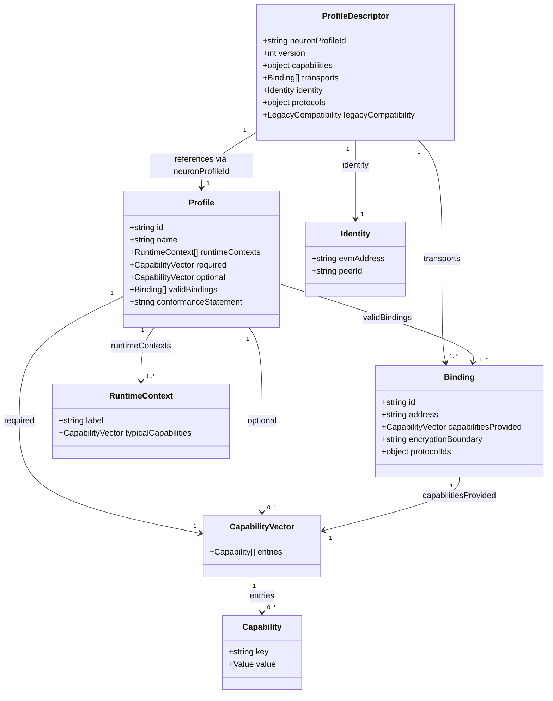
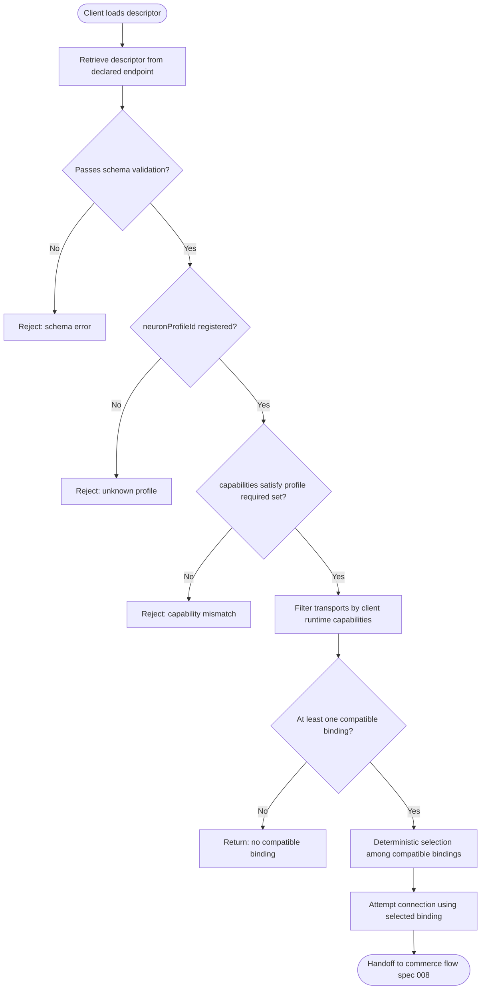
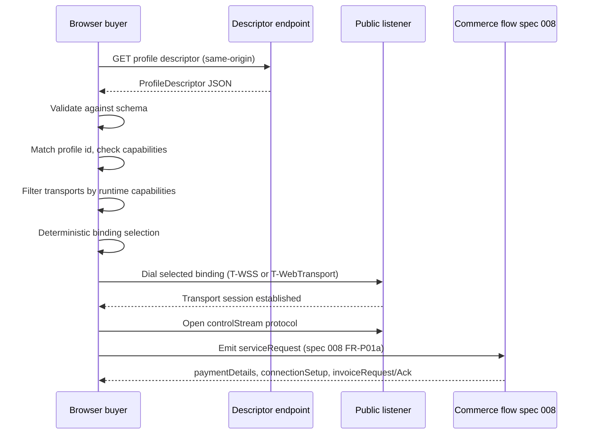

# Feature Specification: Transport-Agnostic Connectivity Profiles

**Feature Branch**: `013-connectivity-profiles`
**Created**: 2026-04-24
**Status**: Draft

## Purpose and Scope

### Why this spec exists

The Neuron SDK specification corpus currently binds protocol behavior to specific transports inside normative requirements. Libp2p, Hedera Consensus Service, QUIC, WebRTC, and WebSocket names appear in MUST-level FRs across specs 001, 002, 003, 004, 005, 008, 009, and 012. Spec 012 ("browser client profile") bundles four orthogonal decisions — identity lifetime, transport choice, audit trail, and settlement venue — into a single versioned artifact; v2a repeats the bundle for WebTransport, and v2b/v2c/v3 continue the pattern. No spec defines what a "profile" is, what capabilities a profile declares, or how transport bindings attach to a profile.

This spec introduces a cross-cutting layer that separates three concerns:

1. Core protocol semantics (wire format, signing, commerce state machine, identity) remain unchanged in specs 001–010 and 012.
2. Transport capabilities are named and typed so that what a deployment needs from its network substrate can be declared independently of any concrete transport.
3. Connectivity profiles name deployment/runtime shapes by combining a runtime context, a required capability set, and a set of valid transport bindings.

The result is that new profiles can be defined by additive amendment to this single spec without editing core specs, and existing working demos (delivery-demo, buyer-seller-demo, browser-demo WSS, browser-demo-wt WebTransport, relay-node) map cleanly to profile + binding instances without any code change.

### What this spec governs

- The definition of a connectivity profile as a normative artifact.
- The capability vocabulary that profiles and bindings both reference.
- The structure of the profile descriptor document that agents publish to declare support.
- The three initial normative profiles: A (Browser → Public Listener), C (Any → NATed Peer via Relay), D (Peer ↔ Peer Direct).
- The rules for adding future profiles without amending core specs.
- Conformance evidence for claiming profile support.

### What this spec does not govern

- Wire format, canonical serialization, signing algorithms, or test vectors (governed by 006).
- Commerce state machine, negotiation sequence, or settlement semantics as protocol behavior (governed by 008).
- Libp2p delivery semantics — stream framing, DeliveryAdapter interface, or ECIES profile (governed by 009).
- Relay semantics, consent model, or resource accounting (to be governed by spec 011 once extracted from 009).
- On-chain registration, agentURI schema details, or reputation/validation registry behavior (governed by 003 and 007).
- Identity derivation, key formats, or signature primitives (governed by 001 and 002).
- TopicAdapter backend semantics — HCS, Kafka, erc-log (governed by 004).

## Definitions

- **Connectivity profile.** A normative specification of a deployment/runtime shape that names (a) the runtime contexts for each participating party, (b) the required capability vector, (c) the set of valid transport bindings, (d) known constraints and failure modes, (e) the conformance rule for an agent claiming to support the profile.
- **Transport binding.** A concrete realization of how bytes move between parties for a given profile. Examples include `T-WSS`, `T-WebTransport`, `T-QUIC`, `T-TCP-Noise`, `T-Relay`. Each binding declares which capabilities it provides and with what values.
- **Capability.** A typed property describing either what a profile needs (required or optional) or what a binding provides. Capability keys and allowed values are defined in "Capability Vocabulary" below.
- **Capability vector.** The complete set of capability key/value tuples attached to a profile (as required or optional) or to a binding (as provided).
- **Profile descriptor.** A machine-readable JSON document an agent publishes to declare which profiles it supports, which bindings satisfy each profile, and what capability values those bindings provide.
- **Runtime context.** The descriptive execution environment for one party in a profile — browser tab, server process, constrained device. Expressed as a label, not a language or framework.
- **Profile conformance.** An agent supports profile X via binding Y if and only if (a) the binding declares every capability that the profile marks required, (b) each declared value falls within the profile's allowed set for that capability, (c) the agent has a functional endpoint reachable at the binding's declared address.

## Clarifications

- Diagram type selection: this spec uses `classDiagram` for the entity model, `flowchart` for the descriptor-load decision procedure, and `sequenceDiagram` for the browser-buyer interaction. Choice made per Constitution "Mermaid diagrams in specs" because the spec defines a static entity model, a decision procedure, and an interaction across parties.
- Verification tier selection: `topic-observable`. Profile descriptors are publicly retrievable documents (same-origin HTTPS for browser-facing; announced via `agentURI.services[]` for on-chain-discoverable agents), and compliance can be assessed from descriptor content plus observable connection behavior.

### Session 2026-04-24

- Q: Profile A scope — collapse 012 v1/v2a/v2b/v2c into one profile with capability variants, or split? → A: Collapse into one Profile A. `audit-trail` and `identity-lifetime` are the distinguishing capability dimensions; transport choice (`T-WSS` vs `T-WebTransport`) is a binding choice within the same profile id `a-browser-to-public-listener/1`.
- Q: Capability vocabulary versioning — closed by key in v1, or open to new keys in a minor version? → A: Closed by key in v1. Adding a new enumerated value within an existing key is a minor-version amendment; adding a new capability key, removing a key, or changing a key's semantics is a major-version amendment.
- Q: Profile descriptor rollout — replace `bootstrap.json` / `bootstrap-wt.json` in place, or serve the new descriptor at a separate endpoint while legacy shapes persist? → A: Separate endpoint. The new profile descriptor is served at the well-known path `/.well-known/neuron-profile.json` (IETF RFC 8615 convention); legacy `bootstrap.json` and `bootstrap-wt.json` remain at their existing paths for at least the N+2 release window. Rollout is additive and non-breaking.
- Q: Spec 011 (relay) extraction sequencing — does 013 ship first with forward-references to 011, or does 011 land first? → A: 013 ships first. Profile C's relay-binding details carry forward-references to spec 011; 013 ratification does not block on 011's creation. 011 lands in a separate `/speckit.specify` run.
- Q: Profile B status — retain as a separate profile, or collapse into Profile A? → A: No Profile B is defined in v1. Browser → public peer is operationally indistinguishable from Browser → public server at the protocol level; both shapes are served by Profile A. Future divergence, if any, will be a major amendment that registers a new profile id.

### Session 2026-05-08

- Q: Spec 009 FR-D15 currently conflates connection-establishment direction (who dials) with stream-init direction (who opens the libp2p stream). Profile E descriptors today implicitly assume seller-dials AND seller-initiates-stream; that's no longer the only valid shape. Should 013 add a new capability key to express stream-init direction independently of connection direction? → A: Yes. Adding a new capability key `stream-init-direction` ∈ `{seller, buyer, either}`. Default for new profiles is `either`. Profile E pins `seller` for back-compat with the existing JV-box edge-seller flow. **Per FR-CP-003 this is a major-version amendment** (capability key addition). Bumping spec 013 internal version from v1 → v2; descriptor schema version from `1` → `2`. Legacy `1`-versioned descriptors continue to be accepted (they implicitly default `stream-init-direction` to `seller` to preserve pre-2026-05-08 behavior).
- Q: With fan-out and admission policy explicitly designated as DApp-land per Constitution Principle XII, do any 013 profiles need amendment to reference DApp specs? → A: No. 013 profiles are transport profiles, not application profiles. The forthcoming application-layer specs (016 ADS-B, 017 Remote ID) will *consume* profiles A/C/D/E as their underlying connectivity shape; 013 does not need to know about the DApp specs and MUST NOT reference them. Per Constitution Principle XII, layer separation prevents 013 from absorbing application semantics.

## User Scenarios & Testing *(mandatory)*

### User Story 1 — SDK author declares supported profiles for a deployment (Priority: P1)

An SDK integrator running a seller agent needs to advertise which connectivity profiles their service supports and which transport bindings satisfy each profile, so browser buyers and peer buyers can discover compatible paths before attempting a connection. Without profile declaration, clients must hard-code transport choice per deployment and break whenever the seller's transport set changes.

**Why this priority**: Descriptor authoring is the gateway capability. Without it, profile-based selection is impossible on the client side, and every other user story is blocked.

**Independent Test**: Generate a profile descriptor file by hand (or via a script) declaring one profile with one binding, and run a descriptor validator against it. Success is the validator parsing the descriptor, enumerating declared profile+binding pairs, and rejecting malformed inputs.

**Acceptance Scenarios**:

1. **Given** a seller running with a WebTransport listener and an ephemeral-identity Node.js bridge, **When** the operator writes a descriptor declaring `neuronProfileId = "a-browser-to-public-listener/1"` with one `T-WebTransport` binding, **Then** the descriptor passes schema validation and the declared binding's `capabilitiesProvided` is a superset of Profile A's required capabilities.
2. **Given** a seller supporting both WSS and WebTransport, **When** the operator writes a descriptor listing both `T-WSS` and `T-WebTransport` bindings under Profile A, **Then** the descriptor passes schema validation, a client can enumerate two candidate bindings, and no ambiguity prevents selection.
3. **Given** a descriptor claiming `neuronProfileId = "q-unicorn/1"` (unknown profile), **When** the validator runs, **Then** it rejects the descriptor with an error identifying the unknown profile id.
4. **Given** a descriptor whose `T-WSS` binding declares `capabilitiesProvided = { control-plane: "topic" }`, **When** the validator checks the binding against Profile A's required `control-plane = in-stream`, **Then** the validator rejects the descriptor with an error identifying the capability mismatch.

---

### User Story 2 — Buyer agent selects a compatible binding at runtime (Priority: P2)

A buyer agent — browser tab or server process — retrieves a seller's profile descriptor, filters supported profiles by the buyer's runtime capabilities, picks a single binding consistent with those capabilities, and proceeds to the commerce flow defined in spec 008. Without deterministic selection, identical inputs produce different connection attempts on different runs, making failures irreproducible.

**Why this priority**: Client-side selection is the consumer of User Story 1's declaration surface. It is the primary runtime touch point for profile-aware behavior.

**Independent Test**: Unit-test the profile-matching function across a matrix of runtime capability sets and descriptor shapes. Success is a deterministic (profileId, binding) tuple for every matchable input, and a clearly-typed "no compatible binding" result for every unmatchable input.

**Acceptance Scenarios**:

1. **Given** a browser runtime with `listen-capability = dial-only` and `identity-lifetime = ephemeral` and **Given** a descriptor advertising Profile A with `T-WSS` and `T-WebTransport` bindings, **When** the buyer runs selection, **Then** it produces one binding deterministically for the same inputs and the binding is browser-dialable.
2. **Given** a browser runtime, **When** it loads a descriptor advertising only Profile D (peer ↔ peer direct with `T-QUIC`, `T-TCP-Noise`), **Then** selection returns "no compatible binding" and the buyer aborts the connection with a descriptive error.
3. **Given** a server runtime behind NAT with no public address, **When** it loads a descriptor advertising Profile C with a `T-QUIC+Relay` binding, **Then** selection matches Profile C and the buyer proceeds through the relay path described in spec 011.

---

### User Story 3 — New profile is added without amending core specs (Priority: P3)

A protocol designer introduces a new connectivity profile — for example "browser to browser via relay and signaling" — by writing a new profile definition document in `specs/013-connectivity-profiles/profiles/`, optionally extending the capability vocabulary with new values for existing keys, and registering the new profile id in the descriptor schema's enum. The designer does not edit specs 001, 002, 003, 004, 005, 008, 009, or 012.

**Why this priority**: Demonstrates the extensibility guarantee that motivates the whole spec. Without this property, the refactor does not pay for its structural cost.

**Independent Test**: Dry-run exercise: draft a new profile file with a new profile id, produce a descriptor referencing it, run the descriptor validator. Success is a valid descriptor, no edits outside `specs/013-connectivity-profiles/`, and all FR-CP-* requirements remain satisfied.

**Acceptance Scenarios**:

1. **Given** a new file at `profiles/E-browser-to-browser-via-relay.md` declaring `neuronProfileId = "e-browser-to-browser-via-relay/1"` with a capability vector built from existing vocabulary keys, **When** a descriptor references this profile id and the validator runs, **Then** the descriptor validates and no other spec file requires modification.
2. **Given** a new profile that requires a brand-new capability key, **When** the designer attempts to add it, **Then** adding the key is an explicit major-version amendment of this spec (documented in Clarifications), and the descriptor schema gets a corresponding version bump.
3. **Given** the new profile uses the forthcoming 011 relay binding, **When** the descriptor validator runs, **Then** the validator can accept the descriptor while flagging any cross-spec reference that has not yet landed as an informational note rather than a hard rejection.

---

### Edge Cases

- A descriptor claims a profile but omits a capability the profile marks required: the validator rejects the descriptor.
- A descriptor's binding declares `capabilitiesProvided` that is a strict subset of the profile's required set: rejected.
- Two bindings in the same descriptor satisfy the same profile: accepted; the client selection rule picks one deterministically (see FR-CP-008).
- Descriptor version is newer than the client's supported major version: the client rejects cleanly and MAY degrade to a legacy `bootstrap.json` path if `legacyCompatibility` is present.
- A legacy `bootstrap.json` fixture with no `neuronProfileId` loads under a default Profile A assumption (backward-compatibility path per FR-CP-009).
- The declared descriptor endpoint is unreachable at connection time: treated as a transient error; validators applying VR-CP-03 should retry before producing a non-compliant verdict.
- A descriptor references an as-yet-uncreated spec (e.g., Profile C referring to 011 before 011 ships): accepted with an informational note; full conformance verdict deferred until the referenced spec exists.
- A client's runtime capabilities match multiple profiles advertised in the same descriptor: the client picks one profile and proceeds; selection order is out of scope for this spec and is left to each SDK (noted as a non-observable area).

## Requirements *(mandatory)*

### Functional Requirements

All Functional Requirement identifiers use the `FR-CP-*` prefix (CP = Connectivity Profile) to scope per-spec per Constitution "Evidence & Validation" section.

- **FR-CP-001** (Profile descriptor structure): The SDK MUST define a profile-descriptor document schema containing at minimum the top-level keys `neuronProfileId`, `version`, `capabilities`, `transports[]`, `identity`, `protocols`, and optionally `legacyCompatibility`.
- **FR-CP-002** (Capability vocabulary): The SDK MUST normatively define the ten seed capability keys listed in "Capability Vocabulary" below with enumerated value sets or typed scalar constraints.
- **FR-CP-003** (Vocabulary extensibility): The capability vocabulary MUST be extensible by additive amendment to this spec. Adding a new enumerated value to an existing key is a minor-version amendment. Adding a new capability key is a major-version amendment. Removing or changing the semantics of an existing key or value is a major-version amendment.
- **FR-CP-004** (Profile A normative definition): This spec MUST define Profile A (Browser → Public Listener) including its required capability vector, optional capabilities, valid transport bindings (`T-WSS` and `T-WebTransport` as reference bindings), unsupported assumptions, and expected failure modes.
- **FR-CP-005** (Profile C normative definition): This spec MUST define Profile C (Any → NATed Peer via Relay) and MUST cross-reference the forthcoming spec 011 for relay semantics, consent model, resource accounting, and evidence tier. Relay-behavior FRs MUST live in 011, not in this spec.
- **FR-CP-006** (Profile D normative definition): This spec MUST define Profile D (Peer ↔ Peer Direct) applicable to any context where both parties are publicly reachable, independent of whether either party self-identifies as "server" or "peer".
- **FR-CP-007** (Descriptor validation): An SDK parsing a profile descriptor MUST reject the descriptor when (a) it fails JSON schema validation, (b) it references an unknown `neuronProfileId`, (c) one or more declared bindings have a `capabilitiesProvided` vector that fails to satisfy the claimed profile's required capabilities, or (d) a declared capability value is not in the profile's allowed set.
- **FR-CP-008** (Binding selection): A client loading a descriptor MUST select at most one binding per connection attempt, chosen on the basis of the client's runtime capability set. Selection MUST be deterministic — identical runtime state and identical descriptor content MUST produce the same binding choice on repeated invocations. For conformance purposes, "identical runtime state" means the same typed capability vector (see "Capability Vocabulary") observable by the client at selection time; implementations MAY extend this with binding-specific fields provided they document the extensions in the SDK's selection documentation.
- **FR-CP-009** (Legacy compatibility): SDKs MUST accept existing `bootstrap.json` and `bootstrap-wt.json` document shapes (per 012 FR-B23 and its WebTransport counterpart) as legacy inputs. A legacy document MUST be interpreted as Profile A with a single binding — `T-WSS` for `bootstrap.json` and `T-WebTransport` for `bootstrap-wt.json`. Publishers MUST continue to serve the legacy shapes at their existing paths for at least the N+2 release window after this spec ratifies, in parallel with the new descriptor at the well-known endpoint (FR-CP-013). Emitting a deprecation notice is OPTIONAL.
- **FR-CP-010** (Cross-spec non-interference): Introducing, amending, or removing a profile or binding in this spec MUST NOT modify the wire format defined in 006, the canonical signing primitives defined in 002, or the commerce state machine defined in 008.
- **FR-CP-011** (Profile addition rule): Adding a new profile MUST require only (a) a new profile file under `specs/013-connectivity-profiles/profiles/`, (b) optional extension of the vocabulary in "Capability Vocabulary" below, and (c) an entry in the descriptor schema's allowed `neuronProfileId` enum. Editing any other spec file MUST NOT be required by profile addition.
- **FR-CP-012** (Capability satisfaction contract): A binding's declared `capabilitiesProvided` vector MUST be a superset or equal set of any profile's required capability vector that the binding claims to serve. "Required" and "optional" status are distinguished per-profile entry in "Profile Definitions" below.
- **FR-CP-013** (Conformance evidence): An agent claiming to support profile X via binding Y MUST expose the corresponding profile descriptor at a discoverable endpoint. For browser-facing deployments the endpoint SHOULD be same-origin with the agent's user-facing surface and SHOULD use the well-known path `/.well-known/neuron-profile.json` per IETF RFC 8615 conventions; publishers MAY use a different same-origin path, in which case the path MUST be documented in the agent's configuration. For on-chain-discoverable agents the descriptor URL (or inline content) SHOULD appear in `agentURI.services[]` per spec 003 with a service type identifier such as `neuron-profile-descriptor`.
- **FR-CP-014** (Partial support declaration): An agent MAY declare partial support for a profile by marking specific optional capabilities as `unsupported` inside its descriptor. Clients MUST honor that declaration during binding selection and MUST NOT attempt interactions that rely on an `unsupported` optional capability.
- **FR-CP-015** (Preservation of working paths): All currently-shipping demo paths — `delivery-demo` (libp2p server↔server), `buyer-seller-demo` (libp2p + HCS or memory topic), `browser-demo` (WSS browser ↔ VPS seller), `browser-demo-wt` (WebTransport browser ↔ VPS seller), and `relay-node` (Circuit Relay v2 infrastructure) — MUST be expressible as concrete profile descriptor + binding instances. This spec MUST NOT require code changes to any of those demos to remain valid.
- **FR-CP-016** (Additive, non-breaking rollout): Adoption of this spec MUST be additive. Publishers MUST NOT remove, relocate, or alter the semantic content of legacy `bootstrap.json` and `bootstrap-wt.json` paths as part of adopting the new descriptor (FR-CP-009). A client consuming only legacy shapes MUST continue to function without modification for at least the N+2 release window. A client consuming the new descriptor at the well-known endpoint (FR-CP-013) MUST function independently of whether the publisher still serves the legacy paths.
- **FR-CP-017** (013 does not block on 011): Ratification of this spec (013) MUST NOT block on the creation of spec 011 (relay). Profile C's relay-binding details are carried as forward-references to 011; those references resolve when 011 lands in a separate `/speckit.specify` run. Implementations MAY claim Profile C support against the current (implicit, 009-based) relay semantics until 011 ratifies, at which point the agent's descriptor MUST be reconciled with 011's normative rules.

### Key Entities

- **ProfileDescriptor**: the published document. Attributes: `neuronProfileId`, `version`, `capabilities` (key→value map), `transports[]` (array of Binding instances), `identity` (EVM address with optional PeerID), `protocols` (map of semantic names such as `controlStream`, `dataStream`, `echo` to their protocol ids), optional `legacyCompatibility`.
- **CapabilityKey**: one of the ten seed keys enumerated in "Capability Vocabulary" below. Extensible via major-version amendment.
- **CapabilityValue**: per-key typed value. Either an enum (e.g., `in-stream | topic | hybrid` for `control-plane`) or a scalar (e.g., integer bytes for `max-payload`).
- **CapabilityVector**: unordered set of `(CapabilityKey, CapabilityValue)` tuples attached to either a Profile as required/optional or a Binding as provided.
- **Profile**: `id`, human-readable name, participating runtime contexts, required capability set, optional capability set, list of valid bindings, unsupported assumptions, failure modes, conformance statement.
- **Binding**: `id` (e.g., `T-WSS`), declared `capabilitiesProvided`, endpoint address serialization (multiaddr, URL, or other form), encryption boundary description, protocol id set.
- **RuntimeContext**: descriptive label — `browser-tab`, `server-process`, `constrained-device`, or other — along with the runtime's typical capabilities (for example, a browser tab lacks `listen-capability = listen` and cannot open arbitrary UDP sockets).

## Capability Vocabulary *(normative)*

The eleven capability keys are listed below. Each entry defines meaning, allowed values, and an example profile usage. Closure status: the set of keys is closed at eleven in v2 of this spec (was ten in v1; `stream-init-direction` was added in the v2 amendment of 2026-05-08 per FR-CP-003 — major-version bump). Enum values within each key are extensible per FR-CP-003 as minor-version amendments.

- **`control-plane`** — where TopicMessage envelopes travel between parties.
  - Allowed values: `in-stream`, `topic`, `hybrid`.
  - Example usage: Profile A requires `in-stream`; Profile D requires `topic`; a future profile MAY require `hybrid`.
- **`audit-trail`** — who publishes envelopes to a durable log for third-party observation.
  - Allowed values: `none`, `client-publish`, `server-proxy`, `relay-proxy`.
  - Example usage: Profile A permits `none` or `server-proxy`; Profile D requires `client-publish` (both parties publish to HCS).
- **`identity-lifetime`** — whether identity material is reused across sessions.
  - Allowed values: `ephemeral`, `persistent`.
  - Example usage: Profile A requires `ephemeral` on the initiator side; Profile D requires `persistent` on both sides.
- **`listen-capability`** — the party's ability to accept inbound connections, dial outbound, or hold a relay reservation. This capability is party-specific: each profile declares it per participating role.
  - Allowed values: `listen`, `dial-only`, `relay-reservation`.
  - Example usage: Profile A's initiator requires `dial-only`; its responder requires `listen`. Profile C's responder requires `relay-reservation`.
- **`nat-traversal`** — the required NAT traversal mechanism.
  - Allowed values: `none`, `relay-assisted`, `dcutr-upgrade`.
  - Example usage: Profile A requires `none` (responder must be public); Profile C requires `relay-assisted` and may optionally support `dcutr-upgrade`.
- **`settlement`** — where funds are actually locked for commerce flows.
  - Allowed values: `mock`, `on-chain`.
  - Example usage: Profile A requires `mock` in v1 (browser cannot interact with on-chain settlement directly in the current scope); Profile D permits either.
- **`max-payload`** — integer bytes specifying the end-to-end envelope plus data ceiling for one session.
  - Allowed values: positive integer.
  - Example usage: Profile A v1 sets `1048576` (1 MiB total) per 012 FR-B21; Profile D typically leaves this unbounded or sets a per-binding ceiling.
- **`confidentiality`** — the encryption boundary.
  - Allowed values: `transport-only`, `transport+payload-ecies`.
  - Example usage: Profile A uses `transport-only` (WSS-TLS or WebTransport-QUIC). Profile C uses `transport+payload-ecies` because the initiator must encrypt multiaddrs for the responder per 009.
- **`ordering`** — the required delivery ordering guarantee for the declared control plane.
  - Allowed values: `fifo-per-stream`, `consensus-ordered`, `best-effort`.
  - Example usage: Profile A requires `fifo-per-stream`; Profile D requires `consensus-ordered` when the control-plane is `topic` over HCS.
- **`reconnect-semantics`** — the client expectation when a transport connection drops.
  - Allowed values: `none`, `resume-token`, `full-reneg`.
  - Example usage: Profile A v1 uses `full-reneg` (new session per page load); a future `identity-lifetime = persistent` variant may use `resume-token`.
- **`stream-init-direction`** *(added 2026-05-08; per FR-CP-003 this is a major-version amendment of the vocabulary)* — which party MAY call `OpenStream` (libp2p `NewStream`) on the underlying connection for a given stream entry. Independent of connection direction (which is governed by `listen-capability` and per-profile dial rules).
  - Allowed values: `seller`, `buyer`, `either`.
  - Example usage: Profile A leaves `stream-init-direction = either` (default for new profiles); Profile E pins `stream-init-direction = seller` for back-compat with the existing JV-box edge-seller flow where the NATed seller dials and also initiates the data stream. A DApp that requires buyer-initiated commands on a separate protocol ID would advertise that *individual stream catalog entry's* direction as `buyer-initiates` per 008 FR-P33a / 009 FR-D-stream-direction; the profile-level value here is the **default** for streams that do not specify their own direction.

## Profile Descriptor Model *(normative)*

The profile descriptor is a JSON document. JSON keys use camelCase. All fields are normative per FR-CP-001.

**Required fields**:

- `neuronProfileId` (string): an entry from the registered profile id enum maintained in `contracts/profile-descriptor.schema.json`.
- `version` (integer ≥ 1): the profile-descriptor schema version supported by the publisher.
- `capabilities` (object keyed by capability name, values per "Capability Vocabulary" above): the agent's claimed capability values at the profile level. These MUST fall within the profile's allowed sets.
- `transports[]` (array; each element `{binding, multiaddr, capabilitiesProvided}`): the list of concrete transport bindings supported for this profile.
- `identity` (object with `evmAddress` (string, EIP-55) and optional `peerId` (string; libp2p-style PeerID, required only when at least one binding targets libp2p)): the agent's on-chain and P2P identity material, cross-referenced to specs 001, 002, 003.
- `protocols` (object mapping semantic names — `controlStream`, `dataStream`, `echo`, or future additions — to concrete protocol ids): the application-level protocol ids carried over the selected binding.

**Optional fields**:

- `legacyCompatibility` (object): indicates how a pre-013 client that expects `bootstrap.json` or `bootstrap-wt.json` can obtain a compatible view. Contains a `legacyShape` identifier and a `legacyPath` URL where appropriate.

**Versioning rules**:

- Additive changes (new optional fields, new enum values within existing keys, new profile ids in the registered list) bump the minor version.
- Removal of any field, change in the semantics of a field, removal of an enum value, or addition of a new capability key bumps the major version.

**Validation expectations**:

- Parsers MUST validate descriptors against the published JSON Schema at `contracts/profile-descriptor.schema.json`.
- When a `strictValidation` flag is set (default `true` for v1), parsers MUST reject unknown top-level keys and unknown keys inside `capabilities`.
- A client MAY configure `strictValidation = false` to accept forward-compatible descriptors; such a client MUST NOT silently ignore unknown capability values when selecting a binding.

**Publication endpoint**:

- Browser-facing publishers SHOULD serve the descriptor at the same-origin well-known path `/.well-known/neuron-profile.json` (IETF RFC 8615 convention). Alternative same-origin paths are permitted and MUST be documented in the agent's configuration.
- On-chain-discoverable publishers SHOULD announce the descriptor URL via `agentURI.services[]` (spec 003) with a service type identifier such as `neuron-profile-descriptor`.
- Legacy `bootstrap.json` and `bootstrap-wt.json` paths (per spec 012 FR-B23 and its WebTransport counterpart) MUST continue to serve the legacy shapes for the N+2 release window after ratification (FR-CP-009, FR-CP-016). The new descriptor and the legacy shapes coexist at distinct paths; neither replaces the other in v1.

## Binding Model *(normative)*

Bindings are transport realizations identified by stable tokens. The initial set of tokens recognized by this spec is `T-WSS`, `T-WebTransport` (abbreviated `T-WT`), `T-QUIC`, `T-TCP-Noise`, and `T-Relay`. Additional tokens become valid as new binding appendices are added.

Each binding's authoritative appendix lives alongside the spec governing that transport:

- `T-WSS` and `T-WebTransport` appendices: spec 012 (browser-facing transports).
- `T-QUIC`, `T-TCP-Noise`: spec 009 (libp2p delivery binding).
- `T-Relay` (Circuit Relay v2): spec 011 once extracted.

A binding appendix MUST declare which capabilities it provides, with what values, and MUST describe the address serialization (multiaddr, URL, or other form), the encryption boundary, and any binding-specific constraint (for example, Circuit Relay v2's 100 KB per reservation limit).

Adding a binding to a profile MUST NOT change that profile's required capability vector. Adding a binding MUST NOT change core protocol semantics as defined by FR-CP-010.

## Profile Definitions *(normative)*

Each profile entry follows a common structure: runtime contexts, required capabilities, optional capabilities, valid transport bindings, unsupported assumptions, expected failure modes, conformance statement. Full per-profile detail lives in each profile's own file under `profiles/`; the entries below are the normative summary.

**Note on Profile B**: No "Profile B" is defined in v1. Browser → public peer is operationally indistinguishable from Browser → public server at the protocol level; both shapes are served by Profile A. The letter `B` is reserved only in the sense that future divergence, if it occurs, would land as a major amendment that registers a new profile id. Clients and validators MUST NOT treat the absence of a Profile B as a protocol gap. This decision (Clarifications 2026-04-24) keeps the profile taxonomy minimal and defers naming space only when operational distinction becomes load-bearing.

**Note on Profile F**: Profile F (`f-fixture-direct/1`) is a draft profile defined authoritatively in `profiles/F-fixture-direct.md` (origin: 2026-05-12 amendment). It covers fixture-direct topologies — direct libp2p dial without 003 registration, 007 NFT mint, or 008 commerce flow — used by `cmd/remoteid-{seller,buyer}`, `cmd/buyer-seller-demo --mode=mock`, and the Phase 2 dual-stream FID smoke test. Profile F is **not** an operational deployment shape; agents MUST disclose Profile F in heartbeat capabilities and TEVV evidence artefacts. Profile F introduces three new minor-version vocabulary values (`control-plane = out-of-band`, `nat-traversal = explicit-multiaddr`, `settlement = n/a`) per FR-CP-003. Like Profile E, Profile F's normative summary will be lifted from the profile file into this section by a future `/speckit.propagate` cycle; until then, `profiles/F-fixture-direct.md` is the authoritative source.

### Profile A — Browser → Public Listener

**Runtime contexts**: initiator is a browser tab; responder is a publicly-reachable listener process (Node.js, Go, or any runtime that can bind a public port).

**Required capabilities**:

- `identity-lifetime = ephemeral` (initiator)
- `control-plane = in-stream`
- `listen-capability = dial-only` (initiator), `listen` (responder)
- `nat-traversal = none`
- `settlement = mock` (in v1 of this profile)
- `audit-trail ∈ {none, server-proxy}`
- `ordering = fifo-per-stream`
- `confidentiality = transport-only`
- `reconnect-semantics = full-reneg`
- `max-payload = 1048576` (1 MiB; carries 012 FR-B21 forward)
- `stream-init-direction = either` *(added 2026-05-08; default for new profiles. Browser buyers typically open the application stream after the WSS / WebTransport session establishes; servers MAY also push streams. Per-stream override via 008 FR-P33a `streams[].direction` remains available.)*

**Optional capabilities**:

- `audit-trail = server-proxy` (variant previously known as 012 v2b)
- `identity-lifetime = persistent` (variant previously known as 012 v2c; requires capability extension with care)

**Valid transport bindings**: `T-WSS`, `T-WebTransport`.

**Unsupported assumptions**:

- Raw UDP dialing from the initiator (browsers cannot open arbitrary UDP sockets).
- Client-side HCS publication (browsers are not configured to hold Hedera operator credentials).
- Cross-origin descriptor loading (the descriptor is expected same-origin with the agent's user-facing surface).

**Expected failure modes**:

- Public listener unreachable.
- Network policy blocks the chosen transport (for example, enterprise proxies block WebTransport UDP).
- Bootstrap descriptor not served same-origin.

**Conformance statement**: An agent claims Profile A support by publishing a descriptor with `neuronProfileId = "a-browser-to-public-listener/1"` containing at least one `T-WSS` or `T-WebTransport` binding whose `capabilitiesProvided` satisfies the required vector above.

**Relationship to spec 012**: spec 012 remains the authoritative source of the browser-side functional requirements. This spec collapses 012's `v1`, `v2a`, `v2b`, and `v2c` markers into a single Profile A with `neuronProfileId = "a-browser-to-public-listener/1"`. The four markers map to capability variation within the single profile, not to separate profiles:

- `012 v1` maps to Profile A with binding `T-WSS`.
- `012 v2a` maps to Profile A with binding `T-WebTransport`.
- `012 v2b` maps to Profile A with optional capability `audit-trail = server-proxy`.
- `012 v2c` maps to Profile A with optional capability `identity-lifetime = persistent`.

Transport choice is a binding selection (FR-CP-008); audit and identity variants are capability variations under one profile id (FR-CP-014). The `012 v3` (browser ↔ browser) marker is out of scope for Profile A and will register as a new profile id when it lands.

### Profile C — Any → NATed Peer via Relay

**Runtime contexts**: initiator is any runtime with outbound connectivity — server process, persistent client, or capable browser in a future variant; responder is a NATed process that cannot accept inbound connections directly.

**Required capabilities**:

- `nat-traversal = relay-assisted`
- `listen-capability = dial-only` (initiator), `relay-reservation` (responder)
- `control-plane ∈ {in-stream, topic}`
- `audit-trail = client-publish` (both parties publish to HCS)
- `ordering = fifo-per-stream`
- `confidentiality = transport+payload-ecies` (initiator encrypts multiaddrs for responder per spec 009)
- `stream-init-direction = either` *(added 2026-05-08; relay-assisted connections do not constrain stream-init direction. Per-stream override via 008 FR-P33a `streams[].direction` remains available.)*

**Optional capabilities**:

- `nat-traversal = dcutr-upgrade` (after reservation, attempt direct upgrade; governed by spec 011 FR-R-009 and FR-R-022 for binding-level disclosure requirements)
- `identity-lifetime = ephemeral` (permitted on initiator side for some future deployments)

**Valid transport bindings**: `T-QUIC+Relay` (Circuit Relay v2 over libp2p QUIC; implemented). `T-WebTransport+Relay` (deferred; not yet validated).

**Unsupported assumptions**:

- Multi-hop relay (out of scope; spec 011 v1 is single-hop only).
- Browser-initiated variant (out of scope until a future profile extension).

**Expected failure modes**:

- Relay node unreachable or busy.
- Reservation denied (resource limits).
- DCUtR upgrade fails and traffic remains on the relay path.

**Conformance statement**: An agent claims Profile C support by publishing a descriptor with `neuronProfileId = "c-relay-assisted/1"`, listing at least one relay-assisted binding and the relay node's multiaddr. Relay-behavior conformance — consent, resource accounting, evidence — is normatively defined in spec 011; this spec MUST NOT duplicate those requirements.

### Profile D — Peer ↔ Peer Direct

**Runtime contexts**: both parties are publicly-reachable processes with no NAT obstruction. Applicable to server-to-server and peer-to-peer contexts where both parties can listen.

**Required capabilities**:

- `listen-capability = listen` (both parties)
- `nat-traversal = none`
- `control-plane = topic` (HCS primary per Constitution Principle VIII; other topic backends permitted where a non-HCS adapter is used)
- `audit-trail = client-publish`
- `identity-lifetime = persistent`
- `settlement ∈ {mock, on-chain}`
- `ordering = consensus-ordered` (when control-plane is HCS) or `fifo-per-stream` (for hybrid control plane over direct transports)
- `confidentiality = transport-only`
- `stream-init-direction = either` *(added 2026-05-08; symmetric peer-to-peer profile, no preferred initiator. Per-stream override via 008 FR-P33a `streams[].direction` remains available.)*

**Optional capabilities**:

- `control-plane = hybrid` (HCS primary plus an in-stream side-channel for latency-sensitive acknowledgements)
- `nat-traversal = dcutr-upgrade` (not required; present for uniformity with Profile C when a relay-assisted fallback is configured)

**Valid transport bindings**: `T-QUIC`, `T-TCP-Noise`. `T-WebTransport` is feasible for server-to-server deployments but not yet validated in the current demo set.

**Unsupported assumptions**:

- NAT obstruction on either side (that case is Profile C).
- Non-persistent identity on either side (that is Profile A's shape).

**Expected failure modes**:

- HCS outage interrupts the control plane (one of the motivating reasons for `control-plane = hybrid` as an optional capability).
- Direct transport handshake fails (network partition, certificate mismatch).

**Conformance statement**: An agent claims Profile D support by registering via spec 003 with a `neuron-p2p-exchange` service entry and publishing a descriptor with `neuronProfileId = "d-peer-to-peer-direct/1"` listing at least one direct transport binding.

## Cross-Spec Relationships *(normative)*

- **Spec 001 (NeuronAccount)**: provides identity primitives (EVMAddress, DID:key). Unchanged by this spec. A future amendment to 001 may soften the `p2pHost` reference from libp2p-specific to a capability-based abstraction; that amendment is out of scope here.
- **Spec 002 (Key Library)**: provides secp256k1 keys, signatures, PeerID derivation. This spec consumes `EVMAddress` in every descriptor. `PeerID` is referenced only when a profile's binding targets libp2p.
- **Spec 003 (Peer Registry)**: agent discovery via EIP-8004 and `agentURI.services[]`. This spec suggests (informatively) that `services[]` entries may in the future include a `profileSupport` field listing supported profile ids; formal adoption is a later 003 amendment.
- **Spec 004 (Topic System)**: `TopicAdapter` is one realization of `control-plane = topic`. This spec does not modify 004. In-stream TopicMessage framing used by Profile A is a distinct control-plane realization; unifying it with the TopicAdapter interface is out of scope here.
- **Spec 005 (Health)**: heartbeat payload shape and observer semantics unchanged. The transport on which heartbeats travel becomes profile-dependent — `topic` in Profile D, `in-stream` in Profile A. In spec 005, `stdOut` is a channel role, not a transport binding; the channel rides the HCS TopicAdapter (spec 004) under Profile D and rides the in-stream control plane under Profile A. Both forms satisfy spec 005 FR-H22 without amendment. Formal 005 amendment is future work.
- **Spec 006 (Protocol Determinism)**: wire format, canonical JSON, signing, test vectors. Unchanged by this spec.
- **Spec 007 (Identity Contract)**: on-chain EIP-8004 registry details. Unchanged by this spec.
- **Spec 008 (Payment)**: commerce state machine and negotiation sequence. Unchanged by this spec. A future amendment to 008's `delivery.mode` enum may add a `profile-defined` variant; that amendment is out of scope here.
- **Spec 009 (P2P Data Delivery)**: remains the libp2p delivery binding spec. Relay-specific FRs (009 FR-D18, FR-D20, FR-D21) will move to spec 011 in a separate extraction run. This spec cites 011 as a forward reference.
- **Spec 010 (Validation Framework)**: evidence envelopes and verdict publication. This spec's Evidence & Validation section below follows 010's model and Constitution Principle XI.
- **Spec 011 (Relay — to be created)**: relay semantics, consent model, resource accounting, evidence tier. This spec cross-references 011 for Profile C's relay binding. 011 does not exist yet and is to be created by a separate `/speckit.specify` run. Per FR-CP-017, ratification of 013 MUST NOT block on 011's creation; Profile C's forward-references resolve when 011 lands.
- **Spec 012 (Browser Client Profile)**: remains the authoritative browser-side functional-requirement surface for Profile A. The v1/v2a/v2b/v2c/v3 markers in 012 collapse — in this spec's view — into binding choices and capability variants under Profile A. Formal 012 amendment is future work; this spec only refers to 012, does not edit it.

## Related specs

- **Specs in this repo**: 001 (NeuronAccount), 002 (Key Library), 003 (Peer Registry), 004 (Topic System), 005 (Health), 006 (Protocol Determinism), 007 (Identity Contract), 008 (Payment), 009 (P2P Data Delivery), 010 (Validation Framework), 012 (Browser Client Profile), and the forthcoming 011 (Relay).
- **External standards**: RFC 6455 (WebSocket); IETF WebTransport over HTTP/3 (draft series); libp2p Circuit Relay v2 specification; EIP-8004 (Agent Identity Registry); Constitution v1.6.0 of this repository.

## Non-Goals *(normative)*

This spec does not do any of the following in this run:

- Rewrite the wire format, canonical serialization, signing, or test vectors (governed by 006).
- Change the commerce state machine, negotiation sequence, or settlement semantics (governed by 008).
- Modify the libp2p DeliveryAdapter interface, stream framing, or ECIES profile (governed by 009).
- Define relay semantics, consent model, resource accounting, or evidence tier (to be governed by 011).
- Amend specs 001, 002, 003, 004, 005, 008, 009, or 012. Those amendments are phase-2 work sequenced after this spec ratifies.
- Require implementation code changes. Existing demos (`delivery-demo`, `buyer-seller-demo`, `browser-demo`, `browser-demo-wt`, `relay-node`) remain valid concrete profile instances per FR-CP-015.
- Mandate libp2p, HCS, or any other specific transport in normative MUSTs. Every transport reference in this spec either names a binding token (which is abstract) or points to the binding's authoritative appendix.

## Hedera Adherence *(informative)*

This spec introduces no chain-specific requirements. Profile D's `control-plane = topic` requirement is satisfiable by any TopicAdapter defined in spec 004; the HCS adapter remains the primary reference binding per Constitution Principle VIII. Profile A and Profile C in v1 use `control-plane = in-stream` and therefore do not involve HCS at the control-plane layer. A future Profile A variant with `audit-trail = server-proxy` would forward audit envelopes through a server-side HCS adapter; that adapter obligation lives on the server side and does not reshape Hedera's role.

## Success Criteria *(mandatory)*

### Measurable Outcomes

- **SC-001** (Profile coverage of current demos): All five currently-shipping demo paths — `delivery-demo`, `buyer-seller-demo`, `browser-demo` (WSS), `browser-demo-wt` (WebTransport), and `relay-node` — map to exactly one (profile id, binding) pair under the model defined here. Verified by producing a descriptor for each demo and confirming schema validity plus capability satisfaction.
- **SC-002** (No regression in active specs): Zero MUST-level Functional Requirements in specs 001, 002, 003, 004, 005, 008, 009, and 012 change semantically as a consequence of ratifying this spec. Verified by a diff audit during `/speckit.analyze` that enumerates every FR touched and confirms no behavioral change.
- **SC-003** (Descriptor validation performance and correctness): A conforming client implementation accepts every descriptor in the in-scope fixture set and rejects every descriptor in the out-of-scope fixture set (malformed, unknown profile id, capability mismatch) within 50 milliseconds per descriptor on commodity hardware. Verified by a unit-test vector matrix produced during `/speckit.plan`.
- **SC-004** (Extensibility demonstration): A hypothetical fourth profile — for example, browser-to-browser via relay and signaling — is fully specified entirely within `specs/013-connectivity-profiles/` (new file under `profiles/` plus optional capability vocabulary additions plus enum update in `contracts/profile-descriptor.schema.json`) without modifying any other spec file. Verified by a dry-run exercise during `/speckit.plan`.
- **SC-005** (Backward compatibility with legacy bootstraps): One hundred percent of the existing `bootstrap.json` and `bootstrap-wt.json` document fixtures in the repository parse as valid legacy descriptors under `legacyCompatibility` and resolve to Profile A with one binding each. Verified by loading each fixture through the legacy-compatibility path during `/speckit.plan` task validation.
- **SC-006** (Reader comprehension of Profile A): A reviewer unfamiliar with spec 012's version markers can, reading only this spec's Profile A section together with spec 012, produce a correct profile descriptor for the Tier B WebTransport seller within 10 minutes. Verified by stakeholder review during `/speckit.clarify` or a follow-up review round.

## Evidence & Validation *(mandatory)*

### Verification Tier

`topic-observable`. The profile descriptor is a publicly observable document (served same-origin as HTTPS or announced via `agentURI.services[]` per spec 003). Profile compliance is assessable by any validator with access to the descriptor endpoint and the agent's observable connection behavior. The tier choice is `topic-observable` rather than `on-chain-only` because some compliance signals (connection-time transport behavior) live outside on-chain state.

### Observable Signals

- Profile descriptor document retrievable at the declared endpoint: either a same-origin URL for browser-facing agents or a URL announced in `agentURI.services[]` for on-chain-discoverable agents per spec 003.
- Connection attempts at the network layer: TLS SNI and ALPN for `T-WSS`, WebTransport session establishment over HTTP/3 for `T-WebTransport`, QUIC Initial packets for `T-QUIC`, libp2p Noise handshake for any libp2p-based binding, Circuit Relay v2 reservation and stream semantics for `T-Relay`.
- TopicMessage envelopes observable on the declared control plane: in-stream frames (Profile A) or HCS messages on the agent's `stdOut` topic (Profile D) per spec 005.

### Evidence Rules

These are suggested interpretations per Constitution Principle XI. Validators MAY reach equivalent conclusions through alternative methods, provided the evidence is defensible.

- **VR-CP-01**: A retrievable, schema-valid profile descriptor returned from the declared endpoint within normal timeout suggests `compliant` for FR-CP-001 and FR-CP-013 because the declared surface matches the spec's descriptor model.
- **VR-CP-02**: The agent accepts a connection over a binding token not declared in its descriptor suggests `non-compliant` for FR-CP-013 because the agent has advertised a conformance claim it is not keeping.
- **VR-CP-03**: The agent rejects a connection over a binding that it does declare suggests `non-compliant` for FR-CP-013. This rule carries an exception: if the failure is plausibly transient (for example, a connection-refused error during a known outage), the validator SHOULD treat the signal as `inconclusive` and retry within 24 hours before finalizing a verdict.
- **VR-CP-04**: The descriptor declares a `neuronProfileId` not present in this spec's registered enum suggests `non-compliant` for FR-CP-007 because the profile id is structurally invalid.
- **VR-CP-05**: The descriptor's binding `capabilitiesProvided` vector fails to satisfy the claimed profile's required capability vector suggests `non-compliant` for FR-CP-012 because the binding cannot serve the profile as claimed.
- **VR-CP-06**: Repeated connection attempts under identical runtime capabilities and identical descriptor content select identical bindings suggests `compliant` for FR-CP-008 (deterministic binding selection). Divergent selection under identical inputs suggests `non-compliant`.

### Non-Observable Areas

- The client's internal selection algorithm that maps a descriptor plus runtime capability set to a specific binding is not directly observable. Validators may infer determinism from repeated observations but cannot directly audit the algorithm.
- The client's internal honor of `partial-support` declarations — specifically, that clients do not attempt interactions that rely on an `unsupported` optional capability — is not directly observable at the descriptor level. Inference from connection behavior over time is possible.
- Cross-origin descriptor loading behavior (whether a client accepts a descriptor served from a different origin than the agent's user-facing surface) is partially observable via browser devtools in controlled tests but not at scale.

**Behavioral Inference Recipes**:

- If a validator observes multiple connection attempts to the same agent descriptor from an identical runtime configuration and sees the same binding selected each time, infer deterministic selection per FR-CP-008.
- If a validator publishes a descriptor with `capability = unsupported` on an optional capability and observes the client attempting to use that capability, infer FR-CP-014 violation.
- If a validator observes an agent accept a connection on a binding while that binding is absent from the agent's current descriptor snapshot, infer FR-CP-013 violation.

### Suggested Evidence Recipes

1. Retrieve the profile descriptor from its declared endpoint (same-origin HTTPS or the URL announced in `agentURI.services[]`).
2. Validate the descriptor against `contracts/profile-descriptor.schema.json`.
3. For each declared binding in `transports[]`, attempt a connection from a controlled runtime that matches one of the profile's supported initiator runtime contexts.
4. Record each connection attempt's transport-layer behavior (TLS handshake, WebTransport session, QUIC Initial, Noise handshake, Circuit Relay reservation) and compare it against the binding's declared address serialization and encryption boundary.
5. Publish an evidence envelope per spec 010 containing the descriptor snapshot, the connection-attempt log, and the verdict (`compliant`, `non-compliant`, or `inconclusive`) with justification.

## Conformance

An implementation claims support for a profile by publishing a profile descriptor meeting FR-CP-001, FR-CP-007, FR-CP-012, and FR-CP-013. Partial support is declared per FR-CP-014 by marking optional capabilities as `unsupported` within the descriptor. Evidence of conformance is the retrievable descriptor plus the agent's connection behavior matching the declared bindings. Conformance assessment is performed by a validator following the recipes in "Evidence & Validation" above or by alternative methods of the validator's choosing per Constitution Principle XI.

An implementation MUST NOT claim support for a profile whose required capability set it cannot satisfy through at least one binding. An implementation MAY support multiple profiles simultaneously by listing each profile with its own binding set in a single descriptor or by publishing multiple descriptors at distinct endpoints; the latter is discouraged in v1 because discovery semantics across multiple descriptors are out of scope.

## Out of Scope

- Implementation code changes in `impl/golang/` or `impl/typescript/`.
- Edits to `CLAUDE.md`, `AGENTS.md`, or any other out-of-spec documentation file.
- The creation of spec 011. That is a separate speckit run sequenced after this spec.
- Amendments to existing specs 001–012. Those are phase-2 work sequenced after ratification of this spec.
- Runtime capability discovery on the client side (how a browser or server detects its own capabilities). Left to each SDK.
- Descriptor discovery across multiple origins or cross-origin negotiation. Out of scope in v1.
- Profile negotiation protocols — for example, a handshake in which two agents converge on a shared profile. The v1 model is static: the publishing agent declares what it supports; the client selects what fits.

## Assumptions

- Legacy `bootstrap.json` fixtures in the repository follow the shape declared in spec 012 FR-B23 and its WebTransport counterpart. If any fixture diverges from that shape, the fallback path in FR-CP-009 applies per-fixture and must be validated during `/speckit.plan`.
- The upcoming spec 011 will define relay semantics consistent with the Circuit Relay v2 mechanism currently implemented in `impl/golang/cmd/relay-node/`. If spec 011 departs from Circuit Relay v2, Profile C's definition here must be updated accordingly.
- Spec 012 remains the authoritative source of browser-side FRs for Profile A during phase 1. Phase 2 will amend 012 to reflect the profile-based model; until that amendment lands, 012's FR-B05, FR-B09, and related transport-prescriptive MUSTs remain normative for browser-side implementations.
- All capability values defined here are orthogonal across their respective keys. If a future use case requires that two capabilities interact (for example, `settlement = on-chain` implying `audit-trail = client-publish`), that interaction must be documented explicitly in the profile definition and in the descriptor schema's constraints.

## Appendix — Mermaid Diagrams

### Entity relationships

### Descriptor-load decision procedure

### Browser buyer interaction sequence

