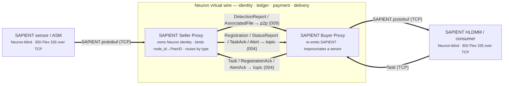
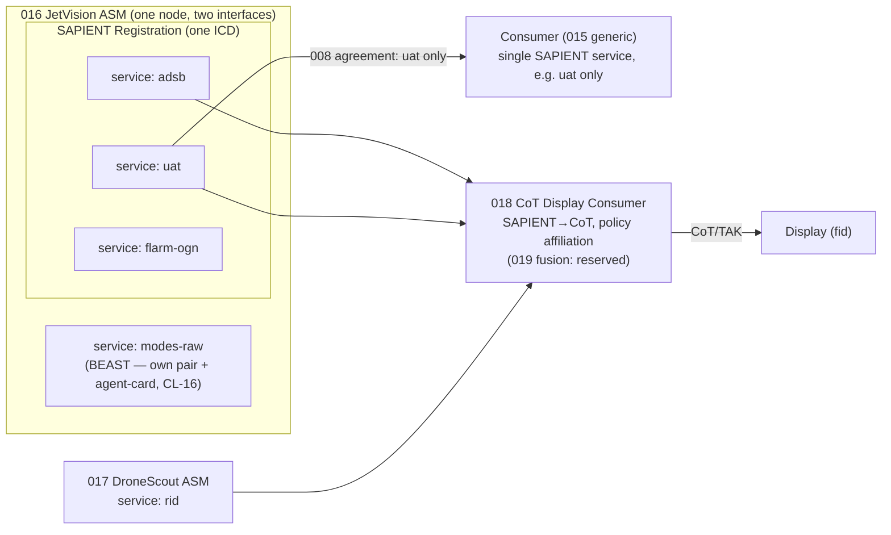
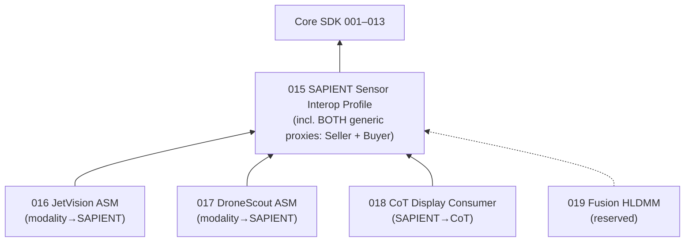
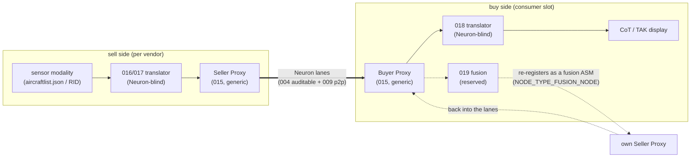
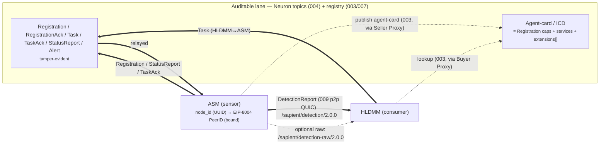

# Feature Specification: SAPIENT Sensor Interop Profile

**Feature Branch**: `spec/sapient-sensor-interop-profile` (review branch, PR #3; authored on `015-sapient-sensor-layer`)
**Created**: 2026-05-29
**Status**: Draft

## At a glance — *new to SAPIENT? start here*

**SAPIENT** is an open UK-DSTL / NATO standard (**BSI Flex 335**) for how a **sensor** tells a **command/fusion system** what it detects — *"there's a drone, here, this confident."* It defines the **messages** (registration, detections, status, tasking), **not** the network they travel over.

**What kind of sensor is this for?** SAPIENT is a **detection / situational-awareness** standard, not a generic telemetry feed. Its core data product is the `DetectionReport` — *"I detected an **object** (or discrete event), at a **location**, of this class, this confident."* A sensor is a good fit when it **detects discrete objects or events in a monitored space and reports them with a position**: drone Remote-ID receivers, ADS-B / Mode-S receivers, radar, RF/acoustic/seismic detectors, cameras, and threat detectors (chemical, biological, radiation, proximity) — all map naturally onto a `DetectionReport`. A fixed-point event detector such as a fire/smoke alarm is a degenerate but valid case: a single-event "object" at the sensor's known location. A sensor is a **poor** fit when it produces a **continuous scalar measurement of an environmental condition** rather than detecting an object — e.g. a standalone humidity, temperature, or air-pressure sensor. SAPIENT has no native measurement/telemetry message; such a feed should ride the Neuron lanes under a **different (sibling) application profile**, not be forced into a `DetectionReport`. *(SAPIENT's `StatusReport` can carry environmental conditions such as weather, but only as context about how they affect a detection sensor's own performance — not as the sensor's primary data product.)*

**This spec** plugs SAPIENT into Neuron. A **sensor** (an **ASM** — *Autonomous Sensor Module*, the **seller**) and a **consumer** (an **HLDMM** — *High-Level Decision-Making Module*, the fusion node / **buyer**) exchange SAPIENT messages over Neuron's existing transport and trust layer (identity, discovery, an auditable ledger, p2p data delivery).

> **In one line:** **SAPIENT** says *what* a sensor reports; **Neuron** provides *who it is, how it connects, and the audit trail* — the parts SAPIENT deliberately leaves out. The output to the operator is **CoT/TAK** (the map-display format).

> **The shape in one more line — a transparent proxy.** A SAPIENT sensor on one side and a SAPIENT command/fusion system on the other talk to each other as if joined by a single wire; **Neuron *is* that wire**, and **neither end needs to know Neuron exists**. Two generic, vendor-blind components — **one pair for all SAPIENT** — sit at the seams: a **SAPIENT Seller Proxy** (sensor side) and a **SAPIENT Buyer Proxy** (consumer side). Each presents a conformant BSI Flex 335 endpoint to its local SAPIENT peer and carries the messages across the Neuron lanes; the proxy decides which lane purely from the SAPIENT message *type*. See **SAPIENT Transparent Proxy** below.

**Key terms:** **ASM** = sensor/seller · **HLDMM** = fusion/buyer · **DetectionReport** = "I see this object" · **StatusReport** = sensor health beat · **Task** = "watch this area" (buyer→sensor) · **CoT/TAK** = the operator's map picture · **ledger** = the auditable trust/audit layer.

> **A word on friend/foe (since CoT/TAK is named above).** SAPIENT answers *"what is it and where"* — object **class** and **confidence**. It deliberately does **not** answer *"whose side is it on."* There is no allegiance / affiliation / IFF field in BSI Flex 335, and that is by design: an edge sensor can observe an object's kinematics and class, but it cannot *know* allegiance. Beware the common trap of conflating **threat** ("of interest / behaving suspiciously," which a sensor can hint at) with **foe** (friend / hostile / neutral / unknown — the MIL-STD-2525 / APP-6 affiliation set, which it cannot). Affiliation is assigned **downstream**, at the seam in two grades: the **display consumer (018)** carries a **static, declared affiliation policy** (a deployment constant — e.g. "paint cooperative RID/ADS-B friendly"; the degenerate case), while a **fusion node (019)** **derives** affiliation by correlating sensor tracks against *identity* sources (IFF, ADS-B/Mode-S, Remote ID, blue-force tracking, flight plans, allow/deny lists); either way the **CoT/TAK** layer then carries and paints it (affiliation lives in the CoT `type` field). So this profile **names CoT/TAK as the downstream output but never specifies it** — the CoT message mapping and the policy affiliation belong to **018**, the derived-affiliation decision to **019**, and the symbology to the operator's common operating picture; none of it is defined here. In one line: **SAPIENT in, CoT out; friend/foe is decided at the seam between them, never inside the sensor messages.** (See *Out of Scope* and the 018/019 roles in *DApp Family Decomposition*.)

The figure shows the whole shape; the rest of the document is the precise rules.

> **Figure source:** `sapient-neuron-architecture.drawio.svg` (editable — open in a drawio-aware viewer, the **NEW (standards-based)** page).

## Layer

**Sensor Interop Profile** — a new tier introduced by this spec, sitting **between** the Core SDK (001–013) and the leaf vendor/fusion DApps (016+). It is not a Core primitive (it defines application-payload semantics, which Principle VIII keeps opaque to Core) and it is not a single DApp (it is shared by every sensor DApp). Its introduction **amends Constitution Principle XII** to recognise this middle tier — see `amendments/constitution-principle-xii.md` in this feature and the Layering Compliance Check below.

> **Why a new tier and not "just a DApp":** Principle XII's binary Core(001–013)/DApp(016+) split has no slot for a payload standard shared *across* DApps. The constitution explicitly retired the proposed core 014 (Fan-Out) and 015 (admission policy) into the DApp tier and recorded: *"Future authors MUST NOT resurrect 014/015 as core specs without amending Principle XII first."* This spec reclaims **015** for the shared Sensor Interop Profile and amends XII accordingly.

## Related Specs

**Core SDK consumed (composed, never redefined):** 001 Account / 007 Identity (EIP-8004) → SAPIENT crypto-bound `node_id`; 002 Key Library; **003 Peer Registry** (carries the agent-card/ICD = SAPIENT `Registration` content); **004 Topic System** (the *auditable lane* — `stdIn`/`stdOut`/`stdErr` ledger-anchored topic channels; see §B Lane binding); 005 Health (distinct from SAPIENT `StatusReport`, FR-S31); 006 Determinism (canonical JSON projection); 008 Payment (an ASM↔HLDMM session is the data plane of an 008 agreement; **one Neuron service per consumable feed**, FR-S70); **009 P2P Data Delivery** (bulk `DetectionReport` stream); 010 Validation; 011 Relay/NAT (relay transport for *reaching* NATed/non-partner consumers — the fan-out *policy* is this tier's, FR-S30); 013 Connectivity Profiles.

**Leaf DApps that depend on this profile:** **017 DroneScout DS240 ASM** (single service: `rid`); **016 JetVision ASM** (SAPIENT services `adsb`, `uat`, `flarm-ogn`; plus a **BEAST** `modes-raw` feed on its own pair, CL-16 — not a SAPIENT service); **018 CoT Display Consumer** (the lightweight HLDMM: SAPIENT→CoT translation behind the Buyer Proxy, static affiliation policy, aggregation without association); **019 Fusion HLDMM** *(plot-to-track association + derived affiliation + `NODE_TYPE_FUSION_NODE`)*. See **DApp Family Decomposition** below.

**External (normative reference, not redefined):** **SAPIENT — BSI Flex 335 v2.0** (DSTL) is the **normative** schema and version (decisions 2026-05-29/30; CL-5 locked to v2.0). Canonical wire definition: `github.com/dstl/SAPIENT-Proto-Files` → `bsi_flex_335_v2_0/*.proto`. Verified for this spec on 2026-05-29 by direct fetch: `detection_report.proto` (sha1 `447e4eab2c27f3db1aeb2bb28b47c5eab38cf90a`), `registration.proto` (sha1 `09e561d1b86c7d70c17db88c12d68266e47a09a2`) — these two are the ground truth for field-level claims here; the remaining message protos are consistent-with but should be re-confirmed against the compiled `.proto` before wire interop. Test harness: `github.com/dstl/BSI-Flex-335-v2-Test-Harness`. The standard itself is paywalled at BSI; the proto files are authoritative **for message content**. **Transport / connection model — which the `.proto` files do NOT define** — is taken from the free **SAPIENT ICD v7** (DSTL/PUB145591, published on gov.uk): §2.1 *Network Interface* (SAPIENT does not constrain the transport — modules "communicate using TCP socket connections" and "any … technology that supports TCP may be used") and §2.1.2 *Message Framing* (each protobuf message carries a **32-bit / 4-byte little-endian** length prefix), confirmed by the DSTL reference middleware `github.com/dstl/Apex-SAPIENT-Middleware` (`sapient_apex_server/message_io.py` → `struct.pack("<I", …)`); this model carries forward unchanged into BSI Flex 335 v2. Any pre-existing reference implementation that models SAPIENT as ICD-shaped JSON is informative only, not normative.

## Purpose

Define, once, how a Neuron node hosting a **sensor agent (Autonomous Sensor Module, ASM = seller)** exchanges **SAPIENT messages** with a Neuron node hosting a **consumer agent (High-Level Decision-Making Module, HLDMM = buyer)**, using the Core lanes as transport. A leaf vendor DApp then only declares *what it detects* (its services, classification taxonomy, and any extension namespace) — never *how the SAPIENT session, registry binding, tasking, fan-out, or lane mapping work*. This standardises the sensor-to-consumer payload as SAPIENT carried over the Core transport.

## SAPIENT Transparent Proxy — the generic Seller and Buyer

The defining shape of this profile: **Neuron is a transparent proxy for SAPIENT.** A SAPIENT sensor on one side and a SAPIENT command/fusion system on the other exchange BSI Flex 335 messages as if connected by a single wire; **Neuron *is* that wire** — it supplies the identity, audit trail, payment, and NAT-traversing delivery between them — but **neither endpoint needs to know Neuron exists**. This generalises an established Neuron pattern (the "Neuron HTTP proxy" used for MCP/x402: two HTTP peers joined by a Neuron virtual wire, each speaking only HTTP to a local endpoint while Neuron relays between them) to a **SAPIENT-protobuf** payload.

Two generic, vendor-agnostic components — **one pair for all SAPIENT** — sit at the seams:

- **SAPIENT Seller Proxy** — the sensor-side half. It exposes a **conformant BSI Flex 335 v2.0 connection endpoint** (length-prefixed protobuf over a TCP connection — the SAPIENT middleware connection model) to the sensor, so any conformant SAPIENT **ASM** — *including third-party gear that has never heard of Neuron* — connects to it **unmodified**, exactly as it would connect to a SAPIENT middleware/DMM. On the network side it owns the node's Neuron identity, signs, and forwards each SAPIENT message onto the correct Core lane.
- **SAPIENT Buyer Proxy** — the consumer-side half, the mirror image. It re-emits the same SAPIENT messages to the consumer over a conformant BSI Flex 335 endpoint, **impersonating a SAPIENT sensor/middleware**, so any conformant **HLDMM** connects unmodified and tasks back through the wire.

Everything *between* the two proxies is Neuron; everything *outside* them is SAPIENT only. **The Neuron envelope is added at the Seller Proxy and stripped at the Buyer Proxy** (and symmetrically in the reverse direction): a SAPIENT message carries no Neuron framing on either local edge, only across the link between the proxies. The two SAPIENT principals (the **ASM** — the sensor — and the **HLDMM** — the consumer) are therefore **Neuron-blind**: they hold no wallet, perform no signing, and address each other only by SAPIENT `node_id`/`destination_id`. The Neuron-commerce roles of seller and buyer are filled by the **proxies**, not by the principals.

**The proxy is intentionally minimal — it selects a lane from the SAPIENT message type alone.** It does not parse vendor `object_info`, model any modality (ADS-B, Remote-ID, UAT, FLARM/OGN), or hold fusion state. Its sole routing decision keys on the message type: `DetectionReport` and `AssociatedFile` ride the private p2p lane; **every other message type, including `Registration`, rides the auditable topic lane** (FR-S90–S97 and the message-direction table). This minimality is what allows a single implementation to serve every sensor DApp.

This recasts the family: a vendor DApp (016/017) is no longer a bespoke "seller" — it is a **Neuron-blind modality→SAPIENT translator** that emits standard SAPIENT into the Seller Proxy and contains **no Neuron code**. The Seller/Buyer Proxy pair, the identity binding, the lane routing, fan-out, and admission are defined **once, here**.

**One proxy pair per payload protocol.** The transparent-proxy *pattern* is payload-agnostic; this profile specifies the **SAPIENT** Seller/Buyer pair, but the same pattern applies to each distinct wire protocol — the existing **HTTP** pair (MCP/x402), and, for a sensor that emits a non-SAPIENT binary stream, a separate pair for that protocol (for example a **BEAST** Seller/Buyer pair for raw Mode-S). **Each payload MUST ride the proxy pair for its own protocol; one wire protocol MUST NOT be encapsulated within another** — BEAST frames MUST NOT be carried inside SAPIENT `object_info`/`associated_file`, and SAPIENT MUST NOT be carried inside BEAST. A node that produces two payload protocols (for example JetVision: SAPIENT assembled detections and a BEAST raw-Mode-S stream) advertises **one service per protocol**, and **each service's agent-card declares the interface it presents** (`SAPIENT` or `BEAST`) so a consumer attaches the matching buyer proxy. Only the SAPIENT pair is normative here; pairs for other protocols are defined by their own profiles (the BEAST pair and the raw-Mode-S service shape are specified in **016 JetVision**). Consequently, JetVision's raw Mode-S is **not** a SAPIENT service — see the decomposition note and FR-S35.

The two figures below show the SAPIENT Seller/Buyer proxy pair: first a message-flow summary, then the fuller design drawing.

*Message flow (simplified): the Seller and Buyer proxies, the SAPIENT-only edges to the sensor and the consumer, and the lane each message type takes — `DetectionReport`/`AssociatedFile` on the p2p lane (009), every other type on the auditable topic lane (004).*

*Design drawing (`sapient-proxy.drawio.svg`): the same proxy pair in its wider context — the **red** box is the SAPIENT Seller/Buyer pair specified in this section; the other paths show surrounding context. Editable in a drawio-aware viewer; re-export the `.svg` after edits to keep the two figures in sync.*

## DApp Family Decomposition

The normative split for the sensor-DApp family. It keeps single-capability vendors minimal, lets a multi-capability vendor expose each feed independently, and makes fusion an **opt-in specialisation** — so a consumer that requires a single modality need not engage a fusion spec.

> **Read this alongside *SAPIENT Transparent Proxy* above.** The SAPIENT-forwarding **Seller Proxy** and **Buyer Proxy** are **generic and defined once here** (FR-S90). A leaf vendor spec (016/017) is therefore **not** a bespoke seller transport — it is a **Neuron-blind modality→SAPIENT translator** that runs *behind* the Seller Proxy and only declares *what it detects* and *how it maps its modality onto SAPIENT* (FR-S41). The "ASM (seller)" role below is that translator-plus-its-proxy; the proxy is the part shared across all vendors.

**Three roles, defined here in 015 (generic), specialised by the leaf specs:**

1. **ASM (seller)** — a sensor node: a **Neuron-blind SAPIENT translator** (the vendor part, 016/017) fronted by the generic **Seller Proxy** (this spec). It publishes **one SAPIENT `Registration`/agent-card** (one node identity, one ICD — synthesised and published by the proxy, FR-S96) that declares **one or more Neuron *services*** — a *service* is one independently-discoverable, independently-priced, independently-consumable feed (FR-S70). SAPIENT models a node's internals as `capabilities` + `mode_definition`s in the single Registration; Neuron commerce wraps each consumable feed as a named service in the 003 registry.
   - **DroneScout (017)** — single-service: **one service** — `rid` (Remote ID → DetectionReports for the UAV, with operator data carried as report metadata; `neuron.rid/1` extension).
   - **JetVision (016)** — multi-capability: **one ASM, several services** —
     - `adsb` — ADS-B extended-squitter → **assembled** DetectionReports *with position*; aircraft callsign → SAPIENT `id` (field 23, "tail number").
     - `modes-raw` — raw Mode-S frames (the **BEAST** binary stream) for downstream MLAT. This is a **BEAST** feed, not a SAPIENT one. Per *one proxy pair per payload protocol* above, `modes-raw` rides a **BEAST Seller/Buyer pair** and its agent-card declares a **BEAST interface**, rather than being wrapped as a position-relaxed SAPIENT `DetectionReport`. The BEAST proxy pair and the raw-Mode-S service shape are specified in **016 (JetVision)**, not here. (Supersedes the earlier approach in which BEAST mapped to `object_info`/`associated_file`; see the FR-S35 caveat.)
     - `uat` — UAT 978 MHz → DetectionReports.
     - `flarm-ogn` — FLARM/OGN → DetectionReports.
     A consumer selects which service(s) to negotiate. A consumer requiring only Mode-S negotiates an 008 agreement for the `modes-raw` service alone; no fusion is required.

2. **Consumer (buyer)** — the generic HLDMM role, defined here. A consumer negotiates 008 agreements for **any subset** of an ASM's services and consumes their SAPIENT streams. **A consumer is NOT required to fuse.** Consuming a single service and rendering or logging it is a complete, valid use (FR-S71). This role needs no per-vendor buyer spec: the consumer reads the vendor's declared extension schema (FR-S40) and is otherwise vendor-agnostic. The concrete **display consumer** leaf is spec **018 (CoT Display Consumer)** — a Neuron-blind SAPIENT→CoT translator behind the generic Buyer Proxy that aggregates N sessions **without associating**, applying a **static affiliation policy** (default: friendly) — the consumer-side mirror of the 016/017 translators.

3. **Fusion Node (HLDMM proper)** — an **optional specialisation** of the consumer (spec **019**) that consumes **multiple** sources, performs plot-to-track association, **derives** affiliation/friend-foe from identity correlation (a fusion *output*, not SAPIENT — CoT/MIL-STD-2525), and emits to a display (CoT/TAK) and/or re-registers upward as a SAPIENT **Fusion Node** (`NODE_TYPE_FUSION_NODE = 20`, with `dependent_nodes` + `reporting_region`) in a fusion hierarchy. Fusion is opt-in: the set of sources a fusion node fuses is deployment configuration, and a deployment requiring only a single modality omits the fusion node entirely. *(2026-06-12: fusion was originally pencilled as 018; 018 is now the lightweight CoT display consumer and fusion is renumbered to 019.)*

**Summary of the decomposition:** **one generic SAPIENT Seller Proxy + one generic Buyer Proxy** (this spec, FR-S90) carry all SAPIENT for every vendor; per-vendor **SAPIENT-translator** specs (016, 017 — multi-service for JetVision) define only the modality→SAPIENT mapping that runs *behind* the Seller Proxy; **one generic consumer** role (this spec) with **one lightweight display-consumer leaf (018, SAPIENT→CoT)**; and **one optional fusion/affiliation** spec (**019**, reserved) that MAY fuse some or all vendors per deployment. There is **no per-vendor seller transport and no per-vendor buyer spec**, and the fusion spec is not a precondition for consumption. SAPIENT's native Fusion-Node hierarchy provides the standards-conformant mechanism for a sensor that fuses internally (e.g. ADS-B + UAT → derived position) to act as a leaf fusion node feeding a parent fusion node.

## Out of Scope

- **Sensor-internal decode** (OpenDroneID, Mode-S/ADS-B frame decode, FLARM/OGN, UAT). Vendor concern; begins at the decoded contact.
- **Friend/foe / affiliation / IFF.** SAPIENT has no such field; affiliation is assigned downstream (CoT / MIL-STD-2525 / APP-6) — as a **static declared policy** at the display consumer (018) or **derived** at a fusion node (019, reserved).
- **Fusion algorithms** (association, correlation, MLAT solving). Fusion-HLDMM concern (019, reserved); this profile carries only the inputs.
- **Display / CoT / TAK output.** The SAPIENT→CoT mapping is **018**; ASTERIX/other display formats are unassigned.
- **Transport internals** (libp2p, QUIC, relay hole-punching, NAT). Owned by 009/011/013; assumed present.
- **Discovery/rendezvous/dial-back mechanics.** Owned by 003/011; peers assumed already discovered, dialled, securely connected.
- **Vendor taxonomies / extension namespaces** (`rid.*`, `adsb.*`). Declared by leaf DApps; this profile defines only the *mechanism* (FR-S40).

## Clarifications

### Session 2026-05-29 (founding)

- Q: Data envelope sensor↔consumer? → A: **SAPIENT BSI Flex 335 v2.0** over the Neuron lanes (SAPIENT is transport-agnostic; the two-lane split is a Neuron choice). *(Refined 2026-06-02 — scope of "transport-agnostic": it holds for the SAPIENT **standard/messages** and for the **inter-proxy Neuron lanes**, but NOT for the **local SAPIENT edge** to a Neuron-blind conformant node, which is still **TCP + a 4-byte little-endian length-prefixed protobuf frame** — the SAPIENT connection model per ICD §2.1/§2.1.2, FR-S91. In one line: agnostic between the proxies, TCP at the edge.)*
- Q: One shared SAPIENT spec or per-DApp? → A: **One shared profile (this spec)** + thin vendor DApps.
- Q: Vendor- or modality-named leaf specs? → A: **Vendor-named** (DroneScout DS240, JetVision). Register "a DroneScout that can do Remote ID," not "a Remote ID thing."
- Q: How to split a multi-capability vendor + fusion? → A: See **DApp Family Decomposition**. One ASM with multiple **services**; a **generic consumer** (no per-vendor buyer spec); **fusion is an optional specialisation** (originally pencilled as 018; renumbered 2026-06-12 to the reserved **019** when 018 became the CoT display consumer), not required to consume a single service.
- Q: May the bus carry low-level data that does not form a position (single Mode-S frame)? → A: **Structurally yes, but it is a documented Neuron deviation.** Verified against the v2.0 proto: `DetectionReport.location_oneof` is annotated `is_mandatory: true` — SAPIENT v2.0 **requires** a `Location` or `RangeBearing` in a DetectionReport. So position-less/raw reports relax a SAPIENT MUST and therefore MUST be a **separate, advertised** output (FR-S35), never the default. *(Refined by CL-16 (2026-06-02): a raw **Mode-S / BEAST** frame stream is carried on its **own BEAST pair**, not wrapped as an FR-S35 SAPIENT deviation; FR-S35 now stands only for genuinely position-less **SAPIENT** contacts.)*
- Q: Fan-out ownership? → A: **This tier** (old core 014 Fan-Out folded into the DApp tier per Principle XII). Fan-out is **independent per-consumer sessions defined here**; a NATed or non-partner consumer is *reached* over the **011 relay transport** — 011 provides reachability/NAT-traversal, **not** the fan-out policy (011 explicitly disclaims fan-out).
- Q: SAPIENT `StatusReport` vs Neuron 005 heartbeat? → A: **Two distinct heartbeats** (FR-S31). ASM declares its `StatusReport` cadence in `Registration.status_definition.status_interval`.
- Q: Which SAPIENT schema is normative? → A: **The official DSTL BSI Flex 335** (`github.com/dstl/SAPIENT-Proto-Files`), to ensure interoperability with conformant third-party SAPIENT systems. Any pre-existing reference implementation that models SAPIENT as ICD-shaped JSON is informative only, not normative. Working version is **v2.0** (CL-5).
- Q: How do Neuron discovery and SAPIENT `Registration` compose? → A: **Pointer model** — the SAPIENT `Registration` message **is** the agent-card. It is published (whole, or as a content-hash + URI) in the 003 registry so an HLDMM can discover and pre-qualify the ASM, **and** it is replayed on connect to obtain `RegistrationAck`. One artifact, two uses, no drift. (Resolves CL-1.) *(The lane that carries the replay was later refined from the in-band p2p session to the auditable/topic lane — see CL-10, 2026-06-02.)*

### Session 2026-05-30

- Q: On-lane encoding for SAPIENT messages (protobuf vs JSON)? → A: **Protobuf normative, canonical-JSON projection allowed.** Protobuf (BSI Flex 335 wire form) is the default/normative encoding; an OPTIONAL canonical-JSON projection (per 006) MAY be negotiated at connection setup for JS/browser edges. (CL-2, FR-S50)
- Q: Auditable-lane anchoring of `Task`/`StatusReport` — full message or hash? → A: **Full message on the ledger.** The whole `Task`/`StatusReport` is published on the auditable lane (004 = the ledger-backed topic), giving full-content on-chain auditability; no hash-only anchoring. (CL-3, FR-S32)
- Q: How to express altitude-band tasking (e.g. "below 10,000 ft"), which SAPIENT has no native field for? → A: **A Neuron `object_info` extension filter** — a namespaced filter parameter carried in the `Task` (mirroring the `object_info` extension mechanism), documented as a Neuron extension to SAPIENT tasking. (CL-4, FR-S26)
- Q: Lock the SAPIENT version? → A: **Lock BSI Flex 335 v2.0** — the normative version (ULID ids, mandatory `location_oneof`, the v2.0 message set), which 015 is written against. (CL-5)
- Q: "register" is overloaded — SAPIENT `Registration`/`RegistrationAck` vs the on-chain EIP-8004/003 registration. Same word, same node, different operations? → A: **Yes, two different things.** Ledger registration = network entry + discovery (one-time, on-chain, durable). SAPIENT `Registration` = per-session admission (per-HLDMM, per-session, ephemeral; carried on the auditable lane per CL-10). The pointer model (CL-1) makes them share *content* (the agent-card **is** the `Registration` payload) but they are distinct operations and MUST be named distinctly. (CL-6, FR-S23)
- Q: Where do peer-level allowlists live, and is the SAPIENT `RegistrationAck` one of them? → A: **`RegistrationAck.acceptance` (bool, + `ack_response_reason[]`) IS a peer admission gate** — the consumer can reject a sensor. There are **three** gates: network-entry (007 permissioned registry, coalition operator), seller-side (008 `AdmissionPolicy`, seller admits buyer), consumer-side (SAPIENT `RegistrationAck`, consumer admits sensor). The two peer gates are **distinct, opposite-direction whitelists** and **both** are used (both directions). Mechanism + allowlist *shape* specified here in 015; concrete *entries* are deployment config (no hardcoded partner list). (CL-7, FR-S80–S84)

### Session 2026-06-02 (transparent proxy — "one Seller and one Buyer for all SAPIENT")

- Q: What *shape* is this profile — how does a SAPIENT sensor reach a SAPIENT consumer over Neuron? → A: **A transparent proxy.** Neuron is the wire; neither endpoint needs to know Neuron exists. One generic **SAPIENT Seller Proxy** (sensor side) and one generic **SAPIENT Buyer Proxy** (consumer side) carry all SAPIENT for every vendor; the SAPIENT principals (ASM, HLDMM) are Neuron-blind. The Neuron-commerce "seller"/"buyer" are the proxies, not the principals. Generalises the existing "Neuron HTTP proxy" (MCP/x402) pattern to a SAPIENT payload. (CL-9, FR-S90/S93)
- Q: How does a proxy decide which Core lane a SAPIENT message takes — and where does `Registration` go? → A: **By SAPIENT message type alone** (vendor-blind): `DetectionReport`/`AssociatedFile` → p2p lane; **everything else, including `Registration`/`RegistrationAck`, → the auditable/topic lane (004)**. This corrects the founding picture, which placed registration on the private/p2p path, and **refines CL-1**. (CL-10, FR-S92; supersedes the in-band-over-p2p replay of CL-1/FR-S21)
- Q: What does a sensor/consumer plug into at the proxy's local edge — and how off-the-shelf must it be? → A: **A conformant BSI Flex 335 v2.0 connection endpoint** (length-prefixed protobuf over TCP, the SAPIENT middleware connection model). **Any** conformant SAPIENT ASM/HLDMM — including third-party gear with zero Neuron knowledge — connects **unmodified**. (CL-11, FR-S91)
- Q: The bridge/sensor is Neuron-blind and signs nothing — who owns the Neuron identity? → A: **The Seller Proxy.** It holds the node's EIP-8004-bound libp2p identity, signs all lane traffic, and **binds the inbound SAPIENT `node_id` to its PeerID** (so the source stays crypto-bound, FR-S15) regardless of the local UUID. (CL-12, FR-S94)
- Q: One proxy per sensor, or can one proxy aggregate many sensors? → A: **One proxy : one sensor : one Neuron identity / one `Registration`.** Aggregate by running multiple proxy instances; do not multiplex several sensors onto one identity. (CL-13, FR-S95)
- Q: With a conformant edge the sensor does a local `Registration` immediately — but the real accept/reject is the consumer's. How does the handshake span the wire? → A: **End-to-end.** The proxy forwards the sensor's `Registration` to the actual consumer and relays the consumer's real `RegistrationAck` (its admission decision, FR-S82) back to the sensor; the proxy never fabricates an acceptance. Under fan-out the sensor sees *accept* once ≥1 consumer accepts; per-consumer rejects stay per-session. The Seller Proxy also synthesises and publishes the 003 discovery agent-card from the sensor's `Registration`. (CL-14, FR-S96)
- Q: A blind endpoint can't see the 007 (network-entry) or 008 (seller-side) gates. How does a denial there reach it? → A: **As a SAPIENT `Error`** carrying a `NEURON-SAPIENT-*` reason (FR-S60) and/or a cleanly refused local connection — never a silent hang. The consumer-side gate already surfaces natively as `RegistrationAck.acceptance = false`. (CL-15, FR-S97)
- Q: Should non-SAPIENT sensor payloads (raw Mode-S / BEAST) be carried inside SAPIENT, or separately? → A: **Separately — one transparent-proxy pair per payload protocol.** Raw Mode-S rides its own **BEAST Seller/Buyer pair**, with a **BEAST interface declared in the agent-card**, rather than being wrapped as a position-relaxed SAPIENT report. Only the SAPIENT pair is normative in 015; the BEAST pair and the JetVision raw-Mode-S service are specified in **016**. (CL-16; FR-S35 caveat / FR-S11; supersedes the earlier decomposition note in which BEAST mapped to `object_info`/`associated_file`.)

### Open clarifications (resolve before plan; Principle III)

- **CL-1 [RESOLVED 2026-05-29 — pointer model; lane REFINED by CL-10 2026-06-02]**: The `Registration` content lives in the 003 registry (discovery) **and** is replayed on connect for `RegistrationAck` (session establishment). The auditable lane (004) carries the *ongoing* control traffic (`Task`/`StatusReport`/`Alert`). **Originally** the `Registration`/`RegistrationAck` replay was specified in-band over the p2p (009) session; **CL-10 (2026-06-02) moves it onto the auditable/topic lane (004)** so that the transparent proxy can route it by message type alongside the other control messages (FR-S92/S96) and the handshake becomes ledger-auditable. See FR-S20/S21/S92/S96.
- **CL-2 [RESOLVED 2026-05-30]**: Encoding — **protobuf normative; canonical-JSON projection OPTIONAL, negotiated at connect.** (FR-S50)
- **CL-3 [RESOLVED 2026-05-30]**: Auditable-lane anchoring — **full `Task`/`StatusReport` on the ledger-backed topic (004)**, not hash-only. (FR-S32)
- **CL-4 [RESOLVED 2026-05-30]**: Altitude-band tasking — **a namespaced `object_info` extension filter in the `Task`** (Neuron extension to SAPIENT tasking). (FR-S26)
- **CL-5 [RESOLVED 2026-05-30]**: SAPIENT version — **locked to BSI Flex 335 v2.0.** (Normative-reference note above.)
- **CL-6 [RESOLVED 2026-05-30 — naming disambiguation]**: "Register" is overloaded. **SAPIENT `Registration`/`RegistrationAck`** (per-session admission) and **ledger/EIP-8004 registration** (network entry + discovery) are distinct operations that share content via the pointer model (CL-1). Specs/code/diagrams MUST name them distinctly. (FR-S23)
- **CL-7 [RESOLVED 2026-05-30 — admission model]**: **Three admission gates**, none collapsible: network-entry (007 `AllowlistPolicy`, **permissioned** registry, coalition operator holds the key), seller-side service admission (008 `AdmissionPolicy`), consumer-side sensor admission (SAPIENT `RegistrationAck.acceptance`). The two peer gates are **distinct, opposite-direction** whitelists; the reference RID deployment uses **both directions**. Admission *mechanism + allowlist shape* are specified in 015; concrete allowlist *entries* are deployment configuration. (FR-S80–S84)
- **CL-8 [RESOLVED 2026-05-30 — multi-consumer tasking scope]**: SAPIENT has no consumer concept (no `consumer`/`subscriber` in the v2.0 proto; addressing is point-to-point `node_id`→`destination_id`), and its `CONTROL_STOP`/`PAUSE` "revert to the previous task" semantics assume a **single tasking authority** per node. This profile's per-session multi-consumer model (FR-S30) stays faithful by restricting *multiplexed* tasking to the non-contending per-session output-filter subset; node-global commands are refused while >1 session is active and reserved to a single authority (FR-S27/FR-S28). A documented profile refinement, not a message change — every session remains byte-for-byte BSI Flex 335 v2.0.

- **CL-9 [RESOLVED 2026-06-02 — transparent-proxy model]**: This profile is a **transparent SAPIENT proxy**; one generic **Seller Proxy** + one generic **Buyer Proxy** carry all SAPIENT, the principals are Neuron-blind, and the commerce seller/buyer are the proxies. (FR-S90/S93)
- **CL-10 [RESOLVED 2026-06-02 — lane routing; refines CL-1]**: A proxy routes **by SAPIENT message type only**; `DetectionReport`/`AssociatedFile` → p2p, **all else incl. `Registration`/`RegistrationAck` → auditable/topic lane (004)**. Supersedes the in-band-over-p2p replay of CL-1/FR-S21. (FR-S92/S96)
- **CL-11 [RESOLVED 2026-06-02 — conformant edge]**: Each proxy's local edge is a **conformant BSI Flex 335 v2.0 TCP connection endpoint**; any third-party SAPIENT ASM/HLDMM plugs in unmodified. (FR-S91)
- **CL-12 [RESOLVED 2026-06-02 — identity ownership]**: The **Seller Proxy owns the Neuron identity** and binds the inbound SAPIENT `node_id` → its EIP-8004 PeerID. (FR-S94)
- **CL-13 [RESOLVED 2026-06-02 — cardinality]**: **One proxy : one sensor : one identity / one `Registration`**; aggregate via multiple instances. (FR-S95)
- **CL-14 [RESOLVED 2026-06-02 — end-to-end handshake]**: `Registration`/`RegistrationAck` is relayed **end-to-end**; the proxy delivers the consumer's real accept/reject (accept-if-≥1 under fan-out) and publishes the 003 agent-card on the sensor's behalf; never fabricates acceptance. (FR-S96)
- **CL-15 [RESOLVED 2026-06-02 — denial surfacing]**: Denials at the 007/008 gates (invisible to a blind endpoint) surface as a **SAPIENT `Error`** (`NEURON-SAPIENT-*`) and/or a clean connection refusal. (FR-S97)
- **CL-16 [RESOLVED 2026-06-02 — one proxy pair per payload protocol; SAPIENT≠BEAST]**: Non-SAPIENT payloads (raw Mode-S / **BEAST**) MUST NOT be wrapped inside SAPIENT; each wire protocol gets its **own** transparent Seller/Buyer pair and the agent-card **declares the interface** (`SAPIENT` vs `BEAST`). JetVision `modes-raw` = a BEAST service on a BEAST pair, specified in **016**. Supersedes the earlier BEAST-in-`object_info` decomposition note. (FR-S35 caveat / FR-S11)

*All founding clarifications are resolved; no open `[NEEDS CLARIFICATION]` items remain. Planning is gated on ratification of the Principle XII amendment described in `amendments/constitution-principle-xii.md`.*

## User Scenarios & Testing *(mandatory)*

### User Story 1 — ASM registers and streams SAPIENT DetectionReports to an HLDMM (Priority: P1)

A sensor ASM, already discovered and securely connected to a consumer HLDMM via Core lanes, performs a SAPIENT `Registration` exchange on the auditable lane (004) and then streams `DetectionReport`s over the p2p lane (009) — the standards-based replacement for the "OLD" proprietary p2p path.

**Independent Test**: Stand up the reference ASM (`neuron-rid-bridge` SAPIENT renderer) + a stub HLDMM over Profile F (fixture); assert `Registration` is accepted (`RegistrationAck`) and `DetectionReport`s arrive on the negotiated stream, each with `report_id` + `object_id` (ULID) and a crypto-bound `node_id`.

**Acceptance Scenarios**:

1. **Given** an established secure session, **When** the ASM sends `Registration` (declaring `icd_version`, `capabilities`, `status_definition`, `mode_definition`, `config_data`) on the auditable lane (004), **Then** the HLDMM replies `RegistrationAck` (also on the auditable lane) accepting the session and the declared `status_interval`.
2. **Given** a registered session, **When** the ASM has a decoded contact with a position, **Then** it emits a `DetectionReport` on `/sapient/detection/2.0.0` with a populated `location_oneof` and `node_id` bound to the ASM's EIP-8004 identity (FR-S15).
3. **Given** a contact with no positional fix on a non-raw service, **When** rendered, **Then** the ASM either supplies a degraded `RangeBearing`/`Location` or routes the contact to its advertised raw output (FR-S35) — it does NOT silently emit a location-less report on the assembled stream.

### User Story 2 — HLDMM discovers an ASM's capabilities & services from the registry (Priority: P1)

A consumer resolves an ASM's **agent-card/ICD** from the registry (003) and learns the sensor's type, **services**, classification taxonomy, coverage, declared `StatusReport` interval, accepted tasks, and any extension schemas — *before* connecting — so it can pick services and parse reports.

**Acceptance Scenarios**:

1. **Given** a registered ASM, **When** the HLDMM does `003 LookupRegistration`, **Then** it obtains the SAPIENT `Registration` capability content, the list of purchasable services (FR-S70), and `extensions[]` (schema id + URI + hash).
2. **Given** a resolved agent-card, **When** a later `DetectionReport` carries `object_info` in a declared namespace, **Then** the HLDMM interprets/validates it using only the declared schema (FR-S40), with no vendor-specific code.

### User Story 3 — HLDMM tasks the ASM auditably (Priority: P2)

A consumer narrows what it wants (region, class filter, report rate, start/stop/pause) via SAPIENT `Task` over the **auditable** lane; the ASM replies `TaskAck`. Command + ack are tamper-evident.

**Acceptance Scenarios**:

1. **Given** a registered session, **When** the HLDMM sends `Task` with a `region[]` entry carrying a `region_area` + `class_filter`, **Then** the ASM `TaskAck`s and restricts subsequent reports.
2. **Given** a streaming session, **When** the HLDMM sends `Task` with `control = CONTROL_STOP`, **Then** the ASM MUST `TaskAck` and cease emitting `DetectionReport`s **on that session** within the declared cease window, leaving any other consumer's stream untouched; a later `CONTROL_START` resumes emission with no new `Registration` (FR-S29).
3. **Given** any `Task`, **When** published, **Then** the **full message** (not a hash) is anchored on the auditable lane (004) as a tamper-evident record (CL-3/FR-S32).

### User Story 4 — One ASM serves multiple HLDMMs (fan-out) (Priority: P2)

One sensor serves several consumers concurrently with independent sessions/tasking; one consumer's task never starves another. The fan-out policy is defined here; a NATed or non-partner consumer is *reached* over the 011 relay transport.

**Acceptance Scenarios**:

1. **Given** two HLDMMs on one ASM, **When** A tasks a 2 km region and B tasks all-region, **Then** each receives the subset matching *its own* task (FR-S30).
2. **Given** more direct consumers than `MaxDirectConsumers`, **When** a new consumer is admitted, **Then** it is served via the profile's fan-out path — reached over the **011 relay transport** where it is NATed/non-partner — and still receives well-formed reports.
3. **Given** two HLDMMs on one ASM, **When** A sends a node-global `Task` (`mode_change` / `look_at` / `detection_threshold`), **Then** the ASM rejects via `TaskAck` (`UnsupportedTask`, node-global-while-multiplexed) and neither consumer's stream changes (FR-S28).

### User Story 5 — ASM offers an optional position-relaxed SAPIENT service for downstream fusion (Priority: P2)

For a contact the ASM detects but **cannot locate at all** — no `Location` *and* no usable bearing (e.g. an identity-only contact) — strict BSI Flex 335 admits no valid `DetectionReport`, because `location_oneof` is mandatory. An ASM MAY advertise a **separate, opt-in** position-relaxed service (the *raw* service of FR-S35, protocol ID `/sapient/detection-raw/2.0.0`) whose reports **omit** `location_oneof` — a **documented Neuron deviation** from strict BSI Flex 335, consumable only by a deviation-aware HLDMM — so a downstream fusion node can correlate the identity against a position from another source. Where *any* bearing exists the report carries a `RangeBearing` instead, which **is** conformant and belongs on the normal/assembled service, not here. *(A raw **non-SAPIENT** frame stream — e.g. BEAST raw Mode-S for MLAT — is **not** this: it rides its own BEAST proxy pair per CL-16 / the FR-S35 caveat, specified in 016, never a `/sapient/detection-raw` service.)*

**Acceptance Scenarios**:

1. **Given** an ASM advertising both an assembled service and a position-relaxed (raw) service, **When** an HLDMM buys the assembled one, **Then** it receives only fuse-ready `DetectionReport`s, each with a populated `location_oneof`.
2. **Given** the same ASM, **When** an HLDMM buys the position-relaxed (raw) service, **Then** it receives SAPIENT-shaped `DetectionReport`s that **omit** `location_oneof` for position-less contacts (a `RangeBearing` is used instead wherever a bearing exists) — a **documented Neuron deviation from strict BSI Flex 335** (FR-S35), tagged raw/pre-fusion and consumable only by a deviation-aware HLDMM; it is **not** strictly-conformant SAPIENT, and **not** foreign frame bytes encapsulated in `object_info`.
3. **Given** an ASM advertising only assembled services, **When** an HLDMM requests a raw service, **Then** it is refused with `RawStreamNotOffered` (FR-S60).

### User Story 6 — SAPIENT health is distinct from Neuron liveness (Priority: P3)

The ASM emits SAPIENT `StatusReport`s (sensor health/coverage/mode) on the auditable lane *and* the node emits the separate Neuron 005 liveness heartbeat; a consumer distinguishes "sensor degraded but node alive" from "node offline."

### User Story 7 — Reports are self-describing across vendors (Priority: P3)

An HLDMM consumes DroneScout + JetVision and parses each vendor's `object_info` namespace using only the agent-card-declared schemas — no per-vendor bespoke integration.

### User Story 8 — A Neuron-blind SAPIENT sensor reaches a Neuron-blind SAPIENT consumer through the proxy pair (Priority: P1)

A conformant SAPIENT sensor that knows nothing about Neuron is pointed at a local **SAPIENT Seller Proxy** endpoint; a conformant HLDMM that knows nothing about Neuron is pointed at a local **SAPIENT Buyer Proxy** endpoint. They exchange `Registration`/`DetectionReport`/`Task` as if directly connected — Neuron carries identity, audit, and delivery between them invisibly. The same generic proxy binaries serve any vendor translator (016/017).

**Independent Test**: Point an unmodified BSI Flex 335 test-harness sensor at a Seller Proxy and an unmodified test-harness HLDMM at a Buyer Proxy; assert the handshake and `DetectionReport` stream complete end-to-end with **no Neuron-specific configuration on either endpoint**, the on-lane `node_id` is bound to the Seller Proxy's EIP-8004 PeerID (FR-S15/S94), and swapping the DroneScout translator for the JetVision translator requires no proxy change.

**Acceptance Scenarios**:

1. **Given** a conformant SAPIENT sensor with no Neuron knowledge, **When** it connects to the Seller Proxy's BSI Flex 335 TCP endpoint and sends `Registration`, **Then** the proxy forwards it over the auditable lane, the consumer's real `RegistrationAck` returns end-to-end, and `DetectionReport`s then flow on the p2p lane — the sensor observing only standard SAPIENT throughout (FR-S91/S92/S96).
2. **Given** a streaming session, **When** the consumer (a conformant HLDMM) issues a `Task` to its local Buyer Proxy endpoint, **Then** the `Task` is carried back over the auditable lane and applied at the sensor, and the `TaskAck` returns — neither endpoint addressing anything but a SAPIENT peer (FR-S92).
3. **Given** an ASM denied at the 008 seller-side gate (or a network-entry denial at 007), **When** it connects, **Then** it receives a SAPIENT `Error` (`NEURON-SAPIENT-*`) and/or a clean connection refusal rather than a silent hang (FR-S97).

### Edge Cases

- No usable `object_id` → no report (vendor rule; this profile requires `object_id`).
- Consumer disappears mid-stream → ASM tears down only that session (FR-S30).
- Task referencing an unsupported region/command → `TaskAck` rejects with reason; behaviour unchanged.
- Encoding mismatch → connection setup fails cleanly (FR-S50), not mid-stream.
- Broadcast signatures → ASM forwards bytes with `verification = unverified`; only the HLDMM sets `verified`/`failed`.
- Neuron wire unavailable (no peer connected / relay down) → the Seller Proxy surfaces it to the Neuron-blind sensor as a SAPIENT `Error` and/or refused local connection (FR-S97), not a silent stall.
- Sensor uses a local SAPIENT `node_id` that is arbitrary or varies → the Seller Proxy binds the on-lane `node_id` to its own EIP-8004 PeerID regardless (FR-S94); the local UUID never reaches the wire as the identity.

## Requirements *(mandatory)*

### Functional Requirements (FR-S-*)

**A. SAPIENT message set & roles**

- **FR-S01**: Use SAPIENT BSI Flex 335 v2.0. Supported `SapientMessage.content` set: `Registration`, `RegistrationAck`, `StatusReport`, `DetectionReport`, `Task`, `TaskAck`, `Alert`, `AlertAck`, `Error`. Envelope carries `timestamp` + `node_id` (UUID, mandatory — **bound to** the sender's Neuron PeerID per FR-S15, not replaced by it) + optional `destination_id`.
- **FR-S02**: The **ASM is the talker** (`Registration`, `DetectionReport`, `StatusReport`, `Alert`, `TaskAck`); the **HLDMM sends control** (`RegistrationAck`, `Task`, `AlertAck`). Implementations MUST NOT invert directions.
- **FR-S03**: `node_id` MUST be bound to the sender's Neuron identity (FR-S15); `destination_id` MAY address a specific sub-element.

**B. Lane binding (Neuron-specific)**

> **Two "lanes," grounded in Core.** "Lane" is 015-local shorthand for *which Core transport a SAPIENT message rides* — it is not Core vocabulary, so it is defined here once and used throughout:
> - **Auditable lane** = the **Topic System ([004](../004-topic-system/spec.md))**: ledger-anchored, signed, sequenced, append-only topics. Each peer exposes 004's three standard channels in its agentURI ([003](../003-peer-registry/spec.md)) — **`stdIn`** (others publish *to* this peer: commands/requests), **`stdOut`** (this peer's own routine output), **`stdErr`** (this peer's error/fault/diagnostic output — its Linux namesake). This profile binds the session-establishing `Registration` handshake **and** the ongoing SAPIENT control onto them by **routine vs exceptional**, exactly like a Unix process: `RegistrationAck`/`Task`/`AlertAck` (HLDMM→ASM) → the **ASM's `stdIn`** (the ASM's input topic); routine ASM output — `Registration` (the in-session ICD replay), `TaskAck` (command responses) and the periodic `StatusReport` (health/coverage/mode beat, emitted on `status_interval` whether healthy or not) → the ASM's **`stdOut`**; exceptional ASM signals — `Alert` (alarm) and the SAPIENT `Error` message → the ASM's **`stdErr`**. (A routine `StatusReport` is *normal output*, **not** an error — it stays on `stdOut`; `stdErr` is reserved for genuine alerts/faults. The report's `INFO/WARNING/FAULT` sensor-status lives in its *content*; a node MAY additionally surface a hard-FAULT report on `stdErr`.) Each is a signed 004 `TopicMessage` (sender, signature, sequence number), which is what makes the lane *auditable*.
> - **P2p lane** = **P2P Data Delivery (009)**: the private, high-rate, off-chain QUIC stream for bulk `DetectionReport`s — not ledger-anchored.
>
> Throughout this spec, "on the auditable lane" means "as a 004 topic message on the channel named above"; "on the p2p lane" means "on the 009 stream." Per-message channels are summarised in the message-direction table at the foot.

- **FR-S10**: `DetectionReport` streams and `AssociatedFile` payloads MUST ride the **p2p lane (009)** — high-rate, private, off-chain.
- **FR-S11**: Each consumable service's stream MUST be advertised in the 009 connection-setup stream catalog with profile-reserved protocol IDs `"/sapient/detection/2.0.0"` (assembled) and, when offered, `"/sapient/detection-raw/2.0.0"` (raw — *position-relaxed SAPIENT*, FR-S35), `direction = "seller-initiates"`. The `/sapient/*` IDs are for **SAPIENT** payloads only; a non-SAPIENT feed (e.g. a BEAST raw-Mode-S stream on its own BEAST proxy pair) uses a protocol ID defined by **its own** sibling profile, never a `/sapient/*` ID.
- **FR-S12**: Low-rate, high-consequence control — `Registration`, `RegistrationAck`, `Task`, `TaskAck`, `StatusReport`, `Alert`, `AlertAck`, `Error` — MUST ride the **auditable lane (the 004 Topic System)** as signed `TopicMessage`s, split **routine vs exceptional** across the standard channels (defined in §B): inbound to the ASM (`RegistrationAck`, `Task`, `AlertAck`) on the **ASM's `stdIn`**; routine ASM output (`Registration`, `TaskAck`, `StatusReport`) on the ASM's **`stdOut`**; exceptional ASM signals (`Alert`, `Error`) on the ASM's **`stdErr`**. A routine `StatusReport` MUST NOT be placed on `stdErr` merely because it is a "status" message — it is normal output; `stdErr` carries genuine alerts/faults (Linux-faithful). Channels are discoverable via the ASM's agentURI (003). *(The placement of `Registration`/`RegistrationAck` on the auditable lane — rather than in-band over the p2p session — is the message-type routing rule of FR-S92, refining CL-1; see CL-10.)*
- **FR-S13**: This profile MUST NOT require Core lanes to parse SAPIENT; payload stays opaque to Core (Principle VIII). Lane binding is a convention defined here, not a Core change.

**C. Identity & crypto-bound source**

- **FR-S15**: The SAPIENT `node_id` (a UUID on the wire, FR-S01) and the report source MUST be **cryptographically bound to** the node's Neuron identity (the EIP-8004-anchored libp2p PeerID, 001/007), making the source self-authenticating (stronger than vanilla SAPIENT). The binding is the agent-card's PeerID↔`node_id` association (FR-S22), integrity-checked against the on-chain entry — the PeerID is **not** literally placed in the UUID field.
- **FR-S16**: Broadcast-signature verification MUST happen **consumer-side** — at the HLDMM, or its Buyer Proxy on its behalf when the HLDMM is Neuron-blind (FR-S93) — against the signer's registry key; the ASM forwards bytes with `verification = unsigned|unverified` and MUST NOT assert `verified`/`failed`.

**D. Registration & registry binding (the ICD)**

- **FR-S20**: An ASM MUST publish an **agent-card** (003) — the node's **ERC-8004 registration file** (the `agentURI` target an explorer resolves; an *A2A-lineage agent card*), 8004-native at the top (the on-chain-anchored identity/key, the `services[]`, and a plain vendor/capability summary) so an ERC-8004 explorer can read *what the sensor is and how to reach it* without parsing SAPIENT. When the ASM is Neuron-blind this publication is performed by its Seller Proxy on its behalf (FR-S93/S96). The card's **capability content is** the SAPIENT `Registration` message — it **is** the ICD (pointer model, CL-1): `node_definition` (`NodeType` + sub-types), `icd_version`, `capabilities` (`category`/`type`/`value`/`units`), `status_definition` (incl. `status_interval` + coverage/FoV), `mode_definition` (incl. mandatory `task` = accepted `TaskDefinition` + `detection_definition`), `config_data` (`ConfigurationData`: **manufacturer/model/serial/hw/sw version → the vendor identity**, e.g. BlueMark / DroneScout DS240), and `extensions[]` (schema id + URI + content hash) for any `object_info` namespaces and any `TaxonomyDockDefinition` taxonomy extensions. The registry entry MAY carry the full `Registration` or a content-hash + resolvable URI to it; either way the published artifact and the replayed in-session `Registration` (FR-S21) MUST be the same artifact (no drift).
- **FR-S20a** *(agent-card envelope = the 003 agentURI registration file)*: The agent-card's discovery envelope **is the 003 agentURI registration file** — Neuron's ERC-8004 registration document — whose structure and `services[]` schema are governed by **003 (+004), not redefined here**. Per 003 it MUST carry the mandatory Neuron services: three `neuron-topic` services (`stdIn`/`stdOut`/`stdErr`, 003 FR-R02/R08) and one `neuron-p2p-exchange` (003 FR-R03); and, for a 015 ASM, the 008 `neuron-commerce` service(s), one per consumable feed (FR-S70). An ERC-8004 explorer resolves the document and reads *what the node is and how to reach it* from that standard `services[]` (topics, p2p, commerce) plus `name`/`description`, without parsing SAPIENT. Alignment with upstream `registration-v1` (a top-level `type`, an A2A endpoint in `services[]`) is OPTIONAL and additive — **003/004 govern on any conflict**. The SAPIENT `Registration` capability content (the ICD, FR-S20) and the PeerID/key binding (FR-S22) ride alongside as additive content an ERC-8004 explorer ignores.
- **FR-S21**: An HLDMM (or its Buyer Proxy on its behalf when the HLDMM is Neuron-blind, FR-S93) MUST resolve the agent-card via `003 LookupRegistration` and interpret reports — including declared extension namespaces — using only the card + linked schemas. On connect, the ASM MUST replay that same `Registration` **over the auditable/topic lane (004)** (per the message-type routing rule FR-S92, refining CL-1 — *not* in-band over the p2p session; CL-10) and the HLDMM MUST respond `RegistrationAck` (accept/reject) before `DetectionReport` flow begins (pointer model, CL-1). When a transparent proxy is in use this replay-and-ack is carried **end-to-end** by the proxy pair (FR-S96). An HLDMM MUST reject (`RegistrationAck.acceptance = false`) if the replayed `Registration` does not match the discovered agent-card (content-hash mismatch).
- **FR-S22**: The agent-card MUST carry the PeerID/public key matching the EIP-8004 entry; the dialled PeerID MUST be verified against it before reports are trusted — by the HLDMM, or by its Buyer Proxy on its behalf when the HLDMM is Neuron-blind (FR-S93) — failing with `IdentityMismatch`.
- **FR-S23** *(naming disambiguation — SAPIENT register ≠ ledger register, CL-6)*: This profile uses "register" for **two different operations that MUST NOT be conflated**:
  1. **Ledger registration** — the one-time, on-chain **EIP-8004 / 003 Peer Registry** entry that mints the node's persistent identity and publishes the agent-card to *any* discoverer. Durable; network-entry + discovery; gated by the 007 registry `AllowlistPolicy` (FR-S80).
  2. **SAPIENT `Registration` / `RegistrationAck`** — the per-session BSI Flex 335 message pair (carried on the auditable topic lane, FR-S92): the ASM replays its ICD to one *specific connected* HLDMM, which accepts or rejects **that session** (`acceptance` bool, FR-S82). Per-session, ASM→HLDMM, ephemeral; **auditable** on the 004 lane, but **not** the durable on-chain EIP-8004 identity write.

  The pointer model (CL-1) makes them share **content** (the agent-card **is** the `Registration` payload), but they are **distinct operations**: a node is *ledger-registered once* and performs a *SAPIENT `Registration` per HLDMM session*. Specs, code, diagrams, and labels MUST disambiguate as "ledger/EIP-8004 registration" vs "SAPIENT Registration" — never bare "register/registration" where the two could be confused.
- **FR-S24** *(registration — what goes where: the 003/007 + on-chain/off-chain split)*: "Ledger registration" (FR-S23.1) spans two Core specs and two storage tiers. An implementation MUST place each part as follows:

  | Layer | Owner | Holds |
  |---|---|---|
  | **On-chain Identity Registry** | **007** (the EIP-8004 registry *contract*) | the identity NFT only: `agentId`, the controller/owner key, the **`agentURI`** (+ optional `contentHash`), and the registry's admission `AllowlistPolicy` (FR-S80). **Never** the full card or the schemas. |
  | **Registration protocol** | **003** (Peer Registry) | *defines* what the `agentURI`/agent-card contains — the EIP-8004 `services[]` (the 008 `neuron-commerce` service(s), topics, multiaddr) and where the SAPIENT capability block + `extensions[]` sit. 003 = "how to register"; 007 = "where it lives on-chain". |
  | **Off-chain agent-card** (resolved via `agentURI`) | the ASM (publishes it at the URI) | the **SAPIENT `Registration` content** (`node_definition`, `capabilities`, `status_definition`, `mode_definition`, `config_data`) + `extensions[]` (id + URI + `contentHash`). This document **is** the ICD (FR-S20); its envelope is the 003 agentURI registration file — `neuron-topic`×3 + `neuron-p2p-exchange` + the 008 `neuron-commerce` service(s), per 003/004 (FR-S20a). |
  | **Off-chain schemas** (resolved via each extension's URI) | the ASM | the extension JSON Schemas (e.g. `neuron.rid-1.schema.json`). Never on-chain. |
  | **Auditable topic lane** | **004** | the *ongoing* session control (`Task`/`StatusReport`/`Alert`) **and** the in-session SAPIENT `Registration`/`RegistrationAck` handshake (FR-S12/S92/S96) — auditable, but distinct from the durable **on-chain** ledger/EIP-8004 identity registration in the rows above. |

  In one line: **007 = the on-chain anchor (`agentId` + key + `agentURI` + `contentHash`); 003 = the agent-card/`services[]` structure; the agent-card itself (= SAPIENT `Registration` = the ICD) and its schemas live off-chain, resolved via the URIs and integrity-checked against the on-chain `contentHash`.** An HLDMM's `003 LookupRegistration` (FR-S21) walks on-chain entry → agent-card → schemas. A concrete fill-in-the-blanks instance is **017 `agent-card.example.json`** (the DroneScout agent-card).

**E. Tasking**

- **FR-S25**: The HLDMM MAY send `Task` on the auditable lane; the ASM MUST `TaskAck`. *(Tasking is OPTIONAL — note the "MAY" — with one mandatory exception: the **per-session stream STOP** of FR-S29, which every ASM and consumer MUST support and respond to.)* Per the verified `task.proto`, supported content MUST include `control` (`CONTROL_START`/`CONTROL_STOP`/`CONTROL_PAUSE`, mandatory), `region[]` (each `Region` = `region_area` (`LocationOrRangeBearing`) + `class_filter[]` + `behaviour_filter[]`), and `command` (the `Command` oneof: `request`, `detection_threshold`, `detection_report_rate`, `classification_threshold` (each a `DiscreteThreshold` LOW/MEDIUM/HIGH), `mode_change`, `look_at`, `move_to`, `patrol`, `follow`).
- **FR-S26**: An ASM MUST honour only tasks it declared in `Registration.mode_definition.task` (`TaskDefinition.region_definition` + allowed `Command`s); unsupported tasks MUST be rejected via `TaskAck` with reason and MUST NOT change behaviour. The advertised `command[]` (`CommandType`) set tells a consumer, before connecting (FR-S21), which commands are on offer; an ASM intended for multi-consumer fan-out advertises only per-session-scopable `CommandType`s (FR-S28), so the filter-only contract is visible from the agent card alone.
- **FR-S26a** *(altitude-band tasking — Neuron extension, CL-4)*: SAPIENT has no native altitude/3-D filter. A consumer that needs an altitude-band constraint (e.g. "only contacts below 10,000 ft") MUST express it as a **namespaced `object_info` extension filter** carried in the `Task` (mirroring the `object_info` extension mechanism of FR-S40), declared in the agent-card `extensions[]` so the ASM advertises support. This is a **documented Neuron extension to SAPIENT tasking**; an ASM that does not declare the filter namespace MUST reject the task via `TaskAck` (`UnsupportedTask`) rather than silently ignore the constraint.
- **FR-S27**: Tasking MUST be per-session; one HLDMM's `Task` MUST NOT alter another's stream (FR-S30). This isolation is achievable only for the **per-session-scopable** command subset (FR-S28); an ASM MUST NOT expose node-global commands in a way that breaches it.
- **FR-S28** *(task scope under fan-out, CL-8)*: `task.proto` mixes two command scopes this profile MUST distinguish once an ASM serves >1 concurrent session: (a) **per-session-scopable** (output shaping, isolable per consumer) — `region[]` + `class_filter` + `behaviour_filter`, and `detection_report_rate` *when implemented as per-session output decimation* — which MUST be honoured per-session (FR-S27); and (b) **node-global** (mutate shared sensor state, not isolable) — `mode_change`, `detection_threshold`, `classification_threshold`, `look_at`, `move_to`, `patrol`, `follow`, and the `CONTROL_STOP`/`CONTROL_PAUSE` **task-stack** semantics (the SAPIENT "revert to the previous task" single-task-stack meaning, which mutates the sensor's shared tasked behaviour). *(The distinct **per-session stream** meaning of `CONTROL_STOP`/`CONTROL_START` — cease/resume `DetectionReport` emission to one session — is **not** node-global: it is output shaping (category (a)), always honourable under fan-out, and is the mandatory baseline of **FR-S29**.)* When the ASM has more than one concurrent direct session it MUST refuse any node-global command via `TaskAck` (`TASK_STATUS_REJECTED`, `UnsupportedTask`, FR-S60), with a `reason[]` code distinguishing "node-global task refused while multiplexed" from "task type not supported". Node-global tasking is admissible only when exactly one direct consumer is connected (the de-facto single authority); a deployment needing it under fan-out MUST place a single tasking authority ahead of the sensor (e.g. a 019 fusion node as the sole direct consumer). FR-S25's "supported content" is the ASM's parse/ack obligation and does NOT oblige it to *act* on a node-global command while multiplexed; the acceptable set is advertised per FR-S26. *(Non-normative: constituting that single authority is deployment policy and out of scope here — one pattern is ledger-quorum arbitration among co-equal buyers, e.g. a Hedera scheduled transaction keyed to the current buyer set, so "single authority" need not mean one privileged buyer.)*
- **FR-S29** *(mandatory per-session STREAM STOP — "stop streaming reports"; both roles)*: Distinct from the node-global task-stack `STOP` of FR-S28(b), this profile defines a **per-session stream stop**: a `Task { control = CONTROL_STOP }` addressed to a session means **"cease emitting `DetectionReport`s to *this* session."** It is output shaping (FR-S28 category (a), decimation-to-zero), hence per-session-scopable and **always honourable under fan-out**, and it is a **mandatory baseline** that BOTH roles MUST implement — exempt from FR-S25's "MAY" and never treatable as "unsupported" under FR-S26.
  - **Seller (ASM) MUST**: (a) **declare** `CONTROL_STOP` + `CONTROL_START` as accepted per-session controls in every `mode_definition.task`; (b) on a well-formed `Task{CONTROL_STOP}` for a session, **cease emitting `DetectionReport`s on that session's `/sapient/detection*` stream(s) within the declared cease window**, leaving every other consumer's stream untouched (FR-S27); (c) **`TaskAck` (accepted) on the auditable lane (004)** — it MUST NOT reject a well-formed per-session STOP with `UnsupportedTask`, and MUST NOT cease silently without acking; (d) keep the session **and** its 008 agreement registered and alive, so a later `Task{CONTROL_START}` **resumes emission to that session without a new SAPIENT `Registration`**.
  - **Buyer (consumer) MUST**: be able to **issue** `Task{CONTROL_STOP}` and to **process the returned `TaskAck`**; it SHOULD STOP before a graceful disconnect rather than rely on session teardown.
  - **Cease window**: the maximum latency from the STOP `TaskAck` to emission actually ceasing; the ASM MUST declare it in its agent-card alongside `status_interval`; bounded — default ≤ one `status_interval`, **hard ceiling 5 s**. Reports already in flight on the p2p stream at STOP time are not recalled.
  - **Idempotent**: a STOP on an already-stopped session is still `TaskAck`-ed and stays stopped.
  - This per-session STOP gates *emission to one consumer* and never touches the sensor's shared task state, so — unlike the FR-S28(b) node-global controls — it is honoured even while the ASM serves many consumers. `CONTROL_PAUSE` (temporary suspension) remains OPTIONAL. The STOP `Task` and its `TaskAck` ride the auditable lane in full (FR-S12/S32), so command and acceptance are tamper-evident.

**F. Fan-out**

- **FR-S30**: An ASM MUST support concurrent independent sessions to multiple HLDMMs, each with independent tasking/lifecycle. Beyond a deployment-configured `MaxDirectConsumers`, additional consumers MUST still be served well-formed reports; a NATed or non-partner consumer is *reached* over the **011 relay transport** (011 provides relay/NAT-traversal, **not** the fan-out policy — which is defined here). Any beyond-direct distribution optimisation is deployment/vendor config, not Core.

**G. StatusReport / health**

- **FR-S31**: The SAPIENT `StatusReport` (sensor health/coverage/mode, ASM→HLDMM, auditable lane) MUST be kept distinct from the Neuron 005 liveness heartbeat. The ASM MUST declare its `StatusReport` cadence in `Registration.status_definition.status_interval`.
- **FR-S32** *(CL-3)*: The **full** `StatusReport` and `Task` messages MUST be published on the auditable lane (004 = the ledger-backed topic), giving full-content on-chain auditability. This profile does NOT use hash-only anchoring for these control messages — the message itself is the audit record. (DetectionReport bulk data stays off-chain on the p2p lane per FR-S10; only the low-rate control traffic is carried in full on the ledger.)

**H. Position-relaxed data**

- **FR-S35**: SAPIENT v2.0 marks `DetectionReport.location_oneof` `is_mandatory: true`; therefore an assembled service's reports MUST carry a `Location` or `RangeBearing`. A service that emits **position-relaxed / pre-fusion** reports (a `DetectionReport` omitting `location_oneof` — e.g. an identity-only contact with no fix *and* no usable bearing) is a **documented Neuron deviation** from strict BSI Flex 335 and MUST: (a) be advertised as a **distinct service** with the `/sapient/detection-raw/2.0.0` protocol ID; (b) be tagged so a consumer never mistakes raw for assembled; (c) prefer a `RangeBearing` where any bearing exists before omitting position entirely. The default service MUST be strictly compliant.
  - **⚠ Foreign wire protocols MUST NOT be encapsulated within SAPIENT (finalized in 016).** This deviation covers reports that are *genuinely SAPIENT but lack a full fix* — not a foreign binary frame stream (for example **BEAST** raw Mode-S) embedded in `object_info`/`associated_file`. Encapsulating BEAST within SAPIENT combines two wire protocols, defeats the conformant-edge guarantee (FR-S91 — a conformant SAPIENT HLDMM cannot consume such a report), and does not preserve the high-precision time-of-arrival that MLAT requires. Per *one proxy pair per payload protocol* (see *SAPIENT Transparent Proxy*), such a stream MUST ride its **own BEAST Seller/Buyer pair**, with a **BEAST-interface service** declared in its agent-card, rather than this SAPIENT raw deviation. JetVision's `modes-raw` is the BEAST case and is specified in **016**.

**I. Extension mechanism**

- **FR-S40**: Vendor fields with no native SAPIENT slot MUST be carried as `DetectionReport.object_info` (`TrackObjectInfo` type/value/error) under a namespaced `type` (e.g. `rid.*`, `adsb.*`), declared in the agent-card `extensions[]` with a resolvable JSON Schema (the `neuron.rid/1` pattern). Class-taxonomy extensions SHOULD use SAPIENT's native `TaxonomyDockDefinition`/`ExtensionSubclass` docking mechanism where the extension is a sub-classification. An HLDMM MUST ignore unrecognised namespaces per SAPIENT extension rules. This profile defines the *mechanism only*.
- **FR-S41** *(DApp conversion mapping MUST be explicit & normative)*: A DApp composing this profile MUST specify in **its own spec**, normatively and completely, **the conversion from its source modality to the SAPIENT `DetectionReport`** — the native-field mapping (`report_id`, `object_id`/`id`, `location_oneof`, `velocity_oneof`, `classification`, `signal`, `detection_confidence`), **every** `object_info` extension key with its **value domain** and any **enum→unit conversions**, the `object_id` assignment rule, and how the source input format is ingested — such that a conforming implementation is **buildable from the DApp spec + the named external modality standard alone, with no reference to any implementation**. The mapping MUST cover **every field the verified protos mark `is_mandatory`/`is_ulid`** on the messages it emits — in particular `report_id` (mandatory + ULID, a **fresh ULID per report**, distinct from the per-track `object_id`), `ENUVelocity.east_rate`/`north_rate`, and `Signal.amplitude`+`centre_frequency` — and a native block MUST be emitted only when its mandatory fields are **honestly fillable** (never padded with fabricated zeros or emitted one-field). Any reference code is *informative only*; where it conflicts with the spec, the spec governs. (Worked exemplars: **017** — §B DS240 ingest, §C Remote-ID → `DetectionReport` mapping, Annex A `neuron.rid/1` value domains + accuracy tables; **016** CL-J15 — the proto-mandatory audit that motivated this clause.)

**J. Encoding & negotiation**

- **FR-S50** *(CL-2)*: **Protocol Buffers (BSI Flex 335 v2.0 wire form) is the normative, default on-lane encoding.** A canonical-JSON projection is OPTIONAL and, when used, MUST be agreed at connection setup (Principle VIII), MUST follow 006 canonical rules (field order, omit-absent-optionals), and MUST be reconcilable field-for-field with the compiled `.proto`. An implementation MUST support protobuf; JSON-projection support is OPTIONAL (intended for JS/browser edges). If a consumer requests an encoding the ASM does not offer, connection setup MUST fail cleanly with `UnsupportedEncoding` (FR-S60).

**K. Services & commerce binding**

- **FR-S70**: Each consumable feed MUST be a distinct Neuron **service** (008 `name`, e.g. `rid`, `adsb`, `uat`, `flarm-ogn` — plus the BEAST `modes-raw`, CL-16) discoverable in the 003 registry and independently negotiable, so a consumer can buy any subset. One ASM = one SAPIENT node identity = one SAPIENT `Registration` declaring all its **SAPIENT** capabilities; multiple SAPIENT services map onto that node's capabilities/modes. A **non-SAPIENT** feed (BEAST `modes-raw`) is **not** carried in the SAPIENT `Registration` — it rides its own pair with its own (BEAST-interface) agent-card per CL-16; how the SAPIENT and BEAST identities relate for such a node is settled in **016**.
- **FR-S71**: A consumer MUST be able to consume a single service without any fusion behaviour. Fusion (multi-source association, derived affiliation) is an OPTIONAL specialisation (019) and MUST NOT be a precondition for consumption; the no-fusion display consumer (018) renders CoT from any subset of services, aggregating without associating.

**L. Admission & peer allowlists**

- **FR-S80** *(three admission gates, CL-7)*: This profile recognises **three independent admission decisions**; an implementation MUST NOT collapse them:
  1. **Network entry** — the on-chain **007 Identity Registry `AllowlistPolicy`** gates *who may register an identity at all*. Owned by the registry operator; for the reference RID deployment this is **permissioned** and a coalition operator holds the policy key (FR-S84). Permissionless iff `admissionPolicy == address(0)`.
  2. **Seller-side service admission** — the **ASM (seller)** decides *which consumers it serves*, via the 008 `AdmissionPolicy` (`Decide → allow-direct | allow-via-fanout | deny`; Core default `AllowAll`).
  3. **Consumer-side sensor admission** — the **HLDMM (consumer)** decides *which sensors it accepts*, expressed natively as **SAPIENT `RegistrationAck.acceptance = false`** with `ack_response_reason[]`.
  Gates 2 and 3 are **opposite-direction peer whitelists on the same link** and are **independent**: a seller admitting a buyer does not oblige the buyer to accept the sensor, and vice-versa. The reference RID deployment uses **both**.
- **FR-S81** *(peer-allowlist shape — both directions)*: Both peer gates MUST evaluate against the counterpart's **Neuron identity** (EIP-8004-bound PeerID / `node_id`, FR-S15) — never a network address. The allowlist is a **declarative set of Neuron identities** in `allow` or `deny` mode; the *schema and evaluation* are defined here, the *entries are deployment configuration and MUST NOT be hardcoded in any spec* (preserves Principle XII / 008 FR-P57: no partner list in the spec corpus). Each gate's default posture MUST be explicitly configured per deployment; absent configuration, seller-side defaults to `AllowAll` (008) and consumer-side defaults to accept-any-registry-valid sensor.
- **FR-S82** *(consumer-side denial via RegistrationAck)*: When an HLDMM refuses a sensor for **admission** reasons it MUST set `RegistrationAck.acceptance = false` and populate `ack_response_reason[]` with a `NEURON-SAPIENT-*` code, surfaced by the SDK as `RegistrationRejected` (FR-S60). This admission refusal MUST be distinguishable (by reason code) from the content-hash-mismatch refusal of FR-S21 — both use `acceptance = false`, but they are different causes.
- **FR-S83** *(seller-side denial via 008)*: When an ASM refuses a consumer via 008 admission it MUST fail the agreement/connection with `AdmissionDenied` (FR-S60) **before** any SAPIENT `Registration` is solicited, and MUST NOT silently drop. `allow-via-fanout` (FR-S30) is a distinct, non-deny outcome.
- **FR-S84** *(registry gate disclosure)*: A deployment MUST disclose its 007 registry posture (permissioned vs permissionless) as deployment metadata; for **permissioned**, the controlling operator identity MUST be recorded. The coalition allowlist of *who may join the network* lives at this gate; the peer gates (FR-S81) further narrow *who transacts/fuses with whom*. The three gates compose: network entry → seller admits buyer → consumer admits sensor.

**M. Errors**

- **FR-S60**: Profile errors MUST use a `NEURON-SAPIENT-*` domain (006 taxonomy): at minimum `UnsupportedEncoding`, `RawStreamNotOffered`, `UnsupportedTask`, `RegistrationRejected`, `AdmissionDenied`, `ExtensionSchemaUnresolvable`, `IdentityMismatch`, `UnknownService`. `RegistrationRejected` (consumer-side, FR-S82) and `AdmissionDenied` (seller-side, FR-S83) are distinct admission outcomes and MUST NOT be merged.

**N. Transparent proxy (the generic SAPIENT Seller / Buyer)**

> This group makes the *transparent-proxy* model normative. It defines the two generic components named in *SAPIENT Transparent Proxy* above and is what the headline requirement — **"build one Seller and one Buyer for all SAPIENT"** — means in testable terms.

- **FR-S90** *(one generic, vendor-blind proxy pair)*: This profile defines **exactly one** generic **SAPIENT Seller Proxy** and **exactly one** generic **SAPIENT Buyer Proxy**, reused **unchanged** by every sensor DApp. A proxy **MUST NOT** contain vendor- or modality-specific logic, parse `object_info` payloads, or hold fusion/track state. A vendor DApp (016/017) MUST NOT implement its own SAPIENT-forwarding seller/buyer transport — it **composes** these. (This is the operational meaning of "the consumer/buyer is generic" in *DApp Family Decomposition*, now extended to the seller side.)
- **FR-S91** *(conformant SAPIENT edge — the transparency contract)*: Each proxy MUST expose, at its **local edge**, a **conformant BSI Flex 335 v2.0 connection endpoint**: BSI Flex 335 v2.0 protobuf messages carried over a **TCP** connection, each message **framed by a 4-byte little-endian length prefix** (the SAPIENT connection model — see the **External** normative-reference note in §Related Specs). A conformant SAPIENT **ASM** (at the Seller Proxy) or **HLDMM** (at the Buyer Proxy) — including a **third-party implementation with no knowledge of Neuron** — MUST interoperate **unmodified**. *(TCP is a 015 **MUST** at this edge even though SAPIENT itself only says transport "may" be TCP: SAPIENT is transport-agnostic as a standard, but its de-facto connection model — what every conformant off-the-shelf node and the DSTL reference middleware actually dial — is TCP + a 4-byte-LE length-prefixed protobuf frame, so the unmodified-interop guarantee requires exactly that here. The agnosticism applies between the proxies on the Neuron lanes, not at this edge; see §B and the §Related Specs note.)* The Seller Proxy MUST present to the sensor as a SAPIENT consumer/middleware would; the Buyer Proxy MUST present to the consumer as a SAPIENT sensor/middleware would. A blind endpoint MUST NOT be required to perform any Neuron operation (discovery, signing, payment) to use the edge.
- **FR-S92** *(routing by message type only)*: A proxy MUST select the Core lane for each SAPIENT message **solely from its `SapientMessage.content` message type**, with **no** inspection of vendor payload, content values, or modality: `DetectionReport` and `AssociatedFile` → the **p2p lane** (009, FR-S10); **every other** message type — `Registration`, `RegistrationAck`, `StatusReport`, `Task`, `TaskAck`, `Alert`, `AlertAck`, `Error` → the **auditable / topic lane** (004, FR-S12), placed on the channel given by the message-direction table. This **supersedes** the earlier in-band-over-the-p2p-session placement of `Registration`/`RegistrationAck` (CL-1/FR-S21, as refined by CL-10).
- **FR-S93** *(Neuron envelope add/strip; principals stay Neuron-blind)*: The Seller Proxy MUST **add** the Neuron envelope (identity, signature, lane framing) to each message ingressing from the sensor, and the Buyer Proxy MUST **strip** it before egress to the consumer — and symmetrically for the reverse (consumer→sensor) direction. The SAPIENT principals (ASM, HLDMM) MUST be able to operate with **no Neuron identity, key, or wallet of their own**; every Neuron-side trust operation is performed by the proxy on their behalf. **Delegation rule:** wherever this profile says "the ASM" or "the HLDMM" MUST perform a **Neuron-side** operation — publishing or resolving the 003 agent-card (FR-S20/S21), verifying a PeerID / EIP-8004 entry or signer registry key (FR-S22/S16), signing, or payment — a **Neuron-blind** principal's proxy performs it on its behalf; only **SAPIENT-level** decisions (e.g. `RegistrationAck.acceptance`, FR-S82) remain with the principal. (A Neuron-aware principal MAY instead perform these itself, with no proxy.)
- **FR-S94** *(identity binding — `node_id` ↔ PeerID)*: A Seller Proxy MUST hold **exactly one** Neuron identity (EIP-8004-anchored libp2p PeerID, FR-S15) and MUST bind the sensor's SAPIENT `node_id` to it: the `node_id` (UUID) on every message it emits onto the lanes MUST be the proxy's stable per-node UUID, **bound to the proxy's PeerID** in the agent-card (FR-S15/S22) so the source is crypto-bound — replacing whatever local UUID the Neuron-blind sensor used on the local edge. The proxy MUST map between the local SAPIENT `node_id` and the on-lane `node_id` **consistently and reversibly** for the life of the session (so the Buyer Proxy can present a stable SAPIENT `node_id` to the consumer).
- **FR-S95** *(cardinality — one proxy : one sensor : one identity)*: One Seller Proxy instance MUST front **exactly one** SAPIENT sensor and represent it as **exactly one** Neuron node identity / one `Registration` (FR-S70). Fronting multiple sensors is achieved by running **multiple** proxy instances, **not** by multiplexing several sensors onto one identity — this keeps "one ASM = one SAPIENT Registration = one node identity" (FR-S70) intact. Symmetrically, one Buyer Proxy session fronts one consumer. *(This one-identity rule is **per protocol**: a vendor that also emits BEAST runs a separate BEAST Seller Proxy; how its SAPIENT and BEAST identities relate is settled in 016, CL-16.)*
- **FR-S96** *(end-to-end registration handshake over the topic lane)*: The SAPIENT `Registration`/`RegistrationAck` handshake MUST be carried **end-to-end** over the auditable/topic lane (FR-S92): the sensor's `Registration` (received on the Seller Proxy's local edge) MUST be forwarded across the wire to the consumer, and the consumer's `RegistrationAck` — its admission decision (FR-S82) — MUST be relayed back and delivered to the sensor as its local `RegistrationAck`. **A proxy MUST NOT fabricate an acceptance the consumer did not give.** Under fan-out (FR-S30) the sensor's local connection is acknowledged **accepted once at least one consumer accepts**; a later or per-consumer reject is scoped to that session and MUST NOT tear down the sensor's other sessions. The discovery agent-card published in 003 (FR-S20/S24) MUST be **synthesised and published by the Seller Proxy** from the sensor's `Registration` (the Neuron-blind sensor cannot publish to 003 itself); the published card and the forwarded `Registration` MUST be the **same artifact** (no drift, FR-S21).
- **FR-S97** *(denials surface as SAPIENT at the blind edge)*: A denial at a gate the blind endpoint cannot see — **007 network-entry** (FR-S80.1) or **008 seller-side admission** (FR-S80.2) — MUST surface at the SAPIENT edge as a **SAPIENT `Error`** carrying a `NEURON-SAPIENT-*` reason (FR-S60) and/or a **cleanly refused** local connection; a proxy MUST NOT leave the blind endpoint hanging with no SAPIENT-level signal. (The **consumer-side** gate, FR-S80.3, already surfaces natively as `RegistrationAck.acceptance = false` and is delivered to the sensor via FR-S96.)

### Key Entities

- **ASM** — sensor; SAPIENT talker; **Neuron-blind principal** (no key/wallet) fronted by the Seller Proxy; one node identity, one `Registration`, ≥1 service. The vendor part is specialised by 016/017.
- **HLDMM / Consumer** — buyer-side principal; sends control; **Neuron-blind**, fronted by the Buyer Proxy; generic (this spec). May consume any subset of services.
- **SAPIENT Seller Proxy** — generic, vendor-blind sensor-side component (FR-S90–S97): conformant BSI Flex 335 TCP edge to the sensor, owns the Neuron identity, binds `node_id`→PeerID, routes by message type, publishes the 003 agent-card. **The Neuron-commerce "seller."** One instance per sensor (FR-S95).
- **SAPIENT Buyer Proxy** — generic, vendor-blind consumer-side mirror of the Seller Proxy: re-emits SAPIENT to the consumer over a conformant BSI Flex 335 TCP edge, impersonating a sensor. **The Neuron-commerce "buyer."**
- **CoT Display Consumer** — the lightweight HLDMM leaf (018): SAPIENT→CoT behind the Buyer Proxy, static affiliation policy, aggregation without association.
- **Fusion Node** — optional consumer specialisation (019); multi-source fusion + derived affiliation; may re-register as `NODE_TYPE_FUSION_NODE` in a hierarchy.
- **Service** — one consumable feed (008 `name`); the unit of discovery/pricing/agreement (FR-S70).
- **Agent-card** — the node's **ERC-8004 registration file** (the `agentURI` target; an A2A-lineage agent card), published in 003; 8004-native at the top so an explorer reads identity/services/vendor without SAPIENT, while its **capability content is** the SAPIENT `Registration` + `extensions[]` (= the **ICD**, pointer model). Reference: **017 `agent-card.example.json`** (FR-S24).
- **DetectionReport** — per-contact product; `report_id` + `object_id` mandatory (ULID); `location_oneof` mandatory for assembled services (FR-S35).
- **object_info namespace** — vendor extension taxonomy (`rid.*`, `adsb.*`) via FR-S40.
- **Admission gates (×3)** — network-entry (007 `AllowlistPolicy`), seller-side service (008 `AdmissionPolicy`), consumer-side sensor (SAPIENT `RegistrationAck.acceptance`). Independent; FR-S80.
- **Peer allowlist** — declarative set of Neuron identities (allow/deny) used by a peer gate (FR-S81); schema is spec, entries are deployment config.
- **SAPIENT Registration vs ledger registration** — same word, different operations (FR-S23): per-session admission vs one-time on-chain network entry.

## Success Criteria *(mandatory)*

- **SC-S01**: Reference ASM + stub HLDMM complete `Registration`→`RegistrationAck`→assembled `DetectionReport` stream end-to-end over Core lanes (Profile F), `node_id` crypto-bound to EIP-8004.
- **SC-S02**: An HLDMM parses a vendor `object_info` namespace using only the agent-card-declared schema, zero vendor-specific code.
- **SC-S03**: A `Task` (region + class filter) restricts one consumer's subset without affecting a second concurrent consumer.
- **SC-S04**: An assembled report always carries `location_oneof`; a raw service's reports are accepted with position relaxed and correctly tagged; a raw request against an assembled-only ASM is refused `RawStreamNotOffered`.
- **SC-S05**: A SAPIENT `StatusReport` shows sensor WARNING while Neuron 005 stays ALIVE, and node death flips 005 independent of any `StatusReport`.
- **SC-S06**: DroneScout (017, service `rid`) and JetVision (016, SAPIENT services `adsb`+`uat`) and one HLDMM (018) interoperate over this profile with no profile-level change — only declared services/taxonomies differ. *(JetVision's BEAST `modes-raw` rides its own pair per CL-16 and is out of this SAPIENT-scope criterion.)*
- **SC-S07**: A consumer buys ONLY a single SAPIENT service (e.g. `uat`) from JetVision and runs with no fusion node present (proves FR-S71). *(Raw Mode-S is a separate BEAST service per CL-16, not the subject of this SAPIENT-scope criterion.)*
- **SC-S08**: The two peer gates act independently and in both directions: (a) an HLDMM whose sensor-allowlist excludes an ASM rejects it with `RegistrationAck.acceptance = false` + reason → `RegistrationRejected`, distinct from a hash-mismatch reject; (b) an ASM whose consumer-allowlist excludes an HLDMM fails the agreement with `AdmissionDenied` before any `Registration`; (c) the same node pair succeeds once both allowlists permit. All three gates evaluate Neuron identities (FR-S15), never addresses.
- **SC-S09**: A registered, streaming session receives `Task{CONTROL_STOP}`; the ASM `TaskAck`s on the auditable lane (004) and its `DetectionReport`s cease on the p2p stream within the declared cease window; a subsequent `CONTROL_START` resumes the stream with no new `Registration`; and a STOP from one consumer leaves a second concurrent consumer's stream uninterrupted (per-session, FR-S29). An ASM that omits `CONTROL_STOP` from its declared `mode_definition.task`, or that fails to cease or to ack, is non-conformant.
- **SC-S10**: For each DApp on this profile, an implementer can produce conforming `DetectionReport`s from the **DApp spec + its named external modality standard alone** (no reference code): every native field and `object_info` key has a stated value domain / conversion, and the `object_id` rule and source-ingest format are specified (FR-S41). 017 is the worked example (RID → SAPIENT).
- **SC-S11** *(transparent proxy)*: A **conformant third-party SAPIENT sensor** and a **conformant third-party HLDMM** — neither aware of Neuron — complete `Registration`→`RegistrationAck`→`DetectionReport`→`Task` **end-to-end through the generic Seller/Buyer Proxy pair**, connecting only to a local BSI Flex 335 TCP endpoint (FR-S91). The emitted `node_id` is bound to the Seller Proxy's EIP-8004 PeerID (FR-S94, not the sensor's local UUID); the `Registration`/`RegistrationAck` handshake is observable on the auditable lane (FR-S92/S96); the same generic proxy binaries serve a DroneScout (017) and a JetVision (016) translator with no change (FR-S90); and a denial at the 007/008 gates surfaces to the blind endpoint as a SAPIENT `Error` (FR-S97).

## Evidence & Validation *(per Principle XI)*

**Verification Tier**: `topic-observable` for registration/tasking/status (004); `proof-required` for the in-stream data plane (private 009 QUIC).

**Observable Signals**: registry agent-card with capability + services + `extensions[]`; auditable-lane `Registration`/`RegistrationAck`/`Task`/`TaskAck`/`StatusReport`/`Alert`; advertised stream protocol IDs; the two distinct heartbeats.

**Evidence Rules**: **VR-S-01** agent-card carries the `Registration` set + ≥1 service + resolvable `extensions[]`. **VR-S-02** observe a `Task`/`TaskAck` pair + anchored record. **VR-S-03** `node_id`/agent-card PeerID match the EIP-8004 entry (`IdentityMismatch` else). **VR-S-04** `StatusReport` cadence matches declared `status_interval`. **VR-S-05** a consumer-side admission refusal is observable as `RegistrationAck.acceptance = false` with an admission `ack_response_reason`; a seller-side refusal is observable as a pre-`Registration` `AdmissionDenied` (no `Registration` solicited); the 007 registry posture (permissioned/permissionless + operator) is disclosed (FR-S84). **VR-S-06** the agent-card declares `CONTROL_STOP`/`CONTROL_START` in `mode_definition.task` plus a bounded `cease_window`; on the auditable lane a `Task{CONTROL_STOP}`→`TaskAck` pair is observable, followed by cessation of that session's `DetectionReport`s within the declared window (the mandatory per-session STOP, FR-S29). **VR-S-07** *(transparent proxy)*: a Neuron-unaware conformant SAPIENT endpoint completes a session through the proxy (FR-S91, US8); the `Registration`/`RegistrationAck` handshake is observable on the auditable lane (FR-S92/S96, not the p2p session); the on-lane `node_id` is bound to the Seller Proxy's EIP-8004 PeerID, not the sensor's local UUID (FR-S94); and a 007/008 denial is observable at the blind edge as a SAPIENT `Error` (FR-S97).

**Non-Observable**: report contents (positions) off-chain; per-consumer task isolation inferred from routing.

## Layering Compliance Check *(per Principle XII, as amended)*

- ✅ Constitution amendment included (`amendments/constitution-principle-xii.md`) defining the Sensor Interop Profile tier — required by the "no resurrecting 014/015 without amending XII first" rule.
- ✅ Composes Core (001–013); redefines no Core primitive; payload stays opaque to Core (Principle VIII) — lane *binding* here, lane *mechanics* not.
- ✅ Defines a *mechanism* shared by all sensor DApps; no vendor taxonomy (016/017), no CoT mapping or affiliation policy (018), no fusion (019).
- ✅ Friend/foe excluded (fusion output).
- ✅ Fan-out lives in this tier (retired core 014 folded into DApp tier per XII).
- ✅ Admission (FR-S80–S84): 015 defines the *mechanism + allowlist shape* and the three-gate composition; concrete allowlist *entries* and the registry operator identity are **deployment config, not spec** — so no partner/admission *policy* is hardcoded in the spec corpus (honours the retired-core-015 rule and 008 FR-P57). The seller-side gate reuses the 008 `AdmissionPolicy` primitive; the consumer-side gate is the native SAPIENT `RegistrationAck`.

## Amendments to Existing Specs *(tracked on this branch)*

Candidate minor amendments (the per-spec recon confirms exact edits; each lands here):

- **Constitution Principle XII** — add the Sensor Interop Profile tier (**required**).
- **003 Peer Registry** — confirm the agent-card/`AgentURI` schema carries the SAPIENT capability block + service list + `extensions[]`; add a `sapient` capability section if missing.
- **004 Topic System** — confirm topic envelope leaves payload opaque; add a message-type tag so a consumer (or the transparent proxy, FR-S92) routes `Registration`/`RegistrationAck`/`Task`/`StatusReport`/`Alert` without parsing SAPIENT internals. (Registration now rides 004 per CL-10, so the handshake is topic-observable.)
- **009 P2P Data Delivery** — reserve the `"/sapient/detection*"` protocol-ID convention; confirm the stream-catalog hook (already used by 016/017).
- **005 Health** — note the SAPIENT `StatusReport` vs Neuron-heartbeat distinction (FR-S31) and the full-message (not hash) anchoring of control traffic on 004 (CL-3/FR-S32).

## Appendix — Mermaid

*(The architecture figure is at the top — see [§At a glance](#at-a-glance--new-to-sapient-start-here). The mermaid below is the same shape in text form.)*

### The spec family — layering vs runtime path *(mermaid)*

> Two different diagrams that are easy to conflate. **Layering** (who *composes* whom): every leaf stands side-by-side on 015 — 018 does not depend on 016/017 (it is vendor-blind, reading their *declared schemas* at runtime), and 019 is a **sibling** of 018 (a heavier consumer specialisation), not a layer above it. **Runtime** (who *talks* to whom): the sensor specs feed *into* the 015 wire and the consumer specs drink *out of* it; 019's one extra trick is the loop-back — it may re-register as a fusion ASM and sell its fused output back into the wire.

**Layering — arrows read "is defined on":**

**Runtime data path — arrows read "data flows to":**

One line: **everything stands on 015; 016/017 feed the wire, 018 and 019 drink from it; 019 may additionally feed it back.**

### SAPIENT over the Neuron lanes *(mermaid)*

> **Logical view — proxies omitted for clarity.** This shows the SAPIENT messages and the lane each takes; the generic **Seller/Buyer Proxy** pair that physically carries them (and is the Neuron-commerce seller/buyer) is in *§SAPIENT Transparent Proxy*. "ASM"/"HLDMM" here are the SAPIENT principals; the Neuron-side operations shown (agent-card publish/lookup) are performed by their proxies on their behalf when the principals are Neuron-blind (FR-S93).

### Message directions (BSI Flex 335 v2.0)

| Message | Direction | Lane → 004 channel |
|---|---|---|
| `Registration` / `RegistrationAck` | ASM→HLDMM / HLDMM→ASM | auditable (004) — ASM `stdOut` / ASM `stdIn` (carried end-to-end by the proxy, FR-S96; refines CL-1 per CL-10); content also published in the 003 registry for discovery |
| `DetectionReport` | ASM→HLDMM | p2p (009) — private stream |
| `StatusReport` | ASM→HLDMM | auditable (004) — ASM `stdOut` (routine status) |
| `Task` / `TaskAck` | HLDMM→ASM / ASM→HLDMM | auditable (004) — ASM `stdIn` / ASM `stdOut` |
| `Alert` / `AlertAck` | ASM→HLDMM / HLDMM→ASM | auditable (004) — ASM `stdErr` / ASM `stdIn` |
| `Error` | either → peer | auditable (004) — the sender's `stdErr` |
