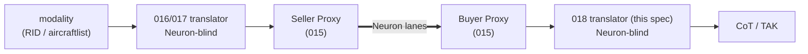

# Feature Specification: CoT Display Consumer (DApp)

**Feature Branch**: `018-cot-dapp`
**Created**: 2026-06-12
**Status**: Draft

> **Scope of this revision.** A sensor node is a SAPIENT **ASM**; a consumer node is a SAPIENT **HLDMM**; **015** defines the session, lane binding, registration, tasking, and fan-out mechanics once — **for both ends of the wire** (the Seller Proxy *and* the Buyer Proxy, 015 FR-S90–S97). This spec describes only **what the consumer does with the SAPIENT it receives**: the DetectionReport→CoT mapping, the affiliation policy, the multi-ASM aggregation rule, and the binding of 015's consumer obligations.

> **This DApp is a SAPIENT *translator*, not a buyer.** Per 015's transparent-proxy model, the **Buyer Proxy** is generic and defined once in 015: it owns the Neuron identity and wallet, buys the 008 services, resolves and verifies the seller's agent-card (content hash + PeerID, 015 FR-S21/S22 via the FR-S93 delegation), strips the Neuron envelope, and presents a **conformant BSI Flex 335 v2.0 TCP edge** to this translator — which therefore holds **no Neuron identity, key, wallet, or lane logic**, publishes **no agent-card** (it sells nothing), and speaks only standard SAPIENT: it receives `Registration`/`DetectionReport`/`StatusReport`/`Alert`, and it sends `RegistrationAck`/`Task` (the SAPIENT-level decisions 015 FR-S93 leaves with the principal). So "the CoT consumer" below denotes *this translator together with the generic Buyer Proxy*; 018 specifies only the translator half.

**The mirror symmetry** *(runtime path; the full layering-vs-runtime pair is in 015's Appendix — Mermaid)*:

## Layer

**DApp (consumer leaf)** — composes the **Shared Application Profile 015** and, through it, the Core SDK (001–013). Per Constitution Principle XII (three-tier model). This spec MUST NOT redefine any 015 or Core requirement; it references them. Concretely it defines a **Neuron-blind SAPIENT→CoT translator** that runs behind 015's generic **Buyer Proxy**; all Neuron-side concerns — identity, payment, card resolution/verification, lane handling — belong to that proxy, not here.

This spec is **output-format-named** (CoT), the consumer-side analogue of the vendor-named sensor specs: there is no vendor on this side, and per 015 there is **no per-vendor buyer spec** — this one consumer works against **any** 015 ASM. It is deliberately a **lightweight HLDMM**: it consumes, translates, and displays; it does not fuse.

## Related Specs

**Shared Application Profile (the substrate this DApp stands on):**
- **015 SAPIENT Sensor Interop Profile** — both proxies (FR-S90–S97), the message set & directions, lane binding, the pointer-model Registration↔agent-card, identity binding, tasking (incl. the mandatory per-session STOP/START, FR-S29 **buyer obligation**), fan-out, the `object_info` extension mechanism, encoding. **All session mechanics live there.** 015 names this spec as the home of the CoT output and of the affiliation seam (*"SAPIENT in, CoT out; friend/foe is decided at the seam between them"*); the **derived**-affiliation half of that seam moves with fusion to 019 — what stays here is CoT carriage plus the **static policy** affiliation (CL-C2).

**Core SDK (consumed via 015 through the Buyer Proxy, not restated):** 001/007 identity, 002 keys, 003 registry, 004 topics, 005 health, 006 determinism, 008 payment (this consumer *buys* `rid`/`adsb` agreements), 009 p2p, 010 validation, 011 relay, 013 connectivity profiles.

**Producer side:** **016 JetVision ADS-B ASM** (`adsb`), **017 DroneScout Remote-ID ASM** (`rid`) — the two services this consumer buys in the reference deployment. Their `neuron.adsb/1` / `neuron.rid/1` extension schemas drive the **enrichment** half of the CoT mapping (Annex A.2); the **native** half works against any 015 ASM with zero vendor knowledge (FR-C-M01).

**Future:** **019 Fusion HLDMM** — plot-to-track association across sources, affiliation **derived** from identity correlation (IFF, allow/deny lists, blue-force), `NODE_TYPE_FUSION_NODE` re-registration, and any re-sale of fused output. 018 deliberately contains none of it (CL-C1).

**Reference implementation:** this spec is written spec-first — per the spirit of 015 FR-S41 (stated there for ASMs), the DetectionReport→CoT conversion below is specified completely enough to build with **no reference code**.

**External (output contract):** **Cursor on Target (CoT)** — the MITRE CoT 2.0 XML event schema (`event` / `point` / `detail`; *Cursor-on-Target Message Router User's Guide*, MITRE 2005) with the MIL-STD-2525 / APP-6 **type atom** vocabulary (`a-<affiliation>-<dimension>-…`) as used by TAK/ATAK. The **TAK protobuf** wire variant is out of scope (CL-C5; XML CoT is what every TAK ingest accepts). **ULID** ([github.com/ulid/spec](https://github.com/ulid/spec)) — the `object_id`/`report_id` format inherited from the SAPIENT side.

## Purpose

Specify a consumer node acting as a SAPIENT **HLDMM** that — through the generic Buyer Proxy — buys **one or more** SAPIENT services from 015 ASMs (the reference deployment: 017's `rid` + 016's `adsb`), and renders every received `DetectionReport` into **CoT event(s)** on a configurable display transport (UDP/multicast, TCP, stdout), applying a **static affiliation policy** (default: everything friendly) and **aggregating without associating** (CL-C4). The consumer acks, tasks, and stops exactly as 015 prescribes; this spec defines only what is CoT-specific.

## Out of Scope

- **The SAPIENT session, both proxies, card resolution/verification, payment, lanes, encoding** — all owned by **015**. This spec references them.
- **Fusion** in every form — plot-to-track association, cross-source deduplication, track stitching, MLAT solving, identity correlation, **derived** affiliation, `NODE_TYPE_FUSION_NODE` re-registration, re-selling fused output — **assigned to 019** (CL-C1). 018 MUST NOT associate: the same physical aircraft seen by two ASMs appears as two CoT tracks (CL-C4) — honest aggregation, explicitly not fusion.
- **Broadcast-signature verification** (RID `rid.auth.*`). 015 FR-S16 fixes the *locus* (consumer-side); this lightweight consumer **does not verify** in its baseline — it MUST NOT claim `verified`, and it surfaces the ASM-reported status (`unsigned`/`unverified`) in CoT remarks (CL-C8). A verifying deployment or 019 may add it without changing the CoT mapping.
- **Other display formats** — ASTERIX, SBS, KML, proprietary COP feeds. CoT only.
- **TAK server administration**, certificate enrolment, mission packages, chat — the consumer emits CoT events; everything TAK-side of the socket is the deployment's.
- **Tasking UI / advanced tasking.** The consumer MUST support the FR-S29 STOP/START baseline and MAY issue the filter tasks the ASMs advertise (region/class); a tasking front-end is product, not protocol.
- **The bespoke `TaggedFrame` envelope, sink vocabulary, and `positionFake` markers** of the superseded `018-fid-fusion` draft — replaced by SAPIENT itself (the envelope), CoT (the display contract), and the 015 TEVV `feedSource` discipline (FR-C-E01).

## Clarifications

### Session 2026-06-12

- Q: Is 018 the full fusion HLDMM that 015 sketched, or the lightweight CoT translator? (CL-C1) → A: **018 = the lightweight CoT Display Consumer; fusion moves to 019.** 015 already owns both ends of the wire (Seller *and* Buyer Proxy), so there is no "wire spec" left to write; what was missing is the consumer-side mirror of 016/017 — a Neuron-blind translator behind the Buyer Proxy. 015's "018 = fusion + affiliation + CoT" references are touched up accordingly (CoT carriage + policy affiliation stay here; association + derived affiliation + fusion-node move to 019).
- Q: How is "everything friendly" expressed? (CL-C2) → A: **A static, declarative per-deployment affiliation policy** — a default affiliation character plus optional per-service and per-class overrides — with the **normative default `f` (friendly)**. The demo case is just the default config; the seam 015 promised is explicit, and 019 can replace the policy with real correlation without touching the CoT mapping. Values restricted to the 2525 set `{f, h, n, u, a, s, p}` (FR-C-T02).
- Q: What happens to the RID operator (`rid.operator*`) on the CoT side? (CL-C3) → A: **A second CoT event for the pilot** — the drone's single SAPIENT report (017's one-report model, unchanged) yields **two** CoT events: the UAV track plus a ground-point event at the operator location (`uid = <object_id>-op`, linked back to the drone). Find-the-pilot is the operationally valuable bit of RID; fan-out on the CoT side does not violate the one-SAPIENT-report model.
- Q: One 018 instance, many ASMs? (CL-C4) → A: **Yes — aggregate, never associate.** One instance holds N Buyer-Proxy sessions (the reference deployment: `rid` + `adsb`) and merges them into one CoT stream. ULID `object_id`s cannot collide, so the merge is mechanically safe; a physical aircraft seen by two ASMs appears **twice** — honest, and explicitly not fusion. *(This re-founds the superseded 018-fid-fusion dual-source demo on SAPIENT.)*
- Q: CoT flavour? (CL-C5) → A: **XML CoT 2.0** (`<event version="2.0">`), one event per UDP datagram / newline-delimited on TCP & stdout. The TAK **protobuf** variant is deferred — XML is universally accepted by TAK ingests and inspectable.
- Q: `uid`? (CL-C6) → A: **The SAPIENT `object_id` ULID, verbatim** (it is globally unique and stable per track by 016 FR-A-D02 / 017 FR-R-D02); the operator event appends `-op`. No additional prefix — the ULID *is* the namespace.
- Q: Staleness? (CL-C7) → A: `time`/`start` = the `SapientMessage.timestamp`; `stale` = `time + staleAfter`, where `staleAfter` is **per-service deployment config, default PT30S**. A `DetectionReport` with native `state = "lost"` (016 FR-A-G01) maps to a final event with **`stale = time`** (immediate expiry) — the track is removed from the display rather than fading on a timer.
- Q: Does the lightweight consumer verify RID broadcast signatures? (CL-C8) → A: **No (baseline).** Verification stays consumer-side *in locus* (015 FR-S16) but this consumer does not perform it: it MUST never present a contact as `verified`, and it carries the ASM-reported `rid.auth.verification` value (`unsigned`/`unverified`) into CoT remarks so the operator sees the trust state. A deployment MAY enable verification (against the registry key, via its proxy) without any change to this mapping; derived trust/affiliation from verification is 019.

### Open clarifications

- **CL-C9 [OPEN]**: SAPIENT `Alert` → CoT. When an ASM emits a native `Alert` (e.g. 016's deferred emergency-squawk Alert, 016 CL-J10), the natural mapping is a CoT emergency/alert event (e.g. `b-a-o-tbl` 911-style or a type escalation on the existing track). Deferred until a producing ASM exists; until then `Alert`s are logged and surfaced in remarks only.
- **CL-C10 [OPEN]**: TAK protobuf wire variant (streaming protobuf to TAK Server) — deferred (CL-C5). Revisit if a deployment's TAK server requires it.

## User Scenarios & Testing *(mandatory)*

### User Story 1 — Drones and aircraft from two ASMs on one TAK screen (Priority: P1)

The consumer buys 017's `rid` and 016's `adsb` through its Buyer Proxy, and a single CoT stream feeds a TAK display: DS240-detected drones and JetVision-tracked aircraft appear together, all painted friendly per the default policy. This is the re-founded dual-source demo and the MVP.

**Why this priority**: This is the visible end of the whole 015/016/017 stack — without a display consumer, the sensor side has no audience and 015's Buyer Proxy has no reference principal.

**Independent Test**: Run the 016 and 017 reference ASMs (replay feeds) behind Seller Proxies, this consumer behind a Buyer Proxy, CoT to `udp:239.2.3.1:6969`; verify with a CoT capture (or ATAK) that drone events carry `type="a-f-A-M-F-Q"`, aircraft events `type="a-f-A-C-F"`, every `uid` is a ULID, and `point.ce` equals the SAPIENT horizontal error.

**Acceptance Scenarios**:
1. **Given** a 017 drone report (ULID `object_id`, position, ODID horiz accuracy 11 → 3 m), **When** rendered, **Then** one CoT event has `uid` = the ULID, `type = a-f-A-M-F-Q`, `point.lat/lon` = the position, `point.ce = 3.0`, `how = m-g`, and `time/start` = the SAPIENT timestamp.
2. **Given** a 016 aircraft report (NACp 9 → 30 m, geometric altitude, category `A3`), **When** rendered, **Then** the event has `type = a-f-A-C-F`, `point.hae` = `location.z` (WGS84_E **is** HAE), `point.ce = 30.0`, and `detail.contact.callsign` = the native `id` (registration/callsign).
3. **Given** an MLAT contact (016, synthesised 300 m error), **When** rendered, **Then** `point.ce = 300.0` — the honesty chain NACp→error→`ce` reaches the operator's accuracy circle.
4. **Given** both ASMs streaming, **When** observed at the sink, **Then** events from both interleave on one stream and no event of one source is altered or delayed by the other beyond transport buffering.

### User Story 2 — Vendor-blind: any 015 ASM renders without code (Priority: P1)

A report from an **unknown** vendor (an extension namespace this consumer has no enrichment table for) still renders as a valid CoT event from the **native** SAPIENT fields alone — position, error, velocity, classification, timestamp. Unknown `object_info` namespaces are ignored per SAPIENT extension rules.

**Acceptance Scenarios**:
1. **Given** a syntactically valid `DetectionReport` whose `object_info` uses only an undeclared `foo.*` namespace, **When** rendered, **Then** a valid CoT event is emitted with `uid`/`type`/`point`/`track` from native fields and **no** enrichment, and the unknown namespace is not an error.
2. **Given** the same report, **When** the consumer's log is inspected, **Then** the undeclared namespace is noted once (not per-report) for evidence purposes.

### User Story 3 — Find the pilot (Priority: P2)

A drone report carrying `rid.operator*` yields a **second** CoT event at the operator's location, linked to the drone's event, so the operator icon is a tappable map point — not a remark buried in the drone's detail.

**Acceptance Scenarios**:
1. **Given** a drone report with `rid.operatorLatDeg`/`rid.operatorLonDeg`, **When** rendered, **Then** exactly two events are emitted: the UAV track and a ground-point event with `uid = <object_id>-op`, `type = a-f-G` (per the policy affiliation), `point` = the operator location, and a `<link uid="<object_id>" relation="p-p"/>` back to the craft.
2. **Given** a drone report with **no** operator fields, **Then** exactly one event is emitted and no `-op` uid ever appears.
3. **Given** an operator location of exactly `0,0` (017 no-suppression), **Then** the operator event is still emitted at `0,0` — the display judges usability, the translator does not filter.

### User Story 4 — One ASM dies; the other stream continues (Priority: P2)

With both sessions live, killing the `adsb` ASM MUST NOT interrupt `rid` CoT events, and vice versa; a restarted ASM resumes per 015 session mechanics. *(Re-founds the superseded 018-fid-fusion failure-isolation story.)*

**Acceptance Scenarios**:
1. **Given** both sessions streaming, **When** the ADS-B seller dies mid-stream, **Then** RID CoT events continue uninterrupted; **When** it returns, **Then** ADS-B events resume on the same CoT stream.

### User Story 5 — A well-behaved 015 buyer (Priority: P2)

The consumer discharges 015's buyer-side obligations: it (via its principal decision) answers each `Registration` with a `RegistrationAck`, it can issue `Task{CONTROL_STOP}` and process the `TaskAck` (015 FR-S29 buyer obligation), and it SHOULD STOP each session before disconnecting.

**Acceptance Scenarios**:
1. **Given** a session it intends to drop, **When** the consumer disconnects, **Then** a `CONTROL_STOP` was issued and `TaskAck`ed first (observable on the auditable lane).
2. **Given** a replayed `Registration` whose content hash mismatches the discovered agent-card, **Then** the Buyer Proxy's verification (015 FR-S21/S22 via FR-S93) yields a rejection and **no** CoT events are emitted for that session.

### User Story 6 — Fixture evidence reaches the screen (TEVV) (Priority: P3)

When an ASM advertises `feedSource ≠ live` in its `StatusReport` (015/016/017 TEVV discipline), every CoT event derived from that ASM carries the disclosure in remarks, so a recorded demo can never silently masquerade as live surveillance.

**Acceptance Scenarios**:
1. **Given** an ASM with `feedSource = replay`, **When** its reports render, **Then** each CoT event's `<remarks>` contains `feedSource=replay`; **When** the ASM later reports `live` (or no value), **Then** the tag disappears.

### Edge Cases

- **Position `0,0`** → rendered at `0,0` (no-suppression carries through to the display; the operator sees the honest value).
- **No altitude** (`location.z` absent) → `point.hae = 9999999.0` (the CoT "unknown" sentinel); never a fabricated 0.
- **Barometric altitude** (datum `WGS84_G`) → `hae` carries the value as-is with `<precisionlocation altsrc="BARO"/>`; geometric (`WGS84_E`) is HAE exactly, `altsrc="GPS"`.
- **No velocity** → no `<track>` element (never a fabricated course/speed); 016's `adsb.groundSpeedKt`-style fallback keys surface in remarks via the enrichment table.
- **No error** (`x_error`/`y_error` absent) → `ce = 9999999.0` (unknown), mirroring SAPIENT's omit-rather-than-fabricate rule; `le` likewise from `z_error`.
- **Unknown classification** → default type `a-<aff>-A` (air track) — total, never failing (mirrors 016 FR-A-A04's totality).
- **`state = "lost"`** → final event, `stale = time` (CL-C7).
- **Emergency (`adsb.emergency`)** → surfaced in remarks (`EMERGENCY:hijack` etc.); a native CoT alert event awaits CL-C9.
- **Sink unreachable** (TAK endpoint down) → events for that sink are dropped with a counted error, never blocking the SAPIENT sessions (display is best-effort; the auditable record is the lanes, not the screen).

## Requirements *(mandatory)*

### Functional Requirements (FR-C-*)

**A. Role & 015 obligations**

- **FR-C-A01** *(Neuron-blind translator behind the Buyer Proxy)*: The consumer translator MUST operate as a SAPIENT HLDMM on a conformant BSI Flex 335 v2.0 edge (015 FR-S91) provided by the generic Buyer Proxy. It MUST NOT hold a Neuron identity, key, or wallet, MUST NOT publish an agent-card (it offers no service), and MUST NOT implement lane transport — all delegated per 015 FR-S93. The SAPIENT-level decisions remain its own: `RegistrationAck.acceptance` (015 FR-S82), task issuance, and STOP discipline.
- **FR-C-A02** *(one instance, N sessions — aggregate, never associate)*: One consumer instance MAY consume any number of ASM sessions concurrently (one Buyer-Proxy session each, 015 FR-S95) and MUST merge them into one CoT output stream. It MUST NOT associate, deduplicate, or merge tracks **across** sessions (or within one): every distinct `object_id` is a distinct CoT `uid`, even when two ASMs observe the same physical object. Association is 019 (CL-C4).
- **FR-C-A03** *(buyer-side STOP/START baseline — binds 015 FR-S29)*: The consumer MUST be able to issue `Task{CONTROL_STOP}` / `{CONTROL_START}` per session and process the `TaskAck`; it SHOULD issue STOP before disconnecting a session. It MAY issue the per-session filter tasks the ASM advertises (`region_definition`, `class_filter_definition`); it MUST NOT issue tasks the ASM did not advertise (015 FR-S26).
- **FR-C-A04** *(schema-driven extension parsing — binds 015 FR-S40)*: The consumer MUST interpret `object_info` namespaces using only the schemas declared in the producing ASM's agent-card (resolved by its Buyer Proxy). Declared-and-known namespaces drive the **enrichment** mapping (Annex A.2); unknown or undeclared namespaces MUST be ignored without error (logged once per session). Rendering MUST NOT require vendor knowledge beyond the declared schemas (FR-C-M01).
- **FR-C-A05** *(no verification claims)*: The baseline consumer performs **no** broadcast-signature verification (CL-C8). It MUST NOT emit any CoT content asserting a contact is `verified`; when `rid.auth.verification` is present its value is carried verbatim into remarks. (Locus stays consumer-side per 015 FR-S16; performing verification is a deployment/019 option that MUST NOT alter this mapping.)

**B. DetectionReport → CoT mapping (native — works for ANY 015 ASM)**

- **FR-C-M01** *(native completeness)*: The consumer MUST produce a **valid CoT 2.0 event from native SAPIENT fields alone** — no extension required: `uid` ← `object_id` (verbatim ULID, CL-C6); `time`/`start` ← `SapientMessage.timestamp` (ISO-8601 Zulu); `stale` ← `time + staleAfter` (per-service config, default **PT30S**; CL-C7); `how = "m-g"` (machine-generated); `point.lat/lon` ← `location.y/x`; `point.hae` ← `location.z` when datum = `WGS84_E` (ellipsoidal **is** HAE), carried as-is with `altsrc="BARO"` when `WGS84_G`, `9999999.0` when absent; `point.ce` ← max(`x_error`,`y_error`) else `9999999.0`; `point.le` ← `z_error` else `9999999.0`; `type` per FR-C-T01/T02. Absent native fields MUST map to the CoT unknown sentinel or element omission — **never** a fabricated value (the SAPIENT-side honesty rules carry through).
- **FR-C-M02** *(velocity → track)*: When the report carries an `ENUVelocity`, the event MUST carry `<track course="..." speed="..."/>` with `course = atan2(east_rate, north_rate)` normalised to `[0°, 360°)` and `speed = hypot(east_rate, north_rate)` in m/s. No `ENUVelocity` ⇒ no `<track>` element (never zeros).
- **FR-C-M03** *(callsign)*: `<contact callsign="..."/>` MUST be filled by preference: native `id` (the "tail number") → an enrichment-declared callsign key (Annex A.2: `adsb.callsign`, `rid.uasId`) → the first 8 characters of the `uid`. Always present (TAK lists need a label).
- **FR-C-M04** *(lost track)*: A report with native `state = "lost"` MUST yield a final event with `stale = time` (immediate expiry) and MUST be the last event for that `uid` (a fresh detection mints a fresh ULID upstream, 016 FR-A-G01).
- **FR-C-M05** *(remarks)*: `<remarks>` MUST carry, in `key=value` space-separated form: `src=<service>` (the 008 service name: `rid`, `adsb`), `node=<node_id>` (the on-lane UUID); and conditionally: `feedSource=<v>` while the session's ASM advertises ≠ `live` (FR-C-E01), `provenance=<v>` when the enrichment surfaces one (e.g. `adsb.provenance`), `auth=<v>` when `rid.auth.verification` is present (FR-C-A05), `EMERGENCY:<v>` when an emergency enrichment is present, plus any Annex A.2 keys flagged `remarks`. Remarks are display-informative, not machine-normative.
- **FR-C-M06** *(per-report fan-out)*: One `DetectionReport` yields **one** CoT event, except where an enrichment rule explicitly fans out (today exactly one: the RID operator second event, FR-C-M07). Events derived from one report MUST share `time`.
- **FR-C-M07** *(operator second event — RID enrichment, CL-C3)*: When a report carries `rid.operatorLatDeg` + `rid.operatorLonDeg` (any value, incl. `0,0`), the consumer MUST emit a second event: `uid = <object_id>-op`; `type = a-<aff>-G` (affiliation per FR-C-T02; ground dimension); `point` ← the operator lat/lon (+ `rid.operatorAltM` → `hae` when present, else unknown sentinel); `<link uid="<object_id>" relation="p-p"/>`; `<contact callsign="<craft-callsign>-OP"/>`; remarks carrying `rid.operatorId`/`operatorIdType`/`operatorLocationType` when present. Its `stale` follows the craft's. No operator fields ⇒ no second event.

**C. Type & affiliation (the policy seam)**

- **FR-C-T01** *(classification → CoT type atoms)*: The CoT `type` MUST be assembled as `a-<aff>-<atom>` where `<aff>` comes from FR-C-T02 and `<atom>` from the **first** native `classification[0]` via the normative (config-overridable) table: `UAV` → `A-M-F-Q`; `Air Vehicle` → `A-C-F` (default civil fixed-wing), refined by sub_class — `Rotorcraft` → `A-C-H`, `Lighter-than-Air`/`Balloon`/`Airship` → `A-C-L`; `Surface Vehicle` → `G-E-V`; anything else/absent → `A` (bare air track). The table is **total** (never fails) and a deployment MAY extend/override entries; sub_class strings not in the table fall back to their top-level row.
- **FR-C-T02** *(static affiliation policy — the degenerate seam, CL-C2)*: The affiliation character MUST come from a **declarative deployment policy**: `default` (one of `f h n u a s p`) plus optional per-service and per-classification-type overrides, evaluated most-specific-first (service+class → class → service → default). The **normative default policy is `{default: f}`** — everything friendly — matching the cooperative, self-announcing nature of RID and ADS-B in the reference deployment. The policy MUST be static for the life of a session (no per-report logic); **deriving** affiliation from data (correlation, allow/deny lists, verification outcomes) is 019 and MUST NOT be implemented here.

**D. Output transports**

- **FR-C-O01**: The consumer MUST support emitting XML CoT 2.0 (CL-C5) to at least: **UDP** (unicast or multicast; one event per datagram; default endpoint `239.2.3.1:6969`, the TAK mesh-SA convention), **TCP client** (newline-delimited events to a TAK server CoT ingest, e.g. `:8087`), and **stdout** (newline-delimited, for development/capture). Sinks are deployment config; at least one MUST be configured.
- **FR-C-O02** *(display is best-effort, sessions are not)*: A failed/unreachable sink MUST NOT block, slow, or abort the SAPIENT sessions; undeliverable events are dropped with a counted, rate-limited error. The auditable record of the system is the 015 lanes, not the display stream.

**E. TEVV**

- **FR-C-E01**: The consumer MUST track each session's `feedSource` from the ASM's `StatusReport` (015 FR-S31; absent ⇒ `live`) and, while it is ≠ `live`, MUST tag every CoT event derived from that session per FR-C-M05 — fixture evidence is disclosed **at the point of display**, not just on the lanes. *(Replaces the superseded TaggedFrame `positionFake` mechanism with the 015-native discipline.)*

**F. Errors**

- **FR-C-F01**: Consumer-specific errors MUST use a `NEURON-DAPP-COT-*` domain (006): at minimum `UnknownExtensionNamespace` (informational, once per session — FR-C-A04), `UnknownClassification` (informational; the total type table still maps — FR-C-T01), `SinkUnavailable` (non-fatal, counted — FR-C-O02), and `MissingPosition` (a report without `location_oneof` on an assembled stream — a **producer** conformance violation per 015 FR-S35; logged, no event emitted, session not torn down). Session/profile errors use the 015 `NEURON-SAPIENT-*` domain.

### Key Entities

- **CoT Display Consumer** — one Neuron-blind HLDMM translator + its generic Buyer Proxy; N SAPIENT sessions in, one CoT stream out; no agent-card, no service, no fusion.
- **CoT event** — the per-report display product: `uid` = the SAPIENT ULID, type = policy affiliation + classification atom, `ce/le` = the SAPIENT error envelope, remarks = provenance/TEVV/auth disclosures.
- **Affiliation policy** — the static declarative table (default `f`) at the 015-promised seam; replaced by derivation only in 019.
- **Enrichment table (Annex A.2)** — the per-namespace (`neuron.rid/1`, `neuron.adsb/1`) mapping of extension keys onto CoT slots; unknown namespaces ignored.

## Success Criteria *(mandatory)*

- **SC-C01**: The 016 + 017 reference ASMs (replay) and this consumer complete the full chain — `Registration`→`RegistrationAck`→`DetectionReport` over both proxies — and a TAK-compatible capture shows both sources interleaved on one stream: drones as `a-f-A-M-F-Q`, aircraft as `a-f-A-C-F`, every `uid` a ULID.
- **SC-C02**: A report from an undeclared vendor namespace renders as a valid native-only CoT event; zero vendor code paths.
- **SC-C03**: The honesty chain reaches the screen: ODID accuracy 11 → `ce=3.0`; NACp 9 → `ce=30.0`; MLAT → `ce=300.0`; absent error → `ce=9999999.0`; absent velocity → no `<track>`.
- **SC-C04**: A drone with operator location yields exactly two linked events (`<uid>` + `<uid>-op`); without operator fields, exactly one.
- **SC-C05**: Killing either ASM leaves the other's CoT events flowing (US4); a session disconnect is preceded by STOP+`TaskAck` (US5).
- **SC-C06**: A `state="lost"` report produces a final event with `stale = time`, and the track disappears from an ATAK display within its refresh interval.
- **SC-C07**: With `feedSource=replay` advertised, every event from that session carries the remarks disclosure; flipping to `live` removes it.
- **SC-C08**: The default deployment (no policy config) paints every contact friendly; adding a one-line policy override (e.g. `UAV → u`) changes only the affiliation character — no other field of any event.

## Evidence & Validation *(per Principle XI)*

**Verification Tier**: `topic-observable` for the consumer's auditable-lane behaviour (`RegistrationAck`, `Task{CONTROL_STOP}`/`TaskAck` — 004 via 015); the CoT output itself is **off-Neuron** (a display feed) and is validated by capture, not by lane evidence.

**Observable Signals**: `RegistrationAck`s and STOP/START `Task`s on the sellers' topics attributable to this consumer's (proxy's) identity; 008 purchase agreements for `rid`/`adsb`; the CoT capture artifact accompanying a demo run.

**Evidence Rules (`VR-C-*`)**: **VR-C-01** every session this consumer opens shows a `RegistrationAck` on the auditable lane before any data-plane consumption. **VR-C-02** a disconnect is preceded by `CONTROL_STOP`+`TaskAck` (or the deviation is logged). **VR-C-03** (capture) CoT events validate against the CoT 2.0 event schema and FR-C-M01's field derivations for a sampled set of reports. **VR-C-04** while any session advertises `feedSource ≠ live`, sampled events from that session carry the remarks disclosure.

**Non-Observable Areas**: what a TAK operator actually sees (rendering, symbology) is the TAK client's behaviour — evidence stops at a schema-valid CoT capture; affiliation is a **declared policy**, not a verified ground truth (and is disclosed as such — `f` under the default policy asserts deployment configuration, not vetted friendliness).

## Layering Compliance Check *(per Principle XII as-amended)*

- ✅ DApp tier (consumer leaf): composes 015 + Core; redefines neither. Declares only CoT specifics (the mapping, the type/affiliation tables, the enrichment registry, the sinks).
- ✅ No fusion/association/derived affiliation — assigned to 019 (CL-C1); FR-C-A02 forbids association outright.
- ✅ No SAPIENT session mechanics restated — all referenced to 015 (both proxies are 015's).
- ✅ Mirror of 015 FR-S41's buildability bar: the DetectionReport→CoT conversion is specified normatively and completely — native mapping (FR-C-M01–M07), total type table + policy (FR-C-T01/T02), enrichment registry (Annex A.2) — buildable from this spec + the CoT/2525 references with **no reference code** (none exists yet).
- ✅ Output-format-named; vendor-blind (FR-C-M01/A04); count-agnostic (N sessions = deployment config).
- ℹ️ Depends on the Principle XII three-tier model (defined in 015 and its `amendments/`).

## Superseded Artifacts

- **`018-fid-fusion` (branch `cleanup-nato-demo-canonical-multistream`)** — the bespoke `TaggedFrame` buyer-aggregation envelope, sink vocabulary, and `positionFake` placeholder markers. Superseded wholesale: SAPIENT is the envelope (015), CoT is the display contract (this spec), `feedSource` is the fixture-disclosure mechanism (FR-C-E01). Its dual-source and failure-isolation demos are re-founded as US1/US4.
- **015's "018 = fusion" references** — touched up on this branch: CoT carriage + policy affiliation stay at 018; association, derived affiliation, and `NODE_TYPE_FUSION_NODE` move to **019**.

## Annex A — CoT mapping tables *(normative)*

### A.1 Native mapping summary *(reproduced from FR-C-M01/M02)*

| SAPIENT (native) | CoT |
|---|---|
| `object_id` (ULID) | `event/@uid` (verbatim; `-op` suffix for the operator event) |
| `SapientMessage.timestamp` | `@time`, `@start` (ISO-8601 Z) |
| *(config `staleAfter`, default PT30S; `state="lost"` ⇒ 0)* | `@stale` |
| `classification[0]` + affiliation policy | `@type` = `a-<aff>-<atom>` (A.3) |
| — | `@how = "m-g"` |
| `location.y` / `location.x` | `point/@lat` / `@lon` |
| `location.z` (datum `WGS84_E` → HAE; `WGS84_G` → `altsrc="BARO"`; absent → 9999999.0) | `point/@hae` (+ `<precisionlocation altsrc>`) |
| max(`x_error`,`y_error`) / `z_error` (absent → 9999999.0) | `point/@ce` / `@le` |
| `ENUVelocity` (absent ⇒ element omitted) | `<track course speed>` |
| native `id` (else enrichment, else uid prefix) | `<contact callsign>` |
| service name, `node_id`, feedSource/provenance/auth/emergency | `<remarks>` (FR-C-M05) |

### A.2 Enrichment registry *(per declared namespace; unknown namespaces ignored)*

**`neuron.rid/1` (017):** `rid.uasId` → callsign fallback + remarks; `rid.operatorLatDeg`/`operatorLonDeg`/`operatorAltM` → the **second operator event** (FR-C-M07); `rid.operatorId`/`operatorIdType`/`operatorLocationType` → operator-event remarks; `rid.auth.verification` → remarks `auth=` (never upgraded, FR-C-A05); `rid.selfId` → remarks.

**`neuron.adsb/1` (016):** `adsb.callsign` → callsign fallback; `adsb.registration`/`typeCode`/`originIcao`/`destIcao` → remarks; `adsb.provenance` → remarks `provenance=`; `adsb.emergency` → remarks `EMERGENCY:<v>`; `adsb.squawk` → remarks; `adsb.groundSpeedKt`/`trackDeg`/`verticalRateFpm` (the no-native-velocity fallback) → remarks; `adsb.signalDbm` → remarks.

A deployment MAY extend this registry for further declared namespaces; entries map a key to exactly one of {callsign-fallback, operator-event field, remarks}. Enrichment MUST NOT alter native-derived geometry (`point`, `track`).

### A.3 Type atoms *(reproduced from FR-C-T01; total, config-overridable)*

| `classification[0]` | sub_class refinement | atom | example with default policy |
|---|---|---|---|
| `UAV` | — | `A-M-F-Q` | `a-f-A-M-F-Q` |
| `Air Vehicle` | *(default)* | `A-C-F` | `a-f-A-C-F` |
| `Air Vehicle` | `Rotorcraft` | `A-C-H` | `a-f-A-C-H` |
| `Air Vehicle` | `Lighter-than-Air` / `Balloon` / `Airship` | `A-C-L` | `a-f-A-C-L` |
| `Surface Vehicle` | — | `G-E-V` | `a-f-G-E-V` |
| *(operator event)* | — | `G` | `a-f-G` |
| *anything else / absent* | — | `A` | `a-f-A` |

Affiliation `<aff>` ∈ `{f, h, n, u, a, s, p}` per the FR-C-T02 policy (default `f`).
